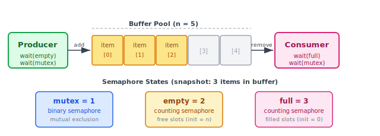
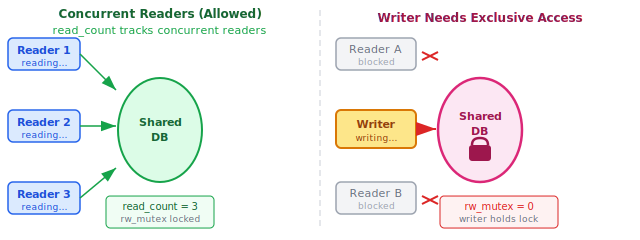
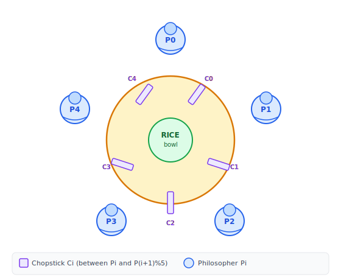
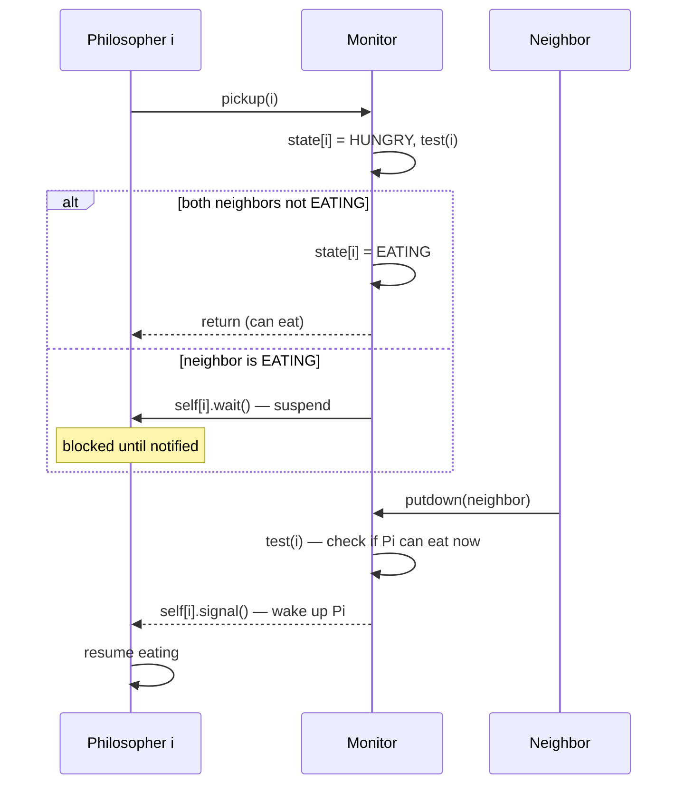

:::note
本系列文章內容參考自經典教材 **Operating System Concepts, 10th Edition (Silberschatz, Galvin, Gagne)**。本文對應章節：**Section 7.1 Classic Problems of Synchronization**。
:::

## **為什麼需要「經典問題」？**

在 Chapter 6 中，介紹了解決 critical-section problem 的各種工具，從硬體層的 memory barrier 與 compare-and-swap，到高階的 mutex lock、semaphore、monitor。這些工具解決了「互斥存取」的機制問題，但在真實應用中，程式設計師面對的是更複雜的情境：多個生產者和消費者共用緩衝區、多個讀寫者並行存取資料庫、多個執行緒競爭多個資源。

**同步的經典問題（Classic Problems of Synchronization）** 正是這類情境的代表。它們之所以被稱為「經典」，是因為幾乎每一種新提出的同步機制都必須通過這些問題的驗證。解決得了這三個問題，代表同步機制具備了足夠的表達能力。本章的解法以 semaphore 為主要工具，因為這是最傳統的呈現方式，實際實作中亦可用 mutex lock 替換二元 semaphore。

<br/>

## **7.1.1 有界緩衝區問題 (Bounded-Buffer Problem)**

### **問題描述**

設想一個生產者-消費者（Producer-Consumer）情境：生產者不斷產生資料項目（item），消費者不斷取出並使用。兩者共用一塊固定大小的緩衝區（buffer pool），共有 **n** 個 slot，每個 slot 存放一個 item。

直覺上，這個設計有兩個邊界條件必須嚴格處理：

1. **緩衝區已滿**：生產者不能再放入 item，必須等待消費者取出後才能繼續
2. **緩衝區為空**：消費者沒有 item 可取，必須等待生產者放入後才能繼續

此外，生產者和消費者可能同時嘗試存取緩衝區（例如同時修改指標或計數器），因此還需要保證**互斥存取（mutual exclusion）**，防止資料競爭（race condition）。

### **共享資料結構**

為了正確協調生產者和消費者，定義以下三個 semaphore：

```c
int n;
semaphore mutex = 1;   // 保護 buffer pool 的互斥存取
semaphore empty = n;   // 空 slot 的數量，初始 = n（全部空）
semaphore full  = 0;   // 已填 slot 的數量，初始 = 0（尚無資料）
```

這三個 semaphore 各有明確的語意：

| Semaphore | 初始值 | 語意                                            |
| :-------: | :----: | :---------------------------------------------- |
|  `mutex`  |   1    | Binary semaphore，保護對 buffer pool 的互斥存取 |
|  `empty`  |   n    | Counting semaphore，追蹤剩餘空 slot 數量        |
|  `full`   |   0    | Counting semaphore，追蹤已填 slot 數量          |

下圖呈現緩衝區中有 3 個 item 時的快照，以及三個 semaphore 對應的狀態值：



此時 `empty = 2`（還有 2 個空 slot）、`full = 3`（有 3 個 item 可取）、`mutex = 1`（目前沒有人在存取）。核心洞察是：**`empty` 和 `full` 並不是一般的計數器，而是 semaphore。** 生產者在放入 item 前必須先 `wait(empty)` 確認有空位；消費者在取出 item 前必須先 `wait(full)` 確認有資料。這樣就把等待條件的同步邏輯完全交給 semaphore 的阻塞機制處理。

### **生產者與消費者的程式碼**

**生產者（Producer）** 的結構如下：

```c title="Figure 7.1 - The structure of the producer process"
while (true) {
    /* produce an item in next_produced */

    wait(empty);    // 等待有空 slot
    wait(mutex);    // 進入 critical section

    /* add next_produced to the buffer */

    signal(mutex);  // 離開 critical section
    signal(full);   // 通知消費者：多了一個 item
}
```

**消費者（Consumer）** 的結構與生產者呈完美對稱：

```c title="Figure 7.2 - The structure of the consumer process"
while (true) {
    wait(full);     // 等待有 item
    wait(mutex);    // 進入 critical section

    /* remove an item from buffer to next_consumed */

    signal(mutex);  // 離開 critical section
    signal(empty);  // 通知生產者：多了一個空 slot

    /* consume the item in next_consumed */
}
```

這個對稱性並非偶然。可以這樣理解：**生產者替消費者生產「滿 slot」，消費者替生產者生產「空 slot」。** 兩者互為對方的資源提供者，semaphore `full` 和 `empty` 則是協調兩者節奏的通訊管道。

:::info wait 的順序為什麼重要？
注意生產者先 `wait(empty)` 再 `wait(mutex)`，消費者先 `wait(full)` 再 `wait(mutex)`。如果順序顛倒（例如先 `wait(mutex)` 再 `wait(empty)`），在緩衝區已滿的情況下，生產者持有 mutex 卻被 `wait(empty)` 阻塞，消費者嘗試 `wait(mutex)` 也被阻塞，兩者互等形成**死結（deadlock）**。因此，外層必須是條件 semaphore（`empty`/`full`），內層才是 mutex。
:::

<br/>

## **7.1.2 讀者-寫者問題 (Readers-Writers Problem)**

### **問題描述**

設想一個資料庫被多個並行 process 共用，其中部分 process 只需要**讀取**資料（稱為 reader），另一部分需要**更新**（讀與寫）資料（稱為 writer）。

關鍵的一致性要求是：

- **兩個 reader 同時讀取**：完全沒有問題，因為讀取不改變資料
- **writer 與任何其他 process 同時存取**：可能造成資料不一致，必須禁止

因此，writer 在寫入時需要**獨占（exclusive）** 存取資料庫，而多個 reader 可以**並行**進行。這個問題稱為**讀者-寫者問題（readers-writers problem）**，是測試各種同步機制能力的標準場景。

下圖說明兩種情境的差異：左側顯示三個 reader 同時讀取（合法），右側顯示 writer 持有鎖，其他 reader 被阻塞（因為此時寫入正在進行）。



### **兩個變體與優先順序**

讀者-寫者問題有兩個常見變體，差異在於**對 writer 等待期間的處理方式**：

|       問題變體        | 核心規則                                                           | 潛在代價                      |
| :-------------------: | :----------------------------------------------------------------- | :---------------------------- |
| **第一讀者-寫者問題** | 除非 writer 已取得許可，否則 reader 不需等待，即使有 writer 在排隊 | Writer 可能飢餓（starvation） |
| **第二讀者-寫者問題** | 一旦 writer 就緒，應盡快讓 writer 寫入，後來的 reader 必須等待     | Reader 可能飢餓               |

兩種問題的任何解法都可能造成某一方的飢餓（starvation）。以下呈現的是**第一讀者-寫者問題的解法**，它讓 reader 優先，不讓 reader 因為 writer 在等待而被迫等待。

### **共享資料結構**

```c
semaphore rw_mutex = 1;   // writer 的互斥鎖，也被第一個/最後一個 reader 使用
semaphore mutex   = 1;    // 保護 read_count 的互斥更新
int       read_count = 0; // 目前正在讀取的 reader 數量
```

`rw_mutex` 是 writer 進入的互斥鎖，也是 **reader 群體的代表鎖**：第一個進入的 reader 取得 `rw_mutex`（阻止 writer），最後一個離開的 reader 釋放 `rw_mutex`（允許 writer 進入）。`mutex` 則是保護 `read_count` 這個計數器本身不發生競爭。

### **Writer 與 Reader 的程式碼**

**Writer** 的結構很直觀，就是單純的互斥鎖：

```c title="Figure 7.3 - The structure of a writer process"
while (true) {
    wait(rw_mutex);       // 等待取得獨占存取權

    /* writing is performed */

    signal(rw_mutex);     // 釋放，讓下一個 writer 或 reader 進入
}
```

**Reader** 的結構複雜一些，核心邏輯在於「第一個 reader 鎖住 writer，最後一個 reader 釋放 writer」：

```c title="Figure 7.4 - The structure of a reader process"
while (true) {
    wait(mutex);
    read_count++;
    if (read_count == 1)   // 我是第一個 reader
        wait(rw_mutex);    // 阻止 writer 進入
    signal(mutex);

    /* reading is performed */

    wait(mutex);
    read_count--;
    if (read_count == 0)   // 我是最後一個 reader
        signal(rw_mutex);  // 允許 writer 進入
    signal(mutex);
}
```

:::info 為什麼需要雙層 semaphore？
`read_count` 本身的讀寫也是共享資料操作，如果多個 reader 同時執行 `read_count++`，就會發生 race condition，所以必須用 `mutex` 保護它。但 `mutex` 只是用來保護 `read_count` 的短暫更新，並非整個讀取過程，不應在讀取期間持有，否則 reader 之間也會互相阻塞。

`rw_mutex` 的持有時機：從第一個 reader 進入到最後一個 reader 離開。在此期間，任何 writer 若嘗試 `wait(rw_mutex)` 都會被阻塞，確保讀取期間資料不被改變。若 writer 正在寫入時有 n 個 reader 在等待，其中一個 reader 排在 `rw_mutex` 上，其餘 n-1 個 reader 排在 `mutex` 上。當 writer 執行 `signal(rw_mutex)` 後，由 OS 排程器決定讓這群 reader 還是另一個 writer 繼續。
:::

### **Reader-Writer Lock**

讀者-寫者問題的解法已被很多系統**泛化為 reader-writer lock** 這個同步原語。取得 reader-writer lock 時需要指定模式：

- **read mode**：多個 process 可以同時持有
- **write mode**：只允許單一 process 持有，排除所有其他存取

Reader-writer lock 最適合以下兩種情境：

- 很容易區分哪些 process 只讀、哪些只寫
- Reader 數量遠多於 writer，允許多個 reader 並行的收益能補償建立 lock 的額外開銷

<br/>

## **7.1.3 哲學家用餐問題 (Dining-Philosophers Problem)**

### **問題場景**

設想五位哲學家圍坐在一張圓桌旁，一生只做兩件事：**思考（think）** 與**進食（eat）**。桌子中央放著一碗米飯，桌上排列著五根筷子，每根筷子放在相鄰兩位哲學家之間。

進食的規則是：哲學家必須同時拿到**左右兩根**筷子才能吃飯。一次只能拿一根，且不能拿已被鄰居持有的筷子。吃完後放下兩根筷子，繼續思考。

下圖呈現這張圓桌的佈局，Pi 代表第 i 位哲學家，Ci 代表第 i 根筷子（位於 Pi 與 P(i+1)%5 之間）：



每位哲學家 Pi 需要同時持有兩根相鄰的筷子：`chopstick[i]` 與 `chopstick[(i+1) % 5]`。

哲學家用餐問題之所以成為經典，不是因為它與現實直接相關，而是因為它精確地抽象了一類通用問題：**多個 process 需要同時取得多個共享資源**，在不使用任何中央排程的情況下，如何既避免死結（deadlock）又避免飢餓（starvation）。

### **Semaphore 解法及其死結缺陷**

最直覺的解法是用 semaphore 代表每根筷子，初始值為 1（表示筷子空閒）：

```c
semaphore chopstick[5]; // 全部初始化為 1
```

哲學家 i 的行為如下：

```c title="Figure 7.6 - The structure of philosopher i (semaphore solution)"
while (true) {
    wait(chopstick[i]);           // 拿左筷子
    wait(chopstick[(i+1) % 5]);   // 拿右筷子

    /* eat for a while */

    signal(chopstick[i]);         // 放下左筷子
    signal(chopstick[(i+1) % 5]); // 放下右筷子

    /* think for a while */
}
```

這個解法保證了「不會有兩個相鄰的哲學家同時進食」，因為任何一根筷子的 semaphore 值最多只有 1。**但這個解法必須被拒絕，因為它可能導致死結。**

考慮以下情境：五位哲學家同時感到飢餓，同時拿起左筷子。此時 `chopstick[0]` 到 `chopstick[4]` 的值全部變為 0。每位哲學家接著嘗試拿右筷子，但右筷子已被鄰居持有，全部陷入等待，**永遠不會有人能進食**。這就是死結。

幾種常見的打破死結方案：

- **限制人數**：最多允許四位哲學家同時坐在桌邊（此時至少有一人能拿到兩根筷子）
- **原子化取筷**：哲學家只有在左右兩根都可用時才一次同時取得（需在 critical section 內完成判斷）
- **非對稱策略**：奇數編號哲學家先拿左筷子再拿右筷子，偶數編號先拿右再拿左，破除循環等待

:::info 死結的根本原因
這個 semaphore 解法滿足了死結的四個必要條件：互斥（每根筷子只能一人持有）、持有並等待（手持一根，等待另一根）、不可搶占（筷子不能被強取）、循環等待（P0 等 P1，P1 等 P2，…，P4 等 P0）。任何能破除其中一個條件的方案都可以避免死結。上述三種方案分別針對不同條件下手。
:::

### **Monitor 解法**

下面用 monitor 提供一個**無死結（deadlock-free）** 的解法。核心限制是：哲學家只有在**左右兩根筷子都可用**時才能拿取，而這個判斷在 monitor 內部以原子方式完成。

為此，用一個狀態陣列追蹤每位哲學家的狀態：

```c
enum { THINKING, HUNGRY, EATING } state[5];
condition self[5]; // 讓 philosopher i 在等待時暫停自身
```

哲學家 i 只有在「自己是 HUNGRY 且兩側鄰居都不是 EATING」時才能進食：

```c
(state[(i+4) % 5] != EATING) && (state[i] == HUNGRY) && (state[(i+1) % 5] != EATING)
```

完整的 monitor 定義如下：

```c title="Figure 7.7 - A monitor solution to the dining-philosophers problem"
monitor DiningPhilosophers {
    enum { THINKING, HUNGRY, EATING } state[5];
    condition self[5];

    void pickup(int i) {
        state[i] = HUNGRY;
        test(i);
        if (state[i] != EATING)
            self[i].wait();   // 等待，直到鄰居通知
    }

    void putdown(int i) {
        state[i] = THINKING;
        test((i + 4) % 5);   // 檢查左鄰居是否可以開始吃
        test((i + 1) % 5);   // 檢查右鄰居是否可以開始吃
    }

    void test(int i) {
        if ((state[(i + 4) % 5] != EATING) &&
            (state[i] == HUNGRY) &&
            (state[(i + 1) % 5] != EATING)) {
            state[i] = EATING;
            self[i].signal();  // 喚醒等待的 philosopher i
        }
    }

    initialization_code() {
        for (int i = 0; i < 5; i++)
            state[i] = THINKING;
    }
}
```

哲學家 i 使用 monitor 的方式：

```c
DiningPhilosophers.pickup(i);
/* eat */
DiningPhilosophers.putdown(i);
```

`pickup(i)` 嘗試讓哲學家 i 進食：若條件滿足（兩鄰居都不在吃）則立即進入 EATING，否則在 `self[i]` 上等待。`putdown(i)` 在哲學家放下筷子後，主動呼叫 `test` 檢查左右鄰居是否因此變得可以進食，若是則呼叫 `self[neighbor].signal()` 喚醒他們。



:::info 這個解法為什麼無死結？
Monitor 的 `test()` 函式使得「判斷可否進食」與「取得筷子」是一個**原子操作**（因為在 monitor 內部執行），不可能出現五人各自判斷「可以取左筷子」後卻同時陷入等待的情況。每次有哲學家放下筷子，`putdown` 就會主動喚醒可能受益的鄰居，確保系統不會停滯。

<br/>

然而，這個解法**仍然無法防止飢餓（starvation）**。若一位哲學家的兩側鄰居輪流進食，而排程器始終不讓他進食，他可能永遠等待。無死結不等於無飢餓，兩者是獨立的性質。
:::

<br/>

## **三大問題對比**

|          問題           | 核心挑戰                            | 解法要點                                     |                需防範的危險                |
| :---------------------: | :---------------------------------- | :------------------------------------------- | :----------------------------------------: |
|   **Bounded-Buffer**    | 生產者/消費者速度不對等，緩衝區有界 | 三個 semaphore（mutex, empty, full）協調兩方 |          錯誤的 wait 順序導致死結          |
|   **Readers-Writers**   | Reader 可並行，writer 需獨占        | `read_count` + 雙層 semaphore                |         Writer 或 Reader 可能飢餓          |
| **Dining-Philosophers** | 多 process 搶多資源，形成循環等待   | Monitor 原子化判斷，`putdown` 主動通知       | Semaphore 解法有死結；Monitor 解法仍有飢餓 |
