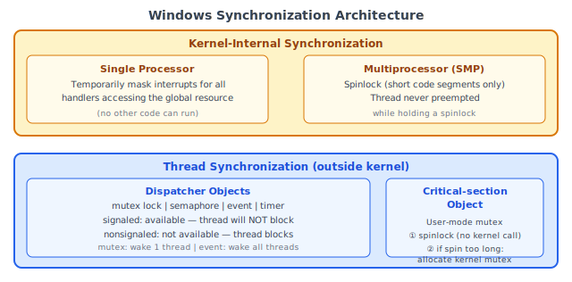
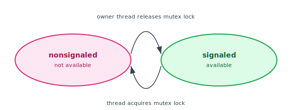
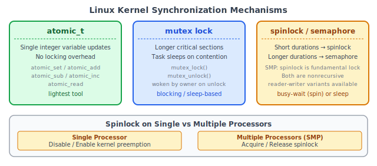
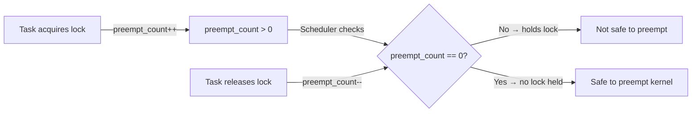

:::note
本系列文章內容參考自經典教材 **Operating System Concepts, 10th Edition (Silberschatz, Galvin, Gagne)**。本文對應章節：**Section 7.2 Synchronization within the Kernel**。
:::

## **從工具到實作**

Ch7.1 以 semaphore 與 monitor 為工具，示範如何解決 Bounded-Buffer、Readers-Writers、Dining-Philosophers 三個經典同步問題。這些解法呈現的是**概念層次**的設計：給定一組同步原語，如何組合出正確的協調邏輯。

但一個更實際的問題隨之而來：**OS 核心本身的資料結構**，例如 process 清單、就緒佇列、記憶體對映表，也需要被並行存取的 thread 或 process 安全共用。核心用什麼機制保護這些結構？它和使用者空間的 semaphore 一樣嗎？

答案是：不完全一樣。不同的 OS 會根據硬體架構（單處理器 vs. 多處理器）以及同步發生的層次（核心內部 vs. 執行緒之間），選擇不同的實作。本節以 Windows 和 Linux 為例，說明兩大主流 OS 如何在核心層落實同步機制。

<br/>

## **7.2.1 Windows 的同步機制**

### **核心層內部同步 (Kernel-Internal Synchronization)**

Windows 作業系統是一個多執行緒核心，支援即時應用程式與多處理器系統。當 Windows 核心需要存取全域資源時，保護策略取決於處理器數量：

- **單處理器系統**：Windows 臨時**遮蔽（mask）中斷**，針對所有可能存取同一全域資源的中斷處理程式（interrupt handler）停用中斷。由於單處理器同一時間只能執行一條指令，停用中斷就能確保沒有其他程式碼能打斷目前的操作。

- **多處理器系統（SMP）**：Windows 使用 **Spinlock** 保護全域資源。核心設計上只將 spinlock 用於**短暫的程式碼片段**（critical section 執行完就立刻釋放）。此外，為了效率考量，核心保證**執行緒在持有 spinlock 期間不會被搶占（preempted）**，避免出現持有鎖卻被排入等待的情況。

下圖呈現 Windows 同步架構的兩個層次：核心層內部用中斷遮蔽（單處理器）或 spinlock（多處理器），執行緒層則使用 Dispatcher Objects 和 Critical-section Object：



### **Dispatcher Objects：執行緒同步的核心工具**

對於核心外部的**執行緒同步（thread synchronization outside the kernel）**，Windows 提供了 **Dispatcher Objects（分派器物件）**。透過 dispatcher object，執行緒可以依照多種不同機制進行同步：

| 機制 | 說明 |
| :---: | :--- |
| **Mutex Lock（互斥鎖）** | 互斥存取；同一時間只有一個執行緒能「持有（own）」它 |
| **Semaphore（信號量）** | 如 Ch6.6 所述的 counting semaphore |
| **Event（事件）** | 類似 condition variable；當某個期望條件發生時，通知等待中的執行緒 |
| **Timer（計時器）** | 當指定時間到期時，通知一個或多個執行緒 |

每個 dispatcher object 都處於以下兩種狀態之一：

- **Signaled state（已信號狀態）**：物件可用，執行緒嘗試取得時**不會被阻塞**
- **Nonsignaled state（未信號狀態）**：物件不可用，執行緒嘗試取得時**會被阻塞**

下圖呈現 mutex lock dispatcher object 的狀態轉移（即 Figure 7.8）：



當 mutex 的持有者釋放鎖時，物件從 nonsignaled 轉為 signaled（可用）；當另一個執行緒取得鎖時，物件再次轉為 nonsignaled（不可用）。每次狀態轉移都由一個對應的操作觸發，形成一個封閉的生命週期。

### **Dispatcher Object 與執行緒狀態的關係**

Dispatcher object 的狀態與執行緒（thread）的狀態之間有直接的對應關係：

1. **執行緒在 nonsignaled 物件上阻塞**：執行緒狀態從 ready 改變為 waiting，並被放入該物件的等待佇列（waiting queue）中
2. **物件轉為 signaled 狀態**：核心檢查是否有執行緒在等待，若有，則將一個或多個執行緒從 waiting 移回 ready，使它們可以繼續執行

核心從等待佇列中選取多少執行緒，取決於 dispatcher object 的類型：

- **Mutex**：核心只選取**一個**執行緒（mutex 同一時間只能被一個執行緒持有）
- **Event**：核心選取**所有**等待該事件的執行緒

:::info Semaphore 與 Event 的差異
`semaphore` 的計數器決定了允許同時持有的執行緒數量，每次 `signal` 只釋放一個等待執行緒（或增加計數器）。`event` 則更接近廣播機制：當事件發生時，所有等待中的執行緒都被喚醒。`timer` 可以視為週期性的 event，在指定時間到期後自動發出信號。這些機制的存在讓 Windows 能夠支援即時應用程式（real-time applications）所需的精確時序控制。
:::

### **Critical-section Object：效率優先的混合機制**

**Critical-section Object（臨界區段物件）** 是一種**用戶模式的 mutex（user-mode mutex）**，與 dispatcher object 不同，它通常可以在**不進入核心的情況下**取得和釋放。其設計採用混合策略：

1. **先用 spinlock**：在多處理器系統上，先以 spinlock 等待另一個執行緒釋放物件
2. **若 spin 時間過長**：配置（allocate）一個核心層的 mutex，並讓出 CPU（yield）

這個設計的效率優勢在於：**核心層 mutex 只在有競爭（contention）時才被分配**。實際上競爭很少發生，因此大部分情況下 critical-section object 的取得和釋放完全在用戶模式完成，省去了系統呼叫（system call）的開銷。在實務中，這帶來了顯著的效能提升。

:::info 為什麼不直接用 spinlock？
Spinlock 在等待時會讓 CPU 空轉（busy-wait），若等待時間過長，這些 CPU cycle 全部浪費。Critical-section object 的策略是：**短暫等待時 spin**（因為 spin 比系統呼叫快），**等待時間拉長就換成 sleep**（避免浪費太多 CPU）。這是一個在「低延遲」與「資源效率」之間的自動動態切換，開發者不需要手動選擇。
:::

<br/>

## **7.2.2 Linux 的同步機制**

### **背景：從非搶占到完全搶占式核心**

理解 Linux 同步機制，必須先了解一個重要的歷史背景。

**在 Linux 2.6 版之前，Linux 核心是非搶占式（nonpreemptive）的**：在核心模式（kernel mode）下執行的 process 不能被搶占，即使有更高優先級的 process 就緒，也無法打斷正在核心中執行的任務。這個設計大幅簡化了同步問題，因為進入核心的任務可以假設「自己不會在執行途中被切換掉」。

**從 2.6 版開始，Linux 核心改為完全搶占式（fully preemptive）**：任務即使在核心模式下執行，也可以被搶占。這大幅提升了系統對高優先級任務的響應速度（response time），但也意味著核心自身的資料結構必須有更嚴密的保護。

這一改變正是 Linux 核心需要多種同步機制的根本原因。

### **原子整數（Atomic Integer, atomic_t）**

Linux 核心提供的最輕量同步工具是**原子整數（atomic integer）**，以不透明資料型別（opaque data type）`atomic_t` 表示。所謂「原子（atomic）」，意指所有使用 `atomic_t` 的數學運算都**不會被中途打斷**，在硬體層面以不可分割的方式完成。

```c
atomic_t counter;
int value;
```

Linux 提供以下原子操作：

| 原子操作 | 效果 |
| :------- | :--- |
| `atomic_set(&counter, 5)` | `counter = 5` |
| `atomic_add(10, &counter)` | `counter = counter + 10` |
| `atomic_sub(4, &counter)` | `counter = counter - 4` |
| `atomic_inc(&counter)` | `counter = counter + 1` |
| `value = atomic_read(&counter)` | `value = 12`（假設之前的操作依序執行後結果為 12）|

原子整數的最大優點是**不需要鎖定機制的額外開銷**，在需要更新計數器（counter）等整數變數的場景下特別高效。然而，它的適用範圍僅限於單一整數變數的更新。**若有多個變數共同構成一個 race condition 的條件，就必須使用更完整的鎖定工具。**

### **Mutex Lock**

對於需要保護較長 critical section 的場景，Linux 核心提供 **mutex lock（互斥鎖）**。任務在進入 critical section 前必須呼叫 `mutex_lock()`，離開後呼叫 `mutex_unlock()`：

```c
mutex_lock(&lock);
/* critical section */
mutex_unlock(&lock);
```

如果呼叫 `mutex_lock()` 時鎖已被持有，**呼叫任務會進入 sleep 狀態（睡眠等待）**，直到鎖的持有者呼叫 `mutex_unlock()` 後才被喚醒。這是一種**阻塞式等待（blocking wait）**，適合需要持有鎖較長時間的情境，因為睡眠比忙碌等待更節省 CPU 資源。

### **Spinlock 與 Semaphore**

Linux 也在核心中提供 **spinlock** 與 **semaphore**（以及這兩者的 **reader-writer 版本**）。

以下圖呈現三種主要同步機制的特性對比，以及 spinlock 在不同處理器環境下的差異化行為：



在 **SMP（Symmetric Multiprocessing）多處理器機器**上，spinlock 是核心最基本的鎖定機制（fundamental locking mechanism）。核心的設計原則是：**spinlock 只應被持有非常短暫的時間**（short duration）。

在**單處理器機器**（例如只有一個 processing core 的嵌入式系統）上，spinlock 是不恰當的選擇，原因很直觀：如果只有一個處理器，而 spinlock 讓當前 CPU 忙碌等待，則持有鎖的任務根本無法執行、永遠無法釋放鎖，形成死鎖。因此，在單處理器系統上，spinlock 被替換為「停用 / 啟用核心搶占（disable/enable kernel preemption）」：

| | 單處理器（Single Processor） | 多處理器（Multiple Processors） |
| :---: | :---: | :---: |
| **取得鎖** | Disable kernel preemption | Acquire spinlock |
| **釋放鎖** | Enable kernel preemption | Release spinlock |

這個設計很有道理：在單處理器上，只要確保不被搶占（不讓其他任務插進來），就能等效達到 spinlock 保護的效果，同時不浪費任何 CPU 資源在忙碌等待上。

:::info 為什麼 SMP 上的 spinlock 比停用搶占更好？
在多處理器系統上，停用搶占只能防止當前 CPU 上的任務切換，無法阻止**其他 CPU 上的任務**同時存取共享資料。Spinlock 的鎖定機制跨越所有 CPU，確保同一時間只有一個 CPU 上的任務持有鎖。這是 spinlock 在 SMP 環境中不可替代的原因。
:::

### **不可重入鎖（Nonrecursive Locks）**

Linux 核心中的 spinlock 和 mutex lock 都是**不可重入（nonrecursive）的**：如果一個 thread 已經取得某個鎖，它無法在不先釋放的情況下再次取得同一把鎖。若試圖重複取得，第二次的嘗試將會永久阻塞。

這個設計是刻意的，可以防止因重複取鎖而形成的隱性死鎖，迫使開發者明確追蹤每次鎖的取得與釋放。

### **preempt_count：核心搶占的安全門衛**

Linux 使用 `preempt_disable()` 與 `preempt_enable()` 系統呼叫來停用和啟用核心搶占。但核心如何判斷在某一時刻停用搶占是否安全？

答案是 **`preempt_count`**：每個任務都有一個 **thread-info 結構（thread-info structure）**，其中包含一個計數器 `preempt_count`，記錄該任務**目前持有的鎖數量**。

`preempt_count` 的生命週期如下：



詳細說明：

1. **任務取得鎖**：`preempt_count` 遞增（`++`）
2. **任務釋放鎖**：`preempt_count` 遞減（`--`）
3. **排程器判斷**：若 `preempt_count > 0`，代表任務仍持有至少一把鎖，**不安全**搶占；若 `preempt_count == 0`，代表任務未持有任何鎖，**安全**搶占（假設也沒有未配對的 `preempt_disable()` 呼叫）

這個設計的優雅之處在於：核心不需要用複雜的邏輯去追蹤「是否有任何鎖被持有」，只需比較一個整數計數器是否為零。此外，即使是 `preempt_disable()` / `preempt_enable()` 這對系統呼叫，本質上也是在操作這個 `preempt_count`：`preempt_disable()` 讓它遞增，`preempt_enable()` 讓它遞減。

:::info 核心搶占禁止的另一條規則
即使不明確呼叫 `preempt_disable()`，**只要任務在核心中持有鎖，核心就不可被搶占**。`preempt_count > 0` 這個條件天然涵蓋了「持有鎖」的情況。這條規則確保了持有鎖的任務能夠安全地完成 critical section，不會在中途被搶占而造成其他任務因鎖永遠不被釋放而死鎖。
:::

### **何時使用哪種鎖**

Linux 核心的設計哲學提供了一條清晰的使用指引：

| 場景 | 適合的鎖 | 原因 |
| :--: | :------: | :--- |
| 鎖持有時間**很短** | **Spinlock** / 停用核心搶占 | 忙碌等待比 sleep 再喚醒的開銷更小 |
| 鎖持有時間**較長** | **Semaphore** / **Mutex Lock** | 長時間 spin 浪費 CPU，sleep 等待更節省資源 |
| 更新單一**整數計數器** | **atomic_t** | 不需要任何鎖定，最輕量 |

這個分層選擇的邏輯，對應了「同步工具」的核心 trade-off：**spinlock** 勝在低延遲（latency）但高 CPU 消耗，**mutex/semaphore** 勝在節省 CPU 但有喚醒延遲，**atomic_t** 完全繞開鎖定機制但只能用於最簡單的整數操作。

<br/>

## **Windows vs Linux 核心同步對比**

| | Windows | Linux |
| :---: | :------ | :------ |
| **核心保護策略（單處理器）** | Interrupt masking（遮蔽中斷） | Disable kernel preemption |
| **核心保護策略（多處理器）** | Spinlock（短 critical section） | Spinlock（短 critical section） |
| **執行緒同步工具** | Dispatcher Objects（4 種機制） | Mutex lock、semaphore（+ rw 版本） |
| **可用狀態模型** | Signaled / Nonsignaled | Lock available / unavailable |
| **輕量級用戶態同步** | Critical-section Object（spinlock + kernel mutex 混合） | 無直接對應（Pthreads 另見 7.3 節） |
| **計數器同步** | 無獨立原子整數型別 | `atomic_t` |
| **搶占安全追蹤** | 由 kernel 隱性管理 | `preempt_count` 顯性計數 |
| **鎖的重入性** | 依類型不同 | Nonrecursive（spinlock、mutex 均不可重入） |

兩個系統在核心思想上高度一致：**短時間的保護用 spinlock（或停用搶占），長時間的保護用 sleep-based 鎖**。差異主要在於 API 設計的風格，以及 Windows 在用戶態提供了更豐富的 dispatcher object 種類（mutex、semaphore、event、timer）。
