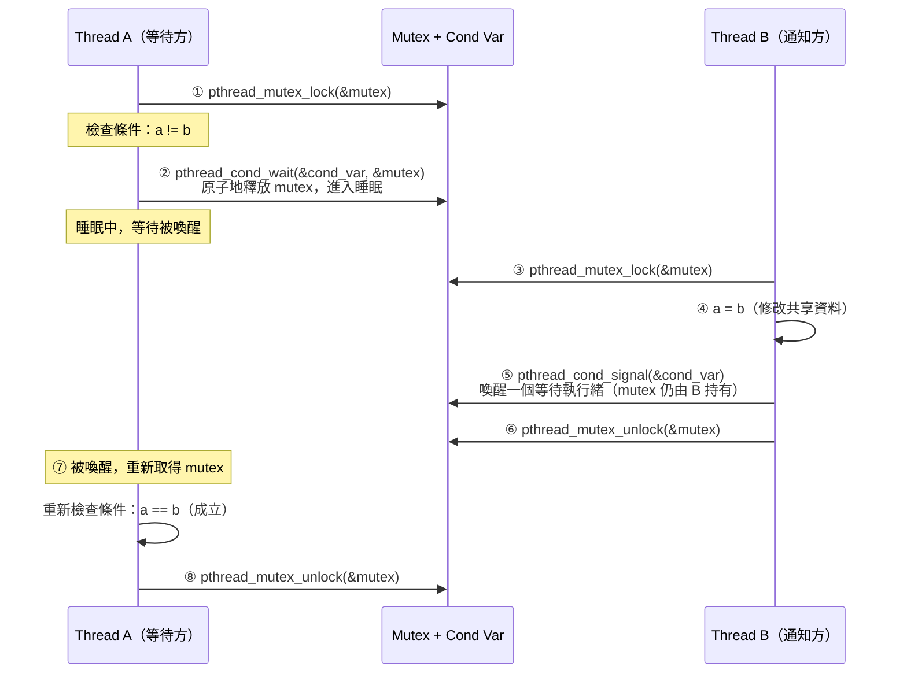

:::note
本系列文章內容參考自經典教材 **Operating System Concepts, 10th Edition (Silberschatz, Galvin, Gagne)**。本文對應章節：**Section 7.3 POSIX Synchronization**。
:::

## **從核心層到用戶層**

Ch7.2 介紹的同步機制，包括 Windows 的 dispatcher object 和 Linux 的 `atomic_t`、spinlock、mutex lock，都是**核心層（kernel-level）的工具**，只有核心開發者才能直接使用。應用程式開發者不能直接呼叫 `mutex_lock()` 來保護自己程式中的共享資料，因為那是核心的內部函式。

**POSIX API** 提供的同步工具，正好填補了這個空缺。POSIX 同步 API 是**用戶層（user-level）的工具**，不隸屬於任何特定 OS 核心，而是一套跨平台的標準介面（當然，底層實作仍然依賴 OS 提供的機制）。在 UNIX、Linux、macOS 上開發多執行緒程式的開發者，幾乎都是透過 Pthreads 和 POSIX API 來實現同步。

本節涵蓋 POSIX 提供的三種同步工具：**mutex lock（互斥鎖）**、**semaphore（信號量）**、**condition variable（條件變數）**。它們分別對應 Ch6 介紹的同名概念，但以 C 語言 API 的形式呈現，可以直接在應用程式中使用。

<br/>

## **7.3.1 POSIX Mutex Lock**

### **基本概念**

**Mutex lock（互斥鎖）** 是 Pthreads 最基礎的同步工具。其用途直觀：執行緒在進入 critical section（臨界區段）之前先取得（acquire）鎖，離開後再釋放（release）。同一時間只有一個執行緒能持有 mutex，其他嘗試取得的執行緒會被阻塞，直到鎖被釋放為止。

Pthreads 以 `pthread_mutex_t` 資料型別表示 mutex，透過 `pthread_mutex_init()` 建立並初始化：

```c
#include <pthread.h>

pthread_mutex_t mutex;

/* 建立並初始化 mutex，使用預設屬性 */
pthread_mutex_init(&mutex, NULL);
```

第一個參數是指向 mutex 的指標，第二個參數傳入 `NULL` 代表使用預設屬性。

### **取得與釋放**

建立完成後，透過 `pthread_mutex_lock()` 和 `pthread_mutex_unlock()` 取得與釋放 mutex：

```c
/* 進入 critical section 前取得 mutex */
pthread_mutex_lock(&mutex);

/* critical section */

/* 離開 critical section 後釋放 mutex */
pthread_mutex_unlock(&mutex);
```

當 `pthread_mutex_lock()` 被呼叫時，若 mutex 已被其他執行緒持有，呼叫執行緒將**被阻塞（blocked）**，直到持有者呼叫 `pthread_mutex_unlock()` 為止。所有 mutex 函式在操作成功時回傳 0，發生錯誤時回傳非零的錯誤碼。

:::info Pthreads mutex 與 Linux 核心 mutex 的差異
Ch7.2 介紹的 `mutex_lock()` / `mutex_unlock()` 是 Linux 核心內部使用的函式，只有核心程式碼能呼叫。`pthread_mutex_lock()` 是 POSIX Pthreads 函式庫提供的用戶層介面，運作在 user space，任何 C 程式都能使用。兩者的語意相同（互斥、阻塞等待），但所在層次不同，不能互換。
:::

<br/>

## **7.3.2 POSIX Semaphore**

POSIX 的 semaphore 並非 Pthreads 標準的一部分，而是屬於 **POSIX SEM 擴充（POSIX SEM extension）**。在很多實作了 Pthreads 的系統上，semaphore 同樣被提供，但需要引入 `<semaphore.h>`。

POSIX 定義了兩種 semaphore：**具名信號量（Named Semaphore）** 與**匿名信號量（Unnamed Semaphore）**。兩者的核心語意相同，差異在於建立方式和跨 process 的共享能力。

### **具名信號量 (Named Semaphore)**

具名信號量（named semaphore）透過 `sem_open()` 建立並取得：

```c
#include <semaphore.h>

sem_t *sem;

/* 建立名為 "SEM" 的 semaphore，初始值為 1 */
sem = sem_open("SEM", O_CREAT, 0666, 1);
```

各參數的含義：

- `"SEM"`：semaphore 的名稱，類似檔案系統的路徑，以字串作為識別鍵
- `O_CREAT`：若 semaphore 不存在則建立；若已存在則回傳已有的 descriptor
- `0666`：存取權限，允許其他 process 讀寫
- `1`：semaphore 的初始值

具名信號量最大的優勢是：**彼此不相關的 process** 只要知道 semaphore 的名稱，就能透過 `sem_open()` 取得同一個 semaphore 的 descriptor，以此作為跨 process 的同步媒介。這比匿名信號量的適用範圍更廣。

建立完成後，使用 `sem_wait()` 和 `sem_post()` 取得與釋放（對應 Ch6.6 的 `wait()` 和 `signal()`）：

```c
/* 取得 semaphore（wait / P 操作） */
sem_wait(sem);

/* critical section */

/* 釋放 semaphore（signal / V 操作） */
sem_post(sem);
```

Linux 和 macOS 都支援 POSIX 具名信號量。

### **匿名信號量 (Unnamed Semaphore)**

匿名信號量（unnamed semaphore）透過 `sem_init()` 建立，需要傳入三個參數：

```c
#include <semaphore.h>

sem_t sem;

/* 建立匿名 semaphore，初始值為 1 */
sem_init(&sem, 0, 1);
```

三個參數的含義：

1. **指向 semaphore 的指標**：注意是值型別 `sem_t`，而非指標型別（相對於具名的 `sem_t *`）
2. **共享旗標（sharing flag）**：傳入 `0` 表示此 semaphore 只在同一個 process 的執行緒之間共享；若傳入非零值，semaphore 可存放於共享記憶體（shared memory）區域，在不同 process 之間共享
3. **初始值**：semaphore 的起始計數值

匿名信號量同樣使用 `sem_wait()` 和 `sem_post()`，但傳入的是值型別的位址：

```c
/* 取得 semaphore */
sem_wait(&sem);

/* critical section */

/* 釋放 semaphore */
sem_post(&sem);
```

如同 mutex 函式，所有 semaphore 函式在成功時回傳 0，發生錯誤時回傳非零值。

:::info 具名 vs. 匿名：如何選擇
兩種 semaphore 的語意完全相同，差異只在使用場景：

|                         |              Named Semaphore              |       Unnamed Semaphore       |
| :---------------------: | :---------------------------------------: | :---------------------------: |
|      **建立方式**       |               `sem_open()`                |         `sem_init()`          |
|      **識別方式**       |                 字串名稱                  |        記憶體變數位址         |
|   **跨 process 共享**   | 天生支援（任何 process 都能用名稱找到它） | 需要共享記憶體（flag 設非零） |
| **同一 process 內共用** |                   支援                    |       支援（flag 設 0）       |
|    **典型使用場景**     |       不相關的多個 process 之間同步       | 同一 process 的執行緒之間同步 |

選擇的原則很簡單：若同步的雙方是**同一個 process 的執行緒**，用匿名信號量即可；若雙方是**不同的 process**，用具名信號量，省去手動建立共享記憶體的麻煩。
:::

<br/>

## **7.3.3 POSIX Condition Variable**

### **為什麼需要 Condition Variable？**

設想一個場景：某個執行緒需要等待「共享變數 `a` 等於 `b`」這個條件成立後才能繼續。若只用 mutex，程式只能這樣寫：

```c
pthread_mutex_lock(&mutex);
while (a != b)  {
    pthread_mutex_unlock(&mutex); // 條件未成立，先釋放鎖
    /* 等一下再試 */
    pthread_mutex_lock(&mutex);   // 再次取得鎖，重新檢查條件
}
/* 條件成立，繼續執行 */
pthread_mutex_unlock(&mutex);
```

這種方式稱為**忙碌輪詢（busy polling）**：執行緒反覆釋放鎖、重新取得鎖、再次檢查條件。即使條件短時間內不會成立（例如要等另一個執行緒寫入資料），這個執行緒仍然不斷佔用 CPU 資源，非常浪費。

**Condition Variable（條件變數）** 解決了這個問題。它讓執行緒可以在條件不成立時**完全暫停（sleep）**，等到另一個執行緒通知條件改變後才被喚醒，完全不佔用 CPU。

然而，由於 C 語言沒有 monitor（Ch6.7 的 monitor 以帶有隱式鎖的物件方法形式存在），POSIX 的做法是：**將 condition variable 與一個 mutex 配對使用**，由程式設計師顯式管理鎖的取得與釋放。

### **建立與初始化**

Pthreads 以 `pthread_cond_t` 表示 condition variable，透過 `pthread_cond_init()` 初始化，同時必須搭配一個 mutex：

```c
pthread_mutex_t mutex;
pthread_cond_t  cond_var;

pthread_mutex_init(&mutex,    NULL);
pthread_cond_init(&cond_var,  NULL);
```

### **等待條件：pthread_cond_wait()**

執行緒使用 `pthread_cond_wait()` 等待條件成立。以等待 `a == b` 為例：

```c
pthread_mutex_lock(&mutex);
while (a != b)
    pthread_cond_wait(&cond_var, &mutex);
pthread_mutex_unlock(&mutex);
```

這段程式碼的執行流程如下：

1. **取得 mutex**：在檢查條件之前必須先持有 mutex，以防止在「判斷條件」與「進入等待」之間發生 race condition
2. **檢查條件**：在 `while` 迴圈中檢查條件是否成立（使用 `while` 而非 `if`，原因稍後說明）
3. **呼叫 wait**：若條件不成立，呼叫 `pthread_cond_wait()`，它會**原子地（atomically）** 做兩件事：釋放 mutex，並讓執行緒進入睡眠等待
4. **被喚醒後重新取得 mutex**：當另一個執行緒發出信號喚醒此執行緒時，`pthread_cond_wait()` 在返回前會重新取得 mutex，確保執行緒回到 critical section 的保護下

:::info 為什麼 wait 必須原子地釋放 mutex？
若釋放 mutex 和進入睡眠是兩個分開的步驟，就可能在中間被插入：執行緒 A 釋放 mutex 後、還沒進入睡眠時，執行緒 B 修改了條件並發出信號。此時 A 尚未進入睡眠，信號就被遺漏了，A 進入睡眠後將永遠等待。`pthread_cond_wait()` 的原子語意正是為了消除這個 race window。
:::

### **發送信號：pthread_cond_signal()**

另一個執行緒在修改共享資料後，透過 `pthread_cond_signal()` 喚醒一個等待中的執行緒：

```c
pthread_mutex_lock(&mutex);
a = b;
pthread_cond_signal(&cond_var);
pthread_mutex_unlock(&mutex);
```

有一個重要細節：**`pthread_cond_signal()` 本身不釋放 mutex**，它只是喚醒一個在 `cond_var` 上等待的執行緒，但那個執行緒還無法繼續執行，因為 mutex 仍由呼叫 signal 的執行緒持有。直到隨後的 `pthread_mutex_unlock()` 釋放 mutex，被喚醒的執行緒才能重新取得 mutex，從 `pthread_cond_wait()` 正常返回。

下圖呈現一次完整的 condition variable wait/signal 互動流程：



流程中的關鍵時序：

- **步驟 ②**：`pthread_cond_wait()` 原子地釋放 mutex 並進入睡眠，消除信號遺漏的 race condition
- **步驟 ⑤**：signal 喚醒等待方，但 mutex 尚未釋放，等待方仍無法繼續
- **步驟 ⑥ → ⑦**：B 釋放 mutex，A 才能重新取得並從 `wait()` 返回
- **重新檢查條件**（`while` 迴圈）：A 返回後必須再次確認條件，因為在 A 被喚醒到取得 mutex 之間，其他執行緒可能已再次修改了共享資料

:::info 為什麼必須用 while 而不是 if 檢查條件？
`pthread_cond_wait()` 有可能出現**偽喚醒（spurious wakeup）**：執行緒在沒有任何執行緒呼叫 `signal()` 的情況下被喚醒。這是 POSIX 標準允許的行為（部分硬體或實作會這樣做）。若用 `if` 只檢查一次，偽喚醒後執行緒會直接跳過條件繼續執行，導致 race condition；用 `while` 則每次返回都重新驗證條件，完全消除偽喚醒的影響。教科書原文也明確指出這一點：「to protect against program errors, it is important to place the conditional clause within a loop」。
:::

<br/>

## **三種工具對比**

|                     |      **Mutex Lock**      | **Semaphore（具名）** | **Semaphore（匿名）** | **Condition Variable**  |
| :-----------------: | :----------------------: | :-------------------: | :-------------------: | :---------------------: |
|     **標頭檔**      |      `<pthread.h>`       |    `<semaphore.h>`    |    `<semaphore.h>`    |      `<pthread.h>`      |
|    **資料型別**     |    `pthread_mutex_t`     |       `sem_t *`       |        `sem_t`        |    `pthread_cond_t`     |
|     **初始化**      |  `pthread_mutex_init()`  |     `sem_open()`      |     `sem_init()`      |  `pthread_cond_init()`  |
|   **取得 / 等待**   |  `pthread_mutex_lock()`  |     `sem_wait()`      |     `sem_wait()`      |  `pthread_cond_wait()`  |
|   **釋放 / 通知**   | `pthread_mutex_unlock()` |     `sem_post()`      |     `sem_post()`      | `pthread_cond_signal()` |
| **跨 process 共享** |            否            |    是（透過名稱）     |    可（flag 非零）    |           否            |
|    **計數能力**     |        否（二元）        |    是（counting）     |    是（counting）     |   否（需配合 mutex）    |
|    **條件等待**     |            否            |  間接（透過計數值）   |  間接（透過計數值）   |     是（直接支援）      |

三種工具的用途定位：

- **Mutex Lock**：最基本的互斥保護，適用於保護任何 critical section。若只需要「同一時間只有一人進入」，mutex 是最直觀的選擇。
- **Semaphore**：適合「允許 N 個執行緒同時存取」的場景（counting semaphore），或需要跨 process 同步的場景（具名信號量）。
- **Condition Variable**：適合「等待某個條件成立」的場景，必須搭配 mutex 使用。與 semaphore 的關鍵差異是：semaphore 透過計數值隱含條件，condition variable 讓程式設計師可以表達任意條件（`a == b`、`buffer_not_full`、`queue_size > 0` 等）。
