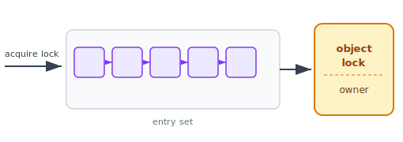
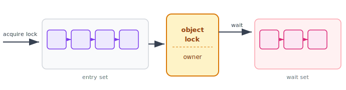
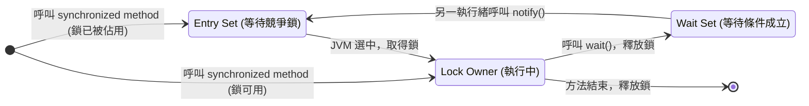
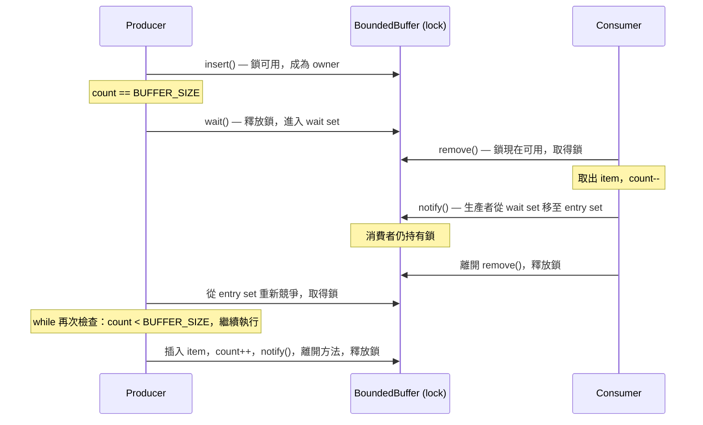

:::note
本系列文章內容參考自經典教材 **Operating System Concepts, 10th Edition (Silberschatz, Galvin, Gagne)**。本文對應章節：**Section 7.4 Synchronization in Java**。
:::

Java 語言從誕生之初就對執行緒同步化（thread synchronization）提供了豐富的支援。Section 7.4 依序介紹四種主要機制：

| 機制                   | 引入版本 | 核心工具                                  |
| :--------------------- | :------: | :---------------------------------------- |
| **Java Monitor**       | Java 1.0 | `synchronized`、`wait()`、`notify()`      |
| **Reentrant Lock**     | Java 1.5 | `ReentrantLock`、`ReentrantReadWriteLock` |
| **Semaphore**          | Java 1.5 | `Semaphore`（`acquire()` / `release()`）  |
| **Condition Variable** | Java 1.5 | `Condition`（`await()` / `signal()`）     |

後三種機制在 Java 1.5 版本同步引入，補足了 Java Monitor 在靈活性與精確性上的不足。

<br/>

## **7.4.1 Java Monitor**

### **每個物件都是一個 Monitor**

Java 最核心的同步化設計是：**每一個 Java 物件，都內建一把鎖（lock）**。這個設計讓任何物件都可以作為互斥存取的保護單位，不需要額外宣告鎖物件。

當一個 method 被宣告為 `synchronized`，呼叫這個 method 需要先擁有該物件的鎖（the lock for the object）。以解決 bounded-buffer problem 的 `BoundedBuffer` 類別為例：

```java
public class BoundedBuffer<E> {
    private static final int BUFFER_SIZE = 5;
    private int count, in, out;
    private E[] buffer;

    public BoundedBuffer() {
        count = 0; in = 0; out = 0;
        buffer = (E[]) new Object[BUFFER_SIZE];
    }

    /* Producers call this method */
    public synchronized void insert(E item) { /* 見下方 */ }

    /* Consumers call this method */
    public synchronized E remove()          { /* 見下方 */ }
}
```

`insert()` 和 `remove()` 都宣告為 `synchronized`，這意味著同一時間，只有一個執行緒可以執行其中任一個方法。生產者和消費者透過競爭同一把物件鎖來保證互斥。

### **Entry Set：競爭鎖時的等待區**

考慮多個生產者執行緒同時想呼叫 `insert()` 的情況。物件的鎖在某一時刻只能由一個執行緒持有。那些拿不到鎖的執行緒不會無端消失，它們會被放進一個稱為 **entry set（進入集合）** 的等待區，並以 blocked 狀態等待鎖被釋放。

下圖展示了 entry set 的結構：多個執行緒在 entry set 中排隊，等待取得物件鎖之後才能進入 synchronized method。



entry set 的運作規則：
- 若鎖被佔用，呼叫 synchronized method 的執行緒被 blocked，放入 entry set
- 若鎖可用，執行緒直接成為鎖的 owner，進入方法執行
- 當鎖被釋放（method 結束）時，JVM 從 entry set 中**任意選取**一個執行緒，讓它成為新的 owner

這個機制保證了互斥：任意時刻最多只有一個執行緒在執行 synchronized method。

:::info JVM 如何選擇下一個執行緒
Java 規格（JVM Specification）並未規定 entry set 必須依特定順序排列，僅說明由 JVM「任意選取」。在實務上，大多數 JVM 實作會以 **FIFO** 順序排列，讓等待最久的執行緒優先取得鎖，以避免飢餓（starvation）。
:::

### **wait()：主動讓出鎖並進入等待集合**

光有 entry set 還不夠。考慮以下情境：生產者執行緒持有鎖、進入了 `insert()` 方法，卻發現緩衝區已滿（`count == BUFFER_SIZE`），根本無法插入資料。

如果這個執行緒死守著鎖不放，消費者執行緒永遠無法進入 `remove()` 方法取出資料，系統陷入僵局。解決辦法是讓這個執行緒**主動讓出鎖**，等待緩衝區有空位再繼續。Java 的 `wait()` 方法正是為此而設計。

當一個執行緒在 synchronized method 中呼叫 `wait()` 時，依序發生三件事：

1. **釋放鎖**：執行緒放棄目前持有的物件鎖
2. **狀態設為 blocked**：執行緒暫停執行，不會繼續往下跑
3. **進入 wait set**：執行緒被放進物件的 **wait set（等待集合）**

wait set 和 entry set 共存於同一個物件，形成完整的 Monitor 模型。下圖呈現了兩個集合並存的樣貌：



理解這張圖的關鍵在於區分兩個集合的**等待原因**：

| 集合          | 執行緒狀態 | 等待原因             | 如何進入                               | 如何離開                                  |
| :------------ | :--------- | :------------------- | :------------------------------------- | :---------------------------------------- |
| **Entry Set** | blocked    | 鎖被佔用，等待競爭   | 呼叫 synchronized method 時鎖已被持有  | JVM 選中此執行緒，取得鎖                  |
| **Wait Set**  | blocked    | 條件不滿足，主動等待 | 在 synchronized method 中呼叫 `wait()` | 另一執行緒呼叫 `notify()`，移至 entry set |

這是 Java Monitor 與單純 mutex lock 的最大差異：Monitor 不僅能互斥，還能讓執行緒在條件未滿足時主動等待，避免無謂的忙等（busy-waiting）。

以下是執行緒在三種狀態之間完整的轉換關係：



### **notify()：喚醒等待集合中的執行緒**

當消費者從緩衝區取出 item 之後，需要通知在 wait set 中等待的生產者：現在有空位了，可以繼續插入。Java 的 `notify()` 負責傳遞這個訊號。

呼叫 `notify()` 時，依序發生三件事：

1. 從 wait set 中**任意選取**一個執行緒 T
2. 將 T 從 wait set **移動到 entry set**
3. 將 T 的狀態從 blocked 設為 **runnable**

T 此時重新回到競爭鎖的行列，但並不立即執行。它必須等到當前 owner 釋放鎖之後，才有機會從 `wait()` 的呼叫點繼續執行，並重新檢查條件。若 wait set 為空，`notify()` 的呼叫不產生任何效果。

:::warning notify() 不直接交出鎖
`notify()` 呼叫後，被喚醒的執行緒 T 不會立即得到鎖，它只是從 wait set 移到 entry set，重新開始競爭。當前持有鎖的執行緒，在方法結束（或再次呼叫 `wait()`）之前，始終持有鎖的所有權。
:::

### **insert() 與 remove() 的完整實作**

有了 `wait()` 和 `notify()` 的語意基礎，`insert()` 和 `remove()` 的完整實作如下：

```java
/* Producers call this method */
public synchronized void insert(E item) {
    while (count == BUFFER_SIZE) {
        try { wait(); } catch (InterruptedException ie) { }
    }
    buffer[in] = item;
    in = (in + 1) % BUFFER_SIZE;
    count++;
    notify();
}

/* Consumers call this method */
public synchronized E remove() {
    E item;
    while (count == 0) {
        try { wait(); } catch (InterruptedException ie) { }
    }
    item = buffer[out];
    out = (out + 1) % BUFFER_SIZE;
    count--;
    notify();
    return item;
}
```

:::tip 為什麼條件檢查必須用 while 而不是 if？
`while` 而非 `if` 是確保正確性的關鍵，理由有兩個：

**第一，競態條件（race condition）**：執行緒從 wait set 被移至 entry set 之後，在它再次取得鎖之前，其他執行緒可能已經改變了條件。例如，生產者被喚醒後，在它取得鎖之前，另一個生產者搶先插入資料把緩衝區再次填滿。`while` 確保執行緒醒來後重新驗證條件，而非盲目繼續執行。

**第二，spurious wakeup（虛假喚醒）**：某些平台的 JVM 實作中，執行緒可能在沒有 `notify()` 的情況下被喚醒。`while` 確保這種情況下執行緒仍然正確地繼續等待，而非誤以為條件已成立。
:::

### **一次完整的 Producer-Consumer 互動追蹤**

以緩衝區已滿、消費者介入解救的情境，逐步追蹤每個執行緒的狀態變化：



這個流程有兩個容易忽略的細節。第一，消費者呼叫 `notify()` 後**並未立即交出鎖**，而是繼續執行到 `remove()` 方法結束才釋放。第二，生產者被喚醒後**不是直接從 `wait()` 返回並繼續**，而是先競爭鎖，取得後才從 `wait()` 的呼叫點恢復執行，並重新執行 `while` 的條件判斷。

### **Block Synchronization（塊級同步化）**

**鎖的作用域（scope of the lock）** 定義為從取得鎖到釋放鎖之間的時間範圍。若一個 `synchronized` method 只有一小部分程式碼在存取共享資料，其鎖的作用域就過大，會不必要地阻塞其他執行緒。

Java 支援**塊級同步化（block synchronization）**：不對整個方法加鎖，只對確實需要保護的程式碼區塊加鎖。以下範例中，`someMethod()` 本身不是 synchronized，只有操作共享資料的那一小段才需要鎖：

```java
public void someMethod() {
    /* non-critical section — 不需要鎖，可與其他執行緒並行 */

    synchronized(this) {
        /* critical section — 取得 this 物件的鎖 */
    }

    /* remainder section — 不需要鎖 */
}
```

縮小鎖的作用域，能降低執行緒間的鎖競爭，提升整體並行度（concurrency）。這是設計高效並行程式時的重要原則：**鎖的持有時間應該越短越好**。

<br/>

## **7.4.2 Reentrant Lock**

### **比 synchronized 更靈活的互斥機制**

`synchronized` 的鎖是隱式（implicit）的：進入 synchronized method 自動取得鎖，離開方法自動釋放，不允許細粒度控制。Java 1.5 引入的 **ReentrantLock** 提供顯式（explicit）的鎖操作，允許更精細的並行策略。

`ReentrantLock` 實作了 `Lock` 介面，基本用法如下：

```java
Lock key = new ReentrantLock();
key.lock();
try {
    /* critical section */
} finally {
    key.unlock();
}
```

「Reentrant（可重入）」的含義是：若一個執行緒已持有某個 `ReentrantLock`，再次對同一個鎖呼叫 `lock()` 不會造成死結，而是直接成功並累加鎖計數（對應的 `unlock()` 也需要被呼叫相同次數）。這個特性對遞迴方法或互相呼叫的 synchronized 方法十分重要。

`ReentrantLock` 還支援**公平性參數（fairness parameter）**，可指定優先讓等待最久的執行緒取得鎖，而非隨機選取，進一步避免飢餓。

### **try/finally 模式的必要性**

`unlock()` 必須放在 `finally` 區塊，而不能放在 try 區塊結尾，理由很直接：若 critical section 內拋出 exception，控制流程會跳出 try 區塊，直接進入 catch 或傳遞 exception。若 `unlock()` 不在 `finally` 中，鎖就永遠不會被釋放，所有等待此鎖的執行緒會永久阻塞。

:::info 為什麼 lock() 也不放在 try 區塊內？
`lock()` 刻意放在 `try` 外面。若 `lock()` 本身因 unchecked exception 失敗（鎖從未被取得），`finally` 仍然會執行 `unlock()`，而未取得的鎖呼叫 `unlock()` 會拋出 `IllegalMonitorStateException`，把原始的失敗原因蓋掉，讓問題更難追蹤。`lock()` 放在 try 外面，可確保只有在成功取得鎖之後，`finally` 中的 `unlock()` 才是有效的。
:::

### **ReentrantReadWriteLock：多讀者並行**

`ReentrantLock` 提供完整的互斥（mutual exclusion），但在多個執行緒**只讀取**共享資料的場景下，互斥是不必要的限制，因為並行讀取本身不會造成 race condition。

Java API 提供 **`ReentrantReadWriteLock`**，實現「多個並行讀者（read mode）、至多一個寫者（write mode）」的語意。這直接對應 Section 7.1.2 Readers-Writers Problem 的解法，在讀多寫少的場景下能顯著提升吞吐量。

<br/>

## **7.4.3 Semaphore**

Java API 提供計數型號誌（counting semaphore），與 Chapter 6.6 介紹的概念一致。

```java
Semaphore sem = new Semaphore(1);
```

建構子接受初始值（可以為負值）。`acquire()` 對應 wait()（號誌減一，若為零則阻塞）；`release()` 對應 signal()（號誌加一，喚醒等待者）。初始值為 1 時，等同於 binary semaphore，可用於互斥存取：

```java
try {
    sem.acquire();
    /* critical section */
} catch (InterruptedException ie) {
    /* 處理執行緒被中斷 */
} finally {
    sem.release();
}
```

`release()` 同樣放在 `finally` 中，確保即使 critical section 拋出 exception，號誌也必然被釋放。`acquire()` 在執行緒被中斷（interrupted）時會拋出 `InterruptedException`，需要妥善處理。

<br/>

## **7.4.4 Condition Variable**

### **Java Monitor 的先天限制**

Java Monitor（`synchronized` + `wait()` + `notify()`）有一個根本限制：**每個 Java 物件只有一個匿名的條件（unnamed condition variable）**。所有呼叫 `wait()` 的執行緒，不論在等待什麼條件，全部進入同一個 wait set。

這在多條件情境下會造成問題。假設 wait set 中同時有「等待緩衝區有空位的生產者」和「等待緩衝區有 item 的消費者」，呼叫 `notify()` 是隨機選取的，完全有可能喚醒了錯誤的那方，讓它醒來後再次發現條件不成立，白白進行一次上下文切換後又回去等待。

**Condition Variable（條件變數）** 解決了這個問題：允許為不同的等待條件建立獨立的等待集合，`signal()` 可以精確喚醒等待特定條件的執行緒，消除不必要的虛假喚醒。

### **建立 Condition Variable**

Condition Variable 必須綁定一個 `ReentrantLock`。建立方式是呼叫 lock 的 `newCondition()` method，它返回一個代表該條件的 `Condition` 物件：

```java
Lock key = new ReentrantLock();
Condition condVar = key.newCondition();
```

`Condition` 提供 `await()` 和 `signal()` 方法：
- **`await()`**：釋放關聯的 `ReentrantLock`，並將執行緒置入此條件的等待集合（等同 Monitor 的 `wait()`）
- **`signal()`**：從此條件的等待集合中喚醒一個執行緒，移至 entry set（等同 Monitor 的 `notify()`）

### **具體範例：5 個執行緒按順序輪流工作**

以一個具體情境說明 Condition Variable 的精確喚醒能力：假設有 5 個執行緒（編號 0 到 4）和一個共享變數 `turn`，只有 `threadNumber == turn` 的執行緒才能進行工作，其他執行緒必須等待輪到自己。

為每個執行緒建立一個專屬的條件變數：

```java
Lock lock = new ReentrantLock();
Condition[] condVars = new Condition[5];
for (int i = 0; i < 5; i++)
    condVars[i] = lock.newCondition();
```

`doWork()` 實作如下：

```java
public void doWork(int threadNumber) {
    lock.lock();
    try {
        /* 若還沒輪到自己，在專屬條件上等待 */
        if (threadNumber != turn)
            condVars[threadNumber].await();

        /* 執行工作 ... */

        /* 工作完成，更新 turn 並精確喚醒下一個執行緒 */
        turn = (turn + 1) % 5;
        condVars[turn].signal();
    } catch (InterruptedException ie) {
    } finally {
        lock.unlock();
    }
}
```

這段程式碼的關鍵在於：`condVars[turn].signal()` 精確喚醒**下一個**應該工作的執行緒，而非隨機喚醒某個等待者。被喚醒的執行緒從 `await()` 的呼叫點恢復執行，繼續執行工作，然後喚醒再下一個。

`doWork()` 本身不需要宣告為 `synchronized`，因為 `ReentrantLock` 的 `lock()`/`unlock()` 已經提供互斥保護。這兩套機制不應混用。

:::info signal() 與 unlock() 的分工
呼叫 `signal()` 時，**只有條件變數發出訊號**，`ReentrantLock` 並未同時釋放。鎖的釋放必須另外呼叫 `unlock()` 才發生。因此在 `doWork()` 中，`signal()` 後仍然需要 `finally` 中的 `unlock()` 來釋放鎖，此時被喚醒的執行緒才能真正取得鎖並繼續執行。這與 Monitor 中 `notify()` 的語意一致：通知和釋放鎖是兩個獨立的操作。
:::
