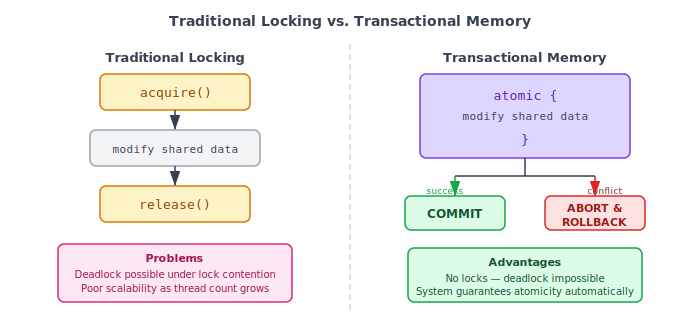
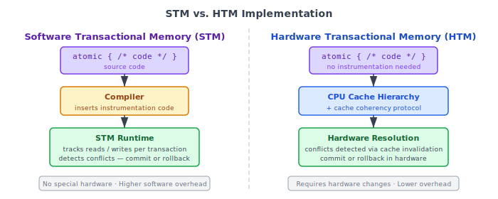
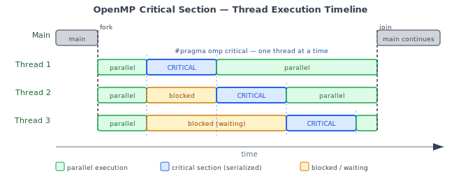

:::note
本系列文章內容參考自經典教材 **Operating System Concepts, 10th Edition (Silberschatz, Galvin, Gagne)**。本文對應章節：**Section 7.5 Alternative Approaches**。
:::

Section 7.5 從一個現實困境出發：隨著多核心（multicore）系統的普及，開發者對並行程式（concurrent application）的需求急劇增加，而傳統同步化工具在這個新環境下暴露出愈來愈明顯的弱點。

mutex lock、semaphore、monitor 在少數執行緒的情境下運作良好，但當核心數與執行緒數同步攀升，傳統鎖帶來的兩個問題開始成為瓶頸：

1. **Deadlock（死結）**：多個執行緒相互等待對方持有的鎖，系統永久停頓
2. **Poor scalability（擴展性差）**：競爭同一把鎖的執行緒越多，大量時間耗費在 blocked 狀態，整體吞吐量不升反降

本節介紹三種替代方案，各自從不同角度應對這個挑戰：

| 替代方案                   | 核心思路                                             | 主要工具                                       |
| :------------------------- | :--------------------------------------------------- | :--------------------------------------------- |
| **Transactional Memory**   | 把一段記憶體操作當作資料庫交易，系統自動保證原子性   | `atomic{}` 語言構造、STM、HTM                  |
| **OpenMP**                 | 用編譯器指令取代手動鎖管理，讓工具替開發者處理執行緒 | `#pragma omp parallel`、`#pragma omp critical` |
| **Functional Programming** | 徹底消除可變狀態，從根本上讓 race condition 無從發生 | Erlang、Scala                                  |

<br/>

## **7.5.1 Transactional Memory（交易式記憶體）**

### **傳統鎖的問題**

保護共享資料的標準寫法如下：

```c
void update()
{
    acquire();
    /* modify shared data */
    release();
}
```

這個模式的責任完全落在開發者身上：哪些資料需要保護、何時 acquire、何時 release，一旦設計稍有疏漏就可能引發難以重現的並行錯誤。更嚴重的是，隨著執行緒數量增加，競爭同一把鎖的機率也隨之上升。大量執行緒在鎖外等待，不僅浪費 CPU 資源，也讓整體吞吐量無法隨核心數線性成長。

### **Memory Transaction 的概念**

Transactional Memory（交易式記憶體）的靈感來自資料庫理論中的「交易（transaction）」概念。**Memory transaction（記憶體交易）** 是一段對記憶體進行讀寫操作的序列，這段序列必須是**原子的（atomic）**：

- 若交易內所有操作都成功完成，交易即**提交（commit）**，修改正式生效
- 若其中任何操作因為衝突而無法繼續，交易必須**中止（abort）**並**回滾（rollback）**，狀態恢復到進入交易之前

下圖對比了傳統鎖與 Transactional Memory 的結構與結果：



左側傳統做法依序執行 `acquire()`、修改、`release()`，任何步驟出錯都可能導致死結或資料損毀，且開發者必須自行確保所有執行路徑都能正確釋放鎖。右側的 Transactional Memory 只需宣告「這段是一個整體」，系統負責決定結果是 COMMIT 還是 ABORT/ROLLBACK，開發者不再需要手動管理鎖的生命週期。

### **`atomic{}` 語言構造**

要在程式語言層面使用 Transactional Memory，只需加入一個新的語言構造 `atomic{S}`，用來宣告其中的操作序列 S 以交易方式執行：

```c
void update()
{
    atomic
    {
        /* modify shared data */
    }
}
```

`atomic{}` 相比傳統鎖有三個關鍵優勢：

1. **無鎖（lock-free）**：`atomic` 塊不使用任何鎖，因此不可能發生 deadlock
2. **系統識別並發機會**：交易式記憶體系統能自動分析 `atomic` 塊內哪些操作可以安全並行，例如多個執行緒同時讀取同一個變數不會衝突，無需開發者手動設計 reader-writer lock
3. **責任轉移**：原子性的保證由系統（語言執行時期或硬體）負責，開發者只需宣告意圖，不需要思考鎖的取得順序

### **STM 與 HTM：兩種實作路線**

Transactional Memory 的概念本身不規定如何實作，目前有兩條主流路線：

下圖展示 STM 與 HTM 各自的實作架構：



左側的 **Software Transactional Memory（STM，軟體交易式記憶體）** 完全以軟體實作，不需要任何特殊硬體。編譯器（compiler）在 `atomic{}` 塊前後自動插入監控代碼（instrumentation code），這段代碼在執行時期（runtime）追蹤每筆讀寫操作、偵測是否有衝突，並決定提交或回滾。由於整個管理邏輯都是軟體，STM 有額外的執行開銷（overhead）。

右側的 **Hardware Transactional Memory（HTM，硬體交易式記憶體）** 則利用現有的 CPU 快取架構（cache hierarchy）與快取一致性協定（cache coherency protocol）來管理交易衝突。當兩顆 CPU 各自快取同一塊記憶體並試圖修改時，快取一致性協定本身就能偵測到衝突並觸發回滾，不需要在程式碼中插入任何額外指令，overhead 因此比 STM 更低。代價是需要對現有的快取硬體架構做出修改，設計門檻較高。

|     比較項目     | STM                                     | HTM                                              |
| :--------------: | :-------------------------------------- | :----------------------------------------------- |
|   **實作方式**   | 純軟體，編譯器插入 instrumentation code | 硬體，利用 cache hierarchy 與 coherency protocol |
| **特殊硬體需求** | 不需要                                  | 需要修改現有快取架構                             |
|   **Overhead**   | 較高，軟體執行時期管理                  | 較低，硬體直接處理                               |
|  **程式碼改動**  | 編譯器自動插入監控代碼                  | 不需要額外代碼                                   |

:::info Transactional Memory 的現況
Transactional Memory 作為學術概念已存在多年，但早期工業界採用有限。多核心系統的快速普及促使學術界與硬體廠商大量投入研究，HTM 支援已逐漸出現在現代處理器中（如 Intel TSX），但普及程度仍不如傳統同步化機制廣泛。
:::

<br/>

## **7.5.2 OpenMP**

### **讓工具管理執行緒**

Transactional Memory 改變的是同步化的底層機制；OpenMP 採取不同策略：保留 mutex 語義，但用**編譯器指令（compiler directives）** 將執行緒建立、管理與同步的責任從開發者手中轉移給 OpenMP 函式庫（library）。

Section 4.5.2 已介紹 OpenMP 的基本概念。核心指令是 `#pragma omp parallel`：緊接在這個指令之後的代碼區塊被識別為**平行區域（parallel region）**，由數量等於系統處理器核心數的執行緒並行執行，執行緒的建立與銷毀完全由 OpenMP 函式庫負責，開發者不需要手動呼叫任何執行緒 API。

### **`#pragma omp critical`：保護臨界區**

在平行區域中，多個執行緒並行執行同一段代碼。一旦有共享變數的讀寫，就可能出現 race condition。以下面這段代碼為例：

```c
void update(int value)
{
    counter += value;
}
```

`counter += value` 這行表面上是一個操作，實際上是三個步驟：讀取 `counter` 的值、加上 `value`、寫回 `counter`。若多個執行緒並行執行，這三個步驟可能交錯，導致某些更新被覆蓋，產生 race condition。

OpenMP 透過 `#pragma omp critical` 編譯器指令解決這個問題：

```c
void update(int value)
{
    #pragma omp critical
    {
        counter += value;
    }
}
```

緊接在 `#pragma omp critical` 之後的代碼區塊被宣告為**臨界區（critical section）**，同一時間只有一個執行緒可以在此區塊中執行。下圖展示三個執行緒在平行區域中分別執行並行工作，抵達 critical section 後的序列化（serialization）行為：



在時間線上，三個執行緒的平行執行（綠色段）可以完全重疊，互不干擾。但進入 critical section（藍色段）時只有一個執行緒能執行，其他執行緒進入 blocked（橙色段）等待。Thread 1 最早抵達，立刻進入；Thread 2 等 Thread 1 離開後才進入；Thread 3 需等待 Thread 1 和 Thread 2 都完成之後才能進入。這個序列化是自動強制的，不需要開發者手動 acquire/release 任何鎖。

當 `#pragma omp critical` 後的區塊已有執行緒在執行時，其他試圖進入的執行緒會被阻擋（blocked），直到當前執行緒離開為止。若系統中有多個 critical section 需要區分，每個 section 可以被指定獨立的名稱（name），規則是同名的 critical section 同一時間只能有一個執行緒進入，不同名稱的 critical section 彼此獨立，不互相阻擋。

### **優點與限制**

`#pragma omp critical` 相比手動 mutex lock 有幾個優點：

- **更易使用**：不需要宣告鎖物件、手動 acquire/release，語意更直觀
- **執行緒管理交給函式庫**：開發者專注於演算法邏輯，不需要思考執行緒生命週期

然而 OpenMP 並非萬能：

- **仍需識別 race condition**：開發者仍然必須自己分析哪裡有共享資料存取、需要加上 `#pragma omp critical`，這個分析責任沒有被消除
- **Deadlock 仍然可能**：`#pragma omp critical` 的語義等同於 mutex lock，若多個 critical section 存在相互等待，deadlock 依然可能發生

<br/>

## **7.5.3 Functional Programming Languages（函數式程式語言）**

### **命令式語言的根本問題**

C、C++、Java、C# 這些主流語言都屬於**命令式（imperative）程式語言**（又稱程序式語言，procedural）。命令式語言的設計假設是：演算法的正確性依賴於**狀態（state）** 的持續改變，變數的值可以在程式執行過程中被不斷修改（mutable state，可變狀態）。

這個設計在單執行緒下毫無問題，但在並行環境中，多個執行緒同時讀取或修改同一個變數，race condition 就由此而生。為此，開發者被迫引入 mutex、semaphore、monitor 等機制來保護這些可變狀態，而這些保護機制本身又帶來了 deadlock 的新風險。

### **函數式語言的根本解答：不可變狀態**

**函數式程式語言（functional programming languages）** 採用截然不同的程式設計典範（programming paradigm）：函數式語言**不維護狀態（stateless）**。具體而言，**一旦一個變數被賦值，其值就不可改變（immutable）**，程式不存在「修改某個變數的值」這個操作，只能「以舊值計算產生一個新值」。

這個看似簡單的限制帶來了深遠的結論：若變數不可變，就不存在多個執行緒同時修改同一個變數的情況，**race condition 從根本上不可能發生**，deadlock 問題也因此消失。本章前幾節大量篇幅討論的同步化問題，在函數式語言中幾乎都不存在。

下表對比命令式語言與函數式語言面對並行程式設計時的本質差異：

|        特性        | 命令式語言                      | 函數式語言                      |
| :----------------: | :------------------------------ | :------------------------------ |
|      **狀態**      | Mutable（可變），變數值可被修改 | Immutable（不可變），變數值固定 |
| **Race Condition** | 可能發生，需要同步化機制保護    | 不可能發生，無可變狀態          |
|    **Deadlock**    | 可能發生，由鎖管理不當引起      | 不需要鎖，deadlock 不存在       |
|   **同步化工具**   | mutex, semaphore, monitor       | 不需要                          |
|    **代表語言**    | C, C++, Java, C#                | Erlang, Scala, Haskell          |

### **代表性函數式語言：Erlang 與 Scala**

目前有多種函數式語言在使用中，其中兩個具代表性的例子：

- **Erlang**：以天生支援並行（concurrency）著稱，能以極簡潔的語法開發在並行或分散式系統上執行的應用程式，廣泛應用於電信系統與即時系統領域
- **Scala**：兼具函數式與物件導向特性，語法與 Java、C# 相近，對已熟悉物件導向語言的開發者提供較低的學習門檻，同時享有函數式語言在並行安全上的先天優勢

:::info 函數式語言的取捨
函數式語言在並行安全上具備先天優勢，但不可變狀態也帶來額外挑戰：許多演算法在命令式思維中自然表達為「改變某個值」，在函數式語言中必須用「以舊值計算並產生新值」來表達，對已習慣命令式程式設計的開發者而言需要根本性的思維轉換。效能層面，頻繁建立新值也可能帶來更高的記憶體配置（memory allocation）與垃圾回收（garbage collection）成本。
:::
