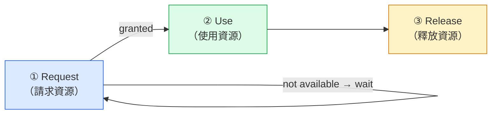
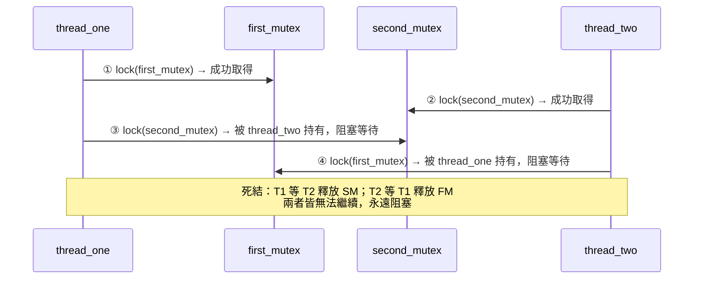

:::note
本系列文章內容參考自經典教材 **Operating System Concepts, 10th Edition (Silberschatz, Galvin, Gagne)**。本文對應章節：**Section 8.1–8.2 System Model / Deadlock in Multithreaded Applications**。
:::

## **死結是什麼，為什麼重要？**

在多程式環境（Multiprogramming Environment）中，多個執行緒（Thread）會同時競爭數量有限的系統資源。正常情況下，執行緒請求資源、使用資源、再釋放資源，整個系統持續向前推進。但有一種情況會讓這個循環徹底卡住：

想像四位哲學家圍坐一張圓桌，每人面前有一根筷子，每人都需要拿到左右兩根才能吃飯。假設所有人同時伸手拿起左邊的筷子，此時每人手持一根，但右邊的筷子都被鄰居拿走了。每個人都在等別人放下筷子，而每個人都不會主動放手，整桌人就這樣永遠等下去。這就是**死結（Deadlock）**。

更正式地說，死結是指**一組執行緒中的每一個執行緒，都在等待一個只有同組其他執行緒才能觸發的事件**，因此整組執行緒永遠無法繼續執行。

死結問題在現代系統中變得越來越重要，原因是多核心（Multicore）硬體的普及使得並行度（Concurrency and Parallelism）大幅提升，執行緒交錯執行的可能組合呈指數增長，死結發生的機率也隨之上升。

<br/>

## **8.1 系統模型 (System Model)**

### **資源的類型與實例**

系統中的資源（Resource）被劃分為若干**資源類型（Resource Type）**，每種類型包含一個或多個**相同的實例（Instance）**。以下是幾個具體例子：

|     資源類型      | 實例數範例                               |
| :---------------: | :--------------------------------------- |
|    CPU cycles     | 一台有 4 顆 CPU 的機器，有 4 個實例      |
| Network Interface | 系統配置了 2 張網卡，有 2 個實例         |
|       File        | 每個開啟的檔案即為一個實例               |
|    Mutex Lock     | 每把 mutex lock 通常被視為獨立的資源類型 |
|     Semaphore     | 同上，每個 semaphore 獨立計算            |

「同類型的實例必須完全相同」這個條件非常關鍵：如果執行緒請求某個資源類型的任意一個實例，系統分配其中哪一個都應該能滿足需求。若不同實例之間有差異，就代表它們屬於不同的資源類型，必須重新分類。

在實務上，**同步工具（Synchronization Tools）是現代系統中最常見的死結來源**。每一個 mutex lock 通常被關聯到一個特定的資料結構（例如保護 queue 的鎖、保護 linked list 的鎖），因此每個 mutex lock 的實例通常被獨立歸為一個資源類型。

:::info 核心資源 vs. 跨程序資源
本章的系統模型只涵蓋由 OS kernel **親自仲裁**的資源，例如 mutex lock、semaphore、記憶體頁面。執行緒透過 **IPC**（如 pipe、shared memory、message queue）與其他 Process 協作時，也可能發生死結，但這類死結 kernel 無法偵測，原因如下：

Kernel 能偵測死結的前提，是它必須對每一次資源的 acquire/release 都有完整的記錄，才能建立「哪個執行緒在等哪個執行緒」的等待關係圖（Wait-for Graph）並找出循環。對於 mutex lock，每次 `acquire()` 都是系統呼叫，kernel 清楚知道「Thread A 在等 Thread B 持有的鎖」。

但 IPC 的情況不同：kernel 提供的是**傳輸管道**（pipe 的讀寫、shared memory 的映射），而不是管道上傳遞的**應用程式協定語意**。當 Process A 阻塞在 `read(pipe)` 等待 Process B 的回覆，同時 Process B 阻塞在 `read(pipe)` 等待 Process A 的回覆，kernel 只看到「兩個 Process 都在等 I/O」，它無法知道這兩個等待之間存在循環依賴，因為那個依賴是由應用程式自己定義的協定所產生的，不是 kernel 管理的資源物件。

因此，這類死結的偵測與預防責任落在應用程式層，需要由設計 IPC 協定的開發者自行保證不會產生循環等待。
:::

### **資源的使用生命週期：Request → Use → Release**

無論哪種資源類型，執行緒使用資源都必須嚴格遵守三個步驟的順序。每一步都有對應的系統呼叫（System Call）或同步操作：



三個步驟的含義：

- **Request（請求）**：執行緒請求某個資源。若資源目前可用，立刻授予並進入 Use 狀態；若資源被其他執行緒持有，執行緒進入等待（Wait），直到資源被釋放後再重試。
- **Use（使用）**：執行緒對資源進行操作。例如若資源是 mutex lock，執行緒正在執行其 Critical Section；若是檔案，執行緒正在讀寫內容。
- **Release（釋放）**：執行緒完成使用，將資源歸還系統。

以下是不同資源類型對應的實際系統呼叫：

|  資源類型  | Request 操作 | Release 操作 |
| :--------: | :----------: | :----------: |
| I/O Device | `request()`  | `release()`  |
|    File    |   `open()`   |  `close()`   |
|   Memory   | `allocate()` |   `free()`   |
| Semaphore  |   `wait()`   |  `signal()`  |
| Mutex Lock | `acquire()`  | `release()`  |

### **系統表與死結狀態的定義**

OS kernel 維護一張**系統表（System Table）**，記錄每個資源的狀態：該資源目前是閒置（Free）還是已分配（Allocated）；若已分配，則記錄被分配給哪個執行緒。當執行緒請求一個已被其他執行緒持有的資源時，該執行緒被加入這個資源的等待佇列（Waiting Queue）。

在這個框架下，**死結的精確定義**是：

> **一組執行緒處於死結狀態，若且唯若這組中的每一個執行緒，都在等待一個只有同組其他執行緒才能觸發的事件（資源的取得或釋放）。**

執行緒的等待數量沒有上限限制，只要執行緒請求的資源總數不超過系統中該類型資源的總實例數即可（例如系統只有一張網卡，執行緒就不能請求兩個 network interface 實例）。

<br/>

## **8.2 多執行緒應用程式中的死結 (Deadlock in Multithreaded Applications)**

### **POSIX Mutex Lock 死結場景**

理解死結最直接的方式是看一個具體的程式範例。以 POSIX Pthreads 為例，兩個 mutex lock 以下面的方式初始化：

```c
pthread_mutex_t first_mutex;
pthread_mutex_t second_mutex;

pthread_mutex_init(&first_mutex, NULL);
pthread_mutex_init(&second_mutex, NULL);
```

接著，兩個執行緒 `thread_one` 和 `thread_two` 各自執行不同的函式，但都需要同時持有這兩把鎖才能完成工作：

```c
/* thread one 執行的函式 */
void *do_work_one(void *param) {
    pthread_mutex_lock(&first_mutex);   // 先拿 first_mutex
    pthread_mutex_lock(&second_mutex);  // 再拿 second_mutex
    /* ... 做一些工作 ... */
    pthread_mutex_unlock(&second_mutex);
    pthread_mutex_unlock(&first_mutex);
    pthread_exit(0);
}

/* thread two 執行的函式 */
void *do_work_two(void *param) {
    pthread_mutex_lock(&second_mutex);  // 先拿 second_mutex
    pthread_mutex_lock(&first_mutex);   // 再拿 first_mutex
    /* ... 做一些工作 ... */
    pthread_mutex_unlock(&first_mutex);
    pthread_mutex_unlock(&second_mutex);
    pthread_exit(0);
}
```

關鍵問題在於：**兩個執行緒取得鎖的順序完全相反**。`thread_one` 的順序是 `first_mutex → second_mutex`，而 `thread_two` 的順序是 `second_mutex → first_mutex`。

下面的時序圖展示死結是如何發生的：



時序圖說明：

- **步驟①**：`thread_one` 取得 `first_mutex`，繼續嘗試取得 `second_mutex`。
- **步驟②**：`thread_two` 在步驟①之後（但步驟③之前）取得 `second_mutex`，繼續嘗試取得 `first_mutex`。
- **步驟③**：`thread_one` 嘗試 `lock(second_mutex)`，但 `second_mutex` 已被 `thread_two` 持有，因此阻塞。
- **步驟④**：`thread_two` 嘗試 `lock(first_mutex)`，但 `first_mutex` 已被 `thread_one` 持有，因此阻塞。

此刻系統陷入死結：`thread_one` 等待 `thread_two` 釋放 `second_mutex`，而 `thread_two` 等待 `thread_one` 釋放 `first_mutex`，兩者都永遠不會釋放手中的鎖。

:::info 死結不是必然發生的
這個範例中，死結只會在特定的**排程時序（Scheduling Circumstance）** 下發生。若 `thread_one` 在 `thread_two` 嘗試取得任何鎖之前就完整完成了所有操作（取得兩把鎖、做完工作、釋放兩把鎖），死結就不會發生。問題的根本在於：死結只在某些排程時序下才會出現，這讓它極難透過測試發現，因為在大多數情況下程式看起來完全正常。
:::

### **8.2.1 活結 (Livelock)**

Livelock 是另一種 **Liveness Failure（活躍性失敗）**，它與 Deadlock 有表面上的相似性，但本質不同。

**Deadlock** 的特徵是：執行緒**被阻塞**（Blocked），完全停止執行，等待一個永遠不會發生的事件。

**Livelock** 的特徵是：執行緒**持續執行**，但每一次執行都以失敗告終，導致整體沒有任何進展。執行緒處於忙碌狀態，卻永遠無法完成工作。

一個生活中的類比：兩個人在走廊相遇，一個往右讓，另一個也往右讓；於是兩人都往左移，又都往左移；如此反覆，始終擋住對方，卻又都在持續移動，這就是 Livelock。

以 POSIX 的 `pthread_mutex_trylock()` 為例，這個函式嘗試取得 mutex lock，但不會阻塞，若鎖不可用就立即回傳失敗。以下程式碼展示了一個可能產生 Livelock 的設計：

```c
/* thread one 的 Livelock 版本 */
void *do_work_one(void *param) {
    int done = 0;
    while (!done) {
        pthread_mutex_lock(&first_mutex);
        if (pthread_mutex_trylock(&second_mutex)) {
            /* ... 做一些工作 ... */
            pthread_mutex_unlock(&second_mutex);
            pthread_mutex_unlock(&first_mutex);
            done = 1;
        } else {
            pthread_mutex_unlock(&first_mutex);  // 失敗就釋放，重試
        }
    }
    pthread_exit(0);
}

/* thread two 的 Livelock 版本 */
void *do_work_two(void *param) {
    int done = 0;
    while (!done) {
        pthread_mutex_lock(&second_mutex);
        if (pthread_mutex_trylock(&first_mutex)) {
            /* ... 做一些工作 ... */
            pthread_mutex_unlock(&first_mutex);
            pthread_mutex_unlock(&second_mutex);
            done = 1;
        } else {
            pthread_mutex_unlock(&second_mutex);  // 失敗就釋放，重試
        }
    }
    pthread_exit(0);
}
```

若 `thread_one` 取得 `first_mutex`，同時 `thread_two` 取得 `second_mutex`，接下來：

- `thread_one` 嘗試 `trylock(second_mutex)` → 失敗，釋放 `first_mutex`，重新進入迴圈
- `thread_two` 嘗試 `trylock(first_mutex)` → 失敗，釋放 `second_mutex`，重新進入迴圈

兩個執行緒都在忙碌地執行（不像 Deadlock 那樣被阻塞），但每一輪都以失敗結束，系統整體毫無進展。

**解決 Livelock 的標準方式**是引入**隨機退讓（Random Backoff）**：當操作失敗時，各執行緒等待一個**隨機長度的時間**再重試，而非立即重試。由於等待時間不同，兩個執行緒的操作時序錯開，其中一個就能成功取得所需的鎖。

這正是 **Ethernet 網路**處理封包碰撞（Collision）的方式：當碰撞發生後，每個主機退讓隨機時間後才重新傳送，而非立即重傳。

:::tip Deadlock vs. Livelock 對比

|          比較項目          | Deadlock                    | Livelock                         |
| :------------------------: | :-------------------------- | :------------------------------- |
|       **執行緒狀態**       | 阻塞（Blocked），完全停止   | 持續執行中，但無進展             |
|       **CPU 使用率**       | 低（等待中不消耗 CPU）      | 高（持續重試，消耗 CPU）         |
|          **症狀**          | 程式卡住、無回應            | 程式看似活躍，但功能永遠無法完成 |
|        **根本原因**        | 互相持有對方需要的資源      | 互相干擾，每次操作都讓對方失敗   |
|        **解決方向**        | 資源排序、Banker's 演算法等 | 隨機退讓（Random Backoff）       |
|        **發生頻率**        | 相對較常見                  | 比 Deadlock 少見，但同樣難以偵錯 |
| **是否只在特定時序下發生** | 是                          | 是，同樣難以透過測試重現         |

:::

