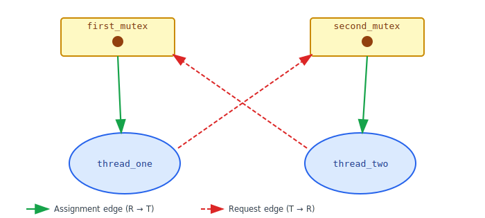
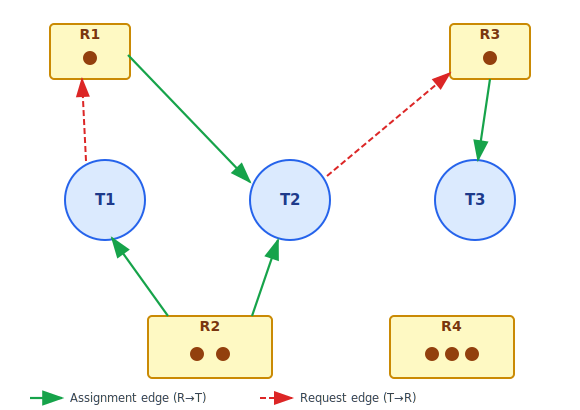
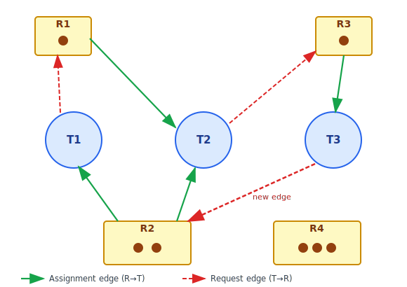
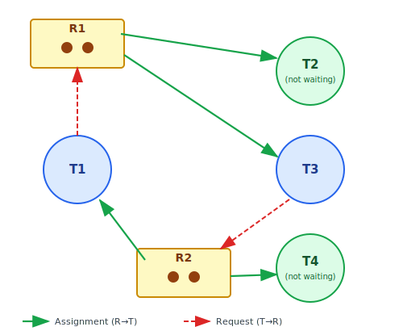

:::note
本系列文章內容參考自經典教材 **Operating System Concepts, 10th Edition (Silberschatz, Galvin, Gagne)**。本文對應章節：**Section 8.3 Deadlock Characterization**。
:::

前一節用 POSIX mutex lock 的具體程式碼展示了死結如何發生。但若要分析任意系統的死結風險，光靠程式碼直覺是不夠的，需要更系統性的分析工具。本節做兩件事：
1. 一是找出死結發生的**必要條件**，讓我們知道只要消除其中一個條件，死結就不會出現；
2. 二是建立**資源分配圖（Resource-Allocation Graph）**，讓系統當下的分配狀態可以用圖形語言精確表達，從而以視覺化方式偵測死結。

 

## **8.3.1 四個必要條件 (Necessary Conditions)**

分析大量死結案例後發現，死結的發生不是隨機的，它需要以下四個條件**同時成立**才有可能出現。這四個條件稱為**死結的必要條件（Necessary Conditions for Deadlock）**，缺少任何一個，死結就無法形成。

### **條件一：互斥 (Mutual Exclusion)**

至少有一個資源必須以**非共享模式（Nonsharable Mode）** 被持有，意即同一時間只有一個執行緒可以使用該資源。若另一個執行緒也請求這個資源，它只能進入等待，直到目前的持有者釋放為止。

若所有資源都是可共享的（例如唯讀檔案），多個執行緒可以同時取用，就不需要等待，死結自然無從發生。問題是，**互斥設計本身是必要的**。mutex lock 的存在意義就是確保 Critical Section 在任意時刻只有一個執行緒進入，若允許多個執行緒同時持有同一把鎖，保護就失去意義。因此，互斥條件幾乎是並行程式的先天屬性，很難從根本上消除。

### **條件二：持有並等待 (Hold and Wait)**

必須存在至少一個執行緒，它**正在持有至少一個資源的同時，又在等待另一個目前被其他執行緒持有的資源**。

這個條件描述的是資源的「卡位」現象：執行緒 A 持有資源 X，等待資源 Y；執行緒 B 持有資源 Y，等待資源 X。每個執行緒都不放手，每個執行緒都在等待別人先放手，整體陷入僵局。

### **條件三：不可搶占 (No Preemption)**

資源**不能被強制奪走**，只能由持有它的執行緒在完成任務後**自願釋放（Voluntarily Release）**。

若系統可以強制奪取資源（例如 OS 可以把某執行緒的 mutex lock 收回），就可以打破等待循環。但搶占 mutex lock 在實務中極為危險：鎖保護的是一段可能修改共享資料的程式碼，若在這段程式碼執行中途被奪走鎖，共享資料可能處於不一致的狀態，後果難以預測。因此，大多數同步原語（Synchronization Primitives）設計上不支援搶占，不可搶占條件在實際系統中幾乎總是成立。

### **條件四：循環等待 (Circular Wait)**

必須存在一組等待中的執行緒 \{T₀, T₁, ..., Tₙ\}，使得：T₀ 等待 T₁ 持有的資源，T₁ 等待 T₂ 持有的資源，以此類推，最後 Tₙ 等待 T₀ 持有的資源，形成一個**封閉的等待環（Circular Wait Chain）**。環上的每個執行緒都在等待環上下一個節點先釋放資源，而下一個節點也在等待，整個環永遠無法推進。

:::info 四個條件的邏輯關係

這四個必要條件**必須同時成立**，死結才有可能發生，缺少任何一個就不會有死結。

值得注意的是，循環等待（Circular Wait）在邏輯上**蘊含**持有並等待（Hold and Wait）：若存在循環等待，則環上每個執行緒都必然同時持有某個資源並等待另一個資源，因此持有並等待自然也成立。兩者並非完全獨立，但後續的死結預防策略（Section 8.5）仍會針對每個條件分別分析，因為各個條件對應不同的防範切入點。

理解這四個條件的核心價值在於：**破壞其中一個條件，就足以防止死結發生**。後續章節（8.5 Deadlock Prevention）正是沿著這個思路，逐一探討如何在系統設計層面使其中一個條件永遠無法成立。
:::

 

## **8.3.2 資源分配圖 (Resource-Allocation Graph)**

四個必要條件給了分析的理論框架，但要診斷一個具體系統是否陷入死結，還需要一個**可操作的視覺化工具**。試想一個有數十個執行緒、多種資源類型的系統，光靠文字描述誰持有什麼、誰等待什麼，幾乎無法快速判斷死結是否存在。這就是**資源分配圖（Resource-Allocation Graph，RAG）** 的用武之地。

資源分配圖是一張**有向圖（Directed Graph）**，由頂點集合 V 和邊集合 E 組成。頂點分為兩類，邊也分為兩個方向：

**節點（Vertex）類型：**

- **執行緒節點（Thread Node）**：以**圓形（Circle）** 表示，代表系統中的活躍執行緒。集合記為 T = \{T₁, T₂, ..., Tₙ\}。
- **資源節點（Resource Node）**：以**矩形（Rectangle）** 表示，代表一種資源類型。矩形內的**圓點（Dot）** 代表該資源類型的可用實例數量。集合記為 R = \{R₁, R₂, ..., Rₘ\}。

**邊（Edge）的兩種方向：**

| 邊的方向  |             名稱              | 含義                                            |
| :-------: | :---------------------------: | :---------------------------------------------- |
| **T → R** |  **請求邊（Request Edge）**   | 執行緒 T 正在等待資源 R 的一個實例，尚未取得    |
| **R → T** | **分配邊（Assignment Edge）** | 資源 R 的一個實例已分配給執行緒 T，T 正在使用中 |

:::info 請求邊與分配邊的轉換機制
請求邊（T → R）是暫時的。當系統能立刻滿足請求時，請求邊**瞬間轉換**為分配邊（R → T），代表 R 的一個實例從可用池分配出去，箭頭方向反轉。當執行緒用完資源並釋放時，分配邊被**刪除**，那個實例重新進入可用池。資源分配圖是系統某個時間點的**快照（Snapshot）**，它完整紀錄了當下每個資源實例的歸屬，以及每個執行緒正在等待什麼。
:::

### **以 mutex 死結為例**

以前一節的 POSIX mutex lock 死結場景為例，可以直接把程式的執行狀態對應成資源分配圖。當 `thread_one` 已取得 `first_mutex` 並正在等待 `second_mutex`，同時 `thread_two` 已取得 `second_mutex` 並正在等待 `first_mutex` 時，系統快照如下：

圖中各邊的含義：

- **綠色實線（Assignment Edge）**：
  - `first_mutex → thread_one` 表示 `first_mutex` 已分配給 `thread_one`；
  - `second_mutex → thread_two` 表示 `second_mutex` 已分配給 `thread_two`。
- **紅色虛線（Request Edge）**：
  - `thread_one → second_mutex` 表示 `thread_one` 正在等待 `second_mutex`；
  - `thread_two → first_mutex` 表示 `thread_two` 正在等待 `first_mutex`。

四條邊形成一個**封閉的有向環（Directed Cycle）**：`thread_one → second_mutex → thread_two → first_mutex → thread_one`。這個環在圖形上直接對應了死結中的循環等待條件，也是死結最重要的圖形特徵。

### **含有多個資源類型的複雜圖**

真實系統中，資源類型和執行緒都可能有多個，圖的結構也更複雜。下圖展示一個包含三個執行緒（T1、T2、T3）和四種資源（R1 到 R4）的系統快照。R1 有 1 個實例，R2 有 2 個實例，R3 有 1 個實例，R4 有 3 個實例：

解讀這張圖的當前狀態：

- **T1**：持有 R2 的一個實例（R2 → T1），正在等待 R1（T1 → R1）。
- **T2**：持有 R1 的一個實例（R1 → T2）以及 R2 的一個實例（R2 → T2），正在等待 R3（T2 → R3）。
- **T3**：持有 R3 的一個實例（R3 → T3），沒有任何請求邊，不在等待任何資源。
- **R4**：有三個實例，但目前沒有任何執行緒持有或等待它。

此時系統**沒有死結**。雖然 T1 和 T2 都在等待，但 T3 持有 R3 且不需要任何額外資源，T3 可以完成工作並釋放 R3。T2 拿到 R3 後，能完成任務並釋放 R1 和 R2，最終讓 T1 也能繼續執行。整個系統持續向前推進。

### **加入一條邊後：死結產生**

現在假設 T3 在持有 R3 的同時，也需要請求 R2（例如 T3 的工作邏輯需要同時持有這兩個資源才能完成）。在圖中新增一條請求邊 T3 → R2：

這一條新邊使圖中出現了**兩個有向環**：

- **環一**：T1 → R1 → T2 → R3 → T3 → R2 → T1
- **環二**：T2 → R3 → T3 → R2 → T2

T1、T2、T3 全部陷入死結。追蹤原因：T3 等待 R2，但 R2 的兩個實例分別被 T1 和 T2 持有；T1 等待 R1，但 R1 唯一的實例已分配給 T2；T2 等待 R3，但 R3 唯一的實例已分配給 T3。三者互相依賴，沒有任何一個能率先完成並釋放資源，等待永遠不會結束。

僅僅新增一條邊就觸發了死結，這說明資源分配圖對死結的形成非常敏感，系統的安全性可能因一次看似普通的資源請求而徹底改變。

### **有環路卻不一定是死結**

環路的存在是死結的**必要條件**，但不是**充分條件**。若資源類型有多個實例，即使圖中存在環，系統也未必處於死結，因為環外持有資源的執行緒可能先完成並釋放資源，把環打斷。

下圖展示這種情形。R1 和 R2 各有兩個實例，T1、T2、T3、T4 四個執行緒中，T2 和 T4 已取得資源但不需要任何額外資源（圖中以綠色節點標示，無請求邊）：

圖中確實存在一個環：T1 → R1 → T3 → R2 → T1。但此時**不是死結**，原因在於：

- **T4** 持有 R2 的一個實例，且沒有任何請求邊，可以隨時完成工作並釋放 R2。
- T4 釋放 R2 後，T3 就能取得 R2，繼而完成任務、釋放 R1。
- T1 得到 R1 後也能繼續執行。

T2 同理，T2 持有 R1 的一個實例，完成後釋放，也能讓 T1 的等待得到滿足。環的存在並不代表系統無法推進，只要環外有不等待的執行緒持有環內所需的資源，系統就有辦法解開等待鏈。

### **從圖推斷死結的規則**

綜合以上分析，可以整理出從資源分配圖判斷死結的三條規則：

|                   圖的狀態                   | 結論                                   |
| :------------------------------------------: | :------------------------------------- |
|            **無環路（No Cycle）**            | 系統**一定沒有**死結                   |
| **有環路，且涉及的每種資源類型只有一個實例** | 系統**一定是**死結狀態                 |
|    **有環路，且涉及的資源類型有多個實例**    | 系統**可能是**死結狀態，需要進一步分析 |

:::tip 環路是死結的必要非充分條件

無環路可以確定沒有死結（充分條件：no cycle ⟹ no deadlock）。有環路則只能說明死結「可能」存在（必要條件：deadlock ⟹ cycle exists）。

只有當所有涉及的資源類型都只有單一實例時，環路才同時成為充分條件，此時「環路 ⟺ 死結」的等價關係才成立。
:::

