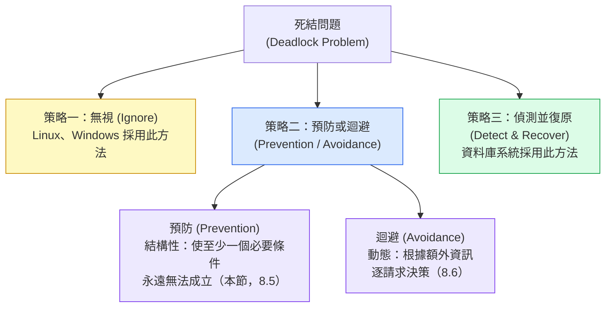
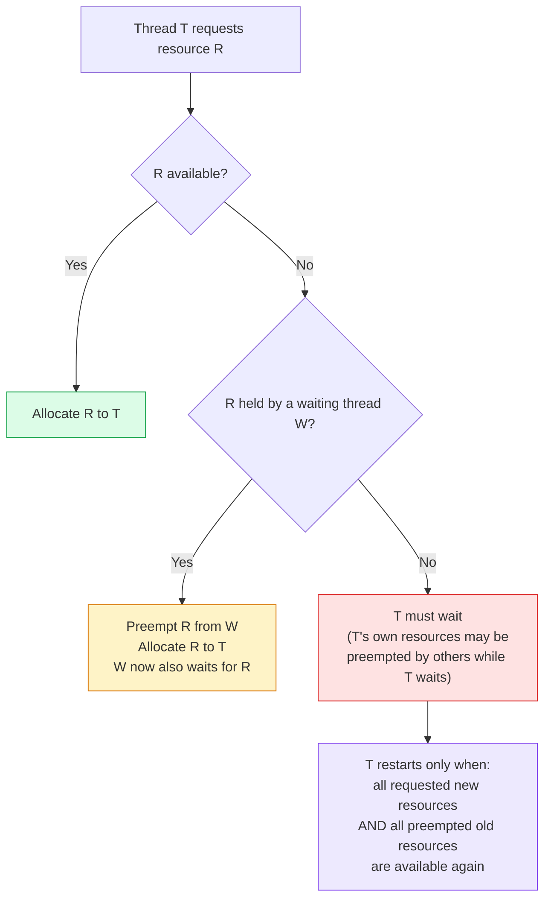
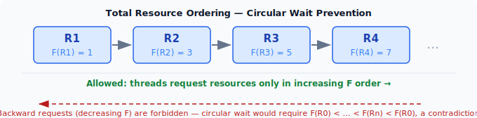

:::note
本系列文章內容參考自經典教材 **Operating System Concepts, 10th Edition (Silberschatz, Galvin, Gagne)**。本文對應章節：**Section 8.4–8.5 Methods for Handling Deadlocks / Deadlock Prevention**。
:::

前一節建立了分析死結的兩個核心工具：**四個必要條件**（互斥、持有並等待、不可搶占、循環等待）和**資源分配圖（Resource-Allocation Graph）**。知道死結在什麼條件下形成、也能在圖形上識別它之後，系統設計者面臨一個根本性的問題：對於死結，究竟應該採取什麼立場？本節回答這個問題，並深入探討其中一條路線的具體實作。

<br/>

## **8.4 死結處理方法 (Methods for Handling Deadlocks)**

### **三種根本策略**

面對死結問題，系統設計者在概念上有三條路可以走：

1. **無視死結**：完全忽略這個問題，假裝死結不存在。
2. **預防或迴避死結**：透過協定確保系統永遠不會進入死結狀態。
3. **偵測並從死結中復原**：允許系統進入死結狀態，偵測後再處理。

以下圖示呈現三種策略的選擇路徑，以及每條路線向下展開的方法：



這三條路線並非互斥，**同一系統可以對不同種類的資源採用不同策略**。例如，核心同步物件（mutex lock、semaphore）採取預防策略，而記憶體分配採用偵測策略。後續章節（8.5 至 8.8）會逐一深入每條路線的具體演算法。

<br/>

### **策略一：無視死結（Ostrich Algorithm）**

> 最直覺的問題是：忽略死結怎麼可能是一個合理的設計決策？

理解這個策略的關鍵在於**成本效益分析**。偵測死結與從死結中復原的機制本身有相當的系統開銷，但在許多通用系統中，死結的發生極為罕見，例如每個月才出現一次。如果為了應對這種低頻率事件而持續付出效能代價，從工程角度看並不合算。

此外還有一個務實的理由：**死結並不是系統需要手動干預的唯一活躍性失敗（Liveness Failure）**。即使沒有死結，系統仍然可能因為優先級最高的即時執行緒（Real-time Thread）長時間佔用 CPU 而不歸還，讓其他執行緒永遠無法執行；這種情況同樣需要手動重啟。換句話說，**手動恢復機制本來就必須存在**，死結只是可以附帶納入這個機制處理的情況之一。

當沒有死結偵測演算法時，未被偵測的死結會造成系統效能持續惡化：被死結鎖住的執行緒持有資源卻無法推進，而越來越多請求同一資源的執行緒也陸續進入死結狀態。最終，系統停止回應，必須人工重啟。這個代價在低頻率死結的場景下，往往比引入複雜偵測機制的代價更低。

因此，Linux 和 Windows 等大多數通用作業系統採用策略一：不主動偵測或預防死結，由核心與應用程式開發者自行負責避免死結，必要時透過其他活躍性恢復機制處理。

:::info 鴕鳥演算法（Ostrich Algorithm）
這個策略在學界常被戲稱為 **Ostrich Algorithm**（鴕鳥演算法）：把頭埋進沙裡，假裝問題不存在。雖然名字帶著諷刺意味，但在工程上它代表一個刻意的取捨決定，而非真的無知。
:::

<br/>

### **策略二：預防 vs. 迴避的差異**

策略二包含兩個方向，兩者都能讓系統永遠不進入死結狀態，但思路截然不同：

**死結預防（Deadlock Prevention）** 是**結構性約束**。系統在設計層面施加限制，使得四個必要條件中的至少一個永遠無法成立。這些限制在系統設計時決定，**在執行期間始終有效**，不需要執行期的動態判斷。代價是限制了程式可以請求資源的方式，可能降低資源使用率或增加設計複雜度。

**死結迴避（Deadlock Avoidance）** 是**動態決策**。OS 在執行期間，從每個執行緒預先獲取關於未來資源請求的額外資訊，並在每一次資源請求發生時，根據當前系統狀態判斷是否授予請求或讓執行緒等待。能迴避死結，但需要執行緒提前聲明最大資源需求，且每次請求都需要執行額外的演算法。詳見 Section 8.6。

<br/>

### **策略三：偵測並復原**

若系統不採用預防或迴避，死結就可能發生。此時系統需要兩個配套機制：

- **死結偵測演算法（Deadlock Detection Algorithm）**：定期檢查系統狀態，判斷是否陷入死結。
- **死結復原演算法（Deadlock Recovery Algorithm）**：確認死結後，採取措施打破等待循環，讓系統恢復正常。

資料庫系統廣泛採用這個策略，因為資料庫交易（Transaction）天生有「偵測到問題後可以回滾（Rollback）」的語義，復原成本相對可控。詳見 Section 8.7（偵測）和 Section 8.8（復原）。

<br/>

## **8.5 死結預防 (Deadlock Prevention)**

死結預防的核心邏輯很直接：若能確保四個必要條件中的**至少一個**永遠無法在系統中成立，死結就從根本上不可能發生。以下逐一分析每個條件是否以及如何被破壞。

<br/>

### **8.5.1 破壞互斥條件 (Mutual Exclusion)**

互斥條件要求至少有一個資源以非共享模式持有。一個自然的想法是：若所有資源都可以被多個執行緒同時使用，就不存在等待，死結自然消失。

但這個想法在實務中幾乎行不通。**唯讀檔案（Read-only File）** 確實可以允許多個執行緒同時開啟和讀取，因此不受互斥限制，也不會參與死結。然而，**某些資源在設計上就是不可共享的（Intrinsically Nonsharable）**。

以 mutex lock 為例，mutex 的存在意義就是保護 Critical Section，確保同一時間只有一個執行緒能進入。若允許多個執行緒同時持有同一把 mutex，保護就完全失去意義。換句話說，mutex lock 的互斥性是其正確語義的必要組成部分，無法在不破壞其功能的前提下消除。

因此，**一般無法透過否定互斥條件來預防死結**。互斥條件幾乎是並行程式的先天屬性，只能針對本質上可共享的資源採用非互斥設計，對核心同步工具則無效。

<br/>

### **8.5.2 破壞持有並等待條件 (Hold and Wait)**

持有並等待條件要求一個執行緒**同時**持有某資源並等待另一個資源。只要打破「同時持有並等待」，這個條件就消失了。有兩種協定可以實現這一點：

**協定一：執行前一次性請求所有資源（All-or-Nothing before Execution）**

要求每個執行緒在開始執行之前，先一次性請求並取得它整個生命週期中所需的**所有**資源。只有當所有資源都成功取得後，執行緒才開始執行。若有任何資源當下不可用，執行緒必須等待，但此時它不持有任何資源，因此不構成「持有並等待」。

這個協定的問題是**極度不實際**。多數應用程式在執行開始時根本無法確定整個過程中會用到哪些資源，因為資源的使用往往依賴於中間計算的結果。

**協定二：請求新資源前先釋放所有已持有資源（Release-before-Request）**

允許執行緒先請求部分資源並使用，但在請求**額外**資源之前，必須先釋放目前持有的**所有**資源。執行緒在任何時刻要嘛持有完整的資源集合並在使用，要嘛不持有任何資源並在等待，不存在中間狀態。

兩種協定都有兩個共同的主要缺點：

|                     缺點                     | 說明                                                                                                                                                                                                                     |
| :------------------------------------------: | :----------------------------------------------------------------------------------------------------------------------------------------------------------------------------------------------------------------------- |
| **資源使用率低（Low Resource Utilization）** | 資源可能被分配給一個執行緒，但只有在執行的某個短暫階段才真正被使用，其餘時間處於閒置狀態。以協定一為例，執行緒可能持有某個 mutex lock 貫穿整個執行週期，但實際只需要它一小段時間，這段閒置期間其他執行緒無法使用該資源。 |
|            **饑餓（Starvation）**            | 需要多個熱門資源的執行緒可能永遠等不到所有資源同時可用的時機。只要其中一個資源始終被其他執行緒持有，該執行緒就永遠無法開始（協定一）或無法繼續（協定二）。                                                               |

<br/>

### **8.5.3 破壞不可搶占條件 (No Preemption)**

不可搶占條件規定資源只能由持有者自願釋放，不能被強制奪走。若系統允許在某些情況下強制回收資源，這個條件就不成立，死結就可能被打破。以下是兩種可行的協定：

**協定一：等待時釋放所有已持有資源（Implicit Preemption on Wait）**

若一個執行緒持有某些資源，並請求一個當下無法立刻取得的資源（必須等待），則**系統立即隱式地搶占（Preempt）該執行緒持有的所有資源**，把它們放入「等待清單」。執行緒只有在能重新取得所有舊資源加上新請求的資源之後，才被重新啟動。

**協定二：有條件搶占（Selective Preemption from Waiting Threads）**

協定二的邏輯更為精細，判斷流程如下：



流程圖說明：

- **R 可用**：直接分配，最理想的情況。
- **R 不可用，但持有者 W 正在等待**：W 因等待其他資源而暫時「擱置」中，從 W 手中搶占 R 不會造成正確性問題（W 會在未來重新取得 R），並且可以讓 T 繼續推進，整體效率更高。
- **R 不可用，且持有者不在等待**：代表持有者正在積極使用 R，無法搶占，T 只能進入等待佇列。

**適用範圍的根本限制**：這兩種協定有一個關鍵限制，它們只適合那些**狀態可以被安全儲存（Save）並在之後還原（Restore）的資源**，例如 CPU 暫存器、資料庫交易（支援 Rollback）。

然而，**mutex lock 和 semaphore 恰恰不適合搶占**，而這兩者正是實際系統中死結最常見的根源。mutex lock 保護的是正在修改共享資料的 Critical Section；若執行緒在修改途中被強制奪走鎖，共享資料會處於部分更新的不一致狀態，後果難以預測。因此，雖然「不可搶占」這個條件理論上可以破壞，但對最需要防範死結的資源類型反而不適用，這是這個方向在實務中價值有限的核心原因。

<br/>

### **8.5.4 破壞循環等待條件 (Circular Wait)**

前三個條件的破壞方式都有嚴重的實務限制。相比之下，**破壞循環等待條件**是在實際系統中最可行、應用最廣泛的預防策略。

#### **全序排列：核心思路**

循環等待要求存在一個等待環：T₀ 等 T₁ 持有的資源，T₁ 等 T₂ 持有的資源，……，最後 Tₙ 又等 T₀ 持有的資源。若能確保任何執行緒永遠不會「向後」等一個比自己已持有資源優先級更低的資源，等待環就無法形成。

具體做法是對所有**資源類型（Resource Type）** 施加一個全序排列（Total Ordering）：定義一個一對一函式 **F : R → ℕ**，將每種資源類型對應到一個唯一的自然數。這個數字代表資源的「優先層級」（Priority Level）或「排序值」（Rank）。

以下圖示呈現這個排序概念，以及它如何在結構上阻斷循環等待的形成：



圖示說明：

- 四種資源被賦予嚴格遞增的 F 值：R1(1) → R2(3) → R3(5) → R4(7)。
- 執行緒請求資源時，**只允許沿 F 值遞增的方向**（圖中向右），不得向反方向請求已擁有較高 F 值的資源。
- 圖底部的紅色虛線箭頭代表「反向請求」，這在規則下被明確禁止，正是這個禁止使循環等待在數學上不可能成立。

#### **協定細則**

有了函式 F 之後，防止循環等待的協定是：

> **執行緒在已持有資源 Rᵢ 的情況下，只能請求 F 值嚴格大於 F(Rᵢ) 的資源 Rⱼ（即 F(Rⱼ) > F(Rᵢ)）。**

等效說法：若執行緒想請求資源 Rⱼ，必須先釋放所有 F 值大於或等於 F(Rⱼ) 的已持有資源。

若同時需要同一類型的多個實例，必須以單一請求一次性提出，而非分開請求。

#### **正確性的反證**

為何這個協定能防止循環等待？用**反證法（Proof by Contradiction）** 可以嚴格證明：

假設循環等待已存在，涉及執行緒集合 \{T₀, T₁, ..., Tₙ\}，其中 Tᵢ 等待由 Tᵢ₊₁ 持有的資源 Rᵢ（下標採模運算，Tₙ 等待 T₀ 持有的 Rₙ）。

由於 Tᵢ₊₁ 持有 Rᵢ 並正在請求 Rᵢ₊₁（等待中），根據協定，必須有 F(Rᵢ) < F(Rᵢ₊₁)，對所有 i 皆成立。因此：

**F(R₀) < F(R₁) < F(R₂) < ... < F(Rₙ) < F(R₀)**

由遞移律得 F(R₀) < F(R₀)，這是一個矛盾。因此，循環等待在遵守此協定的系統中**不可能存在**。

:::info 實務中如何建立 F 的排序
在實際系統中，F 的值是根據資源在系統中的**邏輯層次或用途**來分配的。以 Pthread 程式為例，若需要同時使用 `first_mutex` 和 `second_mutex`，可以定義：

```
F(first_mutex)  = 1
F(second_mutex) = 5
```

那麼任何執行緒在同時需要這兩把鎖時，都必須先取得 `first_mutex` 再取得 `second_mutex`，永遠不能反向操作。

在規模較大的系統中，為數以百計的同步物件手動指定 F 值的代價很高。許多 Java 開發者採用一個實用的替代方案：以 `System.identityHashCode(Object)` 的回傳值作為 F 函式，因為它為每個物件提供一個預設的、在執行期間穩定的整數識別碼，可以在不預先設計全域排序表的前提下，為任意物件建立一個一致的鎖取得順序。
:::

#### **動態資源取得場景的限制**

施加全序排列能夠預防死結，但有一個重要前提：**資源的身份必須在請求之前已知**。若資源的身份只有在執行時才能確定，全序排列就無法保證安全。

以銀行帳戶轉帳函式為例：

```c
void transaction(Account from, Account to, double amount)
{
    mutex lock1, lock2;
    lock1 = get_lock(from);
    lock2 = get_lock(to);
    acquire(lock1);
    acquire(lock2);
    withdraw(from, amount);
    deposit(to, amount);
    release(lock2);
    release(lock1);
}
```

若兩個執行緒同時呼叫 `transaction()` 但參數相反：

- 執行緒 A 呼叫 `transaction(checking_account, savings_account, 25.0)`
- 執行緒 B 呼叫 `transaction(savings_account, checking_account, 50.0)`

此時執行緒 A 取得 `checking_account` 的鎖後嘗試取得 `savings_account` 的鎖，而執行緒 B 取得 `savings_account` 的鎖後嘗試取得 `checking_account` 的鎖，**死結仍然可以發生**，儘管兩個執行緒各自的鎖取得順序在程式碼層面是一致的。

問題的根本在於：`from` 和 `to` 的身份在執行時才能確定，函式本身無法預先知道哪一個帳戶的鎖應該先取得。這代表即使系統層面存在資源的全序排列，**若鎖的取得順序依賴於執行時才知道的資料，開發者必須在應用程式層額外處理排序邏輯**（例如比較兩個帳戶的 ID 或 hash 值，總是先取 ID 較小者的鎖），而不能依賴靜態的排序定義。

:::tip 死結預防各方法的實務取捨

| 破壞的條件 | 方法                                     | 實務可行性 | 主要問題                                         |
| :--------: | :--------------------------------------- | :--------: | :----------------------------------------------- |
|    互斥    | 允許資源共享                             |     低     | 非共享資源（mutex lock）無法消除互斥性           |
| 持有並等待 | 執行前一次性取得所有資源，或釋放後再請求 |    中低    | 資源利用率低，可能饑餓                           |
|  不可搶占  | 等待時釋放所有資源或搶占等待執行緒的資源 |     低     | 不適用於 mutex lock、semaphore                   |
|  循環等待  | 全序排列，只能依遞增 F 方向請求資源      |  **最高**  | 動態取得場景需應用層額外處理，全系統排序難以維護 |

四個方向中，**破壞循環等待條件**是唯一在多數實際系統中具備可操作性的方案。它代價明確（設計時建立排序），且不會直接降低資源利用率或引入饑餓風險。前三個方向雖然理論上可行，但在涉及 mutex lock 和 semaphore 的場景（即死結最常見的場景）中幾乎都面臨根本性的適用障礙。
:::

