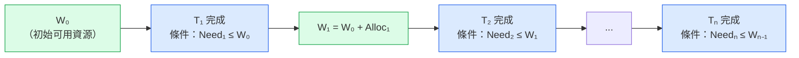
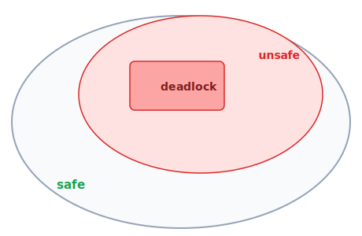
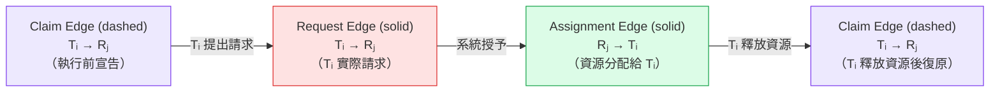
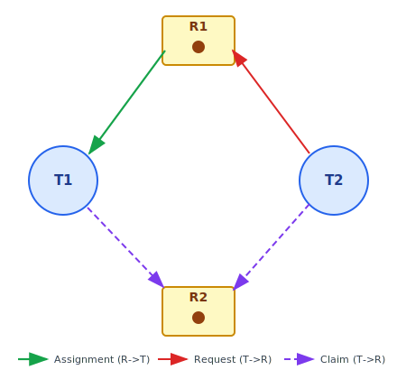
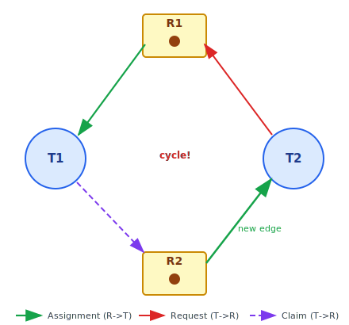
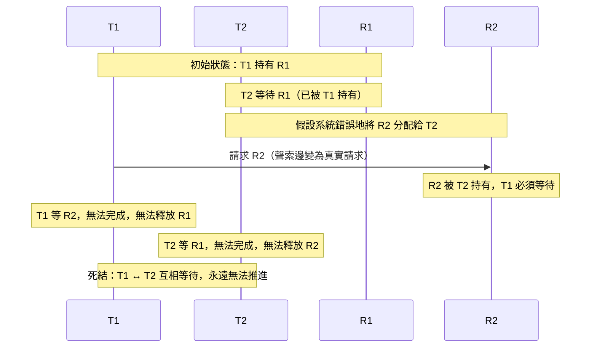
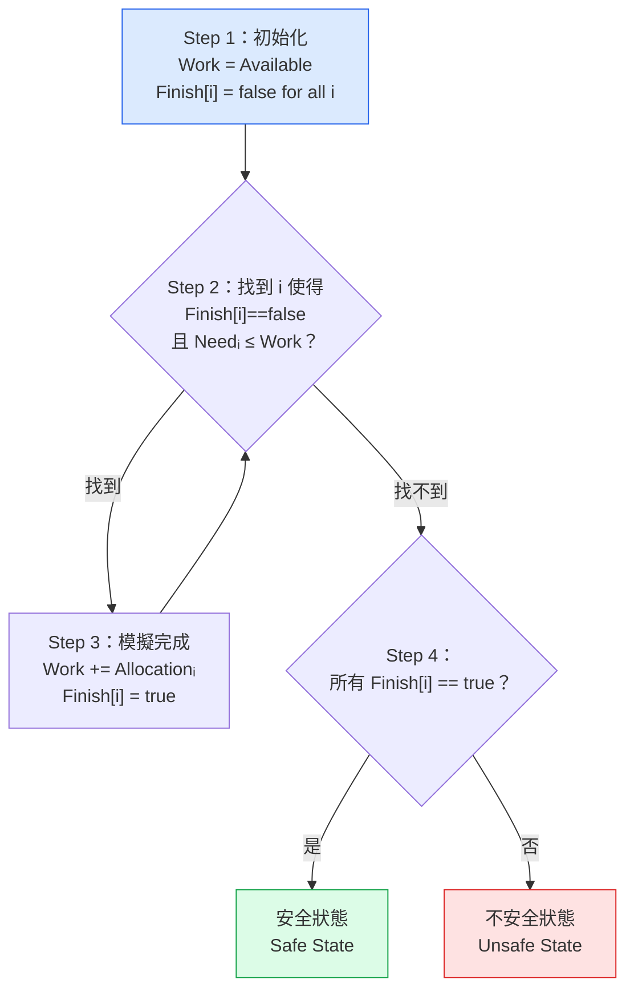
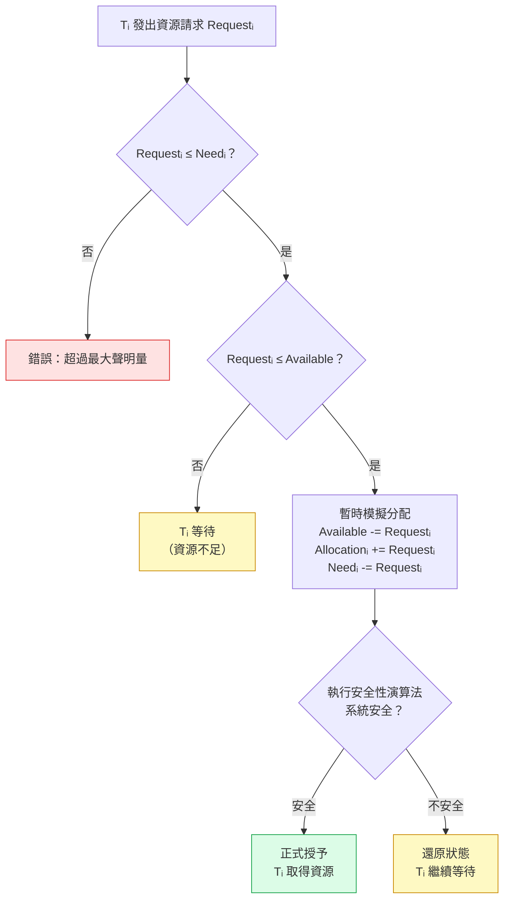

:::note
本系列文章內容參考自經典教材 **Operating System Concepts, 10th Edition (Silberschatz, Galvin, Gagne)**。本文對應章節：**Section 8.6 Deadlock Avoidance**。
:::

前幾節介紹了兩種主動防範死結的方式，並深入討論了其中一種：**死結預防（Deadlock Prevention）**，透過結構性約束使四個必要條件中的至少一個在系統設計階段就被永久消除。然而，預防的代價是犧牲資源使用率，或讓程式設計的彈性受到顯著限制。

本節介紹另一種方式：**死結迴避（Deadlock Avoidance）**。迴避的思路截然不同。系統不從結構上消除死結的必要條件，而是在執行期間動態判斷每一次資源請求是否安全。它要求執行緒在進入系統前，**事先聲明（Declare）** 自己在整個執行過程中對每種資源可能需要的最大數量，OS 再根據這份額外資訊，在資源請求發生的當下決定是立即授予還是讓執行緒等待，確保系統永遠不會進入可能導致死結的狀態。

<br/>

## **8.6.1 安全狀態 (Safe State)**

### **安全狀態的定義**

迴避演算法的一切判斷都以「安全狀態」為核心。在理解定義之前，先建立直覺：想像系統中有若干執行緒，每個執行緒的剩餘資源需求都已知。如果存在某種為每個執行緒分配資源的順序，使得每個執行緒都能在最終取得所需資源、完成任務並釋放資源，那麼系統就是安全的。

**正式定義：** 若系統可以依照某種順序依序為每個執行緒分配資源（直到達到其最大需求量）並讓其完成任務，而不發生死結，則稱系統處於**安全狀態（Safe State）**。

這個「某種順序」就是**安全序列（Safe Sequence）**。

安全序列的核心概念是一種**連鎖（Chain）** 關係，可以用接力賽來理解：T₁ 先取得資源、完成任務、歸還資源；T₂ 再接棒，從「剩餘可用資源 + T₁ 剛歸還的資源」中取得所需，完成後再歸還；T₃ 又從更多的可用資源中取得所需……依此類推，直到所有執行緒都完成為止。

下圖呈現這個連鎖結構，其中 W 代表系統在每個階段的可用資源總量：



圖示說明：

- **W₀**：系統目前的可用資源（Available）。
- **每個 Tᵢ 的完成條件**：剩餘需求 Needᵢ 不超過輪到它時的可用資源 Wᵢ₋₁。
- **W 的累積**：每當一個執行緒完成，它持有的資源全數歸還，使下一棒的可用資源比上一棒更多。

有一個容易誤解的細節：**Tᵢ 不必在「現在」就能立刻取得資源**。如果暫時資源不足，Tᵢ 可以等待排在它前面的 T₁…Tᵢ₋₁ 依序完成並釋放資源後再繼續，只要最終一定能拿到即可。安全序列保證的是「每個執行緒最終都一定有辦法完成」，而不是「每個執行緒現在馬上就能執行」。

正式定義：⟨T₁, T₂, ..., Tₙ⟩ 是安全序列，若且唯若每個 Tᵢ 的剩餘需求（Needᵢ）都能被以下總和滿足：

$$\text{Available} + \sum_{j < i} \text{Allocation}_j$$

若系統找不到任何一條這樣的序列，系統便處於**不安全狀態（Unsafe State）**。

### **安全、不安全、死結三者的關係**

下圖呈現三種狀態的包含關係：



從圖中可以得出幾個重要結論：

- **安全狀態一定不是死結狀態**：若系統能找到安全序列，就代表每個執行緒最終都能完成，死結不可能發生。
- **死結狀態一定是不安全狀態**：一旦陷入死結，找不到任何讓所有執行緒推進的序列。
- **不安全狀態不一定是死結狀態**：不安全只代表「目前沒有已知的安全序列」，執行緒的實際行為可能讓系統恢復，但 OS 無法保證這一點。

這個包含關係揭示了迴避演算法的核心策略：**只要系統始終維持在安全狀態，死結就絕不可能發生**。因此，每當執行緒請求資源時，OS 先「模擬」授予，若模擬後系統仍處於安全狀態則授予，否則讓執行緒等待。

### **安全與不安全狀態的具體範例**

以下範例具體說明安全狀態如何在一次錯誤的資源分配後轉變為不安全狀態。

假設系統共有 **12 個相同資源**，以及 3 個執行緒 T₀、T₁、T₂，各自的最大需求（Maximum Needs）與當前分配量（Current Allocation）如下：

| 執行緒 | Maximum Needs | Current Allocation | 仍需（Need = Max − Alloc） |
| :----: | :-----------: | :----------------: | :------------------------: |
|   T₀   |      10       |         5          |             5              |
|   T₁   |       4       |         2          |             2              |
|   T₂   |       9       |         2          |             7              |

已分配總量：5 + 2 + 2 = 9，剩餘可用資源：12 − 9 = **3**。

**時間點 t₀：安全狀態**

檢驗序列 ⟨T₁, T₀, T₂⟩ 是否為安全序列：

1. **T₁**：Need = 2 ≤ Available = 3，可立即取得所需資源。T₁ 完成後釋放 2 個資源，Available 變為 5。
2. **T₀**：Need = 5 ≤ Available = 5，可取得所需資源。T₀ 完成後釋放 5 個資源，Available 變為 10。
3. **T₂**：Need = 7 ≤ Available = 10，可取得所需資源。T₂ 完成後釋放 2 個資源，Available 回到 12。

序列 ⟨T₁, T₀, T₂⟩ 滿足安全條件，系統在 t₀ 處於安全狀態。

**時間點 t₁：不安全狀態**

若此時 T₂ 多請求一個資源（從 2 個增加到 3 個），系統即進入不安全狀態：

| 執行緒 | Current Allocation | Need  |
| :----: | :----------------: | :---: |
|   T₀   |         5          |   5   |
|   T₁   |         2          |   2   |
|   T₂   |         3          |   6   |

可用資源：12 − 10 = **2**。

只有 T₁（Need = 2 ≤ Available = 2）可以立即推進。T₁ 完成後，Available 變為 4。此時：

- T₀ 需要 5 個資源，但只有 4 個可用，必須等待。
- T₂ 需要 6 個資源，但只有 4 個可用，必須等待。

系統無法繼續讓任何執行緒推進，陷入死結。**犯錯的時機是允許 T₂ 多拿一個資源**。若當時讓 T₂ 等待直到 T₀ 或 T₁ 完成，死結就不會發生。

:::info 安全狀態的代價
在迴避方案下，即使一個資源當下是閒置可用的，OS 也可能拒絕立即分配，強制執行緒等待，因為立即分配會讓系統進入不安全狀態。這意味著資源使用率可能比沒有迴避機制時更低，是迴避演算法在實務上的主要代價。
:::

<br/>

## **8.6.2 資源分配圖演算法 (Resource-Allocation-Graph Algorithm)**

在每種資源類型**只有一個實例（Single Instance）** 的系統中，可以使用一種基於資源分配圖（Resource-Allocation Graph）的迴避演算法。

### **聲索邊 (Claim Edge) 的引入**

在標準資源分配圖中，只有兩種邊：請求邊（Request Edge，T→R）和分配邊（Assignment Edge，R→T）。為了實現迴避，加入第三種邊：**聲索邊（Claim Edge）**。

聲索邊 Tᵢ → Rⱼ 表示執行緒 Tᵢ 在未來的某個時間點**可能會**請求資源 Rⱼ。它在圖中以**虛線（Dashed Line）** 表示，*外觀類似請求邊但尚未成真。*

聲索邊的生命週期如下：



聲索邊有一個重要限制：執行緒在開始執行之前，其所有可能用到的資源的聲索邊必須**已經出現在圖中**。也就是說，執行緒必須在啟動前預先聲明最大需求，不能在執行中途才宣告新的聲索。

### **演算法核心：請求前的循環檢測**

當執行緒 Tᵢ 請求資源 Rⱼ 時，系統的判斷流程如下：

1. 將 Tᵢ → Rⱼ 的聲索邊（虛線）**在圖中臨時轉換**為分配邊 Rⱼ → Tᵢ（假設已授予）。
2. 對轉換後的圖執行**循環偵測演算法（Cycle-Detection Algorithm）**，時間複雜度為 O(n²)，n 為執行緒數量。
3. 若**沒有循環**：授予請求，系統維持安全狀態。
4. 若**發現循環**：拒絕授予，Tᵢ 必須等待，系統恢復原圖。

注意，循環偵測時**聲索邊也參與計算**，這正是迴避演算法能在死結實際發生前就預測風險的關鍵。

### **具體圖例說明**

以下圖呈現一個初始的安全狀態：



圖中各邊的含義：

- **R1 → T1**（綠色實線，分配邊）：R1 已被分配給 T1，T1 目前持有 R1。
- **T2 → R1**（紅色實線，請求邊）：T2 正在等待 R1，但 R1 被 T1 持有中。
- **T1 → R2**（紫色虛線，聲索邊）：T1 在未來某個時間點可能會請求 R2。
- **T2 → R2**（紫色虛線，聲索邊）：T2 在未來某個時間點也可能會請求 R2。

此時系統安全：R2 目前空閒，T1 和 T2 都只有聲索邊指向它（代表「未來可能要」），尚無衝突。

現在假設 **T2 請求 R2**（R2 目前是空閒的）。直覺上 R2 可用，應該直接分配，但系統先模擬「若授予會發生什麼」：

若授予 T2，T2 的聲索邊 T2→R2 轉換為分配邊 R2→T2（綠色），形成下圖的狀態：



圖中出現一個循環：

**T2 → R1 → T1 → R2 → T2**

這條循環是怎麼形成的？關鍵在於 T1 對 R2 的**聲索邊**。循環偵測時，聲索邊也被視為潛在路徑納入計算，因此形成了這條循環：

| 循環路徑段 |    邊的類型    | 含義                       |
| :--------: | :------------: | :------------------------- |
|  T2 → R1   |  請求邊（紅）  | T2 正在等待 R1（T1 持有）  |
|  R1 → T1   |  分配邊（綠）  | R1 目前分配給 T1           |
|  T1 → R2   | 聲索邊（紫虛） | T1 將來**可能**請求 R2     |
|  R2 → T2   |  分配邊（綠）  | R2 被分配給 T2（新增的邊） |

:::info 死結如何具體發生？

分配 R2 給 T2 後，系統進入不安全狀態，代表**在某些未來的執行路徑上，死結無法避免**。具體場景如下：

假設 T1 繼續執行，並在某個時間點真的對 R2 提出請求（聲索邊變為真實請求）：

1. **T2 目前的狀態**：持有 R2，正在等待 R1（被 T1 持有），無法繼續。
2. **T1 目前的狀態**：持有 R1，執行到需要 R2 的地方，發出請求。
3. **R2 被 T2 持有，T1 只好等待 T2 釋放 R2**。
4. **T2 需要 R1 才能完成並釋放 R2，但 R1 被 T1 持有，T1 正在等 R2**。
5. 結果：T1 等 T2 釋放 R2，T2 等 T1 釋放 R1，兩者互相等待，永遠無法推進。



正是因為迴避演算法**預見了這條路徑**，它在 T2 請求 R2 的當下就拒絕授予，讓系統永遠不進入這個狀態。
:::

因此，系統判定授予 T2 的請求會讓系統進入不安全狀態，**拒絕此次請求**，T2 必須繼續等待，直到系統狀態變化（例如 T1 完成並釋放 R1 後，T2 可先取得 R1，再取得 R2）。

:::info 資源分配圖演算法的限制
這個演算法只適用於**每種資源類型恰好有一個實例**的系統。當資源有多個實例時，圖中可能不存在循環但系統仍處於不安全狀態（這個問題在 8.3 節的 RAG 部分已探討過）。對於多實例資源，必須使用下一節介紹的銀行家演算法。
:::

<br/>

## **8.6.3 銀行家演算法 (Banker's Algorithm)**

當系統中每種資源類型有**多個實例（Multiple Instances）** 時，資源分配圖演算法不再適用。**銀行家演算法（Banker's Algorithm）** 正是為了解決這個問題而設計的，適用於多實例資源環境，但時間複雜度較高。

演算法名稱來自銀行業的類比：銀行（OS）管理有限的現金（資源），客戶（執行緒）在開戶時聲明最大貸款需求（Maximum），銀行每次放款前都必須確認放款後仍有能力滿足所有客戶的合理需求，否則拒絕，等待其他客戶還款後再重新評估。

### **資料結構**

設系統中有 **n 個執行緒**，**m 種資源類型**，需維護以下四個資料結構：

|    資料結構    |     維度     | 說明                                                       |
| :------------: | :----------: | :--------------------------------------------------------- |
| **Available**  | 向量，長度 m | `Available[j] = k` 表示資源類型 Rⱼ 目前有 k 個實例可用     |
|    **Max**     |  n × m 矩陣  | `Max[i][j] = k` 表示執行緒 Tᵢ 最多可能請求 Rⱼ 的 k 個實例  |
| **Allocation** |  n × m 矩陣  | `Allocation[i][j] = k` 表示 Tᵢ 目前持有 Rⱼ 的 k 個實例     |
|    **Need**    |  n × m 矩陣  | `Need[i][j] = k` 表示 Tᵢ 還需要 Rⱼ 的 k 個實例才能完成任務 |

四個資料結構之間存在一個不變量（Invariant）：

$$\text{Need}[i][j] = \text{Max}[i][j] - \text{Allocation}[i][j]$$

**向量比較的定義：** 在接下來的演算法描述中，向量比較 X ≤ Y 意為對所有 i 都有 X[i] ≤ Y[i]。以 Allocationᵢ 代表矩陣 Allocation 的第 i 行（即執行緒 Tᵢ 的分配向量），Needᵢ 同理。

<br/>

### **8.6.3.1 安全性演算法 (Safety Algorithm)**

安全性演算法用來判斷系統當前的資源分配狀態是否安全（即是否存在安全序列）。

#### **輔助資料結構的具體含義**

演算法使用兩個輔助資料結構，在看步驟之前先確認它們的實際含義。

**`Work`（長度 m 的向量）**

`Work` 是「模擬可用資源」向量，長度等於資源類型數 m，Work[j] 代表：在目前的模擬進度下，資源類型 Rⱼ 還有多少個實例可以被分配出去。初始化為 `Work = Available` 就是把 Available 向量複製一份給 Work，從「現實中真正可用的數量」出發。每當模擬一個執行緒完成，就把它歸還的資源加回 Work，讓 Work 代表的「可用量」逐漸累積增加。

**`Finish`（長度 n 的布林向量）**

Finish[i] 記錄執行緒 Tᵢ 在本次模擬中是否已被確認「有辦法完成」。初始全為 false，每當一個執行緒被標記完成就設為 true。

**`Needᵢ ≤ Work` 是逐元素比較**

Needᵢ 和 Work 都是長度 m 的向量，`Needᵢ ≤ Work` 代表對所有資源類型 j（從 0 到 m−1）都成立 `Needᵢ[j] ≤ Work[j]`，即 Tᵢ 對每種資源的剩餘需求量都不超過當前模擬可用量。以三種資源 A、B、C（m = 3）為例：

| 資源類型 | Needᵢ[j]（T₁ 還需要） | Work[j]（目前模擬可用） |  條件是否成立   |
| :------: | :-------------------: | :---------------------: | :-------------: |
|    A     |           1           |            3            |     ✓ 1 ≤ 3     |
|    B     |           2           |            2            |     ✓ 2 ≤ 2     |
|    C     |           2           |            1            | ✗ 2 > 1，不滿足 |

上例中，因為資源 C 不夠，`Needᵢ ≤ Work` 整體不成立，T₁ 在這一輪模擬中無法被完成，必須跳過。

#### **演算法步驟**

**Step 1：初始化**

```
Work[j]   = Available[j]，對所有 j = 0, 1, ..., m−1
Finish[i] = false，       對所有 i = 0, 1, ..., n−1
```

**Step 2：尋找一個「可被模擬完成」的執行緒**

掃描所有執行緒，找到一個索引 i 同時滿足：
- `Finish[i] == false`（Tᵢ 尚未被標記完成）
- `Needᵢ[j] ≤ Work[j]`，對所有 j（Tᵢ 的每種資源需求都不超過當前可用量）

若找得到 → 進入 Step 3。若掃描完全部執行緒都找不到 → 跳到 Step 4。

**Step 3：模擬 Tᵢ 完成並歸還資源**

```
Work[j]   = Work[j] + Allocation[i][j]，對所有 j
Finish[i] = true
回到 Step 2
```

Tᵢ 目前持有的所有資源（Allocationᵢ）歸還給系統，Work 因此增加，代表未來可以分配給其他執行緒的量更多了。接著重新回到 Step 2，繼續搜尋。

**Step 4：判斷結論**

若所有 `Finish[i] == true`：系統安全（被模擬完成的順序即為一條安全序列）。  
否則：存在 `Finish[i] == false` 的執行緒，系統不安全。



#### **時間複雜度分析：為什麼是 O(m × n²)？**

直接看步驟時，很自然會計算：Step 2 掃描 n 個執行緒、每個執行緒做 m 次比較，所以是 O(n × m)；Step 3 做向量加法是 O(m)。這樣加起來是 O(n × m)，和課本的 O(m × n²) 差了一個 n。差距的根源在於：**Steps 2-3 是一個迴圈，不是只執行一次**。

從流程圖可以看到，Step 3 結束後會「回到 Step 2」。Steps 2-3 形成一個迴圈（Loop），每次迭代讓一個執行緒的 Finish[i] 從 false 變 true。由於共有 n 個執行緒，**這個外層迴圈最多執行 n 次**。

把三層成本明確拆開：

|        層次         | 操作                               |    執行次數    |    每次成本     |          小計          |
| :-----------------: | :--------------------------------- | :------------: | :-------------: | :--------------------: |
|    **外層迴圈**     | Steps 2-3 整體重複                 |   最多 n 次    |        —        |           —            |
| **Step 2 內層掃描** | 掃描全部 n 個執行緒 × m 次向量比較 | n 次 per outer | O(m) per thread | **O(n × m)** per outer |
|     **Step 3**      | 向量加法 + 設旗標                  | 1 次 per outer |      O(m)       |   **O(m)** per outer   |

**外層迴圈每次的成本** = O(n × m) + O(m) = O(n × m)

**總成本** = 外層 n 次 × 每次 O(n × m) = **O(n² × m)**

$$T = \underbrace{n}_{\text{外層：最多 n 次}} \times \left( \underbrace{n \times m}_{\text{Step 2：掃描 n 個執行緒，每個比較 m 個資源}} + \underbrace{m}_{\text{Step 3：向量加法}} \right) = O(n^2 \cdot m)$$

:::info 為什麼 Step 2 每次都要重新掃描全部 n 個執行緒？

因為隨著 Work 累積增加，**前幾輪被跳過的執行緒，在後面的輪次可能變得可以完成**。例如第一輪 Work=(1,0,0)，T₃ 的 Need=(2,0,0) 不滿足被跳過；第二輪 Work 增加到 (3,0,0) 之後，T₃ 就可以被完成了。因此每一輪都必須從頭掃描，不能只看「上次剩下的」。
:::

**直覺理解：** 演算法模擬一種「樂觀接力」：每次找到一個需求可被當前資源滿足的執行緒，讓它先跑完並歸還資源，再用更多的資源繼續看剩下的執行緒能不能完成。如果能找到一條從頭到尾都能推進的序列，就是安全序列，系統安全。

<br/>

### **8.6.3.2 資源請求演算法 (Resource-Request Algorithm)**

資源請求演算法是實際響應執行緒請求時所執行的決策邏輯。設 Requestᵢ 為執行緒 Tᵢ 發出的資源請求向量，其中 Requestᵢ[j] = k 表示 Tᵢ 請求 Rⱼ 的 k 個實例。

**演算法步驟：**

1. **合法性檢查（超出最大聲明量）：**
   若 `Requestᵢ > Needᵢ`，拒絕請求並回報錯誤：執行緒請求超過了當初聲明的最大需求，屬於非法行為。

2. **可用性檢查（資源不足）：**
   若 `Requestᵢ > Available`，Tᵢ 必須等待：系統目前沒有足夠的可用資源，無法立即滿足請求。

3. **安全性模擬（Pretend to Allocate）：**
   暫時假設已授予請求，修改系統狀態：
   ```
   Available  = Available  − Requestᵢ
   Allocationᵢ = Allocationᵢ + Requestᵢ
   Needᵢ      = Needᵢ      − Requestᵢ
   ```
   接著執行安全性演算法（8.6.3.1）：
   - 若安全：正式授予，系統狀態保持修改後的結果。
   - 若不安全：還原所有修改，Tᵢ 繼續等待。



**步驟 3 的設計洞察：** 「暫時模擬」而非「直接分配」是銀行家演算法的精髓。在不確定是否安全之前，先以試算（Simulation）方式探測後果，若結果不好就「反悔」（Rollback），這正是迴避而非預防的本質：不事先施加永久約束，而是每次請求時動態評估。

<br/>

### **8.6.3.3 實例演算 (Illustrative Example)**

以下用一個具體範例展示銀行家演算法的完整運作流程。

**系統基本資訊：**

- 執行緒：T₀、T₁、T₂、T₃、T₄（共 5 個，n = 5）
- 資源類型：A、B、C（共 3 種，m = 3）
- 各類型的資源**總實例數**：A = 10，B = 5，C = 7

**初始的 Allocation 矩陣與 Max 矩陣：**

|       | Allocation（A B C） | Max（A B C） |
| :---: | :-----------------: | :----------: |
|  T₀   |       0  1  0       |   7  5  3    |
|  T₁   |       2  0  0       |   3  2  2    |
|  T₂   |       3  0  2       |   9  0  2    |
|  T₃   |       2  1  1       |   2  2  2    |
|  T₄   |       0  0  2       |   4  3  3    |

**Available 的計算：**

Available = 系統總資源 − 所有執行緒的 Allocation 總和

```
Allocation 各列加總：
  A: 0 + 2 + 3 + 2 + 0 = 7
  B: 1 + 0 + 0 + 1 + 0 = 2
  C: 0 + 0 + 2 + 1 + 2 = 5

Available = (10, 5, 7) − (7, 2, 5) = (3, 3, 2)
```

**由 Need = Max − Allocation 計算出的 Need 矩陣：**

|       | Need（A B C） |
| :---: | :-----------: |
|  T₀   |    7  4  3    |
|  T₁   |    1  2  2    |
|  T₂   |    6  0  0    |
|  T₃   |    0  1  1    |
|  T₄   |    4  3  1    |

---

**步驟一：確認初始狀態安全**

執行安全性演算法：初始化 Work = Available = (3,3,2)，Finish 全為 false。依序搜尋可完成的執行緒：

| 輪次 | 選出 | Need 是否 ≤ Work？ | Work 更新（+= Allocationᵢ） |
| :--: | :--: | :----------------: | :-------------------------: |
|  1   |  T₁  | (1,2,2) ≤ (3,3,2) ✓ | (3,3,2) + (2,0,0) = **(5,3,2)** |
|  2   |  T₃  | (0,1,1) ≤ (5,3,2) ✓ | (5,3,2) + (2,1,1) = **(7,4,3)** |
|  3   |  T₄  | (4,3,1) ≤ (7,4,3) ✓ | (7,4,3) + (0,0,2) = **(7,4,5)** |
|  4   |  T₂  | (6,0,0) ≤ (7,4,5) ✓ | (7,4,5) + (3,0,2) = **(10,4,7)** |
|  5   |  T₀  | (7,4,3) ≤ (10,4,7) ✓ | (10,4,7) + (0,1,0) = **(10,5,7)** |

所有 Finish[i] = true，安全序列 ⟨T₁, T₃, T₄, T₂, T₀⟩ 存在，**系統初始狀態安全**。

---

**步驟二：T₁ 提出請求 Request₁ = (1,0,2)**

「T₁ 要額外請求 A 1 個、B 0 個、C 2 個」。按資源請求演算法進行三步驟：

**① 合法性檢查：** Request₁ ≤ Need₁？

```
(1,0,2) ≤ (1,2,2)  →  每項都滿足 ✓
```

**② 可用性檢查：** Request₁ ≤ Available？

```
(1,0,2) ≤ (3,3,2)  →  每項都滿足 ✓
```

**③ 安全性模擬：** 暫時假裝授予，更新三個資料結構：

```
Available   = (3,3,2) − (1,0,2) = (2,3,0)   ← 系統可用資源減少
Allocation₁ = (2,0,0) + (1,0,2) = (3,0,2)   ← T₁ 持有量增加
Need₁       = (1,2,2) − (1,0,2) = (0,2,0)   ← T₁ 剩餘需求減少
```

其他執行緒的 Allocation 和 Need 不變。模擬後的完整系統狀態：

|       | Allocation（A B C） | Need（A B C） |
| :---: | :-----------------: | :-----------: |
|  T₀   |       0  1  0       |    7  4  3    |
|  T₁   |       3  0  2       |    0  2  0    |
|  T₂   |       3  0  2       |    6  0  0    |
|  T₃   |       2  1  1       |    0  1  1    |
|  T₄   |       0  0  2       |    4  3  1    |

Available（模擬中）= **(2, 3, 0)**

再次執行安全性演算法，Work = (2,3,0)：

| 輪次 | 選出 | Need 是否 ≤ Work？ | Work 更新 |
| :--: | :--: | :----------------: | :-------: |
|  1   |  T₁  | (0,2,0) ≤ (2,3,0) ✓ | (2,3,0) + (3,0,2) = **(5,3,2)** |
|  2   |  T₃  | (0,1,1) ≤ (5,3,2) ✓ | (5,3,2) + (2,1,1) = **(7,4,3)** |
|  3   |  T₄  | (4,3,1) ≤ (7,4,3) ✓ | (7,4,3) + (0,0,2) = **(7,4,5)** |
|  4   |  T₀  | (7,4,3) ≤ (7,4,5) ✓ | (7,4,5) + (0,1,0) = **(7,5,5)** |
|  5   |  T₂  | (6,0,0) ≤ (7,5,5) ✓ | (7,5,5) + (3,0,2) = **(10,5,7)** |

安全序列 ⟨T₁, T₃, T₄, T₀, T₂⟩ 存在，模擬後狀態安全。系統**正式授予** T₁ 的請求，將步驟 ③ 的模擬狀態轉為真實狀態。

---

**步驟三：驗證另外兩個請求被拒的情況**

以下兩個請求是**獨立的假設情境**，均以「T₁ 的請求已正式通過後」的系統狀態為基準，即 Available = (2,3,0)，各執行緒的 Allocation/Need 如步驟二的表格所示。這兩個情境彼此無關，各自獨立驗證。

**情境 A：T₄ 請求 (3,3,0)**

① 合法性：(3,3,0) ≤ Need₄=(4,3,1) ✓

② 可用性：(3,3,0) ≤ Available=(2,3,0)？

```
A: 3 > 2  →  不滿足 ✗
```

**可用性檢查失敗**，系統目前的 A 資源只剩 2 個，T₄ 的請求無法立即滿足，T₄ 必須等待。（不需要進入安全性模擬。）

**情境 B：T₀ 請求 (0,2,0)**

① 合法性：(0,2,0) ≤ Need₀=(7,4,3) ✓

② 可用性：(0,2,0) ≤ Available=(2,3,0) ✓

③ 安全性模擬：暫時更新：

```
Available   = (2,3,0) − (0,2,0) = (2,1,0)
Allocation₀ = (0,1,0) + (0,2,0) = (0,3,0)
Need₀       = (7,4,3) − (0,2,0) = (7,2,3)
```

執行安全性演算法，Work = (2,1,0)。掃描所有執行緒：

- T₀：Need=(7,2,3) ≤ (2,1,0)？ A: 7>2，✗，跳過
- T₁：Need=(0,2,0) ≤ (2,1,0)？ B: 2>1，✗，跳過
- T₂：Need=(6,0,0) ≤ (2,1,0)？ A: 6>2，✗，跳過
- T₃：Need=(0,1,1) ≤ (2,1,0)？ C: 1>0，✗，跳過
- T₄：Need=(4,3,1) ≤ (2,1,0)？ A: 4>2，✗，跳過

全部跳過，沒有任何執行緒可以被模擬完成，找不到安全序列，**模擬後狀態不安全**。系統拒絕 T₀ 的請求，還原狀態，T₀ 必須等待。

:::tip 銀行家演算法的工程代價
銀行家演算法的理論模型是完備的，但在實際系統中有若干限制：

1. **執行緒數量與資源類型數量在執行期間必須固定**：n 和 m 是演算法假設的常數，動態增減執行緒或資源類型都需要重新初始化，增加系統複雜度。
2. **每個執行緒必須預先聲明最大需求**：許多真實世界的程式無法在啟動前準確預知自己的最大需求，例如網路伺服器處理不可預測的並發連接量。
3. **請求必須等待安全性計算完成**：每次資源請求都要執行 O(m × n²) 的計算，在高頻率請求環境下可能成為效能瓶頸。

這些因素使得銀行家演算法在通用作業系統（如 Linux、Windows）中幾乎不被採用，但它作為理論基礎和設計參考價值極高，並在部分嵌入式即時系統（Real-Time Embedded Systems）中有實際應用。
:::

<br/>

## **Linux lockdep 工具 (Linux lockdep Tool)**

本章已從理論角度討論了如何預防和迴避死結。在實務的 Linux 核心開發中，Kernel 團隊開發了一個名為 **lockdep** 的工具，用來自動化地偵測鎖的取得順序是否可能導致死結。

lockdep 設計來在一個**執行中的核心**上啟用，它監控鎖的取得與釋放操作，並對照一套規則進行動態驗證。以下是兩個典型的偵測場景：

**場景一：鎖取得順序不一致**

lockdep 在系統執行期間動態維護一張「鎖取得順序圖（Lock Ordering Graph）」。若核心程式碼在不同路徑中以不同順序取得同一組鎖（例如某條路徑先取 Lock A 再取 Lock B，另一條路徑先取 Lock B 再取 Lock A），lockdep 就會標記這是一個潛在死結條件，即使死結在當次執行中尚未真正發生。這正是 Section 8.5 中「全序排列」原則的自動化稽核。

**場景二：中斷處理器中的 Spinlock 死結**

在 Linux 中，spinlock 可以在中斷處理器（Interrupt Handler）中使用。若核心程式碼取得了一把也在中斷處理器中使用的 spinlock，此時若中斷發生，中斷處理器會試圖取得同一把 spinlock，但它已被被中斷的核心程式碼持有，中斷處理器因此進入忙等（Spin），導致死結。

一般的解法是：在取得這類 spinlock 前先**關閉當前 CPU 上的中斷（Disable Interrupts）**。lockdep 會偵測核心程式碼是否在「中斷啟用」狀態下取得了一把也在中斷處理器中使用的鎖，並回報潛在死結。

:::info lockdep 的定位與影響
lockdep 從 2006 年開發至今，主要作為**開發與除錯工具**，而非部署在正式環境（Production）的防護機制，原因是它會顯著增加系統執行開銷。其設計目標是：在開發新的 Device Driver 或 Kernel Module 時，儘早發現鎖的使用問題。

根據 lockdep 設計者的報告，自 2006 年引入後，來自系統錯誤報告中的死結問題數量在數年內降低了一個數量級。最近的版本也擴展支援了使用者空間程式（User Applications）中 Pthreads mutex lock 的死結偵測。

詳細文件可參考：`/Documentation/locking/lockdep-design.txt`（Linux 核心原始碼樹）
:::
