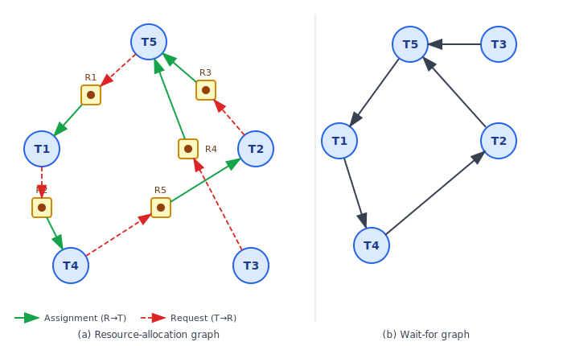

:::note
本系列文章內容參考自經典教材 **Operating System Concepts, 10th Edition (Silberschatz, Galvin, Gagne)**。本文對應章節：**Section 8.7 Deadlock Detection**。
:::

## **為什麼需要偵測？**

前兩篇分別介紹了死鎖預防（Prevention）與死鎖規避（Avoidance）。這兩種做法都在死鎖**發生之前**介入，透過限制資源請求或拒絕可能導致不安全狀態的分配，來確保死鎖永遠不會出現。

但代價是明顯的：預防必須永久放棄其中一個必要條件（例如強制所有 Thread 一次申請全部資源），規避則要求每個 Thread 事先宣告最大需求量（Maximum Claim），且所有配置都要通過安全性演算法的篩選。這些限制在很多實際系統中過於嚴苛，導致資源使用效率低落。

如果系統**不採用預防或規避機制**，死鎖就可能在執行期間悄悄出現。面對這種情況，系統需要提供兩樣東西：

1. **偵測演算法**：定期檢查系統狀態，判斷是否已發生死鎖，以及哪些 Thread 陷入了死鎖
2. **恢復機制**：一旦確認死鎖存在，採取行動打破循環等待，讓系統得以繼續運作

值得注意的是，偵測加恢復這套機制本身也有成本：除了維護額外資料結構與定期執行演算法的運行時開銷之外，恢復過程本身（例如終止 Thread、回滾執行狀態）也可能造成部分計算成果的損失。

 

## **8.7.1 單一實例資源：等待圖 (Wait-for Graph)**

當系統中**每種資源類型都只有一個實例**時，可以使用一種稱為**等待圖（Wait-for Graph）** 的資料結構來偵測死鎖。

### **從資源分配圖推導等待圖**

等待圖由**資源分配圖（Resource-Allocation Graph）** 衍生而來。推導方式很直接：把資源分配圖中所有代表**資源類型**的節點（方塊）移除，再把通過資源節點相連的兩條邊「收合」成一條直接連接 Thread 的邊。

具體規則是：若資源分配圖中存在兩條邊 Ti → Rq（Ti 請求 Rq）與 Rq → Tj（Rq 已分配給 Tj），則在等待圖中新增一條邊 **Ti → Tj**，代表 Ti 正在等待 Tj 釋放它所需的資源。

下圖呈現了資源分配圖與對應等待圖的並排比較：

圖中各元素的含義：

- **（a）資源分配圖**：圓形節點為 Thread，方形節點為資源（方形內的實心圓點代表一個資源實例）。紅色虛線箭頭（T→R）是請求邊，綠色實線箭頭（R→T）是分配邊。整張圖描述了五個 Thread（T1–T5）各自持有與等待的資源：T5 持有 R3、R4 並等待 R1；T1 持有 R1 並等待 R2；T4 持有 R2 並等待 R5；T2 持有 R5 並等待 R3；T3 等待 R4。
- **（b）等待圖**：移除所有資源節點後，每對「Ti → Rq → Tj」的間接連線直接收合成「Ti → Tj」。圖中可見一個明確的環狀結構：**T5 → T1 → T4 → T2 → T5**，這個 4 節點的循環就是死鎖的所在。T3 → T5 則代表 T3 也在等待死鎖鏈中的 T5，因此 T3 雖不在循環內，卻同樣無法繼續執行。

這張圖最核心的洞察是：**等待圖中只要存在一個環（Cycle），系統就處於死鎖狀態**。在單一實例資源的情況下，等待圖中有環等價於死鎖。

### **偵測演算法的運作**

為了持續偵測死鎖，系統必須：

1. **維護等待圖**：在 Thread 申請資源或資源被釋放時即時更新圖的結構
2. **定期執行環偵測（Cycle Detection）演算法**：搜尋等待圖中是否存在環

在等待圖中搜尋環需要 **O(n²)** 次運算，其中 n 是圖中節點數（即 Thread 數量）。

:::info BCC 工具與 Pthreads 死鎖偵測
Linux 的 BCC（BPF Compiler Collection）工具集提供了一個名為 `deadlock_detector` 的工具，能夠偵測使用 Pthreads mutex lock 的 User Process 中潛在的死鎖。

其運作原理是在 `pthread_mutex_lock()` 與 `pthread_mutex_unlock()` 函式上插入探針（Probe）。每當目標 Process 呼叫這兩個函式時，工具就在記憶體中即時維護該 Process 的 mutex 等待圖，一旦偵測到環就立即回報可能存在的死鎖。

這是一種**動態偵測**的實作範例，不需要修改應用程式原始碼，直接在執行期間觀察 Thread 的鎖定行為。
:::

 

## **8.7.2 多實例資源：偵測演算法**

當資源類型具有**多個實例**時，等待圖不再適用，因為一個資源節點可以同時分配給多個 Thread，單純移除資源節點會丟失重要的數量資訊。此時需要一套更完整的偵測演算法，其結構與 Banker's Algorithm 的安全性檢查非常相似，但目的不同：這裡不是預測未來，而是判斷**當前**系統是否已陷入死鎖。

### **演算法使用的資料結構**

演算法依賴三個隨時間變動的資料結構（設系統有 n 個 Thread、m 種資源）：

|    資料結構    |     大小      | 含義                                             |
| :------------: | :-----------: | :----------------------------------------------- |
| **Available**  | 長度 m 的向量 | 每種資源目前可用的實例數                         |
| **Allocation** |  n × m 矩陣   | Allocation[i][j]：資源 Rj 目前分配給 Ti 的實例數 |
|  **Request**   |  n × m 矩陣   | Request[i][j]：Ti 目前正在等待的 Rj 實例數       |

注意 Request 矩陣代表的是 Thread **當前實際發出的等待請求**，而非 Banker's Algorithm 中的 Need（最大還需求量）。這是兩者最關鍵的差異：Banker's Algorithm 是前瞻性（prospective）的規避工具，偵測演算法是回顧性（retrospective）的診斷工具。

### **演算法步驟**

演算法的核心邏輯是：若某個 Thread 的當前請求可以被系統現有資源滿足，就假設它能順利完成並釋放所有資源，再繼續檢查下一個 Thread。

1. 初始化 `Work = Available`。對於每個 Thread Ti：若 `Allocation[i] ≠ 0`（Ti 持有資源），則 `Finish[i] = false`；否則 `Finish[i] = true`（Ti 持有任何資源，暫時視為已完成）。
2. 尋找一個 index i，同時滿足：
   - `Finish[i] == false`
   - `Request[i] ≤ Work`（Ti 的當前請求可以被現有資源滿足）
   - 若找不到這樣的 i，跳到步驟 4。
3. 執行 `Work = Work + Allocation[i]`，`Finish[i] = true`，然後回到步驟 2。
4. 若存在任何 i 使得 `Finish[i] == false`，則系統**處於死鎖狀態**，且 `Finish[i] == false` 的 Thread Ti 就是死鎖的參與者。

整個演算法需要 **O(m × n²)** 次運算。

### **為什麼可以樂觀地「假設完成」？**

步驟 3 在 `Request[i] ≤ Work` 成立後，立刻回收 Ti 的所有資源（`Work += Allocation[i]`）並標記為完成。這背後有一個樂觀假設（Optimistic Assumption）：若 Ti 的當前請求能被滿足，Ti 就不在任何死鎖循環中，因此假設它能夠完成並歸還全部資源。

若這個假設事後被證明不正確（Ti 完成後又發出新的請求導致死鎖），下一次執行偵測演算法時就能偵測到新的死鎖。也就是說，演算法描述的是**此刻的快照**，偵測到的是**當前時間點**的死鎖狀態。

### **示範範例**

考慮一個有五個 Thread（T0–T4）和三種資源類型（A、B、C，分別有 7、2、6 個實例）的系統，當前狀態如下：

|       | Allocation (A B C) | Request (A B C) | Available (A B C) |
| :---: | :----------------: | :-------------: | :---------------: |
|  T0   |       0 1 0        |      0 0 0      |       0 0 0       |
|  T1   |       2 0 0        |      2 0 2      |                   |
|  T2   |       3 0 3        |      0 0 0      |                   |
|  T3   |       2 1 1        |      1 0 0      |                   |
|  T4   |       0 0 2        |      0 0 2      |                   |

執行演算法，可以找到序列 `<T0, T2, T3, T1, T4>`，使得所有 Thread 的 `Finish[i] == true`，因此**此時系統不在死鎖狀態**。

現在假設 T2 額外請求一個 C 類型資源，Request 矩陣變更如下（僅顯示 T2 列）：T2 的 Request 從 (0,0,0) 變成 (0,0,1)。

重新執行演算法後，Available = (0,0,0)。T0 的 Request (0,0,0) ≤ (0,0,0)，所以 T0 能完成，Work 變成 (0,1,0)。但 T1 需要 (2,0,2)，T2 需要 (0,0,1)，T3 需要 (1,0,0)，T4 需要 (0,0,2)，全都無法被 (0,1,0) 滿足。最終 T1、T2、T3、T4 的 `Finish` 均為 false，**系統已陷入死鎖**，死鎖參與者是這四個 Thread。

:::info 使用 Java Thread Dump 偵測死鎖
Java 沒有直接提供死鎖偵測的 API，但 **Thread Dump（執行緒傾印）** 是一個實用的替代手段。Thread Dump 是 JVM 在某一時刻拍下的所有執行緒狀態快照，其中包含每個執行緒目前持有哪些鎖、正在等待哪些鎖。

當 Thread Dump 被產生時，JVM 會在內部建構等待圖並搜尋環，若偵測到循環等待就會在傾印輸出中標示出來。產生 Thread Dump 的方式：

- UNIX / Linux / macOS：`Ctrl-L`
- Windows：`Ctrl-Break`

這個機制說明了一個重要的設計原則：即便語言層面不提供死鎖預防，也可以在 Runtime 層面加入偵測能力，讓開發者在出問題時有診斷工具可用。
:::

 

## **8.7.3 偵測演算法的調用時機**

知道如何偵測死鎖是一回事，知道**何時**調用偵測演算法又是另一回事。調用時機的選擇取決於兩個現實因素：

1. **死鎖發生的頻率**：死鎖越常發生，就越需要頻繁偵測，才能在資源被長時間閒置之前及時介入
2. **死鎖影響的 Thread 數量**：若死鎖等待時間拉長，被捲入的 Thread 數量可能逐漸增加，因為新的 Thread 可能等待已死鎖的 Thread 所持有的資源

### **兩種典型策略**

**策略一：每次請求無法立即滿足時就調用**

當某個 Thread 發出的資源請求因資源不足而必須等待，就立即調用偵測演算法。這樣不只能精確識別出死鎖的 Thread 集合，還能指向「最後那條讓循環等待成形的請求」，也就是從因果角度上「造成」這次死鎖的那個請求（雖然嚴格說來，循環中每個 Thread 都是死鎖的共同成因，並非只有那一個）。

缺點是**運算開銷很大**：在高並行系統中，資源請求失敗的頻率可能相當高，每次都觸發 O(m × n²) 的偵測演算法會嚴重影響整體效能。

**策略二：定期調用**

例如每小時觸發一次，或是在 CPU 使用率降至 40% 以下時觸發一次。死鎖的其中一個後果是系統吞吐量下降，因為持有資源的 Thread 全部卡住，CPU 因此閒置，所以 CPU 使用率驟降往往是死鎖的間接信號。

這種做法的代價是：若偵測演算法在任意時間點被調用，等待圖（或 Allocation/Request 矩陣）中可能同時存在多個死鎖環，此時無法從演算法輸出中直接判斷哪個請求「造成」了哪個死鎖，只能知道「目前有死鎖存在」，而無法精確溯源。

:::info 資料庫系統的死鎖管理
資料庫系統是「偵測加恢復」策略的典型應用場景，也提供了很好的設計參考。

資料庫的更新操作通常以**交易（Transaction）** 為單位，交易執行期間會持有一些資料鎖（Row Lock、Table Lock），多個交易並行執行時就可能形成循環等待。

大多數關聯式資料庫（包括 MySQL、PostgreSQL）的死鎖管理流程如下：

1. **偵測**：資料庫伺服器定期在等待圖中搜尋環
2. **選擇犧牲者（Victim Selection）**：從死鎖環中挑選一個交易作為犧牲者——MySQL 的預設策略是選擇影響行數最少的交易，以最小化回滾（Rollback）的成本
3. **中止與回滾**：終止犧牲者交易，釋放它持有的所有鎖，讓其他交易得以繼續執行
4. **重新執行**：被中止的交易稍後重新發出（Reissued），就像什麼事都沒發生一樣

這個機制的設計精髓在於：資料庫不試圖**預防**死鎖（那樣會嚴重限制並行度），而是**接受死鎖的偶發性**，並以低成本的自動恢復機制來應對。對讀寫吞吐量要求很高的 OLTP 系統來說，這通常比預防策略更實際。
:::
