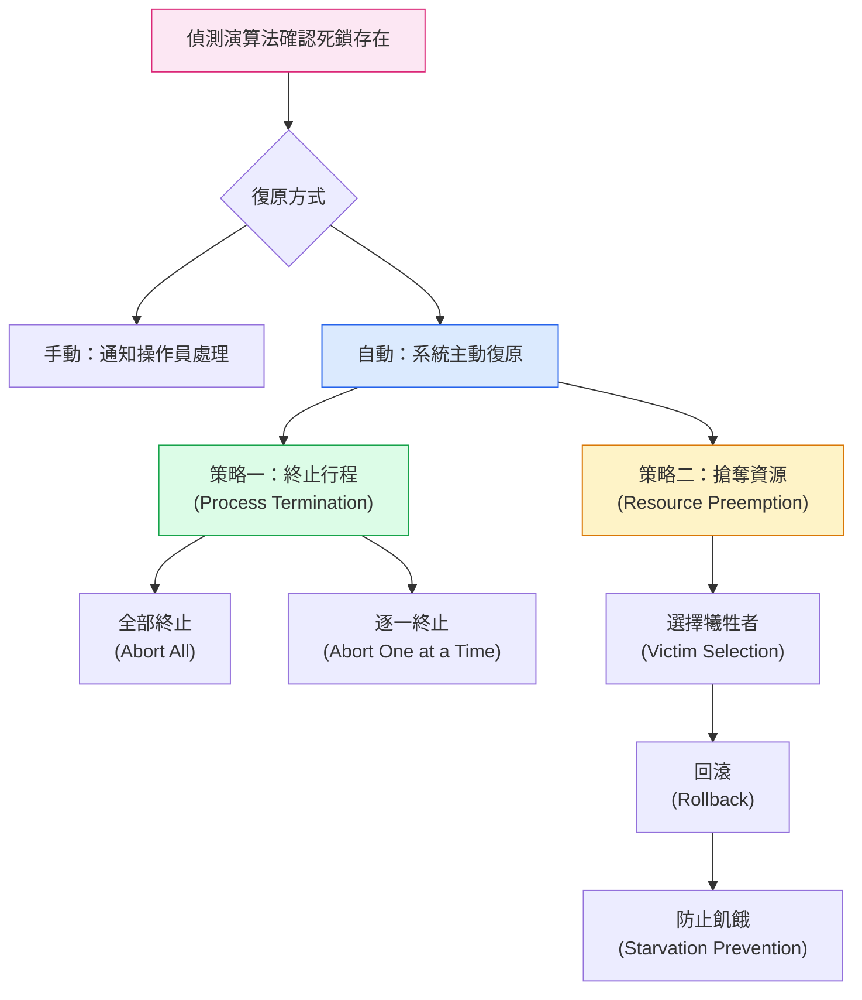

:::note
本系列文章內容參考自經典教材 **Operating System Concepts, 10th Edition (Silberschatz, Galvin, Gagne)**。本文對應章節：**Section 8.8 Recovery from Deadlock**。
:::

## **死鎖偵測之後，然後呢？**

前一篇介紹了死鎖偵測（Deadlock Detection）演算法，它能在系統執行期間掃描資源配置狀態，判斷是否存在循環等待的死鎖。但偵測只是第一步，真正的挑戰在於：**確認死鎖存在之後，系統要如何從中脫身？**

面對這個問題，系統有兩種處置方式：

1. **通知操作員（Operator）手動處理**：將偵測結果回報給人工，由操作員決定如何介入（例如手動終止某個行程）。這在特殊用途系統或高安全環境中常見，因為人工判斷比自動化機制更謹慎。
2. **系統自動復原（Automatic Recovery）**：OS 自行打破死鎖，不需要人工介入。這是大多數通用作業系統的做法。

自動復原又分兩條路：**終止（Terminate）死鎖中的行程**，或**搶奪（Preempt）這些行程持有的資源**。以下分別說明。

 

## **8.8.1 行程終止 (Process and Thread Termination)**

透過終止行程來打破死鎖，核心邏輯很直接：死鎖之所以維持，是因為參與循環等待的每個行程都還活著並持有資源。只要終止其中一個或多個行程，被終止者持有的資源就會釋放回系統，循環等待自然瓦解。

但「要終止哪些行程？要終止幾個？」這個問題有兩種截然不同的策略。

### **策略一：全部終止（Abort All Deadlocked Processes）**

最簡單粗暴的做法，直接終止所有捲入死鎖的行程。這樣可以立刻、確定地打破死鎖循環，但代價極高：這些行程可能已經執行了很長一段時間，累積了大量的運算結果。一旦全部終止，這些中間計算全部作廢，通常必須從頭重新執行。

這種做法的好處是**完全不需要額外的偵測輪次**，一刀切斷就能解決問題；壞處是**成本可能遠大於死鎖本身造成的損失**，特別是當涉及的行程已接近完成時，浪費尤其嚴重。

### **策略二：逐一終止（Abort One Process at a Time）**

比較節省資源的做法：每次只終止一個行程，釋放它的資源，然後**重新執行一次死鎖偵測演算法**，確認死鎖是否已解除。若死鎖仍存在，再選下一個行程終止，如此循環，直到死鎖消失為止。

這樣可以避免不必要的行程終止，但引入了另一個問題：**每一輪都必須重跑偵測演算法**，overhead 較高，特別是當死鎖涉及的行程很多、偵測演算法複雜度高時（如多實例資源的偵測演算法，時間複雜度為 O(n² × m)），這個代價不可忽視。

### **終止哪個行程？犧牲者選擇標準**

如果採用逐一終止策略，每一輪都必須決定「這次終止誰」。這本質上是一個**政策決策（Policy Decision）**，類似 CPU 排程的優先順序問題。基本原則是：**選擇終止成本最小的行程**。

但「最小成本」是一個模糊的概念，實際上需要綜合考量多個因素：

1. **行程優先順序（Priority）**：優先順序低的行程較適合被犧牲，避免打斷高優先順序的關鍵工作。
2. **已執行時間與剩餘時間**：已執行越久、越接近完成的行程，終止代價越高，因為必須重做的計算越多。相反地，剛啟動、做了很少事情的行程是較佳的候選者。
3. **已使用的資源類型與數量**：持有較多資源、或持有「難以回收」資源的行程，終止後能釋放較多資源，有時反而值得優先終止。
4. **還需要多少資源才能完成**：若一個行程再拿一點資源就能結束，與其把它終止，不如讓它完成後自然釋放，反而更划算。
5. **需要連帶終止幾個行程**：某些行程之間有依賴關係，終止一個可能要連帶終止其他行程，擴大損失。

:::info 為什麼不能只看優先順序就決定？
直覺上覺得「優先順序最低的先終止」聽起來合理，但實際上優先順序只是其中一個維度。假設有一個低優先順序的行程已執行了 12 小時、即將完成，而有一個高優先順序的行程才剛啟動 5 秒，從成本角度看，終止那個高優先順序的新行程反而損失更小。

這正是為什麼教科書把終止決策定性為「經濟問題（Economic Problem）」：沒有一個放諸四海皆準的單一標準，OS 必須綜合評估才能做出合理選擇。
:::

 

## **8.8.2 資源搶奪 (Resource Preemption)**

第二種復原策略不終止行程，而是強制**從死鎖行程手中搶走部分資源，再重新分配給其他行程**，直到循環等待被打破。被搶走資源的行程並不立即結束，但它的執行必須被中斷並回滾。

資源搶奪需要面對三個核心問題：

### **問題一：選擇犧牲者（Selecting a Victim）**

搶奪哪個行程的哪些資源，才能以最低成本打破死鎖？這與行程終止策略中的犧牲者選擇邏輯相似，需要考量的成本因素包括：

- 該行程目前持有多少資源（搶走後能釋放多少）
- 該行程到目前為止已消耗多少執行時間（回滾的代價）

目標是找到一個「讓系統付出最少額外成本」的搶奪方案。

### **問題二：回滾（Rollback）**

一旦決定從某個行程搶走資源，這個行程就失去了繼續執行的條件，必須被**回滾（Roll Back）** 到某個安全狀態，然後從那個狀態重新執行。

「安全狀態」的定義是系統的難題：

- **完全回滾（Total Rollback）**：直接終止行程，再從頭重新啟動。這是實作最簡單的做法，但代價高，所有已完成的計算全部丟失。
- **部分回滾（Partial Rollback）**：只回滾到「剛好能打破死鎖」所需的最小程度。這樣損失的計算量最少，但要求系統必須持續追蹤每個行程的完整執行歷史（checkpointing），才能知道要回到哪個時間點，實作成本顯著更高。

大多數系統因為實作複雜度的考量，選擇完全回滾，即使效率較差。

### **問題三：防止飢餓（Starvation Prevention）**

資源搶奪策略有一個潛在的公平性問題：如果每次的犧牲者選擇都根據「成本最小化」的邏輯，那麼**同一個行程可能每次都被選為犧牲者**，永遠無法完成它的工作，陷入飢餓（Starvation）。

這是任何實際系統都必須解決的問題。最常見的解法是：**將「已被搶奪的次數（Number of Rollbacks）」納入成本計算因子**。一個行程被搶奪的次數越多，它在下一次選擇中的成本評分就越高，從而降低它再次被選中的機率，確保每個行程最終都有機會完成。

:::info 資料庫系統中的死鎖管理

資料庫系統提供了一個很具體的例子，展示業界如何同時運用死鎖偵測與自動復原。

資料庫的更新操作以**交易（Transaction）** 為單位執行，為了確保資料完整性，每筆交易在修改資料前必須先取得鎖定（Lock）。一筆交易可能涉及多個鎖定，因此在多個交易並行執行時，死鎖是完全可能發生的情況。

為了管理這種情況，大多數交易型資料庫系統內建了一套死鎖偵測與復原機制：

- **偵測**：資料庫伺服器定期掃描**等待圖（Wait-for Graph）**，尋找其中的循環，以確認是否有一組交易陷入死鎖。
- **選擇犧牲者**：一旦偵測到死鎖，系統選出一筆交易作為犧牲者。以 MySQL 為例，它會傾向選擇「插入、更新或刪除列數最少」的交易作為犧牲者，以最小化資料回滾的成本。
- **復原**：被選中的犧牲者交易被中止（Abort）並**回滾（Rolled Back）**，釋放它持有的所有鎖定，讓其餘交易得以繼續執行。
- **重新發起**：剩餘的交易恢復執行後，被中止的那筆交易會被**重新發起（Reissued）**，從頭再試一次。

這套機制把「搶奪式復原」的三個問題，在資料庫語境下都給出了具體答案：成本函數是修改行數、回滾是 UNDO Log 機制、重新發起則解決了飢餓問題（同一筆交易不會無限次地被選為犧牲者，因為每次重試都會使其修改行數歸零，但實際資料庫系統也有其他機制防止反覆重試）。
:::

 

## **兩種策略的比較**

行程終止與資源搶奪各有適用場景。兩者都需要解決「選哪個犧牲者」的問題，但在後續的處置方式和系統負擔上有明顯差異：

|      比較維度      | 行程終止（Termination）      | 資源搶奪（Preemption）             |
| :----------------: | :--------------------------- | :--------------------------------- |
| **打破死鎖的方式** | 終止行程，釋放其全部資源     | 從行程搶走部分資源，重新分配       |
|  **行程是否繼續**  | 否，必須重新執行             | 是，但要回滾到安全狀態後重啟       |
|   **回滾複雜度**   | 較低（終止即可）             | 較高（需要 checkpoint 機制）       |
|    **飢餓風險**    | 存在（同一行程反覆被終止）   | 存在（同一行程反覆被搶奪）         |
| **解決飢餓的方式** | 將終止次數納入成本因子       | 將搶奪次數納入成本因子             |
|    **適用場景**    | 實作簡單、對行程完整性要求低 | 資源珍貴、需要保留行程部分計算進度 |
