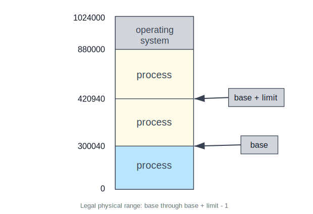
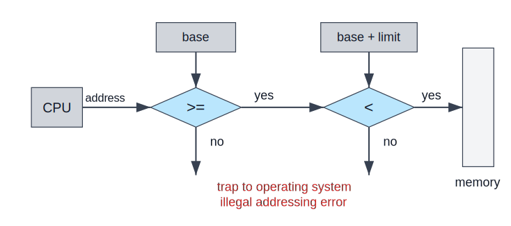
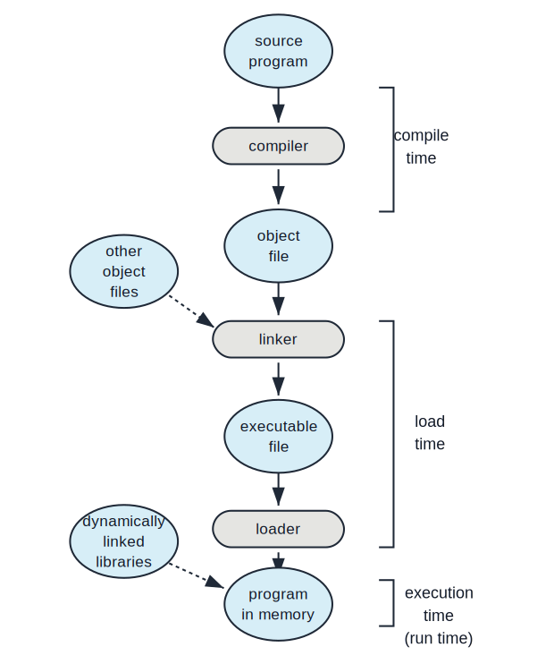
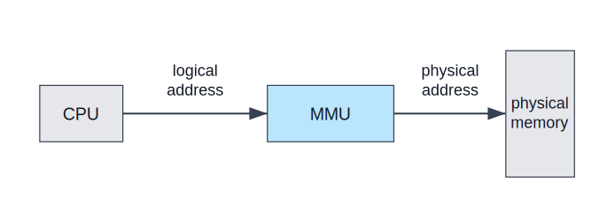
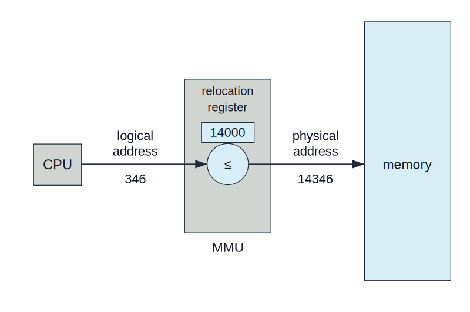
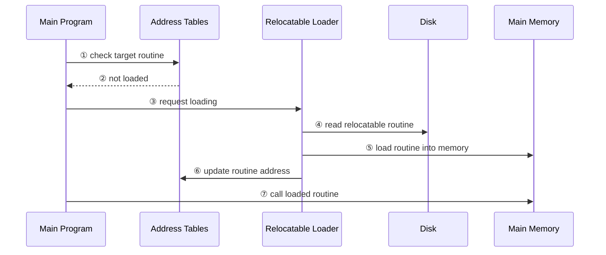
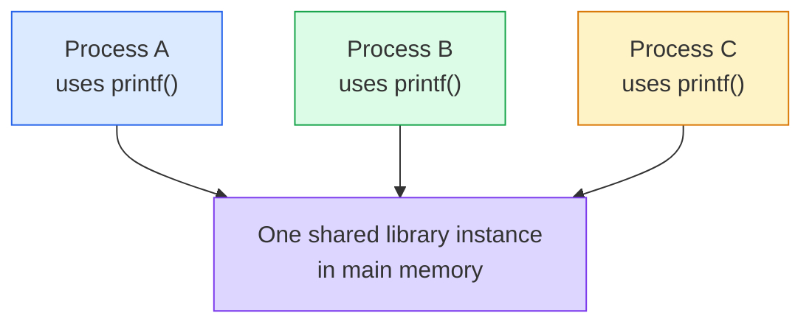

:::note
本系列文章內容參考自經典教材 **Operating System Concepts, 10th Edition (Silberschatz, Galvin, Gagne)**。本文對應章節：**Section 9.1 Background**。
:::

## **為什麼需要主記憶體管理？**

在前面的 CPU 排程章節中，核心目標是讓 CPU 不要閒置：當一個 Process 等待 I/O 時，OS 可以切換到另一個 Process 執行，提高 CPU 使用率與系統回應速度。這個想法要成立，有一個前提：**系統必須同時把多個 Process 留在記憶體中**。如果記憶體一次只能容納一個 Process，CPU 排程再聰明也沒有太多發揮空間。

問題也因此出現：記憶體不再是單一程式的私人空間，而是由 OS 與多個 Process 共同使用的共享資源。OS 必須回答幾個基本問題：

| 問題                                   | 說明                                                          |
| :------------------------------------- | :------------------------------------------------------------ |
| **程式如何被放進記憶體？**             | 一個 executable file 原本在 disk 上，執行前必須被載入主記憶體 |
| **Process 能存取哪些位址？**           | Process 只能存取自己的記憶體，不應碰到 OS 或其他 Process      |
| **程式中的位址如何對應到實體記憶體？** | 程式看到的位址不一定等於 RAM 上真正的位址                     |
| **如何節省記憶體空間？**               | 不常用的 routine 或共用 library 不應在每個程式中重複載入      |

本章的主軸就是這些問題。Section 9.1 先建立基礎：硬體能直接存取哪些儲存體、如何保護每個 Process 的記憶體範圍、程式中的位址如何逐步綁定到實體位址，以及動態載入與動態連結如何改善記憶體使用效率。

 

## **9.1.1 基本硬體 (Basic Hardware)**

CPU 執行指令時，能直接存取的通用儲存體只有兩類：**CPU 內部暫存器 (Registers)** 與**主記憶體 (Main Memory)**。機器指令可以把記憶體位址當作 operand，例如從某個 memory address 載入資料，但一般指令不能直接把 disk address 當作 operand。因此，正在執行的指令與正在使用的資料都必須位於 registers 或 main memory 中；如果資料還在 disk，就必須先被搬進記憶體，CPU 才能對它運算。

這裡有一個速度落差。CPU register 通常可以在一個 CPU clock cycle 內存取，部分處理核心甚至能在每個 clock tick 解碼並執行一個以上的簡單 register operation。主記憶體則必須透過 memory bus 交易才能存取，可能需要許多 CPU cycles。若每次讀寫記憶體都讓 CPU 原地等待，整個系統會被頻繁的 memory access 拖慢。因此硬體通常會在 CPU 與主記憶體之間加入高速 **cache**，用硬體自動加速常用資料與指令的存取。

:::info Memory Stall 與 Cache 的關係
當 CPU 執行某條指令時發現所需資料還沒有從主記憶體回來，CPU 可能必須停住，這稱為 **memory stall**。Cache 的目的不是改變程式語意，而是讓常用資料更可能已經在靠近 CPU 的高速儲存體中，降低 stall 發生的頻率。

在多執行緒核心中，若某個 hardware thread 因記憶體存取而 stall，核心可能切換到另一個 hardware thread 繼續執行，藉此隱藏部分記憶體延遲。
:::

### **記憶體保護為什麼必須靠硬體？**

多個 Process 同時在記憶體中時，OS 必須防止兩種危險：

1. User process 修改 OS kernel 的 code 或 data structure。
2. User process 讀寫其他 Process 的記憶體。

這件事不能只靠 OS 軟體檢查，原因是 CPU 執行每一條 load/store 指令時，OS 通常不會介入。若每次記憶體存取都進入 kernel 檢查，系統效能會無法接受。因此，**記憶體保護必須由硬體在每一次 memory access 發生時自動檢查**。

最基本的一種設計是使用兩個暫存器：**Base Register** 與 **Limit Register**。Base register 存放 Process 可以存取的最小合法實體位址；limit register 存放這段合法範圍的大小。若 base 是 `300040`，limit 是 `120900`，合法範圍就是 `300040` 到 `420939`，其中 `420940` 是第一個不合法位址。

下圖呈現 base 與 limit 如何定義一個 Process 的合法記憶體範圍：

圖中的標記含義如下：

- **base**：這個 Process 可存取範圍的起始實體位址。
- **base + limit**：合法範圍結束後的第一個位址，不包含在合法範圍內。
- **process 區段**：OS 為不同 Process 分配的實體記憶體區域。
- **operating system 區段**：OS 自己使用的記憶體，user mode 程式不應直接存取。

這張圖的核心是：**Process 的合法記憶體範圍不是靠程式自律，而是靠硬體界線定義出來**。只要 CPU 每次存取位址時都檢查 base 與 limit，user program 就無法任意越界。

### **Base/Limit 的硬體檢查流程**

當 CPU 在 user mode 執行程式並產生一個 memory address 時，硬體會做兩個比較：

1. 檢查 address 是否大於或等於 base。
2. 檢查 address 是否小於 base + limit。

只有兩個條件都成立，這次存取才會送到 memory。只要任一條件失敗，硬體就會觸發 trap，讓 OS 接手處理。這種越界存取通常被視為 fatal error，因為它代表程式試圖存取不屬於自己的記憶體。

下圖呈現這個硬體檢查流程：

流程中的每個判斷點如下：

- CPU 先產生一個 address。
- 第一個比較器確認 `address >= base`。
- 第二個比較器確認 `address < base + limit`。
- 兩個比較都通過，address 才能進入 memory。
- 任一比較失敗，硬體觸發 trap，OS 將其視為 illegal addressing error。

這張圖最重要的觀念是：**記憶體保護發生在 CPU 與 memory 之間，而不是發生在應用程式內部**。User program 沒有權限繞過這個檢查。

:::info 為什麼 user program 不能修改 base/limit？
Base register 與 limit register 只能由 OS 使用 privileged instruction 載入。Privileged instruction 只能在 kernel mode 執行，而一般 user program 只能在 user mode 執行，因此 user program 無法把 base 或 limit 改成對自己有利的值。

這個限制是記憶體保護成立的關鍵。若 user program 可以自行修改 base/limit，它就能把合法範圍擴大到 OS 或其他 Process 的記憶體，整個保護機制會立刻失效。
:::

Kernel mode 的 OS 則擁有不受限制的記憶體存取能力，因為它需要替 user process 載入程式、在程式錯誤時 dump 記憶體內容、讀寫 system call 參數、替 I/O 裝置把資料搬進或搬出 user memory。換句話說，**user process 必須被限制在自己的範圍內，但 OS 必須能管理所有範圍**。

 

## **9.1.2 位址綁定 (Address Binding)**

程式一開始通常是一個放在 disk 上的 binary executable file。要執行它，OS 必須把它載入記憶體，建立對應的 Process，然後讓 CPU 有機會執行它。在 Process 執行期間，指令與資料都會從記憶體中讀取；Process 結束後，OS 再回收它佔用的記憶體。

直覺上，程式似乎應該從記憶體位址 `0` 開始執行。但在多 Process 系統中，這通常不可能也不必要。實體記憶體中可能已經有 OS、其他 Process、buffer、library，因此一個 user process 可以被放在實體記憶體的任何可用位置。這就帶來核心問題：**程式原本寫的位址，何時被決定成真正的記憶體位址？**

這個把「某個位址表示」映射到「另一個位址表示」的過程，就是 **address binding**。在程式從 source code 走到 memory 中可執行 image 的過程中，位址通常會經過多種形式：

| 階段           | 位址形式            | 例子                      |
| :------------- | :------------------ | :------------------------ |
| Source program | Symbolic address    | 變數名稱 `count`          |
| Object file    | Relocatable address | 距離 module 開頭 14 bytes |
| Loaded program | Absolute address    | 實體位址 `74014`          |

下圖把使用者程式從 source program 到 memory 中執行的過程串起來：

圖中的流程可以分成三個時間點：

- **Compile time**：compiler 把 source program 轉成 object file，可能產生 absolute code 或 relocatable code。
- **Load time**：linker 與 loader 把 object files、其他 object files 合併成 executable file，並把程式載入記憶體。
- **Execution time**：程式已在 memory 中執行，dynamic libraries 可能在此時被連結進來。

這張圖的核心洞察是：**位址不是只有一種，也不是只能在一個時間點決定**。OS 與硬體設計可以選擇在 compile time、load time 或 execution time 才把程式中的位址綁定到實際記憶體位置。

### **三種 Address Binding 時機**

**Compile-time binding** 的前提是：編譯時已經知道 Process 將被放在記憶體的哪個位置。Compiler 可以直接產生 absolute code。這種方式簡單，但很僵硬；只要起始位置改變，就必須重新編譯程式。

**Load-time binding** 適用於編譯時還不知道程式會被載入哪裡的情況。Compiler 產生 relocatable code，最後的位址綁定延後到 loader 載入程式時才完成。如果起始位置改變，不需要重編譯，只要重新載入即可。

**Execution-time binding** 則把位址綁定延後到程式執行期間。這代表 Process 在執行中仍可能從一段記憶體移動到另一段記憶體。這種彈性最高，但需要特殊硬體支援，因為每一次 memory reference 都必須在執行時被轉換。現代 OS 多數採用這種方法，後面的 paging 與 virtual memory 都建立在這個方向上。

| 綁定時機       | 優點                                           | 代價                            |
| :------------- | :--------------------------------------------- | :------------------------------ |
| Compile time   | 執行時最簡單                                   | 起始位置改變就要重新編譯        |
| Load time      | 起始位置改變只需重新載入                       | Process 載入後不容易任意移動    |
| Execution time | Process 執行中仍可搬移，支援更彈性的記憶體管理 | 需要 MMU 等硬體在執行時轉譯位址 |

 

## **9.1.3 邏輯位址與實體位址空間 (Logical Versus Physical Address Space)**

CPU 產生的位址稱為**邏輯位址 (Logical Address)**。Memory unit 實際看到並放入 memory-address register 的位址稱為**實體位址 (Physical Address)**。在本書中，**虛擬位址 (Virtual Address)** 與 logical address 可視為同義詞。

如果位址在 compile time 或 load time 就完成綁定，logical address 與 physical address 會相同。若使用 execution-time binding，兩者就會不同：程式以為自己在使用某個 logical address，但真正送到 memory 的是轉換後的 physical address。

這裡需要區分兩個集合：

| 名稱                       | 定義                                                   |
| :------------------------- | :----------------------------------------------------- |
| **Logical Address Space**  | 程式執行時可能產生的所有 logical addresses             |
| **Physical Address Space** | 這些 logical addresses 實際對應到的 physical addresses |

真正的關鍵不是單一位址，而是「一整個 logical address space」如何被綁定到「另一個 physical address space」。

### **MMU 的角色**

執行時的 logical-to-physical mapping 由硬體裝置 **Memory-Management Unit (MMU)** 負責。MMU 位在 CPU 與 physical memory 之間：CPU 送出 logical address，MMU 將它轉成 physical address，memory 最後只看到 physical address。

下圖呈現最基本的 MMU 位置：

圖中的資料流如下：

- CPU 產生 logical address。
- Logical address 進入 MMU。
- MMU 依照目前的記憶體管理機制轉換成 physical address。
- Physical memory 只接收轉換後的 physical address。

這張圖的重點是：**程式不需要也不應知道真正的 physical address**。程式只處理 logical address，轉換責任交給硬體與 OS 管理的映射資訊。

### **用 Relocation Register 理解動態重定位**

最簡單的 MMU 例子可以從 base-register scheme 推廣而來。這裡 base register 被稱為 **relocation register**。MMU 會把 relocation register 的值加到 user process 產生的每個 logical address 上，形成 physical address。

若 relocation register 的值是 `14000`：

| Logical Address | Relocation Register | Physical Address |
| :-------------: | :-----------------: | :--------------: |
|       `0`       |       `14000`       |     `14000`      |
|      `346`      |       `14000`       |     `14346`      |
|      `max`      |       `14000`       |  `14000 + max`   |

下圖呈現 logical address `346` 如何在 MMU 中被轉換成 physical address `14346`：

圖中的標記含義如下：

- **relocation register = 14000**：這個 Process 的 logical address space 在 physical memory 中的起始位置。
- **logical address = 346**：CPU 執行 user program 時產生的位址。
- **physical address = 14346**：MMU 將 `14000 + 346` 相加後送往 memory 的位址。
- **MMU**：執行位址轉換的硬體。

這張圖的核心洞察是：**user program 永遠以為自己在操作 0 到 max 的位址範圍，但 memory 實際收到的是 R 到 R + max 的位址範圍**。程式可以建立指向 `346` 的 pointer、把它存進記憶體、比較它與其他 pointer，這些操作都仍然是在 logical address 的世界中進行。只有當這個值真的被當作 memory address 使用時，MMU 才把它轉換成 physical address。

:::info 為什麼這叫 Execution-Time Binding？
因為 referenced memory address 的最後實體位置不是在編譯時或載入時決定，而是在每一次 memory reference 發生時才由 MMU 決定。這讓 OS 有能力在執行期間維持「程式看到的位址」與「實體 RAM 的位置」分離。
:::

 

## **9.1.4 動態載入 (Dynamic Loading)**

到目前為止的討論隱含一個限制：Process 要執行，就必須把整個 program 與所有 data 都放進 physical memory。這會讓 Process 的大小受限於實體記憶體，也會浪費空間，因為許多 routine 可能很少被呼叫。

**Dynamic Loading** 的想法是：**routine 不到真正被呼叫時，不載入記憶體**。所有 routines 先以 relocatable load format 放在 disk 上；main program 先被載入記憶體並開始執行。當某個 routine 需要呼叫另一個 routine 時，系統先檢查目標 routine 是否已經載入：

1. Calling routine 檢查目標 routine 是否已在記憶體中。
2. 若尚未載入，relocatable linking loader 被呼叫。
3. Loader 將目標 routine 載入 memory。
4. Loader 更新程式的 address tables，讓後續呼叫能找到新 routine。
5. Control 轉移到新載入的 routine。

Dynamic loading 特別適合處理「程式很大，但很多部分很少使用」的情況。例如 error-handling routines 可能需要大量程式碼，但只有在異常狀況發生時才會執行。若一開始就全部載入，正常情況下大部分記憶體都被閒置的 code 佔住；使用 dynamic loading 後，只有實際需要的部分會進入 memory。

:::info Dynamic Loading 是否需要 OS 支援？
Dynamic loading 不一定需要 OS 提供特殊硬體或核心機制。主要責任在程式設計與 loader/library routine：程式必須以能延後載入 routine 的方式組織，並在需要時呼叫對應的載入邏輯。

OS 可以提供 library routines 協助實作 dynamic loading，但這不是像 MMU 位址轉譯那樣必須由硬體與 kernel 強制支援的機制。
:::

 

## **9.1.5 動態連結與共享函式庫 (Dynamic Linking and Shared Libraries)**

**Dynamically Linked Libraries (DLLs)** 是在程式執行時才連結到 user program 的 system libraries。它和 dynamic loading 很像，但延後的是「linking」而不只是「loading」。這個機制常用於標準 C library 之類的 system libraries。在 Linux 中常稱為 **shared libraries**，Windows 中常見名稱是 DLLs。

先看沒有 dynamic linking 的情況。若系統只支援 **static linking**，library 會像一般 object module 一樣，在載入時被合併進 binary program image。這代表每個使用標準 library 的 executable image 都可能各自包含一份 library routine。結果有兩個問題：

| 問題                  | 影響                                              |
| :-------------------- | :------------------------------------------------ |
| Executable image 變大 | 每個程式檔都包含自己需要的 library code           |
| 主記憶體浪費          | 多個 Process 可能在 memory 中各放一份相同 library |

Dynamic linking 把 library routine 的連結延後到 execution time。當程式第一次 reference 某個 dynamic library routine 時，loader 會定位該 DLL；若它尚未在 memory 中，就先載入；接著調整程式中引用該 routine 的位址，讓呼叫能跳到 DLL 在 memory 中的實際位置。

### **Shared Libraries 的核心價值**

Dynamic linking 的第二個好處是共享。多個 Process 可以共用 memory 中同一份 library instance，而不是每個 Process 各自載入一份。這就是 shared libraries 名稱的由來。

這個圖的重點是：**共享的是 library code 在主記憶體中的 instance，不是每個 Process 都複製一份**。這能降低 executable image 大小，也能節省主記憶體。

### **Library 更新與版本資訊**

Dynamic linking 也讓 library update 更容易。例如 library 被修補 bug 後，所有 reference 該 library 的程式可以自動使用新版本；若沒有 dynamic linking，這些程式通常都必須重新 link 才能取得更新。

但自動更新也有風險：新 library 可能與舊程式不相容。為了避免舊程式意外載入不相容的新版本，program 與 library 都會包含 version information。系統可以同時載入多個 library 版本，每個程式依照自己的版本資訊決定使用哪一份。通常 minor change 保留同一個版本號，major incompatible change 則提升版本號，讓舊程式繼續使用舊版本，新編譯的程式才使用新版本。

### **Dynamic Linking 為什麼通常需要 OS 支援？**

Dynamic loading 可以主要由程式與 library routine 自行完成，但 dynamic linking 與 shared libraries 通常需要 OS 協助。原因是 Process 之間有記憶體保護，某個 Process 不能自己檢查或映射另一個 Process 的 memory space。只有 OS 能判斷需要的 routine 是否已經在其他 Process 的記憶體空間中，並允許多個 Process 安全地映射同一份 shared library。

:::info Dynamic Loading 與 Dynamic Linking 的差異
兩者都把某些工作延後到執行期間，但延後的對象不同：

| 機制                | 延後的是什麼           | 典型用途                          | 是否通常需要 OS 支援 |
| :------------------ | :--------------------- | :-------------------------------- | :------------------- |
| **Dynamic Loading** | Routine 的載入         | 很少使用的 error-handling code    | 不一定               |
| **Dynamic Linking** | Library routine 的連結 | C library、system libraries、DLLs | 通常需要             |

Dynamic loading 的重點是「需要時才把 routine 放進 memory」；dynamic linking 的重點是「需要時才把 library reference 綁到 memory 中的 library instance」，並進一步支援多 Process 共享同一份 library code。
:::

 

## **本節總結**

Section 9.1 建立了後續 memory management 的基本語彙與硬體模型：

| 概念                                   | 核心意義                                                                     |
| :------------------------------------- | :--------------------------------------------------------------------------- |
| **Main memory**                        | CPU 能直接存取的主要工作空間，執行中的指令與資料必須在其中                   |
| **Base/Limit registers**               | 用硬體定義 user process 的合法記憶體範圍                                     |
| **Address binding**                    | 把程式中的位址表示映射到另一個位址空間，可發生於 compile/load/execution time |
| **Logical address**                    | CPU 執行程式時產生的位址，也稱 virtual address                               |
| **Physical address**                   | Memory unit 實際看到的位址                                                   |
| **MMU**                                | 在執行時把 logical address 轉換成 physical address 的硬體                    |
| **Dynamic loading**                    | Routine 直到被呼叫時才載入 memory                                            |
| **Dynamic linking / shared libraries** | Library 在執行時才連結，且可由多個 Process 共享同一份 memory instance        |

本節最重要的主線是：**現代 OS 不讓程式直接管理實體記憶體，而是讓程式活在 logical address space 中，再由 OS 與硬體合作把它安全、有效率地映射到 physical memory**。後續的 contiguous allocation、paging、TLB、hierarchical paging、inverted page table 都是在這條主線上逐步擴充。
