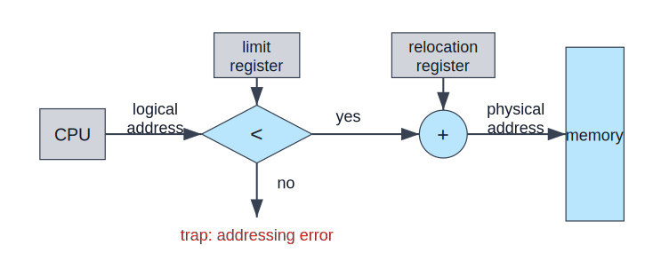
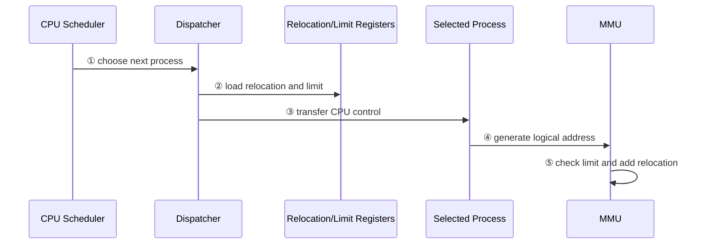
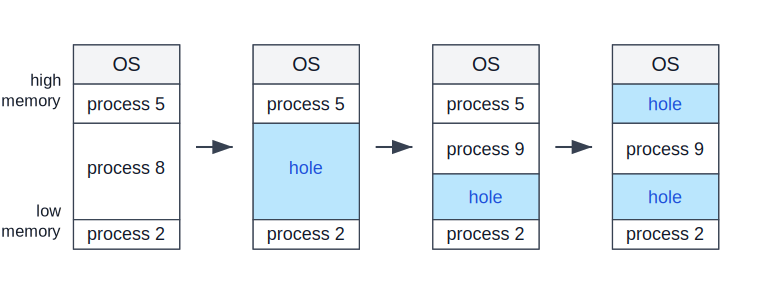
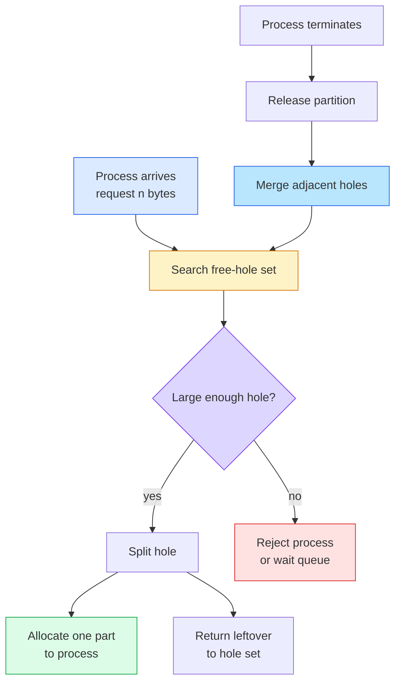
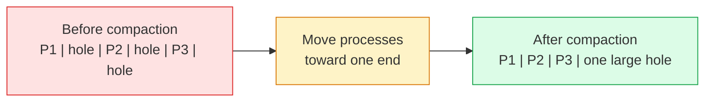

:::note
本系列文章內容參考自經典教材 **Operating System Concepts, 10th Edition (Silberschatz, Galvin, Gagne)**。本文對應章節：**Section 9.2 Contiguous Memory Allocation**。
:::

## **為什麼要討論連續記憶體配置？**

Section 9.1 建立了主記憶體管理的基本前提：CPU 產生的是 logical address，真正進入 RAM 的是 physical address，中間由 MMU 與 OS 管理的資訊負責轉換。接下來的問題是：**OS 要如何把多個 Process 放進同一份 physical memory？**

最直覺的一種方法是 **Contiguous Memory Allocation（連續記憶體配置）**：每個 Process 在 physical memory 中占用一整段連續的記憶體區域。若 Process A 被放在 `100040` 到 `174639`，那它的 code、data、heap、stack 都必須落在這段連續範圍內，不能分散到其他不相鄰的位置。

這種模型好理解，也讓硬體保護相對簡單，但它會帶來一個根本限制：**記憶體必須同時符合「總量足夠」與「連續空間足夠」兩個條件**。後面的 fragmentation 問題，正是由這個限制推導出來的。

:::info Contiguous 的重點
Contiguous 不是說整個 memory 只能放一個 Process，而是說**每一個 Process 自己必須占用一段連續區域**。多個 Process 仍然可以同時存在於 memory，只是每個 Process 都被放在自己的連續 partition 中。
:::

<br/>

## **9.2.1 記憶體保護 (Memory Protection)**

在 contiguous allocation 中，保護問題可以直接延續 Section 9.1 的兩個硬體概念：**Relocation Register** 與 **Limit Register**。

假設 OS 把某個 Process 放在 physical memory 的 `100040` 開始，並分配 `74600` bytes 給它。此時：

| Register                |    值    | 意義                                         |
| :---------------------- | :------: | :------------------------------------------- |
| **Relocation Register** | `100040` | 這個 Process 在 physical memory 中的起始位址 |
| **Limit Register**      | `74600`  | 這個 Process 的 logical address space 大小   |

Process 本身不需要知道 `100040` 這個 physical address。它只會產生從 `0` 開始的 logical address。MMU 會在每一次 memory reference 做兩件事：

1. 檢查 logical address 是否小於 limit。
2. 若合法，將 relocation register 加到 logical address 上，產生 physical address。

例如 logical address `5000` 合法，因為 `5000 < 74600`，轉換後的 physical address 是 `100040 + 5000 = 105040`。但 logical address `74600` 不合法，因為合法範圍是 `0` 到 `74599`。若 Process 試圖使用 `74600`，硬體會觸發 trap，交給 OS 處理 addressing error。

下圖呈現 relocation 與 limit register 如何同時完成保護與位址轉換：



圖中的流程可以拆成五個步驟：

- **CPU** 產生 logical address。
- **Limit register** 提供合法 logical address range 的上界。
- **比較器**檢查 logical address 是否小於 limit。
- 若檢查失敗，硬體觸發 **trap: addressing error**。
- 若檢查通過，MMU 將 **relocation register** 加到 logical address 上，產生 physical address 並送往 memory。

:::tip 
這張圖的核心洞察是：**同一組 register 同時解決兩件事**。
- Limit register 防止 Process 走出自己的 logical address space；
- relocation register 則讓 Process 的 logical address space 可以被放到 physical memory 的任意位置。
:::

### **Context Switch 時誰設定這些 Register？**

Relocation 與 limit register 的值不是 user program 自己設定的。當 CPU scheduler 選出下一個要執行的 Process 時，**dispatcher** 會在 context switch 的過程中，把該 Process 對應的 relocation 與 limit 值載入硬體 register。

這件事很關鍵，因為 CPU 之後產生的每一個 address 都會被這組 register 檢查。換句話說，切換到 Process A 時，硬體用 A 的邊界保護 A；切換到 Process B 時，dispatcher 重新載入 B 的邊界，硬體就改用 B 的範圍保護 B。



這個流程說明了 memory protection 為什麼必須由 OS 與硬體合作完成：OS 知道每個 Process 被放在哪裡，硬體負責在每一次存取時快速檢查。

### **為什麼 Relocation 也讓 OS 大小可以動態改變？**

Relocation-register scheme 還有另一個好處：它讓 OS 不必把所有 code 與 buffer 永久固定在 memory 中。例如 OS 可能包含許多 device driver 的 code 與 buffer space，但某些 driver 當下根本沒有使用。如果硬體支援 relocation，OS 可以在需要時才把 driver 載入 memory，不需要時再移除，釋放空間給其他用途。

:::info Device Driver 的例子
假設某台機器偶爾才使用某個外接裝置。若該裝置的 driver 永遠留在 memory，就會占用主記憶體；若 OS 可以在裝置啟用時才載入 driver，停用後移除 driver，就能把同一段 memory 重新分配給 Process 或其他 kernel buffer。

這裡的重點不是 driver 本身，而是 relocation 提供了彈性：memory 中的內容不必永遠停在固定位置，只要 OS 能更新對應的 base/relocation 資訊，CPU 就能繼續用正確的 physical address 存取資料。
:::

<br/>

## **9.2.2 記憶體配置 (Memory Allocation)**

有了保護機制後，下一個問題才是真正的 allocation：**哪些 Process 可以被放進 memory？放在哪一個空洞？**

一個簡單做法是 **Variable-Partition Scheme（可變分割配置）**。在這個模型中，memory 被切成多個大小不固定的 partition，每個 partition 最多容納一個 Process。OS 需要維護一張表，記錄哪些區域已被占用、哪些區域仍然可用。可用區域稱為 **Hole（空洞）**。

一開始，所有可供 user process 使用的 memory 可以被視為一個大 hole。隨著 Process 被載入與結束，這個大 hole 會被切開、分配、釋放、合併，最後形成多個大小不同、位置分散的 holes。

下圖呈現 variable partition 在 Process 進出時如何產生 holes：



圖中的四個狀態依序代表：

- 一開始 memory 已被 OS、process 5、process 8、process 2 使用。
- Process 8 結束後，原本的位置變成一個連續 hole。
- Process 9 抵達後，OS 從這個 hole 中切出一段給 process 9，剩下部分仍是 hole。
- Process 5 結束後，memory 中出現兩個互不相鄰的 holes。

:::tip
這張圖的核心洞察是：**Process 結束會釋放空間，但釋放出來的空間不一定能自動變成一大塊可用區域**。Hole 的位置與大小會隨著 Process 的生命週期逐漸變得破碎。
:::

### **Process 抵達與離開時，OS 做什麼？**

當一個新 Process 抵達並要求 `n` bytes memory 時，OS 會從目前的 free-hole set 中尋找足夠大的 hole。若找到的 hole 比 `n` 還大，OS 會把它拆成兩段：一段分配給 Process，另一段留在 free-hole set 中。

當 Process 結束時，OS 會把它原本占用的 partition 放回 free-hole set。若這個新 hole 正好與其他 hole 相鄰，OS 會把相鄰 holes 合併成一個更大的 hole，這通常稱為 **Coalescing（合併）**。

整個流程可以整理如下：

1. **Process 抵達**：Process 宣告自己需要多少 memory。
2. **OS 搜尋 hole**：OS 從 free-hole set 中找出足夠大的 hole。
3. **找到可用 hole**：OS 將 hole 切成 allocated partition 與剩餘 hole。
4. **找不到可用 hole**：OS 可以拒絕 Process，或把它放入 wait queue。
5. **Process 結束**：OS 回收該 Process 的 partition。
6. **合併相鄰 holes**：若回收區域旁邊也是 hole，OS 將它們合併。
7. **檢查 wait queue**：若等待中的 Process 現在可以被滿足，OS 再把它載入 memory。



這個流程是 **Dynamic Storage-Allocation Problem（動態儲存配置問題）** 的一個具體版本：如何從一串 free holes 中，滿足一個大小為 `n` 的配置請求。

### **First Fit、Best Fit、Worst Fit**

不同 allocation 策略的差異在於：當有多個 holes 都能容納 Process 時，OS 應該選哪一個？

| 策略          | 選擇方式                  | 搜尋成本                            | 直覺效果                                       |
| :------------ | :------------------------ | :---------------------------------- | :--------------------------------------------- |
| **First Fit** | 選第一個足夠大的 hole     | 通常較低，找到即可停止              | 速度快，但不一定留下好用的剩餘空間             |
| **Best Fit**  | 選足夠大的 holes 中最小者 | 通常需搜尋整個 list，除非依大小排序 | 讓單次配置的剩餘空間最小，但可能製造很多小碎片 |
| **Worst Fit** | 選最大的 hole             | 通常需搜尋整個 list，除非依大小排序 | 留下最大的剩餘 hole，但整體效果通常較差        |

用一個簡單例子看差異。假設 free holes 依 memory 順序為：

```text
H1 = 100 KB, H2 = 500 KB, H3 = 200 KB, H4 = 300 KB
```

若新 Process 需要 `180 KB`：

| 策略          |  選到的 hole  | 配置後剩餘 |
| :------------ | :-----------: | :--------: |
| **First Fit** | `H2 = 500 KB` |  `320 KB`  |
| **Best Fit**  | `H3 = 200 KB` |  `20 KB`   |
| **Worst Fit** | `H2 = 500 KB` |  `320 KB`  |

Best fit 看起來最節省，因為它把 `180 KB` 放進最接近的 `200 KB` hole；但留下的 `20 KB` 可能小到很難再被使用。Worst fit 則希望保留較大的 leftover hole，但模擬結果顯示，在時間與 storage utilization 上，first fit 與 best fit 通常都比 worst fit 好。

:::info 教材中的效能結論
First fit 與 best fit 在 storage utilization 上沒有絕對誰比較好，實際結果取決於 workload、Process 大小分布、hole list 排序方式等因素。不過 first fit 通常較快，因為它不需要每次都掃完整份 hole list。
:::

<br/>

## **9.2.3 碎片化 (Fragmentation)**

Variable partition 最大的問題是 **Fragmentation（碎片化）**。隨著 Process 反覆進出 memory，可用空間會被切成許多小塊。雖然總可用空間可能不少，但因為不連續，某些 Process 仍然放不進去。

### **External Fragmentation**

**External Fragmentation（外部碎片）** 指的是：總可用 memory 足夠，但可用空間分散成多個不相鄰 holes，因此沒有任何單一 hole 足夠大。

例如某系統目前有三個 holes：

```text
Hole A = 100 KB
Hole B = 80 KB
Hole C = 50 KB
Total free memory = 230 KB
```

若新 Process 需要 `200 KB`，系統仍然無法配置，因為最大的單一 hole 只有 `100 KB`。這不是總量不足，而是**形狀不對**：contiguous allocation 要求一段連續空間，不能把 `100 KB + 80 KB + 50 KB` 拼起來給同一個 Process。

:::caution External Fragmentation 的本質
External fragmentation 發生在 allocated partitions 之間，所以稱為 external。它的浪費不是 Process 內部沒用完，而是 Process 外部散落著許多小 holes。
:::

教材提到一個常見統計結果：對 first fit 而言，即使做了一些最佳化，若有 `N` 個 allocated blocks，可能還會有約 `0.5N` 個 blocks 因 fragmentation 而浪費。換算直覺是：總 blocks 約為 `N + 0.5N = 1.5N`，其中 `0.5N` 是碎片，因此大約三分之一的 memory 可能不可用。這個性質稱為 **50-Percent Rule**。

### **Internal Fragmentation**

**Internal Fragmentation（內部碎片）** 則是另一種浪費：allocated partition 裡面有一部分 memory 沒被 Process 使用。它發生在分配給 Process 的區域內部，因此稱為 internal。

教材用一個例子說明這件事。假設有一個 `18,464 bytes` 的 hole，而下一個 Process 要求 `18,462 bytes`。如果 OS 精準切出 `18,462 bytes`，剩下的 hole 只有 `2 bytes`。但為了追蹤這個 `2 bytes` hole，OS 可能需要在資料結構中記錄它的位置、大小、連結資訊，管理成本反而比 hole 本身還大。

比較實際的做法可能是把整個 `18,464 bytes` 都分配給 Process。這樣 OS 避免管理一個毫無價值的小 hole，但 Process 實際只需要 `18,462 bytes`，多出的 `2 bytes` 就變成 internal fragmentation。

| 類型                       | 浪費位置                  | 典型原因                                | 直覺例子                                 |
| :------------------------- | :------------------------ | :-------------------------------------- | :--------------------------------------- |
| **External Fragmentation** | Allocated partitions 之間 | Free space 被切成許多不連續 holes       | 總共 230 KB free，但沒有單一 200 KB hole |
| **Internal Fragmentation** | Allocated partition 內部  | 分配單位比需求稍大，或避免產生太小 hole | 要 18,462 bytes，實際分配 18,464 bytes   |

這兩者的差異很重要：
- external fragmentation 是「空間在外面，但拼不起來」；
- internal fragmentation 是「空間已經給了某個 Process，但它沒用完」。

### **Compaction**

解決 external fragmentation 的一個方法是 **Compaction（壓縮）**。Compaction 的想法是移動 memory 中的 Process，讓所有 free holes 被集中成一個大的連續 hole。

下圖用概念流程呈現 compaction 的效果：



這個圖的重點是：compaction 不會增加總 memory，而是改變 free memory 的排列方式。原本分散的小 holes 被集中後，就可能滿足較大的 contiguous allocation request。

但 compaction 有兩個限制。

第一，compaction 只有在 **dynamic relocation** 且 address binding 發生於 execution time 時才可行。若程式的 physical address 在 assembly time 或 load time 就被固定，OS 不能在執行中任意移動它，因為程式內部或相關資料結構可能仍指向舊位置。若 relocation 是動態的，OS 移動 program 與 data 後，只要更新 base/relocation register，就能讓 logical address 繼續對應到新的 physical location。

第二，compaction 成本可能很高。最簡單的做法是把所有 Process 往 memory 的一端搬，讓所有 holes 往另一端集中。這需要搬移大量 program 與 data，也可能造成系統暫停或額外 I/O 成本。因此，compaction 雖然概念上能解 external fragmentation，但不是免費操作。

### **真正的出路：允許 Noncontiguous Allocation**

另一個更根本的方向是：不要要求一個 Process 的 physical address space 必須連續。若 OS 允許 Process 的 logical address space 對應到多段不連續的 physical memory，就可以把 Process 放進任何可用 frame，而不需要等待一整段連續 hole。

這就是下一節 **Paging（分頁）** 的核心方向。Paging 會把 physical memory 切成固定大小的 frames，把 logical memory 切成同樣大小的 pages，讓一個 Process 可以分散在 memory 的不同位置。它避免了 contiguous allocation 的 external fragmentation，也大幅降低對 compaction 的需求。

<br/>

## **本節總結**

Section 9.2 的主線是：contiguous allocation 是理解 memory allocation 的最簡單模型，但它暴露了「連續空間」這個限制的代價。

| 概念                                 | 核心意義                                                                         |
| :----------------------------------- | :------------------------------------------------------------------------------- |
| **Contiguous Memory Allocation**     | 每個 Process 必須占用一段連續 physical memory                                    |
| **Relocation Register**              | 記錄 Process 在 physical memory 中的起始位址，讓 logical address 可以被動態平移  |
| **Limit Register**                   | 記錄 logical address space 的大小，防止 Process 越界                             |
| **Variable Partition**               | Memory 被切成大小不固定的 partitions，每個 partition 最多放一個 Process          |
| **Hole**                             | 尚未分配、可供 Process 使用的連續 free memory 區域                               |
| **First Fit / Best Fit / Worst Fit** | 從 free holes 中選擇配置位置的三種常見策略                                       |
| **External Fragmentation**           | 總 free memory 足夠，但不連續，因此無法滿足 contiguous request                   |
| **Internal Fragmentation**           | 已分配 partition 內部存在未使用空間                                              |
| **Compaction**                       | 移動 Process，把分散 holes 集中成一個大 hole，但需要 dynamic relocation 且成本高 |

本節最重要的結論是：**contiguous allocation 的困難不是單純來自 memory 容量，而是來自 physical memory 必須保持連續配置**。一旦系統允許 Process 分散在不連續的 physical frames 中，external fragmentation 與 compaction 的問題就能被重新設計，這也正是 paging 要解決的核心問題。
