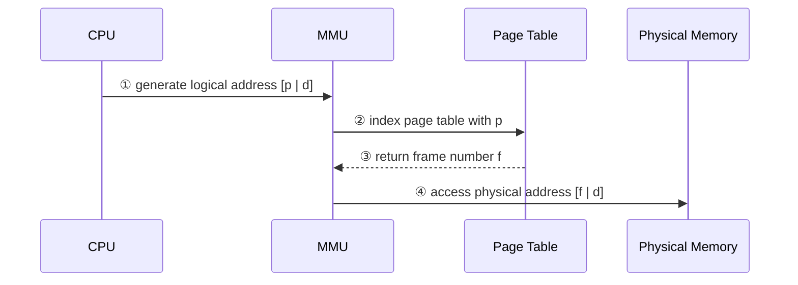
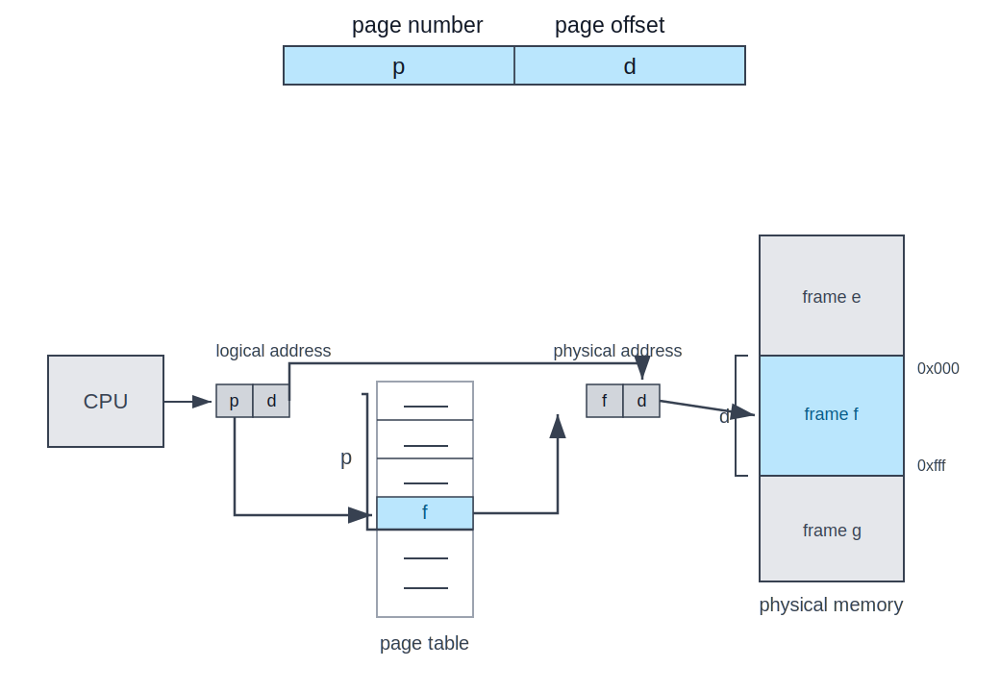
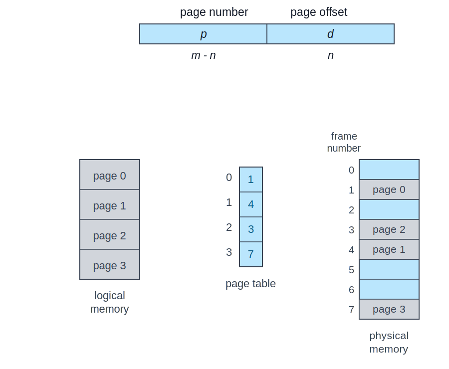
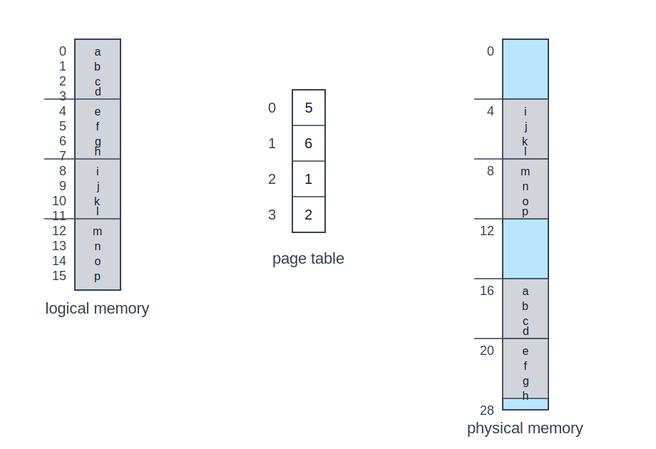
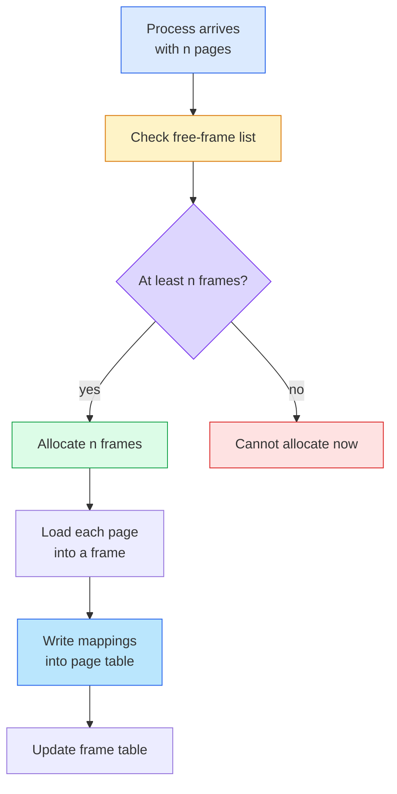
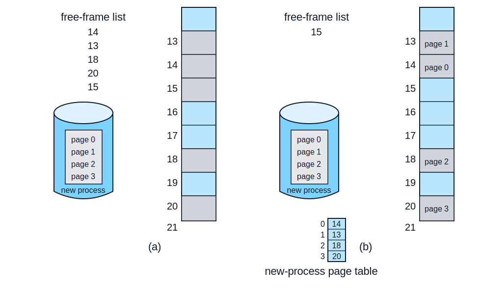
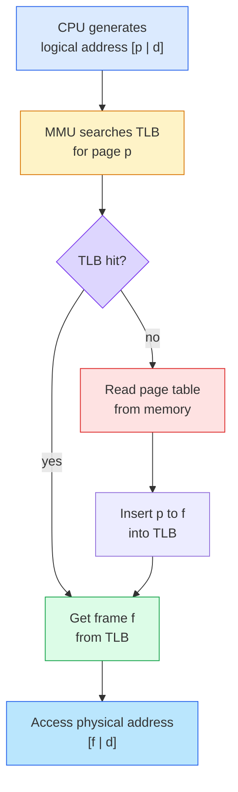
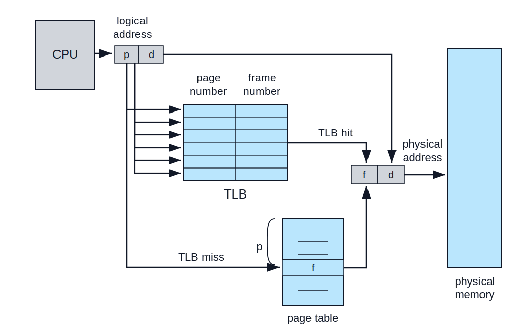
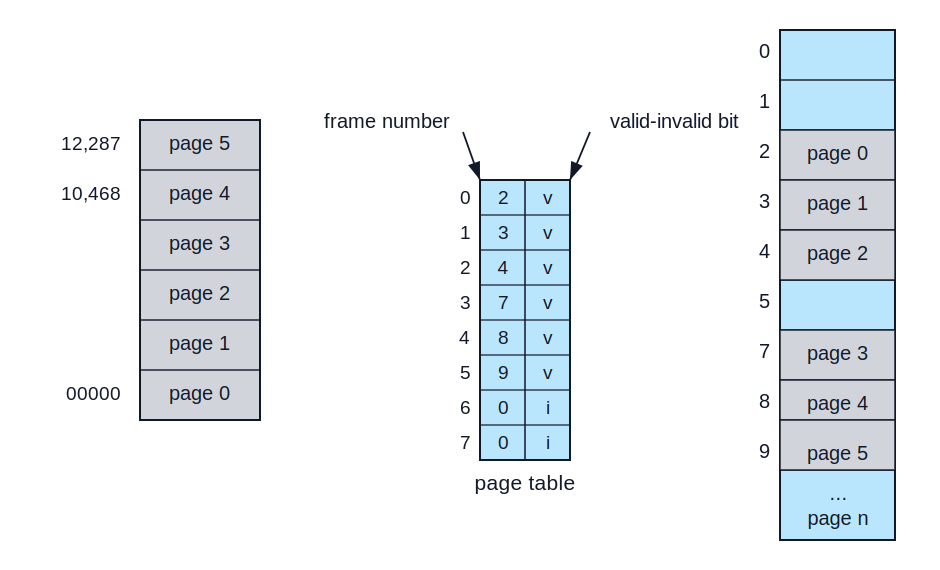
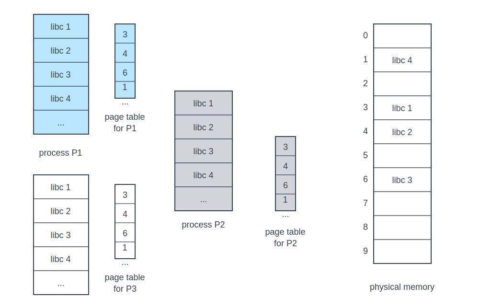

:::note
本系列文章內容參考自經典教材 **Operating System Concepts, 10th Edition (Silberschatz, Galvin, Gagne)**。本文對應章節：**Section 9.3 Paging**。
:::

## **為什麼需要 Paging？**

Section 9.2 的 contiguous allocation 有一個核心限制：**每個 Process 必須占用一段連續的 physical memory**。這個限制讓記憶體配置變得很脆弱。即使總 free memory 足夠，只要它被切成很多不相鄰的 holes，新的 Process 仍然可能放不進去，這就是 external fragmentation。

Compaction 可以把 Process 往同一端搬移，讓所有 holes 聚成一塊，但它需要動態 relocation，而且搬移大量記憶體本身很昂貴。因此另一個方向是直接放棄「Process 必須連續」這個前提：**讓一個 Process 的 logical address space 維持連續，但實際放到 physical memory 時可以分散在不同位置**。

**Paging（分頁）** 就是這個想法。它允許 Process 的 physical address space 不連續，因此 OS 可以把 Process 的不同部分放進任何可用的 physical memory block。這個設計同時避開 external fragmentation，也不再需要靠 compaction 解決碎片問題。

:::info Paging 的核心轉換
Contiguous allocation 問的是：「哪裡有一整段足夠大的連續空間？」

Paging 問的是：「目前有沒有足夠多個固定大小的 free frames？」
:::

<br/>

## **9.3.1 基本方法 (Basic Method)**

Paging 的基本做法是把兩種 address space 切成一樣大小的固定區塊：

| 區塊              | 所在位置        | 說明                                               |
| :---------------- | :-------------- | :------------------------------------------------- |
| **Page（頁面）**  | Logical memory  | Process logical address space 被切出的固定大小區塊 |
| **Frame（頁框）** | Physical memory | Main memory 被切出的固定大小區塊，大小與 page 相同 |

這裡的「固定大小」有兩層意思：

1. **所有 pages 彼此一樣大**。例如系統若使用 4 KB page size，Process 的 logical memory 就會被切成一塊一塊 4 KB 的 pages。
2. **所有 frames 也彼此一樣大，而且每個 frame 的大小必須等於一個 page 的大小**。同樣使用 4 KB page size 時，physical memory 也會被切成一塊一塊 4 KB 的 frames。

因此，不是「所有 frames 加總起來等於一個 page」，而是**一個 page 剛好可以放進一個 frame**。若 Process 需要 4 個 pages，OS 就要找 4 個 free frames；這 4 個 frames 可以分散在 physical memory 的不同位置，不需要連在一起。

當 Process 要執行時，OS 不需要找一段連續 physical memory，只需要找出足夠數量的 free frames。若 Process 有 `n` 個 pages，就需要至少 `n` 個 frames。Process 的 page 0 可以放在 frame 14，page 1 可以放在 frame 13，page 2 可以放在 frame 18，彼此不必相鄰。

這裡有一個重要分離：**程式看到的 logical memory 仍然是連續的，但 physical memory 可以是不連續的**。這個分離由 OS 與硬體共同維持，user process 不需要知道自己的 pages 實際散落在哪些 frames。

:::info 為什麼 Page 與 Frame 必須一樣大？
Page 與 frame 一樣大，MMU 才能把 logical address 的 offset 原封不動搬到 physical address。

例如 page size 是 4 KB，logical address 指向「page 7 裡面的第 100 個 byte」。若 page 7 被放進 frame 20，physical address 就會指向「frame 20 裡面的第 100 個 byte」。這個「第 100 個 byte」就是 offset，它不需要重新計算。

若 page 與 frame 大小不同，同一個 offset 在 page 裡合法，放到 frame 裡可能超出範圍或對不到同一個位置，硬體轉址就會變得複雜。
:::

### **Logical Address 如何被拆成 Page Number 與 Offset？**

在 paging 系統中，CPU 產生的每個 logical address 都被拆成兩個欄位：

| 欄位                | 作用                                                            |
| :------------------ | :-------------------------------------------------------------- |
| **Page Number `p`** | 作為 index 查詢 page table，找出這個 page 對應的 frame number   |
| **Page Offset `d`** | 表示目標資料在該 page 內的位移，也會原封不動成為 frame 內的位移 |

**Page size（頁面大小）** 指的是一個 page 可以容納多少 bytes。因為 page 與 frame 一樣大，所以 page size 也同時決定一個 frame 的大小。若 page size 是 4 KB，意思是每個 page 有 4 KB，每個 frame 也有 4 KB。

Page size 的意義在於：它決定「一個 logical address 裡面，要用多少 bits 表示 page 內的位置」。這些 bits 就是 offset。

若 logical address space 大小是 `2^m`，page size 是 `2^n` bytes，則 logical address 的高位元 `m - n` bits 是 page number，低位元 `n` bits 是 page offset。

```text
logical address = [ page number p | page offset d ]
                     m - n bits       n bits
```

Page size 通常由硬體架構決定，並且會是 2 的冪次方，例如 4 KB、8 KB、2 MB、1 GB。使用 2 的冪次方不是偶然，而是為了讓硬體可以直接用 bit slicing 拆出 page number 與 offset，不需要昂貴的除法運算。

可以先用一個小例子理解 offset。若 page size 是 4 bytes，一個 page 裡只有 4 個 byte 位置：

```text
offset 0, offset 1, offset 2, offset 3
```

要表示 4 種位置，需要 2 bits，因為 2 bits 可以表示 `00`、`01`、`10`、`11`，也就是 0 到 3。這就是為什麼 page size 是 `2^n` bytes 時，offset 需要 `n` bits。

### **Page Table 與位址轉換**

**Page Table（頁表）** 是每個 Process 各自擁有的轉換表。它的每個 entry 記錄某個 logical page 目前位於哪一個 physical frame。CPU 產生 logical address 後，MMU（Memory-Management Unit）會用 page number 查表，將它替換成 frame number；offset 則保持不變。

一次基本 address translation 可以拆成三步：

1. **取出 page number `p`**：MMU 從 logical address 中分離出 page number。
2. **查詢 page table**：MMU 用 `p` 作為 index，取得對應的 frame number `f`。
3. **組成 physical address**：MMU 用 `f` 取代 `p`，並保留原本的 offset `d`，形成 physical address `[f | d]`。



下圖呈現 paging hardware 的基本轉址路徑：page number 用來查 page table，offset 則直接帶到 physical address。



圖中的標記含義如下：

- **p**：logical address 中的 page number，用來索引 page table。
- **d**：page offset，表示目標 byte 在 page 內的位置。
- **f**：page table 回傳的 frame number。
- **frame f**：physical memory 中真正存放該 page 的 frame。

這張圖的核心洞察是：**paging 的 relocation 不是靠單一 base register，而是靠一張 page table**。每個 page 都有自己的 frame mapping，因此同一個 Process 的不同 pages 可以被放在 physical memory 的不同位置。

下圖進一步把 logical memory、page table、physical memory 的關係放在一起看。Logical memory 中連續的 pages，最後被映射到不連續的 physical frames。



圖中的關係可以讀成：

- **Logical page 0** 對應到 **frame 1**。
- **Logical page 1** 對應到 **frame 4**。
- **Logical page 2** 對應到 **frame 3**。
- **Logical page 3** 對應到 **frame 7**。

這張圖說明了 paging 最重要的抽象：**logical memory 可以保持「像是連續的」，但 physical memory 不必真的連續**。程式用 page 0、page 1、page 2 的順序思考；硬體和 OS 則負責把這些 pages 找到實際 frame。

### **一個 32-byte Memory 的具體例子**

前面已經建立 paging 的一般規則：logical address 會被拆成 page number 與 offset，page number 查 page table，offset 保持不變。接下來教材故意使用一個非常小的記憶體設定，讓所有數字都能手算出來。

這個例子不是在描述真實機器的大小，而是一個用來理解轉址的範例。先把前提列清楚：

| 前提                  | 設定     | 這個設定在說什麼                               |
| :-------------------- | :------- | :--------------------------------------------- |
| Addressable unit      | 1 byte   | 每一個 address 指到 1 byte，不是 1 bit         |
| Logical address width | 4 bits   | CPU 產生的 logical address 只有 4 個二進位位元 |
| Page size             | 4 bytes  | 每個 logical page 容納 4 bytes                 |
| Physical memory size  | 32 bytes | 實體記憶體總共有 32 bytes                      |
| Frame size            | 4 bytes  | 每個 physical frame 大小等於 page size         |

這些前提分屬不同層次。`4 bits` 描述的是 **address 本身有多長**；`4 bytes` 描述的是 **一個 page/frame 有多大**；`32 bytes` 描述的是 **physical memory 總容量**。

#### **第一步：4-bit Logical Address 代表多少可用位址？**

「Logical address 是 4 bits」的意思是：CPU 產生的每個 logical address 都是一個 4-bit 的二進位數字。

4 bits 可以表示 `2^4 = 16` 個不同數字：

```text
0000, 0001, 0010, ..., 1111
```

換成 decimal，就是 address `0` 到 address `15`。因為這個例子假設 memory 是 **byte-addressable**，每個 address 指向 1 byte，所以 16 個 addresses 就能命名 16 個 byte 位置：

```text
address 0  -> 第 0 個 byte
address 1  -> 第 1 個 byte
...
address 15 -> 第 15 個 byte
```

因此，「logical address space 有 `2^4 = 16` bytes」的意思不是 address 本身有 16 bytes，也不是 memory 只有 16 個 bits，而是：**4-bit address 一共能命名 16 個 byte 位置**。

#### **第二步：Page Size = 4 bytes 會把 Logical Memory 切成幾個 Pages？**

Page size 是 4 bytes，代表每個 page 裡有 4 個 byte 位置。Logical address space 總共有 16 bytes，所以會被切成 4 個 pages：

```text
page 0: address 0  - 3
page 1: address 4  - 7
page 2: address 8  - 11
page 3: address 12 - 15
```

在每一個 page 內部，只需要表示 4 個可能位置：

```text
offset 0, offset 1, offset 2, offset 3
```

要表示 4 種 offset，需要 2 bits，因為 2 bits 可以表示 `00`、`01`、`10`、`11`。這 2 bits 會放在 logical address 的低位元。

Logical address 總共只有 4 bits，扣掉 offset 的 2 bits 後，剩下 2 bits 就是 page number，用來表示 page 0 到 page 3。

```text
4-bit logical address = [ page number: 2 bits | offset: 2 bits ]
```

#### **第三步：Physical Memory = 32 bytes 會切成幾個 Frames？**

Physical memory 有 32 bytes。因為 frame size 必須等於 page size，所以每個 frame 也是 4 bytes。於是 physical memory 會被切成 8 個 frames：

```text
32 bytes / 4 bytes per frame = 8 frames
```

因此 logical side 與 physical side 的大小不是一樣的：logical address space 只有 16 bytes，physical memory 有 32 bytes。但它們的切割單位一樣，都是 4 bytes。

#### **第四步：Page Table 負責把 Page 對到 Frame**

這個例子中的 page table 記錄：

```text
page 0 -> frame 5
page 1 -> frame 6
page 2 -> frame 1
page 3 -> frame 2
```

所以程式眼中的 logical memory 是 page 0、page 1、page 2、page 3 連續排列；但在 physical memory 中，這些 pages 實際分散在 frame 5、frame 6、frame 1、frame 2。

把所有數字整理起來：

| 項目                  | 數值     | 意義                                        |
| :-------------------- | :------- | :------------------------------------------ |
| Logical address width | 4 bits   | 每個 logical address 用 4 個 0/1 表示       |
| Logical address space | 16 bytes | 4-bit address 可命名 16 個 byte 位置        |
| Page size             | 4 bytes  | 每個 page 容納 4 個 byte 位置               |
| Offset width          | 2 bits   | 2 bits 可表示 page 內的 4 個 byte 位置      |
| Page number width     | 2 bits   | 2 bits 可表示 4 個 logical pages            |
| Physical memory size  | 32 bytes | Physical memory 總容量                      |
| Frame size            | 4 bytes  | 每個 frame 大小等於 page size               |
| Number of frames      | 8 frames | 32 bytes physical memory 可切成 8 個 frames |

下圖中，logical memory 的 4 個 pages 被映射到 physical memory 的 frames 5、6、1、2：



這個例子可以手算幾個 logical address：

| Logical address | 拆成 page/offset | Page table 查到  | Physical address |
| :-------------- | :--------------- | :--------------- | :--------------- |
| `0`             | page 0, offset 0 | page 0 → frame 5 | `5 × 4 + 0 = 20` |
| `3`             | page 0, offset 3 | page 0 → frame 5 | `5 × 4 + 3 = 23` |
| `4`             | page 1, offset 0 | page 1 → frame 6 | `6 × 4 + 0 = 24` |
| `13`            | page 3, offset 1 | page 3 → frame 2 | `2 × 4 + 1 = 9`  |

這張圖的核心洞察是：**logical address 的數值順序不等於 physical address 的數值順序**。Logical address `0` 到 `15` 看起來連續，但真正存放的 physical addresses 分散在 `20-27` 與 `4-11`。

:::info Paging 也是一種 Dynamic Relocation
Paging 可以視為更細緻的 dynamic relocation。Section 9.2 的 relocation register 是「整個 Process 一個 base」；paging 則像是「每個 page 各自有一個 base」，這些 base 就是 page table 中記錄的 frame number。

因此，paging 比 contiguous allocation 更有彈性：Process 不再被綁定到一整段連續 physical memory。
:::

### **Paging 的 Fragmentation 問題**

Paging 消除了 external fragmentation，因為任何 free frame 都可以被分配給任何需要 memory 的 Process。只要 free frames 的數量足夠，Process 的 pages 就能放進去，不需要一段連續 hole。

但 paging 仍然可能有 **Internal Fragmentation（內部碎片）**，原因是 frame 是固定分配單位。若 Process 的大小不是 page size 的整數倍，最後一個 frame 可能只用了一部分。

例如 page size 是 `2,048 bytes`，Process 大小是 `72,766 bytes`：

```text
72,766 = 35 × 2,048 + 1,086
```

這個 Process 需要 35 個完整 pages，再加上一個只使用 1,086 bytes 的 page，因此 OS 必須分配 36 個 frames。最後一個 frame 會浪費：

```text
2,048 - 1,086 = 962 bytes
```

若 Process 大小與 page size 沒有特定關係，平均而言，每個 Process 的 internal fragmentation 約為半個 page。這也引出 page size 的取捨：

| Page size 較小              | Page size 較大                    |
| :-------------------------- | :-------------------------------- |
| Internal fragmentation 較少 | Page table entries 較少           |
| Page table 需要更多 entries | Disk I/O 搬移較大區塊時較有效率   |
| 管理成本較高                | 每個 Process 最後一頁可能浪費較多 |

:::info 在 Linux 上查 page size
教材側欄提到，Linux 的 page size 會依 architecture 而不同。常見查法有兩種：

```bash
getconf PAGESIZE
```

或在程式中呼叫 `getpagesize()` system call。兩者都會回傳 page size 的 bytes 數。
:::

### **Page Table Entry 大小與可定址範圍**

Page table entry（PTE）不只需要記錄 frame number，也常常需要記錄保護位元、valid-invalid bit、dirty bit、reference bit 等資訊。因此，PTE 的位元數不一定都能拿來表示 frame number。

教材提到一個常見情境：在 32-bit CPU 上，一個 page-table entry 常是 4 bytes。若所有 32 bits 都能拿來指向 physical page frame，而且 frame size 是 4 KB，也就是 `2^12` bytes，那理論上可以定址：

```text
2^32 frames × 2^12 bytes/frame = 2^44 bytes = 16 TB
```

但實際系統通常還要在 PTE 中放其他控制資訊，所以可定址 physical memory 可能小於這個理論上限。

### **Process 到達時，OS 如何分配 Frames？**

當一個 Process 抵達並準備執行時，OS 會先看它需要多少 pages。假設它需要 4 個 pages，OS 就必須從 free-frame list 中取出 4 個 frames，將每個 page 載入其中，並把 mapping 寫入該 Process 的 page table。

這個流程可以拆成：

1. **計算 pages 數量**：OS 根據 Process 大小與 page size，算出需要幾個 pages。
2. **檢查 free frames**：若 free-frame list 中至少有同樣數量的 frames，配置才可進行。
3. **載入 pages**：OS 把 Process 的每個 page 從檔案系統或 backing store 載入某個 free frame。
4. **更新 page table**：每載入一個 page，就把 page number 到 frame number 的 mapping 寫進該 Process 的 page table。
5. **更新 frame table**：OS 記錄哪些 physical frames 已被占用，以及它們屬於哪個 Process 的哪個 page。



下圖呈現 free frames 分配前後的變化。左側是分配前，free-frame list 中有 `14, 13, 18, 20, 15`；右側是新 Process 的四個 pages 被載入 frames `14, 13, 18, 20` 後，只剩 frame `15` 還在 free-frame list。



圖中的重點如下：

- **Before allocation**：Process 還在 backing store 或檔案系統中，physical memory 中有多個不連續 free frames。
- **After allocation**：page 0、page 1、page 2、page 3 分別被放進 frames 14、13、18、20。
- **New-process page table**：記錄 logical page 到 physical frame 的 mapping。

這張圖的核心洞察是：**OS 分配的是 frames，不是連續 partition**。這就是 paging 能避開 external fragmentation 的原因。

### **OS 還需要保存哪些資料？**

Paging 把轉址藏在硬體裡，但 OS 仍然必須知道整個 physical memory 的配置狀態。通常 OS 會維護一個 system-wide 的 **Frame Table（頁框表）**，每個 physical frame 對應一個 entry，記錄它目前是 free 還是 allocated；若已被配置，還要記錄屬於哪個 Process 的哪個 page。

此外，OS 也需要為每個 Process 保存 page table 的副本。原因有兩個：

| 原因                             | 說明                                                                                                          |
| :------------------------------- | :------------------------------------------------------------------------------------------------------------ |
| **Context switch**               | Dispatcher 切換到某個 Process 時，必須讓硬體使用該 Process 的 page table                                      |
| **Kernel 需要解讀 user address** | 若 user process 透過 system call 傳入 buffer address，OS 必須把這個 logical address 轉成正確 physical address |

因此，paging 會增加 context-switch time。切換 Process 時不只要保存與載入 registers，還要切換 page-table 相關硬體狀態。

<br/>

## **9.3.2 硬體支援 (Hardware Support)**

Page table 是 per-process data structure，所以每個 Process 的 PCB（Process Control Block）中會保存 page table 相關資訊。當 CPU scheduler 選出下一個 Process 時，dispatcher 必須載入該 Process 的 registers，也必須讓硬體知道應該使用哪一張 page table。

Page table 的硬體實作有兩種基本方向：

| 實作方式                             | 優點                                      | 缺點                                                         |
| :----------------------------------- | :---------------------------------------- | :----------------------------------------------------------- |
| **Dedicated registers**              | 查表非常快                                | Page table 大時不可行；context switch 必須更換大量 registers |
| **Page table in main memory + PTBR** | Context switch 只需更換一個 base register | 每次 memory access 可能多一次 page-table memory access       |

現代系統通常把 page table 放在 main memory，並用 **Page-Table Base Register（PTBR）** 指向目前 Process 的 page table 起始位置。Context switch 時只要更換 PTBR，就能切換到另一張 page table。

### **為什麼需要 TLB？**

把 page table 放在 main memory 會帶來一個直接問題：每次程式要存取某個 address，硬體可能必須先讀 page table，再讀真正的資料。

假設要存取 logical address `i`：

1. MMU 用 `i` 的 page number 加上 PTBR，找到 page-table entry 的位置。
2. MMU 讀取 page-table entry，取得 frame number。
3. MMU 組出 physical address。
4. CPU 再讀取真正的 memory data。

如果沒有額外最佳化，一次 memory reference 會變成兩次 memory access：一次查 page table，一次存取資料。這等於把 memory access time 近似放大兩倍，通常無法接受。

標準解法是使用 **Translation Look-Aside Buffer（TLB，轉址旁路緩衝區）**。TLB 是一個小而快的 associative hardware cache，專門快取最近使用過的 page-table entries。每個 TLB entry 通常包含 page number 作為 key，以及 frame number 作為 value。

### **TLB Hit 與 TLB Miss**

當 CPU 產生 logical address 時，MMU 會先查 TLB，而不是直接查 main-memory 中的 page table。

1. **TLB hit**：若 page number 已在 TLB 中，MMU 立刻取得 frame number，直接組成 physical address。
2. **TLB miss**：若 page number 不在 TLB 中，MMU 必須查 main-memory 中的 page table，取得 frame number 後，再把這筆 mapping 加入 TLB。
3. **TLB replacement**：若 TLB 已滿，硬體或 OS 必須選一個舊 entry 替換掉，常見策略包含 LRU、round-robin、random。



下圖呈現加入 TLB 後的 paging hardware。TLB hit 時，page table 不需要被存取；TLB miss 時，才回到 page table 查 frame number。



圖中的兩條路徑代表：

- **TLB hit**：page number `p` 在 TLB 中找到，直接得到 frame number `f`，組出 physical address。
- **TLB miss**：TLB 找不到 `p`，MMU 改查 page table，取得 `f` 後再存取 physical memory。
- **physical address `[f | d]`**：不論 hit 或 miss，最後 offset `d` 都不變。

這張圖的核心洞察是：**TLB 不是另一種 memory mapping 規則，而是 page table 的硬體快取**。正確性仍然由 page table 定義，TLB 只是把常用 mapping 放到更快的位置。

:::info TLB 的大小為什麼通常不大？
TLB 要在 CPU pipeline 中非常快速地查詢，常以 associative memory 同時比較多個 keys。這種硬體昂貴且耗電，因此 TLB 通常比一般 cache 小很多，教材提到典型大小約為 32 到 1,024 entries。

現代 CPU 可能有分開的 instruction TLB 與 data TLB，也可能有多層 TLB，概念上類似多層 cache。
:::

### **ASID、TLB Flush 與 Wired Entries**

TLB 的內容和 Process 有關。若 Process A 的 page 0 對應 frame 5，Process B 的 page 0 可能對應 frame 19。若 context switch 後仍使用舊 TLB entry，就可能讓 B 錯誤地存取 A 的 frame。

解決方式有兩種：

| 機制                                 | 說明                                                                                   |
| :----------------------------------- | :------------------------------------------------------------------------------------- |
| **TLB flush**                        | 若硬體不支援 process-aware TLB，每次切換 page table 時必須清空 TLB，避免沿用舊 mapping |
| **ASID（Address-Space Identifier）** | 在 TLB entry 中加入 Process 身分；查詢時必須同時匹配 page number 與 ASID               |

ASID 的好處是 TLB 可以同時保存多個 Process 的 entries。Context switch 後，只要目前 Process 的 ASID 不同，舊 entries 就不會被錯用，也不必每次都清空整個 TLB。

某些 TLB 還允許 **wired down entries**，也就是固定在 TLB 中、不能被替換掉的 entries。這通常用於重要 kernel code，避免頻繁 TLB miss 影響核心路徑。

### **Hit Ratio 與 Effective Memory-Access Time**

**Hit Ratio（命中率）** 是某個 page number 能在 TLB 中找到的比例。它直接決定 paging 的平均成本。

假設 memory access time 是 10 ns，且 TLB 查詢成本可以忽略：

| 情況     | 成本                               |
| :------- | :--------------------------------- |
| TLB hit  | 直接存取 memory，10 ns             |
| TLB miss | 先查 page table，再存取資料，20 ns |

若 hit ratio 是 80%，effective access time 是：

```text
0.80 × 10 + 0.20 × 20 = 12 ns
```

這代表 paging 讓平均 memory access time 從 10 ns 增加到 12 ns，慢了 20%。若 hit ratio 提升到 99%：

```text
0.99 × 10 + 0.01 × 20 = 10.1 ns
```

平均成本只增加 1%。這就是 TLB 對 paging 系統如此關鍵的原因：**paging 的抽象很強，但若 TLB hit ratio 不夠高，轉址成本會直接反映在每一次 memory reference 上**。

:::info 現代 CPU 的 TLB 成本更複雜
教材提到 Intel Core i7 類型的 CPU 可能有 L1 instruction TLB、L1 data TLB，以及 L2 TLB。若 L1 miss，硬體可能再查 L2；若 L2 也 miss，CPU 可能要走訪 memory 中的 page-table entries，這可能花費數百個 cycles，或進入 OS 讓 kernel 協助處理。

<br/>

因此 OS 的 paging 設計必須理解目標平台的 TLB 行為。硬體 TLB 的設計改變，也可能迫使 OS 調整 paging implementation。
:::

<br/>

## **9.3.3 保護 (Protection)**

Paging 的保護機制通常放在 page table entries 中。因為每次 memory reference 都必須經過 page table 或 TLB，所以硬體可以在轉址同時檢查權限。

最基本的 protection bit 可以標記某個 page 是 **read-write** 或 **read-only**。若 user process 嘗試寫入 read-only page，硬體會觸發 trap，交給 OS 處理 memory-protection violation。更細緻的系統也可以支援 read-only、read-write、execute-only，或用多個 bits 表示任意組合。

:::info Protection Bits 的位置
Protection bits 通常是 page-table entry 的一部分。TLB 快取 page-table entry 時，也會快取相關權限資訊，否則 TLB hit 時就無法直接完成保護檢查。
:::

### **Valid-Invalid Bit**

除了讀寫執行權限，page table entry 通常還有一個 **Valid-Invalid Bit（有效-無效位元）**：

| Bit 狀態    | 意義                                                                 |
| :---------- | :------------------------------------------------------------------- |
| **valid**   | 該 page 屬於 Process 的 logical address space，是合法 page           |
| **invalid** | 該 page 不屬於 Process 的 logical address space，存取時應 trap 到 OS |

下圖中的 Process 只合法使用 address `0` 到 `10,468`。Page size 是 2 KB，因此 page 0 到 page 5 被標為 valid；page 6 與 page 7 被標為 invalid。



圖中的標記含義如下：

- **Page 0 到 page 5**：page-table entries 標記為 `v`，代表這些 pages 可被合法轉址。
- **Page 6 與 page 7**：page-table entries 標記為 `i`，若 Process 產生這些 pages 的 address，硬體會 trap 到 OS。
- **10,468**：程式實際使用範圍的最後界線。
- **12,287**：page 5 的結尾位址，因為 page 5 被整頁標為 valid。

這張圖揭示一個細節：**valid-invalid bit 的粒度是 page，不是 byte**。程式實際只到 address `10,468`，但 page 5 被標為 valid 後，`10,469` 到 `12,287` 之間的位址也會被硬體視為 valid。這段多出來的合法但未使用空間，就是 paging 的 internal fragmentation。

### **Page-Table Length Register (PTLR)**

許多 Process 只使用整個 logical address range 的一小部分。如果為整個 address range 的每個 page 都建立 page-table entry，會浪費大量 memory。

有些系統使用 **Page-Table Length Register（PTLR）** 記錄 page table 的大小。每次產生 logical address 時，硬體會檢查 page number 是否落在 page table length 之內；若超出，直接 trap 到 OS。PTLR 的目的不是替代 valid-invalid bit，而是避免 Process 的 page table 被迫涵蓋完整 logical address range。

<br/>

## **9.3.4 共享頁面 (Shared Pages)**

Paging 還有一個重要好處：它讓多個 Process 可以共享同一份 physical pages。這對常用 library 特別重要。

以 standard C library `libc` 為例，Linux 上多數 user processes 都需要它。若 40 個 Processes 各自載入一份 2 MB 的 `libc`，總共需要：

```text
40 × 2 MB = 80 MB
```

但如果 `libc` 的 code 是 **Reentrant Code（可重入程式碼）**，OS 就可以只在 physical memory 中保留一份，並讓每個 Process 的 page table 都指向同一組 physical frames。此時總共只需要 2 MB。

:::info Reentrant Code 是什麼？
Reentrant code 是不會在執行中修改自己的 code，也不依賴共享 mutable code state 的程式碼。多個 Processes 可以同時執行同一份 reentrant code，因為每個 Process 都有自己的 registers、stack、heap、data storage；共享的只有不會被改寫的 code pages。

因此，共享 code 必須是 read-only。OS 不應只相信程式「不會修改自己」，而應透過 page-table protection bits 強制共享 pages 為 read-only。
:::

下圖呈現三個 Processes 共享 `libc` pages 的情況。每個 Process 的 logical address space 中都有 `libc 1` 到 `libc 4`，但 page table 都指向 physical memory 中同一份 frames 3、4、6、1。



圖中的關係可以讀成：

- **Process P1、P2、P3**：各自有自己的 logical pages 與 page table。
- **Page tables**：三張 page tables 都把 `libc 1`、`libc 2`、`libc 3`、`libc 4` 映射到相同 physical frames。
- **Physical memory**：只保存一份 `libc` code pages。

這張圖的核心洞察是：**共享不是把 Process 的整個 address space 合併，而是讓不同 page tables 的某些 entries 指向相同 frames**。因此，每個 Process 仍然保有自己的 private data，但共同使用同一份 read-only code。

Shared libraries 通常就是用 shared pages 實作。更廣義地說，Chapter 3 提過的 shared memory IPC，也可以透過讓不同 Processes 的 page tables 指向相同 physical frames 來完成。

<br/>

## **本節重點整理**

| 主題                       | 核心結論                                                                                   |
| :------------------------- | :----------------------------------------------------------------------------------------- |
| **Paging 的目的**          | 讓 Process 的 physical address space 可以不連續，避免 external fragmentation 與 compaction |
| **Page / Frame**           | Logical memory 切成 pages，physical memory 切成同大小 frames                               |
| **Address Translation**    | Logical address `[p                                                                        | d]` 透過 page table 轉成 physical address `[f | d]` |
| **Page Table**             | 每個 Process 一張，記錄 page number 到 frame number 的 mapping                             |
| **Internal Fragmentation** | 最後一個 frame 可能未填滿，平均約浪費半個 page                                             |
| **PTBR**                   | 指向目前 Process 的 page table，context switch 時需要更新                                  |
| **TLB**                    | Page table 的高速硬體快取，用 hit ratio 壓低 paging 的轉址成本                             |
| **Valid-Invalid Bit**      | 判斷 page 是否屬於 Process 的 logical address space                                        |
| **Shared Pages**           | 多個 page tables 可以指向同一組 read-only frames，節省 common code 的 memory               |

Paging 的本質可以用一句話總結：**OS 把 memory 分配從「連續區間問題」改成「固定大小 frame 的集合問題」，硬體則用 page table 和 TLB 把這個分散配置隱藏在 address translation 後面**。
