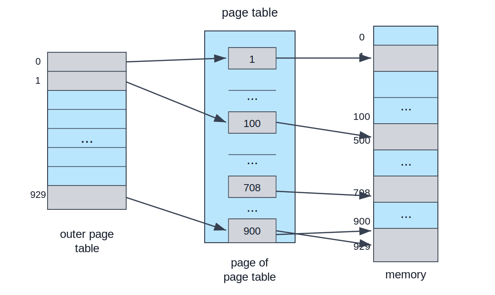
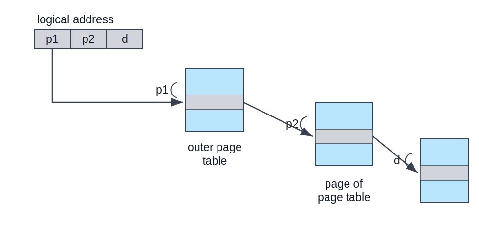
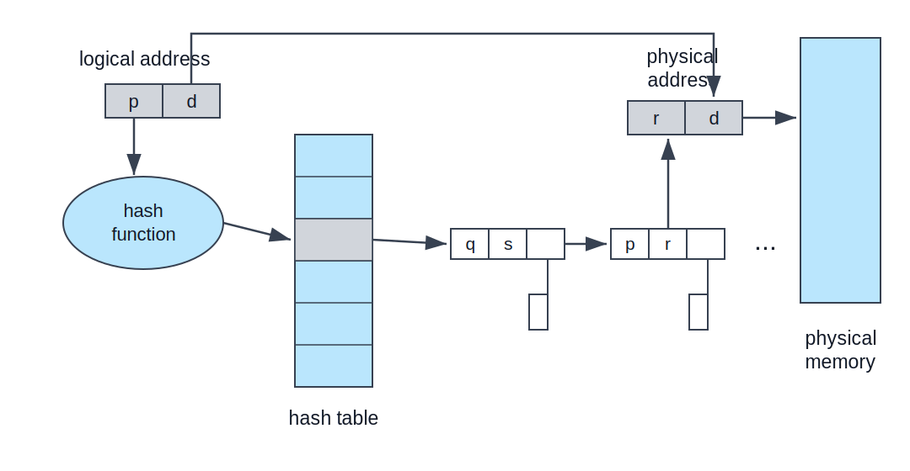
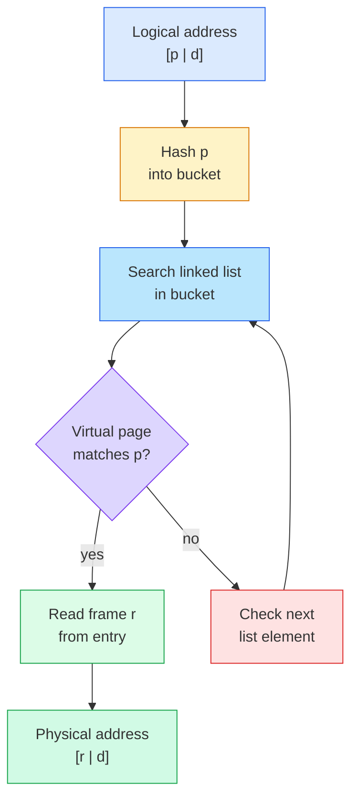
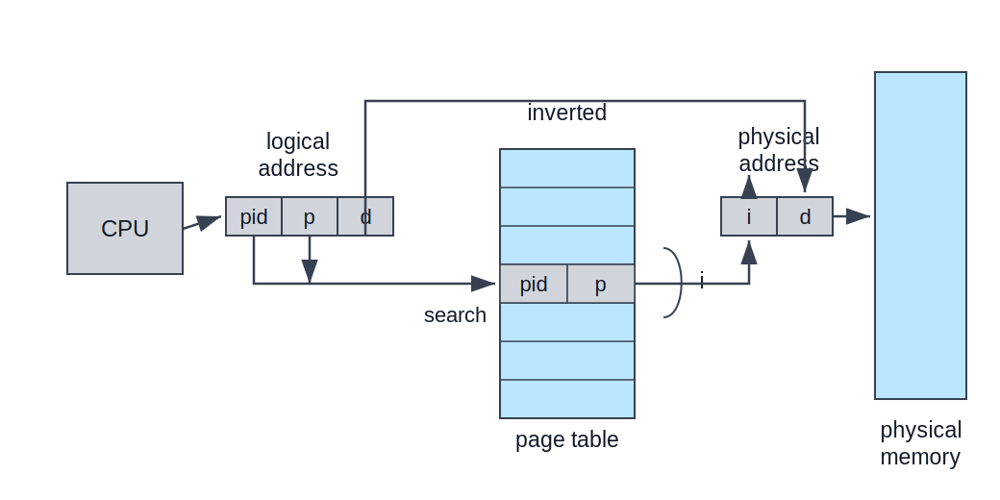
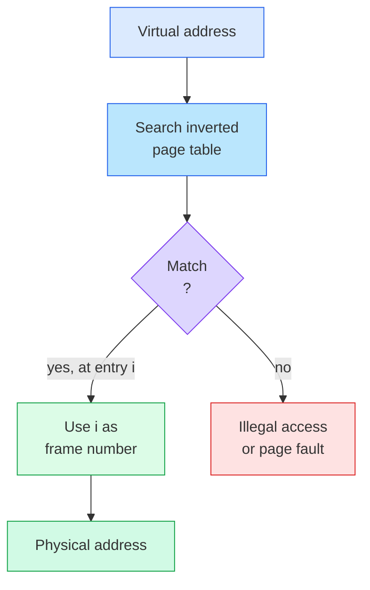
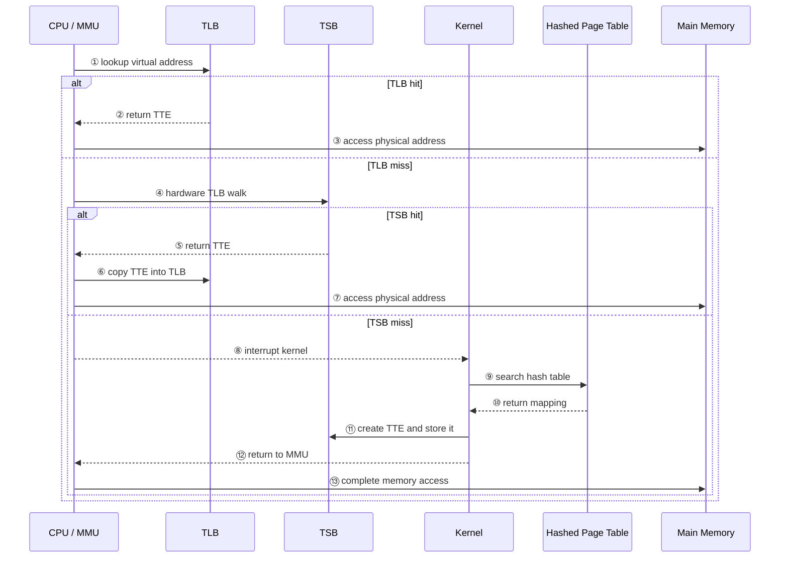

:::note
本系列文章內容參考自經典教材 **Operating System Concepts, 10th Edition (Silberschatz, Galvin, Gagne)**。本文對應章節：**Section 9.4 Structure of the Page Table**。
:::

## **為什麼 Page Table 也需要設計結構？**

Section 9.3 已經建立 paging 的基本模型：每個 Process 有一張**頁表 (Page Table)**，CPU 產生的 logical address 會被拆成 page number 與 offset，MMU 再用 page number 查頁表，找出對應的 physical frame。

這個模型在概念上很乾淨，但遇到大型 logical address space 時，會立刻碰到一個很現實的問題：**page table 本身也要佔用記憶體**。

以 32-bit logical address space 與 4 KB page size 為例：

```text
logical address space = 2^32 bytes
page size             = 2^12 bytes
number of pages       = 2^32 / 2^12 = 2^20 pages
```

若每個 page-table entry（PTE）是 4 bytes，單一 Process 的 page table 最多需要：

```text
2^20 entries x 4 bytes = 2^22 bytes = 4 MB
```

這個算式的意思不是「Process 的程式碼或資料有 4 MB」，而是：**OS 為了描述這個 Process 的 logical pages 要放在哪些 physical frames，最多需要另外準備 4 MB 的 page table metadata**。

可以把 page table 想成一張表：

| Page number | Page-table entry 內容 |
| :-- | :-- |
| page 0 | page 0 目前在哪個 frame、權限 bits、valid bit 等資訊 |
| page 1 | page 1 目前在哪個 frame、權限 bits、valid bit 等資訊 |
| ... | ... |
| page `2^20 - 1` | 最後一個可能 page 的 mapping 資訊 |

`2^20 entries` 代表這張表最多有 `2^20` 列，因為 32-bit address space 搭配 4 KB pages 時，整個 logical address space 會被切成 `2^20` 個 pages。`4 bytes` 代表每一列 PTE 需要 4 bytes 儲存 frame number 與控制資訊。因此整張表需要 `2^20 x 4 bytes = 4 MB`。

4 MB 看起來不算大，但這只是**一個 Process 的頁表上限**。系統同時有數十或數百個 Processes 時，光是保存 page tables 就可能消耗大量 physical memory。更重要的是，OS 不希望 page table 必須像 contiguous allocation 那樣被放在一段連續 physical memory 中，否則 paging 原本想解決的「連續配置困難」又會回到 page table 本身。

因此 Section 9.4 的核心問題是：

:::info
Paging 把 Process 的 address space 切成 pages，讓 Process 不必連續放在 physical memory。

但 page table 也可能很大，所以 page table 本身也需要被拆開、索引、快取，或換一種方向表示。
:::

教材介紹三類常見設計：

| 結構                    | 核心想法                                                  | 主要解決的問題                             |
| :---------------------- | :-------------------------------------------------------- | :----------------------------------------- |
| **Hierarchical Paging** | 把 page table 再切成 pages，用多層 page table 查詢        | 避免配置一整張連續的大 page table          |
| **Hashed Page Table**   | 用 virtual page number 做 hash，只保存實際需要的 mappings | 適合 64-bit 以上的大型、稀疏 address space |
| **Inverted Page Table** | 整個系統只用一張表，每個 physical frame 一個 entry        | 降低 page table 的總記憶體用量             |

這三種設計不是在改變 paging 的基本語意。最後仍然要把 logical page 轉成 physical frame；差別在於「如何有效保存與找到這個 mapping」。

<br/>

## **9.4.1 階層式分頁 (Hierarchical Paging)**

### **問題：單層 Page Table 太大**

單層 page table 的直覺做法是：page number 直接當成陣列 index，第 `p` 個 PTE 就記錄 page `p` 對應的 frame。這讓查詢很快，但代價是 page table 必須能涵蓋整個 logical address space。

對 32-bit 系統來說，4 MB 的 page table 已經不小；對 64-bit 系統來說，問題會變得非常誇張。若 page size 仍是 4 KB，single-level page table 需要：

```text
2^64 / 2^12 = 2^52 entries
```

這不可能為每個 Process 實際配置。因此，第一個自然想法是：**既然 Process memory 可以 paging，page table 本身也可以 paging**。

### **Two-Level Paging 的基本想法**

**階層式分頁 (Hierarchical Paging)** 會把原本單一 page table 切成很多小頁表頁面，再用一張外層頁表指向這些內層頁表。最常見的入門形式是 **two-level paging**：

1. **Outer page table**：第一層表，entry 指向某一頁 inner page table。
2. **Page of page table**：第二層表，真正保存 logical page 到 physical frame 的 mapping。
3. **Physical memory**：inner page table 查到 frame 後，offset 決定 frame 內的 byte 位置。

下圖呈現 two-level page-table scheme 的概念。左邊不是直接指向 physical memory，而是先指向「某一頁 page table」；中間那頁 page table 才指向 physical frames。



圖中的標記可以這樣讀：

- **outer page table**：每個 entry 指向一頁 inner page table。
- **page of page table**：它本身是一頁 memory，但內容是 page-table entries。
- **memory**：最後真正保存 process data 或 code 的 physical frames。
- 圖中的數字如 `1`、`100`、`708`、`900`、`929`：代表某個 entry 內保存的 frame number 或下一層表的位置。

這張圖的核心洞察是：**page table 被拆成多個 page table pages，因此 OS 不需要一次配置一整張連續的大表**。如果某段 logical address range 沒有被使用，對應的 inner page table 甚至可以完全不配置。

### **32-bit 位址如何拆成 `p1`、`p2`、`d`？**

以 32-bit logical address 與 4 KB page size 為例。4 KB 等於 `2^12` bytes，所以 offset 需要 12 bits。剩下的 20 bits 是 page number。

在 two-level paging 中，這 20 bits 的 page number 再拆成兩段：

```text
logical address = [ p1 | p2 | d ]
                    10   10   12 bits
```

其中：

| 欄位 | 作用                                                             |
| :--- | :--------------------------------------------------------------- |
| `p1` | index into the outer page table，找出哪一頁 inner page table     |
| `p2` | offset within the page of page table，找出該頁表頁面中的哪個 PTE |
| `d`  | page offset，最後保留為 physical frame 內的位移                  |

為什麼 `p2` 剛好是 10 bits？因為一頁 page table 的大小是 4 KB，而每個 PTE 是 4 bytes：

```text
4 KB / 4 bytes = 4096 / 4 = 1024 = 2^10 entries
```

這裡的「10 bits」可以拆開理解：

1. 一頁 inner page table 的大小是 4 KB，也就是 4096 bytes。
2. 每個 PTE 佔 4 bytes，所以這一頁 inner page table 可以放 `4096 / 4 = 1024` 個 PTE。
3. `1024 = 2^10`，代表要從 1024 個 entries 中選出其中一個，需要 10 個 binary bits。

因此，`p2` 不是 offset 到某個 byte，而是**在 inner page table 這一頁裡選第幾個 PTE 的 index**。10 bits 可以表示 `0` 到 `1023`，剛好對應這一頁 page table 中的 1024 個 entries。

`p1` 也是 10 bits，理由是 32-bit address 中扣掉 12-bit offset 後，只剩 20-bit page number。既然 `p2` 需要 10 bits 來選 inner page table 內的 PTE，剩下的 10 bits 就作為 `p1`，用來選 outer page table 中的 entry。

下圖呈現 two-level 32-bit paging 的 address translation。位址轉換從外層一路往內走，因此這種設計也稱為 **forward-mapped page table**。



圖中的三段 lookup 含義如下：

- **`p1`**：選出 outer page table 的某個 entry，該 entry 指向一頁 inner page table。
- **`p2`**：在那一頁 inner page table 中選出某個 PTE，取得目標 frame number。
- **`d`**：不參與查表，最後直接成為 physical address 的 offset。

這張圖的核心洞察是：**多層 page table 把一次「大陣列查表」拆成多次「小表查表」**。它降低了 page table 的連續配置壓力，但每增加一層，就可能讓 TLB miss 時多一次 memory access。

:::info Hierarchical Paging 與 TLB 的關係
多層 page table 的成本主要出現在 **TLB miss**。這裡先補一個直覺定義：

| 情況 | 意思 | 結果 |
| :-- | :-- | :-- |
| **TLB hit** | TLB 中已經有這個 page number 對應的 frame number | MMU 直接形成 physical address，不需要走訪 page table |
| **TLB miss** | TLB 中沒有這個 page number 的 mapping | MMU 必須回到 page table 結構查詢，找到 mapping 後通常會放回 TLB |

若 TLB hit，MMU 已經直接拿到 frame number，不需要走訪多層 page table。若 TLB miss，硬體或 OS 才需要從 outer page table 一層一層查到真正的 PTE。因此，多層設計通常必須搭配高 TLB hit ratio，否則每次 memory reference 的平均成本會太高。
:::

### **為什麼 64-bit 系統不適合一直加層？**

Two-level paging 對 32-bit address space 很合理，但直接套到 64-bit address space 會失控。

假設仍然是 4 KB page size 與 4-byte PTE：

```text
64-bit logical address = [ 52-bit page number | 12-bit offset ]
```

如果讓 inner page table 一頁大小，仍然只能放 `2^10` 個 PTE，所以 two-level 設計會變成：

```text
[ outer page p1 | inner page p2 | offset d ]
       42              10             12 bits
```

這裡的 `p2 = 10 bits` 和 32-bit 例子是同一個理由：inner page table 仍然是一頁 4 KB，而每個 PTE 仍然是 4 bytes，所以一頁 inner page table 仍然只能放 `2^10` 個 PTE。只要 page size 與 PTE size 不變，**用來選 inner page table 內第幾個 PTE 的欄位就仍然需要 10 bits**。

差別在於 64-bit address 的 page number 太長。4 KB pages 會留下 12-bit offset，因此 page number 總共有 `64 - 12 = 52 bits`。其中 10 bits 給 `p2` 使用後，剩下 `52 - 10 = 42 bits` 就都變成外層 page table 的 index `p1`。

外層 page table 需要 `2^42` entries。每個 entry 4 bytes，所以外層表大小是：

```text
2^42 x 4 bytes = 2^44 bytes = 16 TB
```

這比許多機器的 physical memory 還大。若再把外層表也 paging，形成 three-level paging，位址可能拆成：

```text
[ second outer p1 | outer p2 | inner p3 | offset d ]
        32             10         10          12 bits
```

此時最高層仍然需要 `2^32` entries，也就是 `2^34 bytes = 16 GB`。若繼續加到四層、五層、更多層，page table 的空間壓力會下降，但 TLB miss 時的查表次數會上升。教材指出，64-bit UltraSPARC 若用這種方向可能需要七層 paging，這會造成過多 memory accesses。

因此，對非常大的 address space，hierarchical paging 的思路會遇到兩個相反壓力：

| 目標                         | 代價           |
| :--------------------------- | :------------- |
| 減少每一層 page table 的大小 | 需要更多層     |
| 減少 TLB miss 時的查表次數   | 每一層表會變大 |

這也是為什麼 Section 9.4 接著介紹 hashed page table 與 inverted page table。它們從不同方向處理大型 address space，而不是單純一直增加 page-table levels。

<br/>

## **9.4.2 雜湊頁表 (Hashed Page Tables)**

### **從「完整陣列」改成「只找用得到的 mapping」**

Hierarchical paging 仍然保留一個觀念：logical page number 可以被拆成多段，逐層索引到某個 PTE。這很適合 address space 相對密集的情況。

這裡說的 **64-bit address space**，指的是 CPU 產生的 virtual / logical address 有 64 bits。理論上，64 bits 可以表示 `2^64` 個不同 byte addresses。這不是說每台機器真的有 `2^64` bytes 的 RAM，而是說每個 Process 的 virtual address 命名空間可以非常大。

64-bit address space 常常很**稀疏 (Sparse)**。例如 Process 可能只用到程式碼、heap、stack、shared libraries 幾個區域，中間大片 virtual address range 沒有被映射。若仍然讓 page number 對應到某個巨大的索引結構，會浪費空間。

**雜湊頁表 (Hashed Page Table)** 的想法是：不用 page number 直接當陣列 index，而是把 **virtual page number** 丟進 hash function，找到 hash table 中的一個 bucket。每個 bucket 指向一條 linked list，用來處理 hash collision。

每個 linked-list element 通常包含三個欄位：

| 欄位                    | 說明                                       |
| :---------------------- | :----------------------------------------- |
| **Virtual page number** | 用來確認這個 element 是否真的是要找的 page |
| **Mapped page frame**   | 命中後回傳的 physical frame number         |
| **Next pointer**        | 指向同一 bucket 中的下一個 element         |

下圖呈現 hashed page table 的 lookup 路徑。`p` 經過 hash function 後找到某個 bucket，再沿著 linked list 比對 virtual page number；比對到 `p` 後，取出 frame number `r` 與 offset `d` 組成 physical address。



圖中的標記含義如下：

- **logical address `[p | d]`**：`p` 是 virtual page number，`d` 是 offset。
- **hash function**：把 `p` 轉成 hash table bucket index。
- **hash table**：每個 bucket 可能指向一條 linked list。
- **linked-list element `[p | r | next]`**：若 virtual page number 匹配，就用 `r` 作為 frame number。
- **physical address `[r | d]`**：frame number `r` 搭配原本 offset `d`，形成真正的 physical address。

這張圖的核心洞察是：**hashed page table 不需要為整個 virtual address space 保留一個巨大線性陣列**。它只需要保存實際存在的 virtual-to-physical mappings，特別適合大型且稀疏的 address space。

一次 hashed page table lookup 可以拆成：

1. **取出 virtual page number `p`**：MMU 或 OS 從 logical address 中分離出 `p` 與 `d`。
2. **計算 hash bucket**：用 `p` 作為 hash function 的輸入。
3. **走訪 bucket linked list**：逐一比對 element 中保存的 virtual page number。
4. **命中時產生 physical address**：若找到 `p`，取出對應 frame number `r`，形成 `[r | d]`。
5. **未命中時觸發錯誤或 page fault**：若找不到對應 mapping，代表該 virtual page 目前沒有合法 physical frame。



:::info Hash Table 為什麼仍然要比對 virtual page number？
Hash function 可能發生 collision。兩個不同 virtual page numbers 可能被丟到同一個 bucket。

因此 hash table 只能縮小搜尋範圍，不能直接保證命中。linked list 中的每個 element 仍然必須保存 virtual page number，查詢時也必須逐一比對，確認找到的是正確 mapping。
:::

### **Clustered Page Tables**

**Clustered Page Table** 是 hashed page table 的變形，特別適合 64-bit address space。差別在於：一般 hashed page table 的每個 element 只保存一個 page mapping；clustered page table 的每個 element 可以保存一小群 pages 的 mappings，例如 16 個 pages。

這個設計適合 sparse address space 中的非連續引用。當程式使用分散的 virtual regions 時，系統不必為每個 page 都建立完全獨立的 hash-table element；若附近一小群 pages 都被使用，就可以用同一個 clustered entry 表示多個 physical frames。

核心取捨如下：

| 設計                       | 優點                                            | 代價                                               |
| :------------------------- | :---------------------------------------------- | :------------------------------------------------- |
| **一般 hashed page table** | 每個 entry 精準對應一個 page                    | entry 數量可能較多                                 |
| **Clustered page table**   | 一個 entry 可表示多個 pages，降低 metadata 數量 | entry 結構較複雜，適合有局部群聚的 sparse mappings |

<br/>

## **9.4.3 反向頁表 (Inverted Page Tables)**

### **從 per-process table 改成 system-wide table**

傳統 paging 的 page table 是 per-process data structure。每個 Process 的 page table 以 virtual page number 排序，所以 lookup 很自然：Process 產生 page `p`，MMU 就到該 Process 的 page table 第 `p` 個位置找 frame。

但這種自然表示法有一個成本：**每個 Process 都可能有一張很大的 page table**。即使很多 virtual pages 沒有被使用，系統也需要某種方式表示「這些 pages invalid」或保存多層結構的 metadata。

**反向頁表 (Inverted Page Table)** 把方向倒過來。它不再為每個 Process 保存一張以 virtual pages 為索引的表，而是整個系統只保存一張表：

```text
one inverted page table entry per physical frame
```

每個 entry 記錄：「這個 physical frame 目前保存哪個 Process 的哪個 virtual page」。

因此 inverted page table 的 entry 通常包含：

| 欄位                          | 說明                                                     |
| :---------------------------- | :------------------------------------------------------- |
| **Process identifier / ASID** | 區分不同 Process 的 address space                        |
| **Virtual page number**       | 說明該 frame 目前保存哪個 virtual page                   |
| **Control bits**              | 權限、valid、dirty、reference 等額外資訊，依系統設計而定 |

下圖呈現 inverted page table 的轉址方向。CPU 產生 logical address 後，系統用 `(pid, p)` 去搜尋 inverted page table；若在第 `i` 個 entry 找到 matching pair，代表 physical frame number 是 `i`。



圖中的標記含義如下：

- **logical address `[pid | p | d]`**：除了 page number 與 offset，還需要 process identity，避免不同 Processes 的 page `p` 混在一起。
- **search**：用 `(pid, p)` 搜尋 system-wide inverted page table。
- **inverted page table entry `[pid | p]`**：表示某個 physical frame 目前屬於哪個 Process 的哪個 virtual page。
- **physical address `[i | d]`**：若第 `i` 個 entry 命中，`i` 就是 physical frame number，`d` 仍是 offset。

這張圖的核心洞察是：**standard page table 以 virtual pages 為主體，inverted page table 以 physical frames 為主體**。若 physical memory 有 `N` 個 frames，inverted page table 就只有 `N` 個主要 entries，大小跟 physical memory 成正比，而不是跟所有 Processes 的 virtual address spaces 成正比。

### **IBM RT 的簡化例子**

教材用 IBM RT 的簡化版 inverted page table 說明 lookup 流程。在這個模型中，每個 virtual address 是一個 triple：

```text
<process-id, page-number, offset>
```

而每個 inverted page-table entry 是一個 pair：

```text
<process-id, page-number>
```

一次 memory reference 發生時，流程如下：

1. **形成查詢鍵**：系統取出 virtual address 中的 `<process-id, page-number>`。
2. **搜尋 inverted page table**：在 system-wide table 中尋找相同的 `<process-id, page-number>`。
3. **命中時產生 frame number**：若在 entry `i` 找到 match，`i` 就是 physical frame number。
4. **組成 physical address**：physical address 變成 `<i, offset>`。
5. **未命中時判定非法或缺頁**：若找不到 match，代表該 virtual page 沒有合法 mapping，系統會視情況觸發 illegal address trap 或 page fault。



:::info 為什麼 Inverted Page Table 需要 ASID？
不同 Process 可以有相同的 virtual page number。Process A 的 page 7 與 Process B 的 page 7 是兩個不同 address spaces 中的 page。

因此 inverted page table 不能只記錄 page number，還必須記錄 **Address-Space Identifier（ASID）** 或 process identifier。查詢時必須同時比對 ASID 與 virtual page number，才能確認該 physical frame 屬於正確的 Process。
:::

### **Inverted Page Table 的代價：搜尋成本**

Inverted page table 節省 memory，但讓 lookup 變難。原因是表格以 physical frame 排序，而查詢輸入卻是 virtual page number。

在 standard page table 中，page number `p` 可以直接定位第 `p` 個 PTE；但在 inverted page table 中，`(pid, p)` 可能出現在任何 physical frame 對應的 entry。若暴力搜尋整張表，每次 memory reference 都可能掃過大量 entries，成本不可接受。

實際系統通常會用 hash table 降低搜尋範圍：

```text
hash(pid, virtual page number) -> candidate entries in inverted page table
```

這會讓查詢不必掃完整張表，但也帶來額外 memory references。教材指出，一次 virtual memory reference 至少可能需要先讀 hash-table entry，再讀 inverted page-table entry。幸好，TLB 仍然會先被查詢；只要 TLB hit，就不必走到 hash table 與 inverted page table。

### **Inverted Page Table 與 Shared Memory 的限制**

Standard paging 很自然地支援 shared pages：不同 Process 的 page tables 可以有多個 virtual addresses 指向同一個 physical frame。

Inverted page table 則比較麻煩，因為它的基本規則是：

```text
one physical frame -> one inverted page-table entry
```

如果同一個 physical frame 同時被兩個 Processes 共享，這個 frame 可能對應到兩個不同的 virtual addresses。但 inverted page table 的一個 frame entry 通常只能保存一組 `(ASID, virtual page number)`。因此，另一個共享 Process 存取同一個 physical frame 時，可能會造成 page fault，系統再把 entry 改成另一組 virtual mapping。

這不是說 inverted page table 完全不能支援 shared memory，而是它無法像 per-process page tables 那樣自然地用「多個 PTE 指向同一 frame」表達共享。共享機制需要額外處理，設計複雜度較高。

<br/>

## **9.4.4 Oracle SPARC Solaris 的例子**

Oracle SPARC Solaris 是教材用來說明現代 64-bit CPU 與 OS 如何協作降低 virtual memory overhead 的例子。Solaris on SPARC 面對的問題是：不能靠大量多層 page tables 直接覆蓋整個 64-bit address space，否則 page-table metadata 會吃掉太多 physical memory。

它的做法結合三個層次：

| 層次                                     | 角色                                                                   |
| :--------------------------------------- | :--------------------------------------------------------------------- |
| **TLB（Translation Look-Aside Buffer）** | CPU 內快速保存最近使用的 translation table entries                     |
| **TSB（Translation Storage Buffer）**    | 記憶體中的 TTE cache，保存最近用過的 page translations                 |
| **Hashed page tables**                   | 最後的 backing structure，kernel 與所有 user processes 各有 hash table |

Solaris 的 hashed page table 不一定每個 entry 只代表一頁。每個 hash-table entry 可以代表一段連續 mapped virtual memory，包含 base address 與 span，span 表示該 entry 代表多少 pages。這比每個 page 都建一筆 hash entry 更有效率。

### **TLB Miss 後的 TSB / Hash Table 流程**

一次 virtual-to-physical translation 的流程可以分成：

1. **硬體先查 TLB**：CPU 產生 virtual address 後，MMU 先搜尋 TLB。
2. **TLB hit 時直接完成轉址**：若 TLB 有對應 TTE，MMU 直接取得 physical frame。
3. **TLB miss 時走訪 TSB**：硬體在 memory 中的 Translation Storage Buffer 搜尋對應 TTE。
4. **TSB hit 時回填 TLB**：若 TSB 找到 TTE，CPU 將它複製到 TLB，轉址完成。
5. **TSB miss 時進入 kernel**：硬體中斷 kernel，kernel 搜尋 appropriate hashed page table。
6. **Kernel 建立 TTE 並寫入 TSB**：kernel 由 hash table 找到 mapping，建立 TTE，放進 TSB。
7. **返回 MMU 完成存取**：interrupt handler 返回後，MMU 重新取得 translation，最後存取 main memory 中的 byte 或 word。



:::info TTE 與 TSB 的直覺
**Translation Table Entry（TTE）** 可以理解為 Solaris/SPARC 用來表示一筆 virtual-to-physical translation 的 entry，角色類似一般討論中的 page-table entry。

**Translation Storage Buffer（TSB）** 則是 memory 中的 TTE cache。它比 TLB 慢，但比每次都進 kernel 搜尋完整 hashed page table 快。TSB 的目的就是把「硬體 TLB miss」與「昂貴的 kernel hash-table search」隔開。
:::

這個設計的核心洞察是：**現代 virtual memory 實作通常不是單一資料結構，而是一串快取與 backing structure 的階層**。TLB 處理最常見情況，TSB 處理較慢但仍可由硬體走訪的情況，kernel hash table 則作為最後的權威 mapping 來源。

<br/>

## **三種 Page Table 結構的比較**

三種結構可以用「要節省什麼」來理解：

| 結構                    | 節省的東西                                                                        | 付出的代價                                             | 適合情境                                                       |
| :---------------------- | :-------------------------------------------------------------------------------- | :----------------------------------------------------- | :------------------------------------------------------------- |
| **Hierarchical Paging** | 避免整張 page table 連續配置，也可不配置未使用區域的 lower-level tables           | TLB miss 時可能要走訪多層 page tables                  | 32-bit 或中等大小、局部使用的 address space                    |
| **Hashed Page Table**   | 避免為巨大 sparse address space 建立完整索引陣列                                  | Hash collision 需要 linked-list search，且查詢較不直接 | 大於 32-bit 的大型 sparse address space                        |
| **Inverted Page Table** | Page table 大小與 physical frames 數量成正比，而非與 virtual address space 成正比 | Lookup 需要 hash/search，shared memory 表示較不自然    | physical memory 相對有限，但 virtual address spaces 很大的系統 |

:::caution
Page table 結構的選擇不是單純看「哪個查表最快」。

若只看單次 lookup，single-level page table 最直覺；但它可能浪費大量記憶體。若只看記憶體用量，inverted page table 很吸引人；但它讓查詢與 shared memory 變複雜。實際 OS 需要同時考慮 address space 大小、physical memory 大小、TLB 行為、hardware page-table walk 支援，以及 expected workload 的稀疏程度。
:::

<br/>

## **本節重點整理**

| 主題                          | 核心結論                                                                       |
| :---------------------------- | :----------------------------------------------------------------------------- |
| **Page table 太大的根本原因** | Logical address space 很大時，per-process page table 可能需要大量 entries      |
| **Hierarchical Paging**       | 把 page table 本身也 paging，避免配置一整張連續大表                            |
| **Two-Level Paging**          | 32-bit、4 KB pages 可拆成 `p1=10 bits`、`p2=10 bits`、`d=12 bits`              |
| **64-bit 的困難**             | 一直增加 page-table levels 會讓 TLB miss 的 memory accesses 過多               |
| **Hashed Page Table**         | 用 virtual page number 做 hash，只保存實際 mappings，適合 sparse address space |
| **Clustered Page Table**      | 一個 hash entry 可表示多個 pages，降低 metadata 數量                           |
| **Inverted Page Table**       | 整個系統一張表，每個 physical frame 一個 entry                                 |
| **ASID / process-id**         | Inverted table 必須區分不同 Process 的相同 virtual page number                 |
| **Solaris SPARC**             | 用 TLB、TSB、hashed page tables 分層處理 translation 成本                      |

Page table 結構的本質可以總結成一句話：**paging 解決了 Process 在 physical memory 中必須連續的問題，而 page-table structure 進一步解決了「用來描述 paging 的資料結構本身太大」的問題**。
