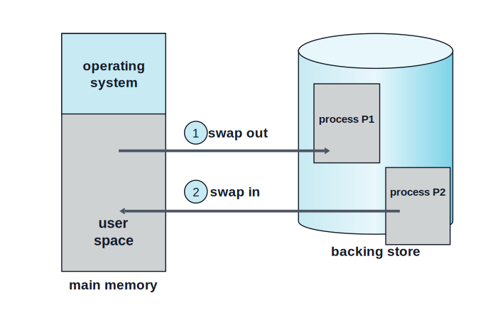
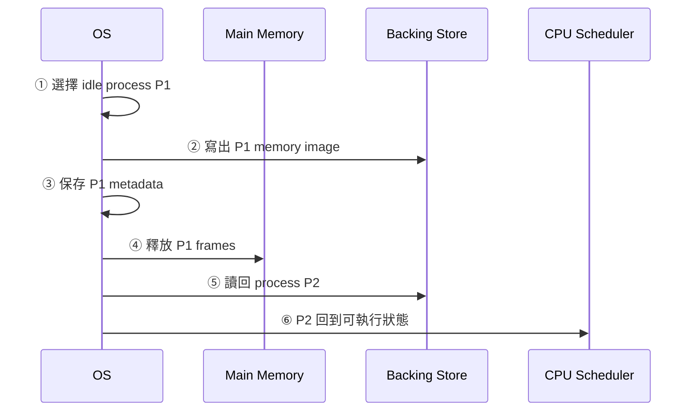
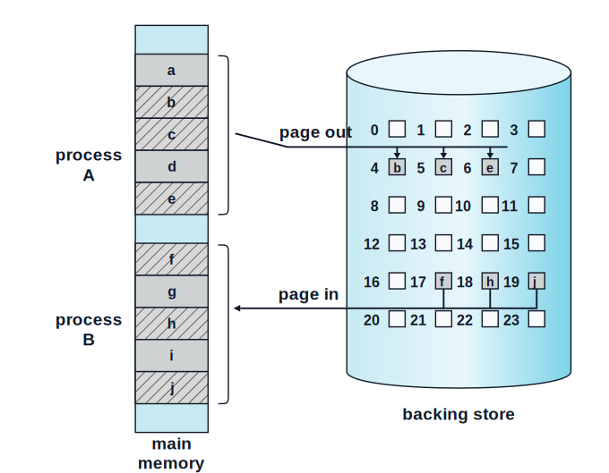
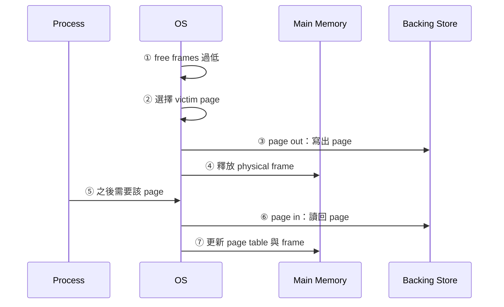

:::note
本系列文章內容參考自經典教材 **Operating System Concepts, 10th Edition (Silberschatz, Galvin, Gagne)**。本文對應章節：**Section 9.5 Swapping**。
:::

## **為什麼需要 Swapping？**

前面幾節已經建立主記憶體管理的基本模型：Process 的 instruction 與 data 必須在**主記憶體 (Main Memory)** 中，CPU 才能直接載入與執行。這個限制很硬，因為 CPU 的一般 load/store 指令不能直接對 disk 上的資料運算。

但 multiprogramming 會讓 OS 面臨一個現實問題：系統希望同時保留多個 Process，以便某個 Process 等待 I/O 時可以切換到其他 Process 執行；可是 physical memory 的容量有限，不可能永遠容納所有 Process 的全部 code、heap、stack 與資料。

**交換 (Swapping)** 就是在這個矛盾下出現的機制。它允許 OS 暫時把一個 Process，或 Process 的某一部分，從 memory 搬到**後備儲存體 (Backing Store)**，等到之後需要繼續執行時再搬回 memory。這樣一來，所有 Process 的總 physical address space 可以大於真正的 physical memory，系統就能維持較高的 multiprogramming degree。

:::info Swapping 解決的不是「CPU 能直接執行 disk 上的程式」
Swapping 並沒有改變 CPU 的硬體限制。Process 要真正執行時，正在使用的 instruction 與 data 仍然必須在 main memory。

Swapping 解決的是「暫時不用的內容要放哪裡」：當某個 Process 目前不活躍，OS 可以把它的記憶體內容寫到 backing store，釋放 RAM 給更需要執行的 Process。之後該 Process 再度變得活躍時，OS 再把內容讀回 RAM。
:::

以一個互動式系統為例，使用者可能同時開著瀏覽器、編輯器、終端機與音樂播放器，但某些程式在一段時間內幾乎沒有動作。若 OS 強制所有程式完整留在 RAM，就會讓活躍程式可用的 memory 變少。Swapping 的直覺是：**inactive process 佔用的 RAM 可以暫時借給 active process 使用**。

 

## **9.5.1 標準交換 (Standard Swapping)**

**標準交換 (Standard Swapping)** 是最直接的版本：OS 會在 main memory 與 backing store 之間搬移整個 Process。Backing store 通常是速度較快的 secondary storage，它必須有足夠容量保存被換出的 memory image，也必須支援 direct access，讓 OS 可以找回指定 Process 的內容。

下圖呈現 standard swapping 的基本動作。Process `P1` 被換出到 backing store，Process `P2` 則從 backing store 被換入 main memory。

圖中的標記可以這樣讀：

- **main memory**：左側長條代表 RAM，上方是 OS 自己使用的區域，下方是 user space。
- **backing store**：右側圓柱代表用來暫存 process memory image 的 secondary storage。
- **swap out**：OS 把目前不適合留在 RAM 的 `P1` 寫到 backing store。
- **swap in**：OS 把之後要繼續執行的 `P2` 從 backing store 讀回 RAM。

這張圖的核心洞察是：**swapping 不是讓 Process 永遠住在 disk，而是在 RAM 與 backing store 之間重新分配誰有資格被 CPU 執行**。被 swap out 的 Process 仍然存在，只是暫時不能直接執行；被 swap in 之後，它才重新具備被 CPU 排程執行的條件。

### **Standard Swapping 的完整流程**

假設系統記憶體壓力上升，OS 決定把一個長時間 idle 的 Process `P1` 換出，並把另一個 Process `P2` 換入。整個流程可以拆成幾個步驟：

1. **選擇 victim process**：OS 根據目前記憶體壓力、Process 狀態與排程需求，選出暫時不需要留在 RAM 的 `P1`。
2. **寫出 memory image**：OS 將 `P1` 的 code、data、heap、stack，以及需要保存的 process data structures 寫到 backing store。
3. **保存 metadata**：OS 記錄 `P1` 被放在 backing store 的位置，以及之後恢復它所需的資訊。若 `P1` 是 multithreaded process，每個 thread 的 per-thread data structures 也必須一起保存。
4. **釋放 RAM**：`P1` 原本佔用的 physical memory 可重新分配給其他 active processes。
5. **換入目標 process**：當 `P2` 應該繼續執行時，OS 從 backing store 讀回 `P2` 的 memory image，重建它在 RAM 中的內容。
6. **恢復執行條件**：OS 更新相關 metadata，使 scheduler 之後可以把 CPU 分配給 `P2`。

這裡最容易忽略的是 metadata。Swapping 不是單純把一段 bytes 從 RAM 複製到 disk。OS 還必須知道這段 bytes 屬於哪個 Process、原本有哪些 thread、各種 kernel data structures 如何恢復，以及換入後該如何重新接回 scheduler 與 memory-management structures。

:::info 為什麼 idle process 適合被 swap out？
Swapping 的目標是把 RAM 讓給「近期更可能被執行」的內容。如果某個 Process 長時間沒有使用者互動，也沒有正在進行 CPU 密集工作，那它佔著 RAM 的機會成本很高。

把 idle process 換出後，active processes 可以得到更多 physical memory，減少等待或頻繁換入換出的機會。若該 idle process 之後又被使用者切回前景，OS 再把它換入即可。
:::

### **Standard Swapping 的代價**

Standard swapping 的優點清楚：它讓 physical memory 可以被 **oversubscribed**。也就是說，系統可容納的 Process 總記憶體需求可以超過實際 RAM 容量。

但它的代價同樣明顯：**搬移整個 Process 太慢**。一個現代 Process 可能包含大量 memory pages，即使 backing store 比一般 secondary storage 快，完整寫出與讀回也可能花費很長時間。在這段期間，Process 不能繼續執行，系統也可能因大量 I/O 變慢。

因此，standard swapping 曾經被傳統 UNIX 系統使用，但在當代一般作業系統中已經不再是主要方法。教材特別提到 Solaris 仍可能在可用 memory 極低的嚴重情況下使用 standard swapping，但那是極端壓力下的策略，而不是日常路徑。

 

## **9.5.2 搭配分頁的交換 (Swapping with Paging)**

既然搬移整個 Process 太昂貴，一個自然的改良方向是：**不要以 Process 為單位搬移，而是以 page 為單位搬移**。

這就是**搭配分頁的交換 (Swapping with Paging)**。在這種方法中，OS 可以只把某個 Process 的部分 pages 寫到 backing store，而不是把整個 Process 換出。這仍然允許 physical memory oversubscription，但每次 I/O 的範圍通常小很多。

教材也提醒一個術語差異：在現代語境中，**swapping** 常特指 standard swapping，也就是搬移整個 Process；而 **paging** 常指搭配分頁的換出與換入，也就是以 page 為單位在 memory 與 backing store 之間移動。

下圖呈現 page-level 的交換。Process `A` 的部分 pages 被 page out 到 backing store；Process `B` 的部分 pages 則從 backing store page in 回 main memory。

圖中的標記含義如下：

- **process A / process B**：左側 main memory 中有兩個 Process 的 pages，斜線區塊代表可被換出的 pages。
- **page out**：Process `A` 的 pages `b`、`c`、`e` 被寫到 backing store 的 slots。
- **page in**：Process `B` 的 pages `f`、`h`、`j` 從 backing store 被讀回 main memory。
- **backing store slots**：右側數字 `0` 到 `23` 代表 backing store 中可存放 swapped pages 的位置。

這張圖的核心洞察是：**現代系統不需要把整個 Process 視為不可分割的單位**。Paging 已經把 address space 切成固定大小的 pages，因此 OS 可以只移動目前不需要的 pages，保留或載入真正會被使用的 pages。

### **Page Out 與 Page In**

Page-level swapping 有兩個基本動作：

| 動作         | 方向                        | 意義                                                  |
| :----------- | :-------------------------- | :---------------------------------------------------- |
| **Page Out** | main memory → backing store | 把某個 page 從 RAM 寫到 backing store，釋放對應 frame |
| **Page In**  | backing store → main memory | 把某個需要使用的 page 從 backing store 讀回 RAM       |

若把它放回前面學過的 paging 模型來看，page out 後，該 page 的內容不再位於某個 physical frame 中。OS 必須在 page table 或相關資料結構中記錄：這個 page 目前不在 memory，但它可以從 backing store 的某個位置取回。之後 Process 需要該 page 時，OS 再執行 page in。

典型流程如下：

1. **記憶體壓力出現**：free frames 降到某個低水位，OS 需要釋放 RAM。
2. **選擇要換出的 page**：OS 根據 page replacement policy 選出暫時不值得留在 RAM 的 page。
3. **Page out**：若 page 內容需要保存，OS 將它寫到 backing store，並更新 mapping metadata。
4. **釋放 frame**：原本的 physical frame 被回收，可供其他 page 使用。
5. **Process 之後存取該 page**：若該 page 不在 RAM，OS 需要把它從 backing store 讀回。
6. **Page in**：OS 找到 free frame，把 page 讀入，再更新 page table，讓 Process 可以繼續存取。

這個流程會在 Chapter 10 的 virtual memory 中變得更完整。此處先抓住關鍵：swapping with paging 的目的，是把「整個 Process 一次搬走」縮小成「只搬少量 pages」，讓記憶體回收更細緻，也讓成本更容易被系統承受。

:::info 為什麼 swapping with paging 比 standard swapping 常見？
Standard swapping 的粒度是整個 Process，代價大且反應慢。Swapping with paging 的粒度是 page，OS 可以只處理真正造成壓力或暫時不需要的部分。

這個差異很重要：一個 Process 可能很大，但它在短時間內真正會碰到的 working set 只是其中一小部分。若 OS 能保留 working set、換出冷門 pages，就能在不完整移除 Process 的情況下釋放 RAM。
:::

### **Terminology：Swapping、Paging 與 Virtual Memory 的關係**

在學習到這裡時，容易把三個詞混在一起：

| 術語               | 在本節的精確含義                                                                             | 核心單位             |
| :----------------- | :------------------------------------------------------------------------------------------- | :------------------- |
| **Swapping**       | 狹義上指 standard swapping，在 memory 與 backing store 之間搬移整個 Process                  | Process              |
| **Paging**         | 在本節語境中常指 swapping with paging，以 page 為單位進行 page out / page in                 | Page                 |
| **Virtual Memory** | 允許 Process 只把需要的 pages 放在 memory 中，其餘可留在 backing store，會在 Chapter 10 詳談 | Page / Address Space |

這三者的共同背景都是：main memory 不夠大，且 CPU 只能直接執行 memory 中的內容。差別在於抽象層級與搬移單位。Standard swapping 是粗粒度；paging 是細粒度；virtual memory 則把細粒度搬移與 address translation 結合成完整的執行模型。

 

## **9.5.3 行動系統上的 Swapping (Swapping on Mobile Systems)**

PC 與 server OS 通常支援 page-level swapping，但 mobile systems 通常不支援任何形式的 swapping。這不是因為 mobile OS 不需要面對記憶體壓力，而是因為它們使用的 nonvolatile storage 與使用情境不同。

Mobile devices 通常使用 **flash memory** 作為非揮發儲存體，而不是容量更大、傳統上更適合大量交換 I/O 的 hard disks。教材指出 mobile OS 避免 swapping 的主要原因有三個：

| 原因                | 說明                                                                             |
| :------------------ | :------------------------------------------------------------------------------- |
| **空間有限**        | Flash storage 容量相對珍貴，不適合大量保留 swap space                            |
| **寫入壽命有限**    | Flash memory 能承受的寫入次數有限，頻繁 page out 會增加磨耗                      |
| **throughput 較差** | Main memory 與 flash memory 之間的傳輸效能不足，頻繁 swapping 會嚴重影響互動體驗 |

因此，mobile OS 通常採用另一種策略：當 free memory 低於某個 threshold 時，不是把 pages 大量寫到 backing store，而是要求 app 釋放 memory，必要時終止 app。

### **iOS 的策略**

Apple iOS 在 free memory 降到一定門檻時，會要求 applications 自願釋放已配置的 memory。Read-only data，例如 code，可以直接從 main memory 移除，因為之後若需要，仍可從 flash memory 重新載入。已修改過的資料，例如 stack，則不會用這種方式移除。

若某個 app 無法釋放足夠 memory，OS 可以直接終止它。這個策略背後的判斷是：與其讓整個系統因頻繁 swapping 變慢，不如保護前景工作與系統回應性，把記憶體壓力轉成 app lifecycle 管理問題。

### **Android 的策略**

Android 採用類似方向。當 free memory 不足時，Android 可能終止某個 Process。不過在終止之前，Android 會把 application state 寫到 flash memory，讓該 app 之後可以快速重新啟動，並盡可能恢復先前狀態。

這和傳統 swapping 有一個關鍵差異：Android 保存的是 application state，而不是完整 process memory image。完整 memory image 代表 OS 之後可以把 Process 原封不動換回 RAM；application state 則是讓 app 重新啟動時可以重建使用者感知到的狀態。

:::info Mobile App 開發的實務含義
在 mobile systems 中，Process 不能假設自己只是被透明地 swap out，之後一定會從完全相同的 memory image 恢復。OS 可能要求 app 釋放 memory，也可能直接終止 app。

因此 mobile app 必須小心配置與釋放 memory，避免 memory leaks，並在適當時機保存足以重建畫面與工作狀態的 application state。
:::

 

## **系統效能觀點：Swapping 是壓力訊號**

教材的 sidebar 強調一個重要觀念：即使 page-level swapping 比整個 Process swapping 更有效率，只要系統正在進行任何形式的 swapping，通常就代表 active processes 的總需求已經超過 available physical memory。

:::caution System Performance Under Swapping
Swapping 不是免費的容量擴充。它會把 memory pressure 轉成 backing-store I/O，而 secondary storage 的速度與延遲遠不如 RAM。

當系統頻繁 swapping 時，通常只有兩個根本處理方向：**終止一些 processes**，或是**增加更多 physical memory**。
:::

這個提醒很重要，因為 swapping 很容易被誤解成「RAM 不夠時的完美解法」。更準確地說，swapping 是一個退讓機制：它讓系統在記憶體不足時還能勉強維持更多 Process 的存在，但代價是 I/O、延遲與互動體驗。

如果 swapping 偶爾發生，它可以吸收短暫壓力；如果 swapping 長時間持續，系統可能進入一種不健康狀態：CPU 花很多時間等待 pages 在 memory 與 backing store 之間移動，而不是執行真正有用的 user work。這個問題在 Chapter 10 會以 thrashing 的形式更完整地討論。

 

## **小結**

Section 9.5 的主線可以整理成一個問題：當 active processes 的總記憶體需求超過 physical memory 時，OS 要如何維持系統可用？

| 策略                                | 搬移單位                  | 優點                                              | 主要問題                                             |
| :---------------------------------- | :------------------------ | :------------------------------------------------ | :--------------------------------------------------- |
| **Standard Swapping**               | 整個 Process              | 概念簡單，可直接釋放大量 RAM                      | 搬移整個 Process 太慢，現代系統很少作為日常機制      |
| **Swapping with Paging**            | Page                      | 粒度細，只需換出部分 pages，能搭配 virtual memory | 仍會產生 backing-store I/O，頻繁發生時代表記憶體不足 |
| **Mobile Memory Pressure Handling** | App state / app lifecycle | 避免大量 flash writes 與差的互動延遲              | App 可能被要求釋放 memory 或直接被終止               |

這一節最核心的觀念是：**main memory 是真正能被 CPU 直接執行的工作區，而 backing store 是壓力下的暫存空間**。Standard swapping、page-level swapping 與 mobile OS 的 termination strategy 都是在回答同一個問題，只是它們對「效能、儲存媒介壽命、使用者體驗」的取捨不同。
