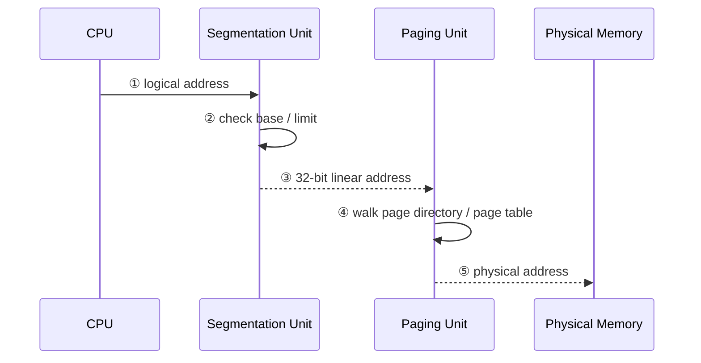
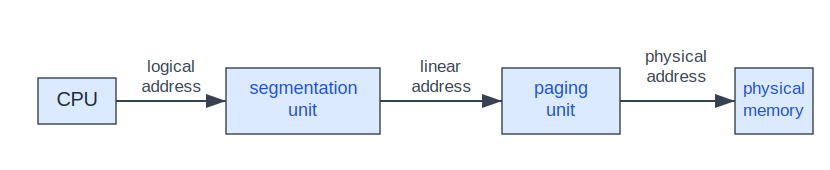
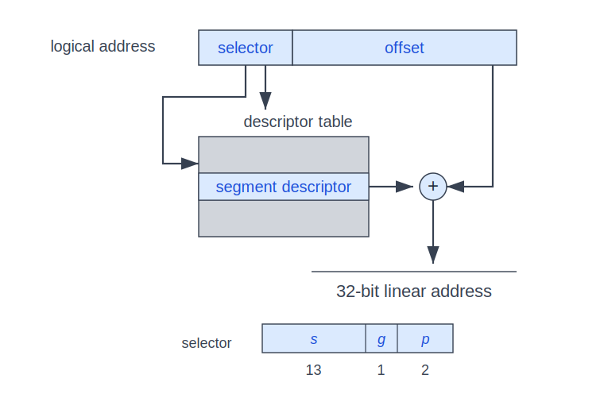
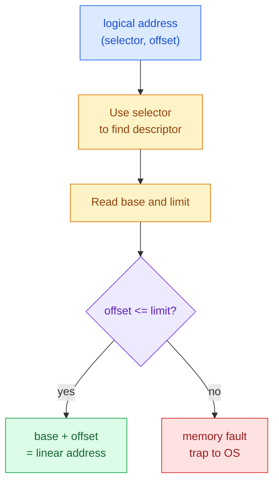
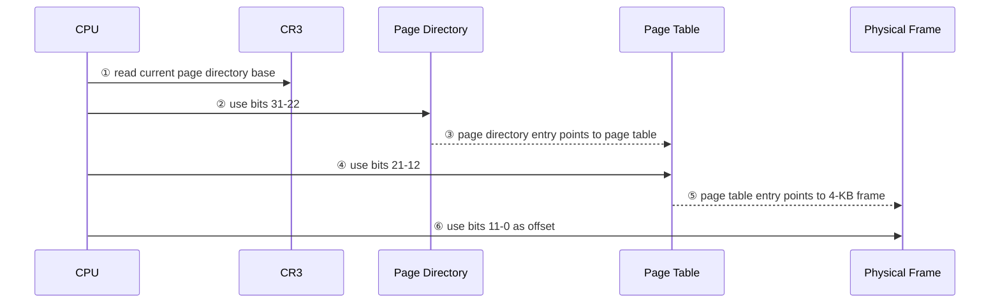
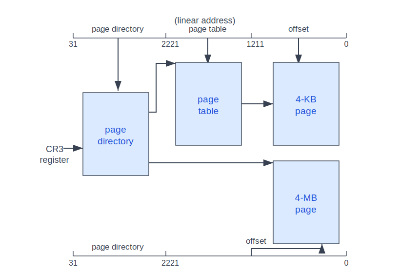
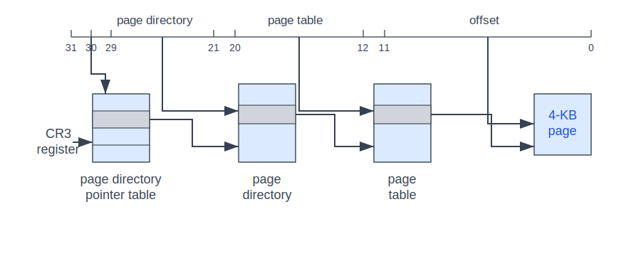
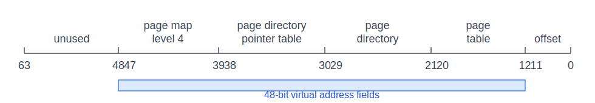

:::note
本系列文章內容參考自經典教材 **Operating System Concepts, 10th Edition (Silberschatz, Galvin, Gagne)**。本文對應章節：**Section 9.6 Example: Intel 32- and 64-bit Architectures**。
:::

## **為什麼要看 Intel 架構範例？**

前面幾節已經建立了 main memory 管理的核心抽象：logical address、physical address、base/limit、paging、page table、TLB、shared pages 與 swapping。這些概念如果只停留在抽象層，容易讓人誤以為 CPU 做 address translation 時只有一種固定流程。

Intel 架構範例的價值在於把抽象模型放回真實硬體：IA-32 同時使用**分段 (Segmentation)** 與**分頁 (Paging)**，x86-64 則把 paging hierarchy 擴展到更大的 virtual address 與 physical address 空間。也就是說，本節不是要記硬體細節，而是要看見一件事：**作業系統教科書中的 memory-management concepts，最後會被 CPU 具體實作成一連串位址轉換表與硬體暫存器。**

從歷史上看，Intel 16-bit 8086 與 8088 是早期 PC 的重要處理器，後來發展出 32-bit IA-32，包括 Pentium 系列。再往後，主流 PC 進入 64-bit x86-64 時代。Windows、macOS 與 Linux 都長期支援 Intel 相容架構；相對地，mobile systems 則主要由 ARM 架構主導。

:::info 本節閱讀重點
Intel 多年來推出許多處理器版本與變形，完整細節屬於 computer architecture 的範圍。本節只抓 memory management 相關的主線：

1. IA-32 如何把 logical address 先轉成 linear address，再轉成 physical address。
2. IA-32 segmentation 如何用 selector、LDT/GDT、base 與 limit 檢查位址。
3. IA-32 paging 如何用 page directory、page table 與 CR3 完成 two-level paging。
4. PAE 如何突破 32-bit 系統原本 4 GB physical memory 的限制。
5. x86-64 如何用四層 paging hierarchy 表示 48-bit virtual address 與 52-bit physical address。
:::

 

## **9.6.1 IA-32 Architecture：先 Segmentation，再 Paging**

IA-32 的 memory management 可以理解成兩段式轉換。CPU 不會直接把程式產生的位址拿去查 physical memory，而是先經過 segmentation unit，再經過 paging unit：

1. **CPU 產生 logical address**：程式執行 load/store 或 instruction fetch 時，CPU 看到的是 logical address。
2. **Segmentation unit 轉成 linear address**：segmentation unit 根據 segment descriptor 的 base 與 limit 檢查位址是否合法，合法時產生 32-bit linear address。
3. **Paging unit 轉成 physical address**：paging unit 把 linear address 拆成 page directory index、page table index 與 offset，最後找到 physical frame。
4. **Main memory 接收 physical address**：只有最後的 physical address 才是真正送到 memory system 的位址。

下圖是 IA-32 位址轉換的大方向。它把 segmentation 與 paging 串在同一條路徑上，因此兩者合起來才等價於整個**記憶體管理單元 (Memory-Management Unit, MMU)** 的功能。

圖中的標記可以這樣讀：

- **logical address**：CPU 產生、尚未經過 segmentation 的位址。
- **segmentation unit**：負責根據 segment descriptor 檢查範圍，並把 logical address 轉成 linear address。
- **linear address**：segmentation 的輸出，也是 paging 的輸入。
- **paging unit**：負責用 page tables 把 linear address 轉成 physical address。
- **physical memory**：最後接收 physical address 的 main memory。

這張圖的核心洞察是：**IA-32 的 paging 並不是直接吃 logical address，而是吃 segmentation 之後的 linear address**。因此，討論 IA-32 paging 前，必須先理解 segmentation 如何形成那個 32-bit linear address。

 

## **9.6.1.1 IA-32 Segmentation**

IA-32 的 segmentation 保留了「程式由多個 segment 組成」的模型。每個 segment 最大可達 4 GB，每個 process 最多可有 16 K 個 segments。這 16 K 個 segments 被切成兩半：

| 分區                     | 容量              | 用途                          | Descriptor Table                  |
| :----------------------- | :---------------- | :---------------------------- | :-------------------------------- |
| Process-private segments | 最多 8 K segments | 只屬於該 process 的 segment   | **Local Descriptor Table (LDT)**  |
| Shared segments          | 最多 8 K segments | 所有 processes 共享的 segment | **Global Descriptor Table (GDT)** |

LDT 與 GDT 的每個 entry 都是一個 8-byte **segment descriptor**，裡面包含該 segment 的 base location、limit 與保護資訊。直覺上，LDT/GDT 就像是 segmentation 的 page table：它們不是存放資料本身，而是存放「某個 segment 在哪裡、範圍多大、能不能被存取」的 metadata。

### **Logical Address：Selector + Offset**

IA-32 的 logical address 是一對值：`(selector, offset)`。

- **selector**：16-bit，指定要使用哪個 segment descriptor。
- **offset**：32-bit，指定 segment 內部的 byte 位置。

selector 本身又分成三個欄位：

| 欄位 | Bits | 意義                                                 |
| :--- | :--- | :--------------------------------------------------- |
| `s`  | 13   | Segment number，用來選擇 descriptor table 中的 entry |
| `g`  | 1    | 指出該 segment 在 GDT 或 LDT                         |
| `p`  | 2    | Protection 相關資訊                                  |

下圖把 selector、offset、descriptor table 與 linear address 的關係畫在一起。閱讀時應特別注意：selector 不直接變成 address，而是先拿去找到 segment descriptor；offset 則是要加到 descriptor 裡的 base 上。

圖中的標記含義如下：

- **selector**：用來選擇 descriptor table 中的某個 segment descriptor。
- **offset**：代表目標 byte 在該 segment 內的相對位置。
- **descriptor table**：可能是 LDT，也可能是 GDT，由 selector 的 `g` bit 決定。
- **segment descriptor**：包含 segment base、limit 與 protection metadata。
- **plus sign**：代表把 segment base 與 offset 相加，得到 32-bit linear address。

這張圖的核心洞察是：**segmentation 做了兩件事，先檢查 offset 是否落在 segment limit 內，再把 offset 加上 segment base 形成 linear address**。因此它同時提供 address relocation 與 protection。

### **位址是否合法：Limit Check 先於加法**

形成 linear address 的順序很重要。硬體不是無條件把 base 和 offset 相加，而是先用 segment descriptor 裡的 limit 檢查 offset 是否有效：

1. **Segment register 指向 descriptor**：CPU 透過 segment register 找到 LDT 或 GDT 中的對應 descriptor。
2. **讀出 base 與 limit**：descriptor 告訴 CPU 該 segment 起點在哪裡、範圍多大。
3. **檢查 offset**：若 offset 超過 limit，代表 process 試圖存取 segment 外的位址。
4. **非法時產生 memory fault**：硬體產生 fault，透過 trap 進入 OS。
5. **合法時產生 linear address**：offset 加上 base，得到 32-bit linear address。

這裡的前因後果很值得抓清楚。若沒有 limit check，process 只要算出某個 offset，就可能越界讀寫別的 segment。Segmentation 的 protection 不是 OS 事後檢查，而是 CPU 在每次位址形成時由硬體即時檢查；一旦失敗，硬體立刻把控制權交給 OS。

:::info 為什麼需要 segment register cache？
IA-32 有六個 segment registers，代表同一時間一個 process 可以快速 address 六個 segments。硬體另外有六個 8-byte microprogram registers，用來快取對應的 descriptors。

原因很直接：若每一次 memory reference 都要從 LDT/GDT 讀 descriptor，address translation 會多一次 memory access，效能會很差。把最近使用的 descriptors 快取在 CPU 內部，可以避免每次都重新讀 descriptor table。
:::

 

## **9.6.1.2 IA-32 Paging**

Segmentation 產生的是 32-bit linear address，但 memory system 最後需要的是 physical address。IA-32 paging 就接手這個 linear address，將它映射到 physical frame。

IA-32 支援兩種 page size：

| Page Size | 用途                                             |
| :-------- | :----------------------------------------------- |
| 4 KB      | 標準 page size，使用 two-level paging            |
| 4 MB      | 大型 page，由 page directory 直接指向 page frame |

對 4-KB pages 而言，32-bit linear address 被切成三段：

| 欄位 | Bits | 範圍       | 作用                 |
| :--- | :--- | :--------- | :------------------- |
| `p1` | 10   | bits 31–22 | Page directory index |
| `p2` | 10   | bits 21–12 | Page table index     |
| `d`  | 12   | bits 11–0  | Page offset          |

為什麼是 10、10、12？因為 4 KB = 2¹² bytes，所以 offset 需要 12 bits 才能選到 page 內任一 byte。剩下 20 bits 不直接當成一個巨大 page table index，而是拆成兩層各 10 bits，讓 page tables 可以分段配置，不必一次建立完整 2²⁰ entries 的單一大表。

### **Two-Level Paging 的查表流程**

IA-32 的 two-level paging 可以分成下列步驟：

1. **CR3 指向 page directory**：`CR3` register 保存目前 process 的 page directory 起始位置。
2. **用 bits 31–22 選 page directory entry**：最外層 page table 在 IA-32 稱為 page directory。
3. **Page directory entry 指向 page table**：若是標準 4-KB page，entry 會指到下一層 page table。
4. **用 bits 21–12 選 page table entry**：page table entry 指向目標 4-KB page frame。
5. **用 bits 11–0 當 offset**：offset 指出 page frame 內的 byte 位置。

下圖呈現 IA-32 paging 的完整結構。上半部是標準 4-KB page 路徑；下半部是 4-MB page 路徑，也就是 page directory 直接指向大型 page frame。

圖中的標記含義如下：

- **CR3 register**：保存目前 process 的 page directory 位置，因此 context switch 時會跟著切換。
- **page directory**：外層 page table，由 linear address 高 10 bits 選 entry。
- **page table**：內層 page table，由 linear address 中間 10 bits 選 entry。
- **4-KB page**：標準 page frame，最後 12 bits 作為 offset。
- **4-MB page**：大型 page frame，若 Page Size flag 被設定，page directory 直接指向它。

這張圖的核心洞察是：**同一個 page directory 可以同時支援兩種粒度**。一般情況走 page directory → page table → 4-KB page；若 Page Size flag 被設定，則直接走 page directory → 4-MB page，省略內層 page table。

:::info Page Size Flag 的意義
Page directory entry 中有一個 **Page Size flag**。若這個 bit 被設定，該 entry 指向的是 4-MB page frame，而不是下一層 page table。

這代表 linear address 的低 22 bits 都變成 4-MB page 內的 offset。這種設計適合映射大型連續區域，代價是粒度變粗，內部浪費的風險也變高。
:::

### **Page Tables 也可以被換到 Disk**

Paging 的目的是節省 physical memory，但 page tables 本身也會占 memory。IA-32 允許 page tables 被 swapped to disk。此時 page directory entry 會用 invalid bit 表示它指向的 page table 目前不在 memory。

如果該 page table 在 disk 上，OS 可以使用 page directory entry 中其他 31 bits 記錄 disk location。之後真的需要該 page table 時，再把它 demand load 回 memory。

這件事的關鍵不是「資料 page 可以被換出」而已，而是**管理資料的 page table 也可能被換出**。當 address space 很大、但 process 只使用其中一小部分時，把未使用區域的 page tables 留在 disk，可以避免 page-table metadata 本身吃掉太多 RAM。

 

## **PAE：突破 32-bit 的 4 GB Physical Memory 限制**

32-bit address 最直覺的限制是 2³² bytes，也就是 4 GB。這裡要小心區分兩件事：

| 名稱                            | 問題                                  |
| :------------------------------ | :------------------------------------ |
| 32-bit virtual / linear address | 單一 address 只能表示 4 GB 範圍       |
| 32-bit physical address         | CPU 最多只能指向 4 GB physical memory |

軟體需求成長後，4 GB physical memory 對系統來說不夠。Intel 因此引入**頁面位址延伸 (Page Address Extension, PAE)**，讓 32-bit processors 可以存取超過 4 GB 的 physical address space。

PAE 的核心變化有兩個：

1. **Paging 從 two-level 變成 three-level**：linear address 的最高 2 bits 先選 page directory pointer table。
2. **Page-directory / page-table entries 從 32 bits 變成 64 bits**：entry 變大後，可以存放更長的 page table base address 與 page frame base address。

下圖呈現 PAE 使用 4-KB pages 時的三層結構。相較於原本 IA-32 two-level paging，最前面多了 page directory pointer table。

圖中的標記含義如下：

- **page directory pointer table**：由 linear address 最高 2 bits 選 entry，是 PAE 新增的最上層。
- **page directory**：由接下來 9 bits 選 entry。
- **page table**：再由接下來 9 bits 選 entry。
- **offset**：低 12 bits 仍然是 4-KB page 內 offset。
- **CR3 register**：在 PAE 模式下指向 page directory pointer table。

這張圖的核心洞察是：**PAE 不是把 process 的 virtual address 變成無限大，而是讓 page-table entries 能描述更大的 physical frame number**。教材指出，PAE 讓 base address 從 20 bits 擴展到 24 bits；加上 12-bit offset 後，physical address space 變成 36 bits，也就是最多 64 GB。

:::info 為什麼 PAE 需要 OS 支援？
PAE 改變了 page-table hierarchy 與 page-table entry 格式，因此不是 CPU 支援就自動生效。OS 必須知道如何建立 PAE 格式的 tables、如何設定 CR3、如何處理 page faults，以及如何管理大於 4 GB 的 physical frames。

教材提到 Linux 與 macOS 支援 PAE；但 32-bit Windows desktop 版本即使啟用 PAE，仍只提供 4 GB physical memory 支援。這表示硬體能力、OS policy 與產品限制是三個不同層次，不能混為一談。
:::

### **PAE 與 4 GB 限制的精確理解**

PAE 最容易被誤解成「32-bit process 就能直接使用超過 4 GB 的 address space」。更精確的說法是：

- **單一 32-bit linear address 仍然只有 32 bits**，所以單一 process 的一般 linear address 空間仍以 4 GB 為上限。
- **physical address 可以擴展到 36 bits**，所以整個系統可以裝更多 RAM，讓不同 pages 映射到更大的 physical frame 集合。
- **OS 必須管理這個映射**，讓不同 processes 或 kernel 使用超過 4 GB 的 physical memory。

因此，PAE 解決的是「系統總 physical memory 不夠」的問題，不是直接把每個 32-bit process 的 pointer 變成 64-bit。

 

## **9.6.2 x86-64**

Intel 最早推出的 64-bit 架構是 IA-64，也就是後來的 Itanium，但它沒有成為主流 PC 架構。另一家晶片廠商 AMD 則設計了 x86-64：它不是完全拋棄 IA-32，而是在既有 IA-32 instruction set 上擴展到 64-bit。後來 Intel 也採用這個方向，因此本節用通稱 **x86-64**，而不特別區分 AMD64 或 Intel 64 的商業名稱。

x86-64 的直覺賣點是 64-bit address space。理論上，64 bits 可以表示 2⁶⁴ bytes，超過 16 exabytes。但真實硬體通常不會在一開始就實作完整 64-bit address translation，因為那會讓 page tables、TLB 與硬體路徑都變得更大、更貴。

教材描述的 x86-64 設計提供：

| 項目                                 | 大小             |
| :----------------------------------- | :--------------- |
| Virtual address                      | 48 bits          |
| Physical address                     | 52 bits          |
| Supported page sizes                 | 4 KB、2 MB、1 GB |
| Paging hierarchy                     | 4 levels         |
| Maximum physical memory from 52 bits | 4,096 TB         |

下圖呈現 x86-64 linear address 的欄位切法。雖然機器 word 是 64 bits，但實際拿來走 paging hierarchy 的是 bits 47–0；bits 63–48 在這個表示中標成 unused。

圖中的標記含義如下：

- **unused**：bits 63–48，沒有作為此圖中的 paging index。
- **page map level 4**：bits 47–39，選擇四層 hierarchy 的第一層 entry。
- **page directory pointer table**：bits 38–30，選擇第二層 entry。
- **page directory**：bits 29–21，選擇第三層 entry。
- **page table**：bits 20–12，選擇第四層 entry。
- **offset**：bits 11–0，4-KB page 內 offset。

這張圖的核心洞察是：**x86-64 延續了 PAE 的多層 paging 思路，但把 hierarchy 擴展成四層**。每一層用 9 bits 選 entry，最後 12 bits 當 4-KB offset，因此 9 + 9 + 9 + 9 + 12 = 48 bits。

### **為什麼 64-bit 架構沒有直接用滿 64 bits？**

若完整使用 64-bit virtual address，又維持 4-KB pages，offset 仍然只需要 12 bits，剩下 52 bits 都要用來索引 page-table hierarchy。這會導致 page-table 結構更深或每層更大，也會讓硬體 page walk、TLB tag 與 OS memory-management metadata 變得更昂貴。

x86-64 採用 48-bit virtual address 是工程折衷：它已經遠大於一般應用程式需要的 address space，同時避免為暫時用不到的位址範圍付出完整硬體成本。等到未來需求增加，架構仍可逐步擴展。

:::info 48-bit virtual address 與 52-bit physical address 不矛盾
Virtual address 是 process 看到的位址空間；physical address 是 memory system 能定位的 RAM 範圍。兩者不必同樣大。

 

x86-64 在此設計中提供 48-bit virtual address，但可支援 52-bit physical address。這代表單一 virtual address translation 最後可以映射到更大的 physical frame 集合。OS 透過 page tables 決定哪些 virtual pages 對應到哪些 physical frames。
:::

 

## **整體比較：IA-32、PAE、x86-64**

把本節放在一起看，可以發現 Intel 相容架構的 address translation 是逐步演進，而不是突然改成另一套完全不同的模型。

| 架構 / 模式 | Virtual / Linear Address        | Physical Address 能力 | Paging 層級 | 關鍵特色                                                                   |
| :---------- | :------------------------------ | :-------------------- | :---------- | :------------------------------------------------------------------------- |
| IA-32       | 32-bit linear address           | 典型上限 4 GB         | 2 levels    | Segmentation 先產生 linear address，再由 paging 轉成 physical address      |
| IA-32 + PAE | 32-bit linear address           | 36-bit，最多 64 GB    | 3 levels    | 新增 page directory pointer table，entry 由 32 bits 擴為 64 bits           |
| x86-64      | 48-bit virtual / linear address | 52-bit，最多 4,096 TB | 4 levels    | 以四層 hierarchy 支援更大的 address space，page size 可為 4 KB、2 MB、1 GB |

這個比較的重點不是背數字，而是理解限制如何驅動設計：

- **Segmentation** 解決的是「logical address 如何先做範圍檢查與 relocation」。
- **Paging** 解決的是「linear address 如何細粒度映射到 physical frames」。
- **PAE** 解決的是「32-bit 系統如何使用超過 4 GB 的 physical memory」。
- **x86-64** 解決的是「如何讓 address space 大幅成長，同時避免立刻承擔完整 64-bit translation 的成本」。

因此，本節可以視為 Chapter 9 的收束：前面抽象介紹的 memory-management tools，在真實 CPU 中會以 descriptor tables、CR3、page directories、page tables 與多層 paging hierarchy 的形式一起工作。OS 的責任則是建立並維護這些資料結構，讓 CPU 在每一次 memory reference 時都能快速、安全地完成 address translation。
