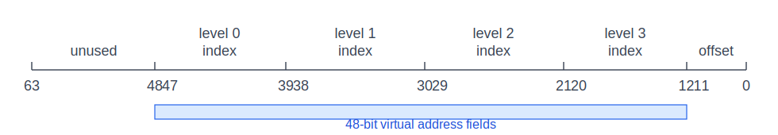
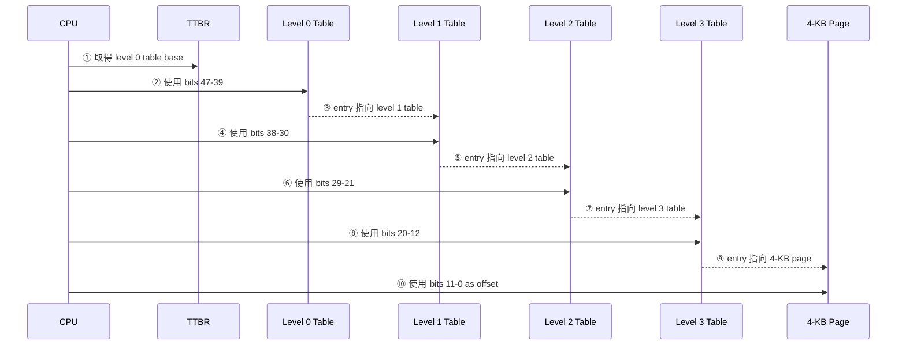
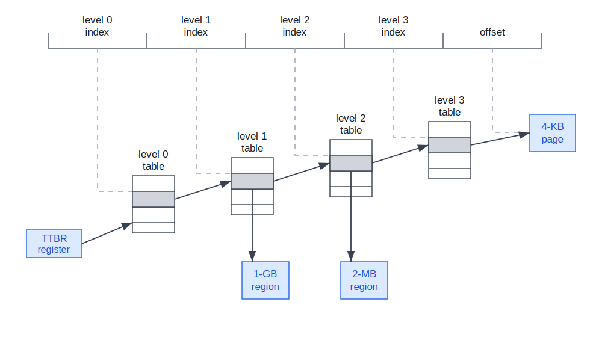
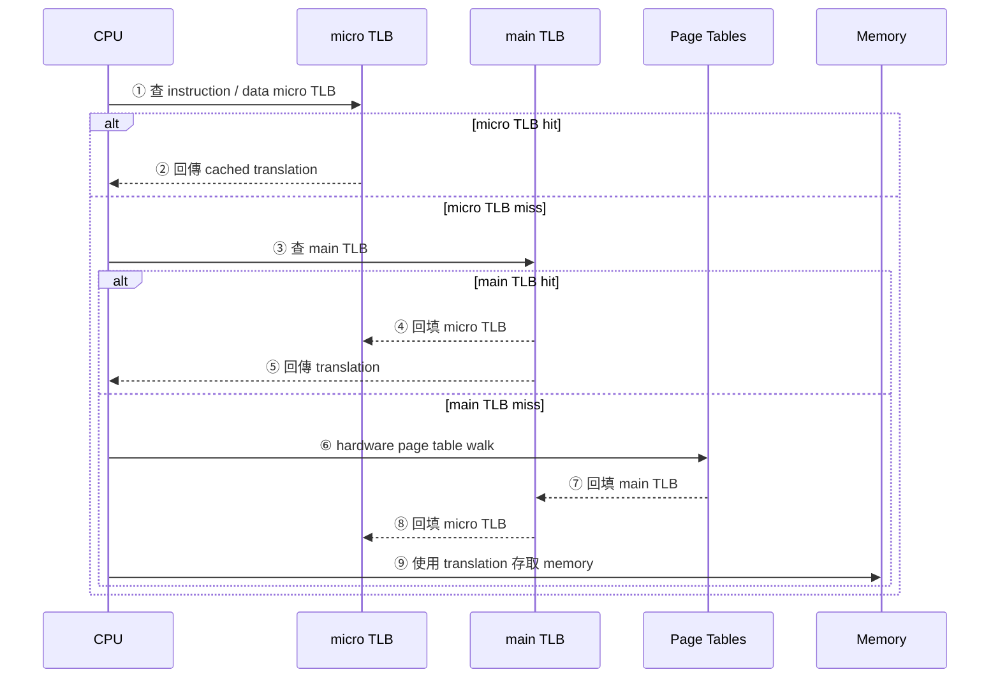

:::note
本系列文章內容參考自經典教材 **Operating System Concepts, 10th Edition (Silberschatz, Galvin, Gagne)**。本文對應章節：**Section 9.7 Example: ARMv8 Architecture**。
:::

## **為什麼要看 ARMv8 架構範例？**

上一節用 Intel IA-32 與 x86-64 看見一件事：作業系統中的 paging、page table、**轉譯備援緩衝區 (Translation Look-aside Buffer, TLB)** 與 address translation，最後都必須落到真實 CPU 的硬體格式。**ARMv8 架構 (ARMv8 Architecture)** 則提供另一個重要範例，因為它不是傳統 PC 市場的主角，而是廣泛出現在 mobile devices、tablet computers 與 real-time embedded systems 中。

ARM 與 Intel 還有一個商業模式上的差異。Intel 通常同時設計與製造晶片；ARM 則主要設計處理器架構，並把設計授權給晶片製造商。Apple 的 iPhone、iPad，以及大量 Android-based smartphones 都採用 ARM design。也因為這種授權模式與 mobile / embedded 市場的規模，教材指出 ARM processors 的累計數量極高，是以晶片數量衡量時最廣泛使用的架構之一。

本節的重點不是背 ARM 的全部硬體細節，而是抓住它的 memory-management 主線：

1. ARMv8 是 **64 位元架構 (64-bit architecture)**，但教材中的位址格式目前只使用 48 bits。
2. ARMv8 不只支援一種 page size，而是透過不同的 **轉譯粒度 (translation granule)** 決定 page 與 region 的大小。
3. 以 4-KB translation granule 為例，ARMv8 可以使用四層 hierarchical paging。
4. ARMv8 的 table entry 不一定只能指向下一層 table，也可以在較高層直接指向大型 contiguous memory region。
5. ARMv8 透過兩層 TLB 結構，先查 micro TLB，再查 main TLB，最後才進行硬體 page table walk。

:::info 64-bit computing 的現實提醒
教材在本節旁邊放了一個 **64-bit computing** 側欄，核心意思是：每一代硬體剛出現時，memory capacity、CPU speed 與 address space 都看似足夠，但技術成長最後往往會把這些容量吃滿。

這也是為什麼 64-bit address space 看起來極大，作業系統與 CPU architecture 仍然需要保留擴展空間。今天覺得誇張的容量，未來可能因為更大的資料集、更密集的記憶體映射、更大的 process address space 或新型應用而變得合理。
:::

<br/>

## **轉譯粒度 (Translation Granule)：ARMv8 的基本頁面粒度**

在前面的 paging 章節中，page size 通常被當成一個固定條件，例如 4 KB。ARMv8 的設計更彈性：它提供三種 **translation granules**，分別是 4 KB、16 KB 與 64 KB。

Translation granule 可以理解為 address translation 的基本配置粒度。選擇不同 granule，會同時影響：

- page size，也就是最小 page mapping 的大小。
- page-table hierarchy 最多需要幾層。
- 是否能在較高層直接映射更大的 contiguous memory region。

教材列出的對應關係如下：

| Translation Granule Size | Page Size | Region Size |
| :----------------------- | :-------- | :---------- |
| 4 KB                     | 4 KB      | 2 MB、1 GB  |
| 16 KB                    | 16 KB     | 32 MB       |
| 64 KB                    | 64 KB     | 512 MB      |

這張表背後的設計取捨很重要。Granule 越小，mapping 越細緻，OS 可以用更小單位管理記憶體，內部碎片較少；但 page table 可能更大、translation hierarchy 也可能更深。Granule 越大，page-table metadata 可能較少，TLB coverage 也可能較大，但每次分配或映射的基本單位變粗，細小資料容易浪費空間。

:::info Page 與 Region 的差別
在 ARMv8 的語境中，**page** 是最小的 translation unit，例如 4-KB granule 對應 4-KB page。

**region** 則是較大的 contiguous memory mapping。例如 4-KB granule 可以映射 2-MB region 或 1-GB region。Region 的用途與 x86-64 的 large page 類似：若一大段連續 virtual memory 可以對應到一大段連續 physical memory，就不必一路走到最底層 page table 才完成 translation。
:::

<br/>

## **4-KB Translation Granule 的位址格式**

教材用 4-KB translation granule 作為主要例子。對 4-KB page 而言，page offset 需要 12 bits，因為 4 KB = 2¹² bytes。剩下的 virtual address bits 則被切成多個 index，用來逐層查 page tables。

下圖呈現 ARMv8 在 4-KB translation granule 下的 64-bit address layout。雖然 ARMv8 是 64-bit architecture，但圖中只有 bits 47–0 被用於 translation；bits 63–48 標示為 unused。



圖中的欄位可以這樣讀：

- **unused**：bits 63–48，在教材這個位址格式中不參與 translation。
- **level 0 index**：bits 47–39，用來選擇 level 0 table entry。
- **level 1 index**：bits 38–30，用來選擇 level 1 table entry。
- **level 2 index**：bits 29–21，用來選擇 level 2 table entry。
- **level 3 index**：bits 20–12，用來選擇 level 3 table entry。
- **offset**：bits 11–0，指出 4-KB page 內的 byte 位置。

這張圖的核心洞察是：**ARMv8 雖然是 64-bit 架構，但位址轉換不必一開始就把 64 bits 全部用滿**。與 x86-64 類似，48-bit virtual address 已經能提供很大的 address space，同時避免 page-table hierarchy、TLB 與硬體 page walk 因完整 64-bit translation 而立刻變得更昂貴。

### **為什麼每一層 index 都是 9 bits？**

在 4-KB granule 下，一個 page table 本身通常也放在一個 4-KB page 中。若每個 table entry 是 8 bytes，則一張 table 可以容納：

```text
4 KB / 8 bytes = 4096 / 8 = 512 entries = 2^9 entries
```

因此，每一層 table 需要 9 bits 來選出其中一個 entry。四層 table 各吃 9 bits，再加上 12-bit page offset，正好是：

```text
9 + 9 + 9 + 9 + 12 = 48 bits
```

這也解釋了為什麼圖中 bits 47–39、38–30、29–21、20–12 各自形成一段 index。這不是任意切割，而是由 page size 與 table entry size 推導出來的硬體格式。

<br/>

## **四層 Hierarchical Paging 與 TTBR**

有了位址欄位後，下一步是看 CPU 如何用這些欄位找到 physical memory。ARMv8 使用 **轉譯表基底暫存器 (Translation Table Base Register, TTBR)** 指向目前 thread 的 level 0 table。TTBR 的角色類似前面 Intel 架構中的 CR3：它保存 page-table hierarchy 的起點，因此 context switch 或 address-space switch 時，OS 需要讓硬體知道新的 translation table base 在哪裡。

以 4-KB translation granule 且四層都使用的情況為例，一次 address translation 可拆成以下流程：

1. **從 TTBR 找到 level 0 table**：CPU 先讀取 TTBR，取得目前 thread 的 level 0 table 起始位置。
2. **用 level 0 index 選 entry**：bits 47–39 選出 level 0 table 中的一個 entry，該 entry 指向 level 1 table。
3. **用 level 1 index 選 entry**：bits 38–30 選出 level 1 entry。這個 entry 可能指向 level 2 table，也可能直接指向 1-GB region。
4. **用 level 2 index 選 entry**：bits 29–21 選出 level 2 entry。這個 entry 可能指向 level 3 table，也可能直接指向 2-MB region。
5. **用 level 3 index 選 entry**：bits 20–12 選出 level 3 entry，得到 4-KB page 的 mapping。
6. **用 offset 找到 page 內位置**：bits 11–0 指出 4-KB page 內的 byte offset。



下圖把這個四層查表流程畫成結構圖。上方是 virtual address 的 index 與 offset，下方是由 TTBR 開始的一串 table references。



圖中的標記可以這樣讀：

- **TTBR register**：保存目前 thread 的 level 0 table base address。
- **level 0 table**：由 level 0 index 選 entry，通常指向 level 1 table。
- **level 1 table**：entry 可以指向 level 2 table，也可以直接映射 1-GB region。
- **level 2 table**：entry 可以指向 level 3 table，也可以直接映射 2-MB region。
- **level 3 table**：entry 指向 4-KB page。
- **offset**：若走到 4-KB page，offset 是 bits 0–11；若提前落到 region，offset 範圍會變大。

這張圖的核心洞察是：**hierarchical paging 不一定每次都要走到底**。如果某段記憶體適合用大區塊映射，ARMv8 可以讓較高層 entry 直接指向 region，省下後續 table lookup，也減少需要建立的 page-table entries。

### **提前映射 Region：Level 1 與 Level 2 的分支**

Figure 9.27 最容易漏看的地方，是 level 1 與 level 2 下方的垂直箭頭。它們表示 table entry 有兩種可能：繼續指向下一層 table，或直接完成一個大區塊 mapping。

若 level 1 entry 指向 **1-GB region**，就不需要 level 2 table 與 level 3 table。此時 virtual address 的低 30 bits，也就是 bits 0–29，會被當成 1-GB region 內的 offset。因為 1 GB = 2³⁰ bytes。

若 level 2 entry 指向 **2-MB region**，就不需要 level 3 table。此時 virtual address 的低 21 bits，也就是 bits 0–20，會被當成 2-MB region 內的 offset。因為 2 MB = 2²¹ bytes。

| Mapping 結果 | 停在哪一層 | Offset bits | 對應原因         |
| :----------- | :--------- | :---------- | :--------------- |
| 4-KB page    | Level 3    | bits 0–11   | 4 KB = 2¹² bytes |
| 2-MB region  | Level 2    | bits 0–20   | 2 MB = 2²¹ bytes |
| 1-GB region  | Level 1    | bits 0–29   | 1 GB = 2³⁰ bytes |

這個設計反映了 OS memory management 常見的取捨：細粒度 page 適合一般 process memory；大型 region 適合 kernel mapping、large contiguous buffers 或其他需要大範圍映射的區域。大區塊 mapping 可以降低 page-table 層級與 TLB 壓力，但前提是那段 virtual memory 與 physical memory 的對應足夠連續、權限也足夠一致。

<br/>

## **兩層 TLB：micro TLB 與 main TLB**

Page-table walk 很昂貴，因為一次 memory reference 可能變成多次 table lookup。ARMv8 和其他現代架構一樣，會用 **TLB (Translation Look-aside Buffer)** 快取最近使用的 address translations。但 ARM architecture 在教材描述中使用兩層 TLB：

1. **先查 micro TLBs**：內層有兩個 micro TLB，一個給 data access，一個給 instruction fetch。
2. **micro TLB miss 時查 main TLB**：外層有一個 shared main TLB。
3. **兩層都 miss 才做 page table walk**：若 micro TLB 與 main TLB 都找不到 translation，硬體才沿著 page-table hierarchy 查表。
4. **查到後回填 TLB**：硬體取得 translation 後，會把結果放回 TLB，使後續相同或鄰近的 access 更快。



這個流程的設計理由很直接：micro TLB 小而快，放在最靠近 instruction pipeline 與 data pipeline 的位置；main TLB 較大，命中率較高，但通常比 micro TLB 慢。兩層結構讓常見 access 可以用最快路徑完成，較少見的 access 則退到容量較大的 main TLB。

:::info ASID 的作用
教材指出 micro TLB supports **位址空間識別碼 (Address-Space Identifiers, ASIDs)**。ASID 可以理解為 translation cache entry 上的 address-space tag，用來區分不同 process 或不同 address space 中看似相同的 virtual address。

沒有 ASID 時，context switch 後同一個 virtual page number 可能屬於不同 process，TLB 裡的舊 translation 就有危險。ASID 讓 TLB entry 不只記 virtual page number，也知道它屬於哪個 address space，因此 OS 與硬體可以更有效地保留 TLB entries，降低切換成本。
:::

<br/>

## **ARMv8 與 x86-64 的對照**

ARMv8 與 x86-64 都是 64-bit architecture，也都在教材的例子中使用 48-bit virtual address 與多層 hierarchical paging。不過兩者的表達方式不同：

| 面向                          | x86-64                          | ARMv8                                  |
| :---------------------------- | :------------------------------ | :------------------------------------- |
| 範例中的 virtual address bits | 48 bits                         | 48 bits                                |
| 4-KB page offset              | 12 bits                         | 12 bits                                |
| 主要 hierarchy                | 四層 paging                     | 4-KB granule 下可用四層 paging         |
| 起始暫存器                    | CR3 指向最上層 paging structure | TTBR 指向 level 0 table                |
| 大型 mapping                  | 支援 2 MB、1 GB page size       | 4-KB granule 下支援 2-MB、1-GB regions |
| TLB 說明重點                  | 一般 TLB 與 page walk           | micro TLBs + main TLB                  |

這個比較的重點是：不同 CPU architecture 可以有不同欄位名稱、不同暫存器名稱與不同 table-entry 格式，但核心問題相同。CPU 需要把 process 看到的 virtual address 轉成 physical address；OS 則要建立、維護、切換這些 translation structures，讓每一次 memory reference 都能兼顧速度、保護與彈性。

因此，ARMv8 這節可以視為 Chapter 9 的另一個收束：抽象 paging 模型不是只屬於 PC 或 Intel 架構，而是現代 CPU 普遍採用的基本方向。差異在於每個 architecture 如何選擇 page granularity、hierarchy depth、large-region mapping 與 TLB organization。
