## **前言**
我最一開始研究 Nginx 的契機是想在 VPS 上部署自己的服務，擺脫對 Vercel, Netlify, Cloudflare 等平台的依賴，順便學習網路與部署的相關知識。我認為對於新手來說，如果目標是快速上手 Nginx，並有能力使用 Nginx 在 VPS 上部署一個網站，最先需要釐清的不是 Nginx 設定檔怎麼寫，而是 **Nginx 在整個網站架構中到底扮演著什麼樣的角色**。因此本篇文章將會用大量圖解整理 Nginx 常見用途，讓想上手 Nginx 的朋友可以快速了解 Nginx 的核心功能與應用場景。

<br/>

## **Nginx 是什麼**

簡單來說，**Nginx 是一個高效能的 Web Server**，也常被放在網站最前面，作為接收 HTTP/HTTPS 流量的入口。後面會介紹到的反向代理、負載平衡、HTTPS 終結、快取、路由，都可以理解成：Nginx 站在 HTTP 流量入口時，順手幫系統處理的各種邊界工作。不過，什麼是 Web Server 呢？

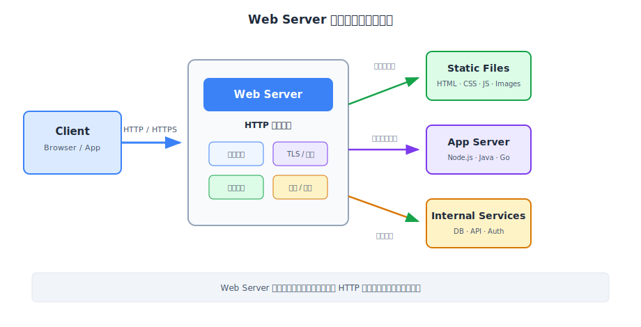

### **什麼是 Web Server？**

**Web Server** 指的其實是負責處理 HTTP/HTTPS 請求的伺服器軟體。當瀏覽器打開一個網址時，背後其實是在送出一個 HTTP request。這個 request 進到伺服器後，總要有一個軟體先接住它、看懂它，然後決定接下來要做什麼。這個「先接住 HTTP request」的角色，就是 Web Server。

如果把網站想成一棟大樓，Web Server 就像接待櫃台。有人走進來說「我要看首頁」，櫃台可以直接把首頁資料拿出來；有人說「我要查訂單」，櫃台不會自己查資料庫，而是把人導向後面的業務系統；有人從錯的入口進來，櫃台也可以告訴他正確入口在哪裡。Nginx 就是很常被放在這個櫃台位置的工具。

以最簡單的靜態網站為例，瀏覽器請求 `/index.html`、`/style.css`、`/logo.png`，Nginx 可以直接從 VPS 的檔案目錄把這些檔案讀出來並回傳。這時候不需要資料庫，也不需要進到後端框架。Nginx 作為 Web Server，自己就能完成這件事。


### **Web Server 不只是回傳網頁檔案**

不過，如果 Web Server 只是單純的回傳 HTML、CSS、JavaScript，那為什麼幾乎每次談到 VPS 部署、後端服務部署、微服務入口時，都會看到 Nginx？

原因是 Web Server 常常不只被拿來「回傳檔案」，而是被放在整個網站的最前面。只要流量先經過 Web Server，它就可以在請求進入後端服務之前，先做很多共通處理，像是判斷這個請求該去哪個服務、要不要走 HTTPS、要不要壓縮、要不要快取、請求量有沒有太多、某些舊網址要不要轉到新網址。

也就是說，Web Server 的角色可以從最基本的回傳靜態檔案，延伸成網站的 **流量入口（Traffic Gateway）**。比方說，當遇到像是 `/api/orders` 的請求時，Nginx 不會自己計算訂單資料，而是把請求轉交給背後真正負責商業邏輯的 **Application Server**，例如 Node.js、Go、Java、Python 服務。Application Server 才是執行登入、權限、訂單、付款、資料庫查詢的地方。


### **為什麼部署網路服務時會需要 Nginx？**

回到部署服務的情境：如果我只是想把網站放到 VPS 上，為什麼不直接讓後端程式對外開 port 就好？例如 Node.js 可以 listen `3000`，Go 可以 listen `8080`，Python 也可以自己起一個 HTTP server，表面上看起來 Nginx 好像不是必需品。

但在自主掌控伺服器（Self-Hosting）的實務部署中，很快就會撞到網路世界的底層物理限制：**在同一個 IP 地址上，同一個 Port（連接埠）在同一時間只能被一個應用程式綁定（Bind）**。

這會帶來兩個問題：

1. **預設通道被獨佔**：外部使用者瀏覽網站時，預設走的是 HTTP（port 80）或 HTTPS（port 443）。如果我讓 Node.js 獨佔了 port 80，那麼跑在同台 VPS 上的 Go 服務或靜態網站，就再也無法使用 port 80 對外服務了。
2. **雜亂的公開入口**：為了讓其他服務也能對外，也是可以強迫它們監聽不同的 port（如 `8080`、`4000`）。但外部使用者不應該記得一堆連接埠（例如 `example.com:3000`、`example.com:8080`），比較合理的入口應該是同一個 domain，搭配不同的乾淨路徑，比方說：`https://example.com/`、`https://example.com/blog`、`https://example.com/api`。


針對上述兩個問題，部署網站時，通常會希望外部只看到乾淨的入口，例如 `https://example.com`。至於內部服務跑在哪個 port、哪個 container、哪台機器，最好不要直接暴露給外部。Nginx 正好可以站在外部世界和內部服務中間，對外負責公開入口，對內再轉發到真正的應用程式。這個分工會讓系統比較容易整理。前端可以是一個靜態檔案目錄，API 可以是一個 Node.js process，後台可以是另一個服務，但外部看到的仍然是同一個網站。Nginx 在中間做的事情，就是把「外部網址」翻譯成「內部服務位置」。

除此之外，如果沒有 Nginx，每個服務可能都要自己處理 HTTPS、壓縮、CORS、log、錯誤頁、流量限制、舊網址轉址。小專案一開始可能還能接受，但服務一多，規則就會散落到不同程式裡，維護起來很痛苦。而 Nginx 的好處是把這些共通問題集中在入口層。後端服務只要專心處理商業邏輯；Nginx 負責在流量進門前先做必要整理。這也是為什麼會把 Nginx 想像成 VPS 上的網站入口管理員，而不是單純的「另一個 server」。

:::tip
這也是為什麼在現代 Serverless/PaaS 平台（如 Vercel）盛行的時代，當我們需要自己租用 VPS 掌控一切時，仍然需要學習 Nginx，因為那些平台只是在底層幫我們封裝了類似 Nginx 的入口代理，而自託管時，這個入口需要我們自己來搭。
:::

<br/>

## **Nginx 常見用途：從部署網站會遇到的問題開始看**

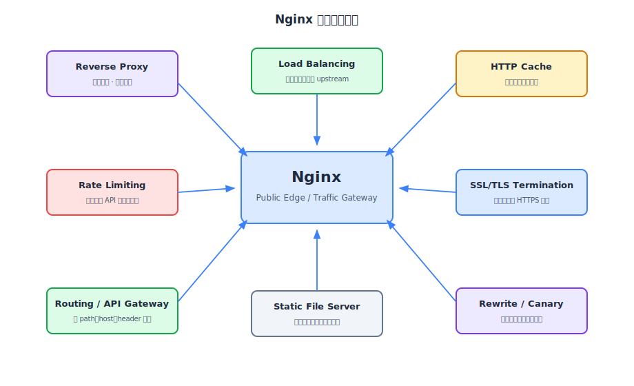

理解 Nginx 為什麼會站在網站入口後，接下來看看它的一些常見用途。這個小節以 VPS 部署網站時遇到的問題為例，探討 Nginx 的用途：先讓前端檔案能被打開，再讓 API 能被轉發，接著處理同 domain 路由、HTTPS、快取、壓縮，最後再探討負載平衡、限流與灰度發布這些更偏進階的入口治理。

### **靜態檔案伺服器 (Static File Server)**

部署一個網站最直覺的第一步，就是讓瀏覽器能拿到 HTML、CSS、JavaScript、圖片與字型。以前端專案來說，通常會先經過 build，產生一包靜態檔案，例如 `dist/` 或 `build/` 目錄。這些檔案本質上不需要後端程式運算，只需要有人把檔案讀出來回傳給瀏覽器。

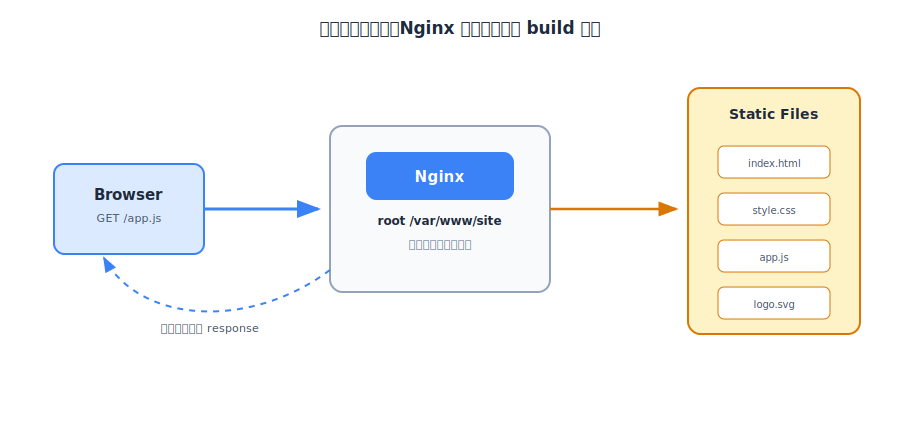

Nginx 很適合做這件事。它可以把 VPS 上某個目錄指定成網站根目錄，例如 `/var/www/site`。當瀏覽器請求 `/index.html` 時，Nginx 就去這個目錄找 `index.html`；請求 `/assets/app.js` 時，就去找對應的 JavaScript 檔案。這種請求不需要進到 Application Server，因此速度快、資源消耗也低。

:::tip 靜態檔案伺服器比想像中更重要
前端網站的大部分載入體驗，其實都和靜態檔案有關。HTML 是否快速回來、CSS 和 JS 是否能被快取、圖片是否正確壓縮，這些都會影響使用者感受到的速度。Nginx 之所以會被業界作為 Web Server 的首選，很大一部分就是因為它在靜態檔案分發上非常成熟、效能優異，同時也支援非常豐富的快取與壓縮策略，可以讓使用者感受到極佳的載入體驗。
:::


### **反向代理 (Reverse Proxy)**

靜態檔案能被打開後，下一個常見問題就是 API。後端服務通常會跑在 VPS 內部的某個 port，例如 Node.js 服務監聽 `localhost:3000`。但外部瀏覽器不應該直接連 `localhost:3000`，因為那是 VPS 自己的內部位址；也不一定希望後端服務直接暴露 public port 給外部世界。

這時候就需要 **反向代理（Reverse Proxy）**。Nginx 對外接收 request，再把 request 轉送給內部後端服務。對瀏覽器來說，它只知道自己連到 `https://example.com/api`；對後端服務來說，它只需要在內部 port 接收 Nginx 轉來的請求。

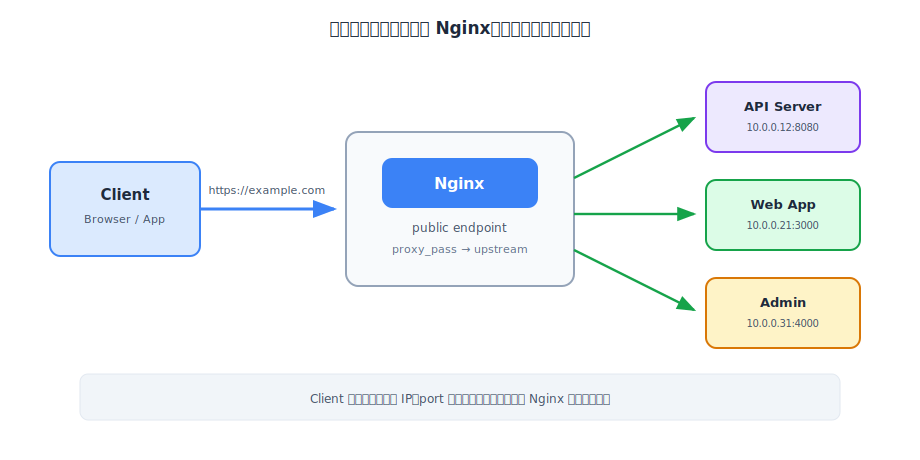

「反向代理」這個名字一開始有點抽象，我的理解方式是**看它服務哪一端**，用生活中的角色來比喻的話：

* **正向代理（Forward Proxy）**：就像 **「海外代購（或家長幫小孩買東西）」**。我想買某個國外網站的商品（Client 想存取某個網站），但因為某些限制無法直接買，於是我請代購去幫我買（Client 透過代理去拿資料）。對商家（Server）來說，它只知道把貨賣給了代購，並不知道背後真正的買家是誰。我們日常用的 VPN 翻牆就是典型的正向代理。
* **反向代理（Reverse Proxy）**：就像 **「公司的總機（或客服熱線 0800）」**。當客戶（Client）撥打電話進來時，只會撥同一個公開的號碼，總機（Nginx）接起後，再根據客戶的需求把電話轉接給內部的銷售部、技術部或客服部（內部的伺服器群，在 Nginx 的術語中被稱為 **上游 Upstream**）。對客戶來說，他不需要、也沒辦法知道內部員工的私人分機號碼。

Nginx 在網站部署中扮演的正是「公司總機」的角色。

:::tip
反向代理的好處不只是轉發。它也讓內部服務被藏起來，外部不需要知道後端服務跑在哪個 port，也不需要知道內部有幾個服務。這讓部署更乾淨，也讓未來調整內部架構時比較不會影響外部入口。
:::

### **路由：同一個 Domain 掛載多個應用**

有了靜態檔案與反向代理後，真正的網站通常會遇到更具體的路由需求：同一個 domain 底下可能要同時放首頁、API、後台、文件站。這時候 Nginx 不只是在「轉發」，而是在做入口路由。

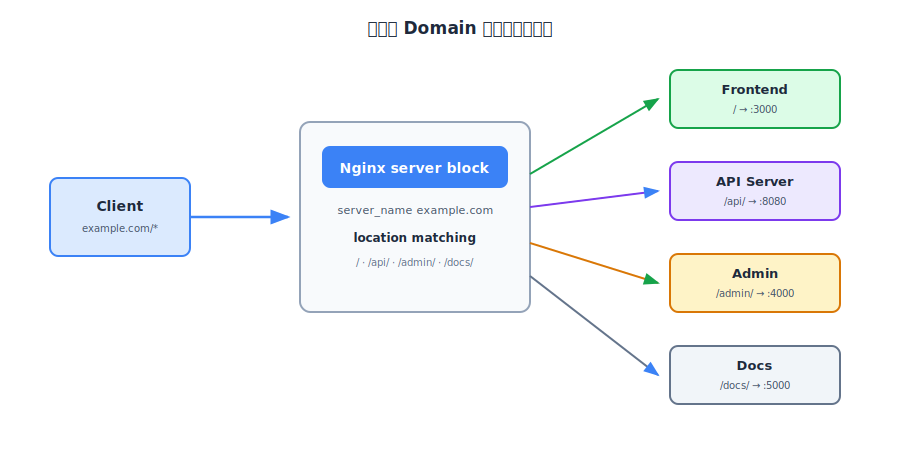

例如 `example.com/` 可以回傳前端網站，`example.com/api/` 轉給 API server，`example.com/admin/` 轉給後台服務，`example.com/docs/` 回傳文件站。外部看起來是一個完整網站，內部其實可以是多個獨立應用。

```nginx
server {
    listen 443 ssl;
    server_name example.com;

    location / {
        root /var/www/frontend;
    }

    location /api/ {
        proxy_pass http://api:8080;
    }
}
```

由於本篇不會介紹 Nginx 的詳細語法，這裡的 `server` 可以先理解成「某個 domain 的入口規則」，`location` 則是「某段路徑要怎麼處理」。先不用急著把所有語法細節一次記完，初學時只要先抓住概念：Nginx 會根據請求的 host 與 path，決定要回檔案，還是轉給某個內部服務。


### **SSL/TLS 終結 (SSL/TLS Termination)**

網站能透過 domain 打開後，下一個繞不開的問題就是 HTTPS。現代網站幾乎都需要 HTTPS，因為瀏覽器會標示不安全連線，許多 API、Cookie、安全政策也都和 HTTPS 綁在一起。

HTTPS 背後需要 TLS 憑證、私鑰、加密協定與握手流程。如果每個後端服務都自己處理 HTTPS，憑證更新、安全設定與 redirect 規則會散落到不同服務裡。比較常見的做法，是讓 Nginx 在最前面統一處理 HTTPS，也就是 **SSL/TLS 終結（SSL/TLS Termination）**。

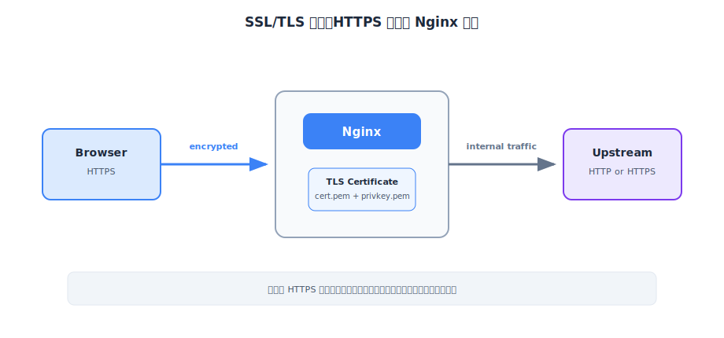

所謂 TLS 終結，意思是瀏覽器到 Nginx 這段走 HTTPS，加解密在 Nginx 這裡完成。Nginx 解開請求後，再把明文的 request 轉給內部 upstream。

這時我可能會有個常見的安全疑問：**「內部這段走不加密的 HTTP，難道不會有安全漏洞嗎？」**

答案是：在單機部署（Nginx 與後端服務跑在同一台 VPS 內，透過 `127.0.0.1` 通訊）或受保護的 VPC 私有子網（Private Subnet）中，外部網路是完全接觸不到這段內部流量的。因此，將昂貴的「加解密運算」統一在最外層的 Nginx 終結，後端服務就能用極快、不耗費額外 CPU 的 HTTP 來溝通，這是一個非常高效且成熟的設計模式。當然，若內部服務跨越了不同的實體機器或雲端環境，內部這段通常還是需要繼續走 HTTPS 來確保安全性。

這樣做的價值是集中管理。憑證放在 Nginx，HTTP 轉 HTTPS 放在 Nginx，TLS protocol 與 cipher suite 也放在 Nginx。後端服務就不用每個都重複處理同一批 HTTPS 邊界問題。

### **HTTP Cache**

當網站可以被正常打開、API 也能被轉發後，下一個會遇到的是效能問題。某些資源如果每次 request 都重新打到後端，後端壓力會變大，使用者等待時間也會變長。這時候 Nginx 可以在入口層做 HTTP cache。

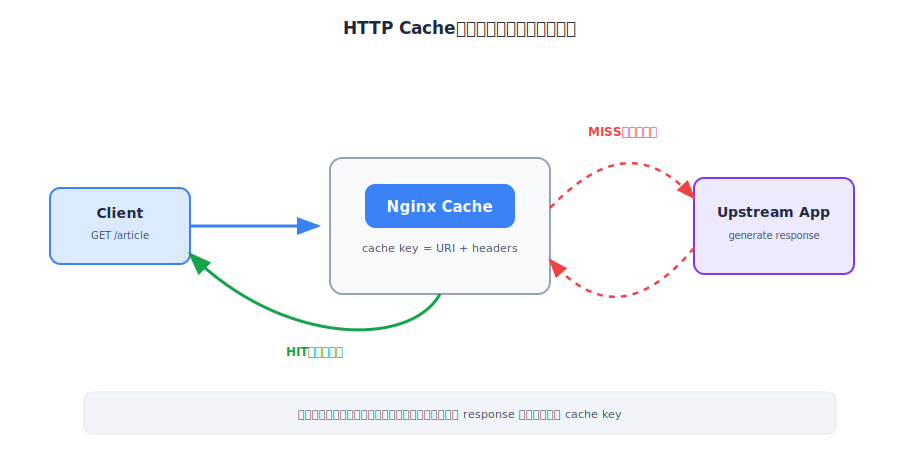

HTTP cache 的想法很直覺：第一次請求某個資源時，如果 Nginx 沒有快取，就轉到後端拿資料，這叫 cache miss。拿到 response 後，Nginx 可以依照設定把它存起來。下一次相同資源又被請求時，如果快取仍然有效，Nginx 就直接回傳快取內容，這叫 cache hit。

適合快取的內容通常是「很多人都會拿到一樣結果」的東西，例如圖片、CSS、JavaScript、公開文章頁、公開商品列表。不適合隨便快取的內容，通常和使用者狀態有關，例如個人資料、購物車、訂單、後台資料。因為一旦快取規則錯誤，就可能把 A 使用者的資料回給 B 使用者。

:::danger 快取錯誤比沒有快取更危險
效能問題通常只是慢，快取錯誤可能直接變成資料外洩。只要 response 內容和使用者身分、授權狀態、語系、裝置類型或實驗分組有關，就需要仔細檢查 cache key、`Cache-Control` 與 `Vary` header。
:::

### **內容壓縮 (Compression)**

除了快取之外，另一個常見的效能手段是壓縮。瀏覽器和伺服器之間傳輸的資料越小，網路下載時間通常越短。Nginx 可以在回傳 response 前，把適合壓縮的內容用 `gzip` 或 `brotli` 壓縮後再送出去。

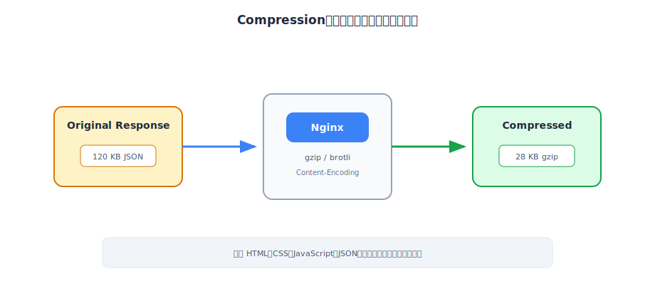

壓縮最適合文字型資源，例如 HTML、CSS、JavaScript、JSON。這些內容通常有大量重複字串，壓縮效果很好。相反地，JPEG、PNG、MP4、zip 這類檔案通常已經壓縮過，再壓一次不一定會變小，反而浪費 CPU。

從部署角度來看，壓縮很適合放在 Nginx 這一層，因為它屬於傳輸最佳化，不是產品邏輯。後端服務只要產生原始 response，Nginx 再根據瀏覽器支援的格式決定是否壓縮即可。

### **負載平衡 (Load Balancing)**

前面的用途多半和單台 VPS 或單一服務入口有關。當流量變大時，單一後端服務可能開始撐不住。這時候直覺解法是開多個後端 instance，但只要後端變成多台，就需要一個入口決定每個 request 要送去哪一台。這就是 **負載平衡（Load Balancing）**。

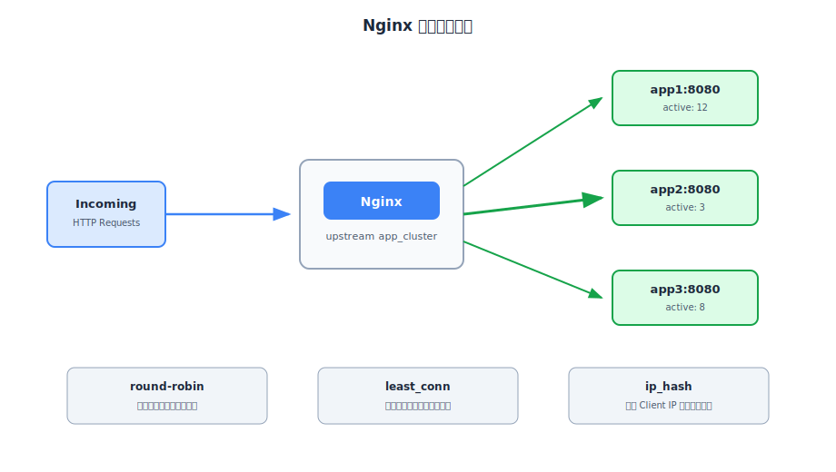

最簡單的策略是 round-robin，也就是輪流分配。第一個 request 給 app1，第二個給 app2，第三個給 app3，接著再回到 app1。這適合後端機器規格差不多、每個 request 成本也差不多的情境。

如果不同 request 的處理時間差很多，就可能使用 least connections，讓新請求優先送到目前連線數較少的後端。若希望同一個 Client IP 盡量固定到同一台後端，可以使用 IP hash。這在某些依賴 session affinity（對特定伺服器的黏性）的系統中會比較方便，但也可能帶來分配不均的缺點：**例如同一個公司或學校宿舍裡的所有電腦，對外上網時通常共享同一個公開 IP（在網路術語中稱為站在同一個 NAT 後面）**，這會導致這群使用者的請求全部被擠到同一台後端伺服器上。


### **API Gateway**

當系統只有一個 API 服務時，Nginx 做反向代理就很夠用。但當 API 服務變多，例如 User API、Order API、Payment API 都拆開時，入口層會開始需要更多統一規則。這時 Nginx 可以扮演輕量的 API Gateway。

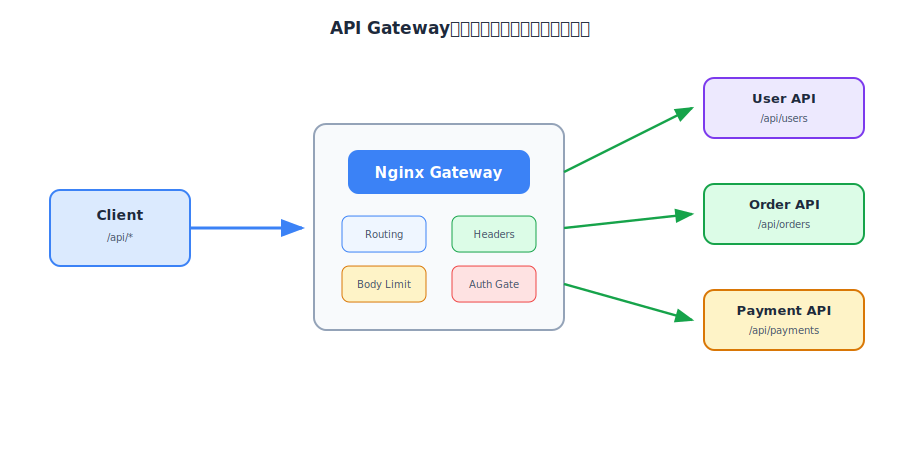

API Gateway 這個詞很容易被講得很大。以這篇的範圍來說，我先把它理解成「API 的統一入口」。所有 `/api/*` 請求先進 Nginx，再由 Nginx 根據路徑轉給不同 API 服務。入口層也可以順便處理一些共通規則，例如 request body 大小限制、header 補齊、basic auth、錯誤頁、簡單的流量限制。

但 Nginx 不應該被當成放商業邏輯的地方。像是「這個使用者是否能取消訂單」、「付款狀態是否允許退款」、「庫存是否足夠」這些規則，仍然應該在 Application Server 裡處理。Nginx 適合處理入口規則，不適合處理產品狀態。

### **CORS**

當前端和 API 不在同一個 origin 時，瀏覽器會套用 CORS（Cross-Origin Resource Sharing）規則。Origin 可以先理解成「協定 + 網域 + port」的組合。例如 `https://app.example.com` 和 `https://api.example.com` 是不同 origin，即使它們都屬於同一個主網域。

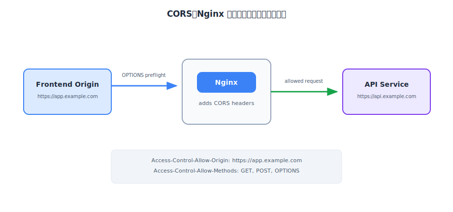

CORS 不是 Nginx 發明的安全機制，而是瀏覽器用來限制跨來源請求的規則。伺服器必須明確告訴瀏覽器：哪些 origin 可以存取、哪些 method 可以使用、哪些 header 可以被送出。這些資訊會放在 `Access-Control-Allow-*` 相關 response headers 裡。

Nginx 可以在入口層統一補上 CORS headers，避免每個 API 服務都重複寫一次。不過這不代表可以無腦設成 `*`。如果 API 會帶 cookie、Authorization header，或涉及私人資料，就應該精準限制允許的 origin，否則會讓瀏覽器端安全邊界變得過於寬鬆。

:::info 延伸閱讀：CORS 的完整背景
這裡只站在 Nginx 的角度看 CORS：Nginx 可以幫忙統一補 header，但真正決定瀏覽器為什麼要擋跨來源請求、simple request 與 preflight request 差在哪裡，屬於瀏覽器安全模型的問題。我已經在 [不可不知的網路基石：同源政策（SOP）與跨來源資源共享（CORS）](../13-Software-Engineering/02-Security/01-sop-and-cors.md) 另外整理過，閱讀這段時可以搭配那篇一起看。
:::

### **流量限制 (Rate Limiting)**

當網站開始對外開放後，入口層還需要面對異常流量。這些流量不一定是很複雜的攻擊，有時只是某個 IP 短時間內瘋狂重試登入、一直打搜尋 API、或不斷呼叫昂貴的查詢。後端如果每一筆都認真處理，很快就會被拖慢。

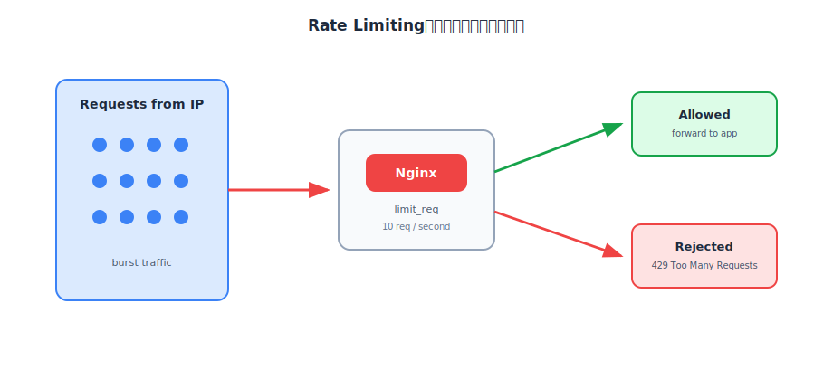

Rate limiting 可以先理解成入口層的節流閥。正常速度的請求可以通過；短時間內超過限制的請求，Nginx 可以延遲處理或直接回應 `429 Too Many Requests`。這樣後端服務就不需要承擔所有異常流量。

Rate limiting 不能取代完整資安防護，也不能取代應用程式內的權限檢查，但它很適合做第一層保護。尤其是登入、簡訊驗證、寄信、搜尋、報表查詢這類昂貴或敏感 API，通常都值得在入口層先加上基本限制。

### **URL 重寫與重定向 (Rewrite & Redirect)**

網站部署久了，URL 規則一定會變。舊文章路徑可能改版，HTTP 需要導到 HTTPS，`www.example.com` 和 `example.com` 可能需要統一，某些 trailing slash 規則也需要固定。這些都會用到 rewrite 或 redirect。

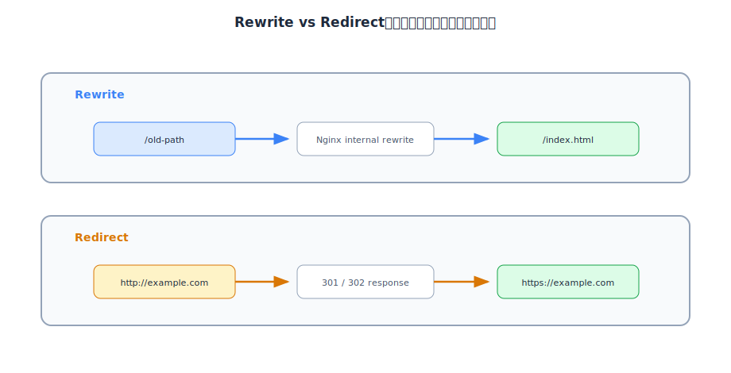

rewrite 和 redirect 的差異在於：rewrite 偏向 Nginx 內部改寫請求路徑，瀏覽器網址列不一定會變；redirect 則是伺服器明確回應 301 或 302，告訴瀏覽器改去另一個 URL，所以瀏覽器網址列會變。

這些規則看起來小，但在正式網站很重要。HTTP 轉 HTTPS 影響安全性；舊網址轉新網址影響 **SEO（搜尋引擎最佳化）** 和既有連結（若沒有將 www 與 non-www 網址統一，搜尋引擎會把它們視為兩個重複內容的獨立網站，因而分散並降低搜尋排名權重）；把這些入口規則放在 Nginx，比散落在前端或後端程式裡更清楚。

### **A/B 測試與灰度發布 (Canary Release)**

最後一個用途比較偏進階，但也能幫助理解 Nginx 作為流量入口的價值。當新版本服務準備上線時，不一定要一次把所有使用者都切到新版本。比較穩健的做法，是先把少量流量導到新版本，觀察錯誤率、延遲與行為，再逐步放大比例。

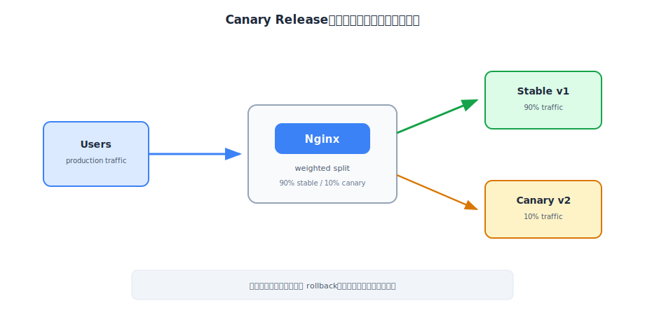

這種做法稱為灰度發布或 Canary Release。Nginx 可以依照權重、cookie、header、IP hash 等方式做基本分流。例如 90% 流量仍然送到穩定版 v1，10% 流量送到新版本 v2。若觀察結果正常，再逐步提高 v2 的比例。

灰度發布的重點不只是分流，而是分流後要能觀察與回滾。如果沒有監控，流量雖然被導到新版本，卻沒有人知道新版本是否變慢或出錯；如果沒有 rollback 計畫，發現問題後也無法快速切回穩定版。因此這個功能雖然可以由 Nginx 協助，但仍然需要搭配部署流程與監控系統。

<br/>

## **補充：Nginx、Apache、Node.js Server 的差異**
理解 Nginx 的角色與常見用途後，來看看 Nginx 與其他相同或類似定位的工具差異。這邊就舉老牌的 Apache 與我比較熟悉的 Node.js server 為例，它們都可能處理 HTTP request，但適合解決的問題也不一樣。

### **Nginx 與 Apache**

Apache HTTP Server 是非常老牌、成熟、功能完整的 Web Server。它的特色之一是模組生態與 `.htaccess`，也就是可以在特定目錄底下放設定檔，讓不同目錄擁有不同規則。這對早期共享主機很方便，因為同一台機器可能放了很多網站，站點擁有者未必能改整台 Web Server 的主設定檔，但可以改自己目錄裡的 `.htaccess`。

Nginx 的思路比較不一樣。Nginx 通常把設定集中在主設定檔或站台設定檔裡，由入口層統一管理規則。這種方式一開始看起來比較不彈性，但在 VPS、容器、反向代理、負載平衡這類部署情境下，反而比較乾淨：所有入口規則都集中在同一個地方，靜態檔案、TLS、proxy、cache、rate limit 都可以被一起整理。

所以比較準確的理解是：Apache 很適合傳統網站與需要 `.htaccess` 彈性的環境；Nginx 很適合被放在現代部署架構的入口，負責高併發、代理、TLS 與流量治理。若目標是自己租 VPS 部署前後端服務，Nginx 會更常出現在教學與實務架構圖裡。

### **Nginx 與 Node.js Server**

我特別把 Node.js server 放進來比較，是因為 Node.js 是我平常工作會用到的 runtime。嚴格來說，這裡也可以換成 Python、Go、Java 或其他後端服務；真正要比較的不是語言本身，而是「Application Server 已經能處理 HTTP request，為什麼前面還常常多放一層 Nginx？」

Node.js 的確可以直接建立 HTTP server，也可以直接 listen `80` 或 `443` 對外服務。問題是，能做到不代表適合把所有入口責任都放在它身上。當網站開始需要 HTTPS 憑證、自動續期、靜態檔案快取、壓縮、舊網址轉址、同 domain 多服務路由、流量限制時，這些事情如果都塞進 Node.js，應用程式會慢慢混入很多和產品邏輯無關的基礎設施規則。

比較乾淨的分工是：Nginx 負責 public internet 入口，先處理網路邊界與傳輸層面的共通問題；Node.js server 負責應用程式真正關心的事情，例如登入、權限、訂單、付款、資料庫存取。這樣做不是因為 Node.js 比較弱，而是因為入口治理和商業邏輯原本就屬於不同層次。把它們分開，部署時比較好維護，未來要把單一 Node.js process 換成多個 instance、甚至換成別的語言服務，也比較不會牽動外部入口。

<br/>

## **Reference**

- **[Nginx 是什麼？認識反向代理、負載平衡](https://kucw.io/blog/nginx/)**
- **[[基礎觀念系列] Web Server & Nginx，2](https://medium.com/starbugs/web-server-nginx-2-bc41c6268646)**
- **[Celebrating 20 Years of NGINX](https://blog.nginx.org/blog/celebrating-20-years-of-nginx)**
- **[Inside NGINX: How We Designed for Performance & Scale](https://blog.nginx.org/blog/inside-nginx-how-we-designed-for-performance-scale)**
- **[NGINX Reverse Proxy](https://docs.nginx.com/nginx/admin-guide/web-server/reverse-proxy)**
- **[Using nginx as HTTP load balancer](https://nginx.org/en/docs/http/load_balancing.html)**
- **[NGINX Content Caching](https://docs.nginx.com/nginx/admin-guide/content-cache/content-caching/)**
- **[Apache HTTP Server Multi-Processing Modules](https://httpd.apache.org/docs/current/en/mpm.html)**
- **[Node.js: Don't Block the Event Loop](https://nodejs.org/en/learn/asynchronous-work/dont-block-the-event-loop)**
