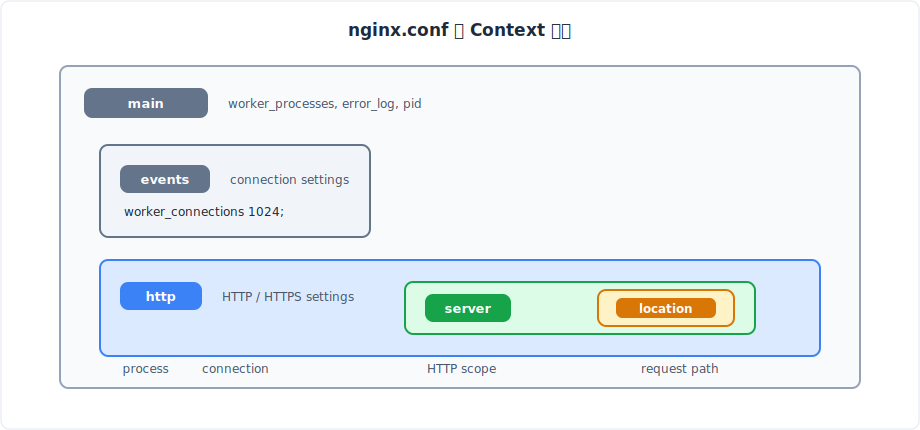
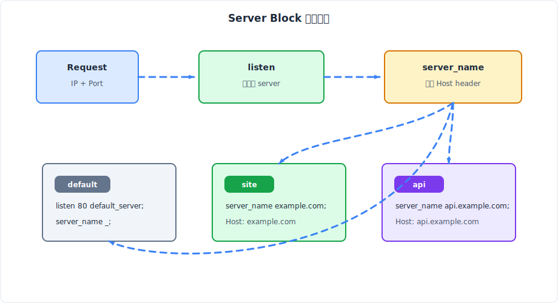
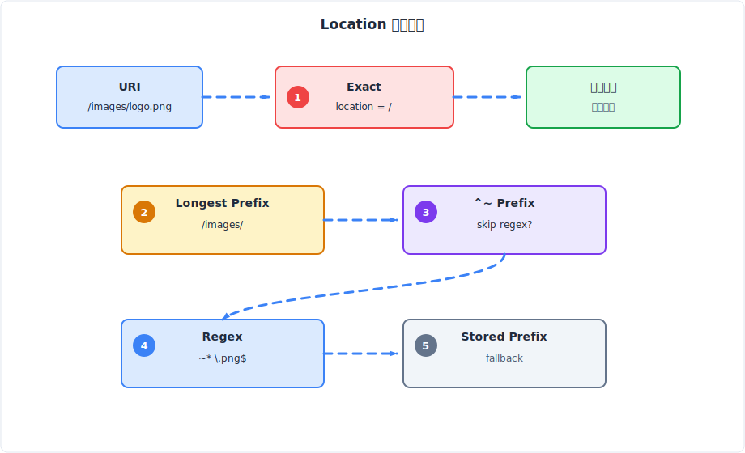
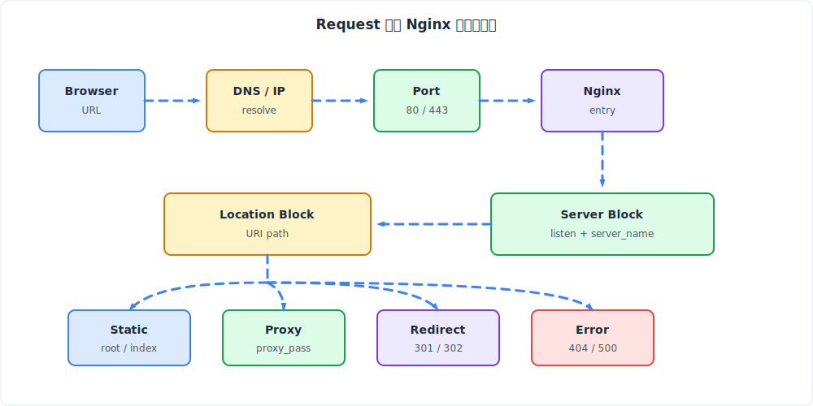
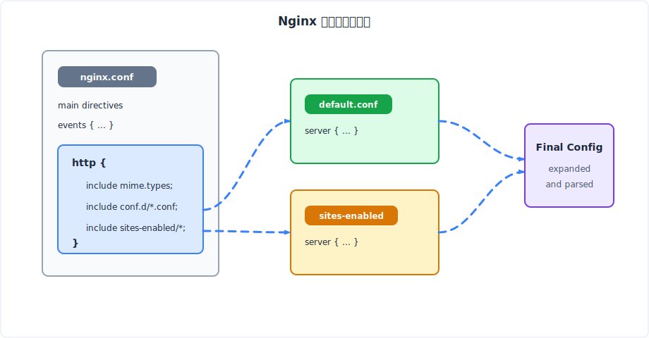

## **前言**

前一篇筆記我們簡單認識了 Nginx 是什麼以及它能做什麼，這一篇將聚焦於 Nginx 設定檔的基本結構，以及 Nginx 處理一個 HTTP Request 的流程。為了避免在還沒建立起設定檔結構概念之前就被各種複雜的設定淹沒，我們先理解 `main`、`events`、`http`、`server`、`location` 的分工，以及 Nginx 選擇 server block 與 location block 的順序，後續學習反向代理、靜態檔案、HTTPS、redirect、cache 的應用時，我們就能比較清楚知道該把哪些設定放在哪個 context 裡。

<br/>

## **從最小 nginx.conf 看懂設定檔的骨架**

Nginx 設定檔像是一份分層規則表：不同規則必須放在不同層級，Nginx 啟動或 reload 時會讀取這些規則，之後 request 進來時再依照規則做匹配與處理。



### **Directive、Block 與 Context 是什麼**

Nginx 設定檔裡最基本的單位叫做 **directive**。一個 directive 通常由名稱、參數與分號組成，例如：

```nginx
worker_processes auto;
error_log /var/log/nginx/error.log warn;
```

這種單行設定可以先理解成「設定某個值」。
- `worker_processes auto;` 是告訴 Nginx worker process 數量由系統自動決定
- `error_log /var/log/nginx/error.log warn;` 則是設定錯誤日誌的位置與等級。

另一種 directive 會用 `{}` 包住更多設定，稱為 **block directive**。如果一個 block 裡面可以繼續放 directive，這個 block 所形成的作用範圍就稱為 **context**。例如 `events`、`http`、`server`、`location` 都是常見 context。

```nginx
http {
    server {
        location / {
            return 200 "hello nginx\n";
        }
    }
}
```

:::tip[這段設定的意思：]
是把 HTTP 相關規則放進 `http` context，再把某個網站入口規則放進 `server` context，最後把某段 URL path 的處理方式放進 `location` context。
:::

:::info[為什麼設定要分成不同層級？]
Nginx 把設定分層，不只是為了格式好看，而是因為不同規則的影響範圍不同。
- 最外層的設定會影響整個 Nginx process，例如 worker process 數量、錯誤日誌、PID 檔位置。
- `events` 關心的是 Nginx 怎麼處理連線。
- `http` 開始才進入 HTTP 世界，裡面可以放多個 `server`。
- 每個 `server` 又可以放多個 `location`。

這種設計讓共通設定可以放在外層，特定網站或特定路徑的設定可以放在內層。好處是：
- 設定更集中：想要改某個網站的 proxy 設定時，不用翻遍整個 `nginx.conf`，只要找到對應的 `server` 或 `location` 就可以了。
- 易於維護：每個 block 只負責自己的事情，不會因為修改一個地方就意外影響到其他地方。
- 方便 include：可以把不同 server 的設定拆成不同檔案（例如 `sites-available` 與 `sites-enabled` 的常見做法），在 `http` 層只用 `include` 引入，main file 保持簡潔。
:::

### **一份最小 nginx.conf 需要包含什麼**

如果目標是讓 Nginx 能以 HTTP server 的形式啟動，最小結構通常會長得像這樣：

```nginx
events {}

http {
    server {
        listen 80;
        server_name localhost;

        location / {
            root /usr/share/nginx/html;
            index index.html;
        }
    }
}
```

這份設定非常小，但已經包含了 Nginx 作為 HTTP server 時最重要的骨架：

| 區塊       | 角色                                               |
| ---------- | -------------------------------------------------- |
| `events`   | 告訴 Nginx 連線處理相關設定放在哪裡                |
| `http`     | HTTP/HTTPS 流量規則的總容器                        |
| `server`   | 一組入口規則，通常對應某個 port、domain 或預設站台 |
| `location` | 在某個 server 裡，根據 URL path 決定實際處理方式   |

真正的正式環境通常會再加上 `user`、`worker_processes`、`error_log`、`access_log`、`include mime.types`、`sendfile`、`gzip` 等設定。不過那些都可以視為在這個骨架上繼續補細節。初學時最重要的是先知道：Nginx 的 HTTP 規則不是散落在任意位置，而是有固定的層級。

:::warning 常見錯誤：把 directive 放錯 context
Nginx 對 directive 的位置很嚴格。例如 `server` block 必須放在 `http` block 裡，`location` block 必須放在 `server` block 裡。如果把整段 `server { ... }` 放到最外層，或把 `location { ... }` 直接 include 到 `http` 層，Nginx 會在啟動或 `nginx -t` 時回報類似 `directive is not allowed here` 的錯誤。
:::


<br/>

## **Main、Events、HTTP：進入網站規則之前的外層設定**

### **Main Context：影響整個 Nginx Process 的設定**

所謂 **main context**，其實就是 `nginx.conf` 中不在任何 `{}` 裡面的最外層位置。它沒有一個叫做 `main {}` 的 block，而是所有頂層 directive 的共同作用範圍。

常見的 main context 設定包含：

```nginx
user nginx;
worker_processes auto;
error_log /var/log/nginx/error.log warn;
pid /var/run/nginx.pid;
```

這些設定通常不是在描述某個 domain 或某段 URL path，而是在描述 Nginx process 本身。例如 worker process 要用什麼使用者執行、開幾個 worker、錯誤日誌寫到哪裡、master process 的 PID 放在哪裡。

:::note 
初學階段不需要急著調整這些值，但要知道它們的層級比 HTTP 規則更外面。也就是說，`worker_processes` 不是某個網站的設定，而是整個 Nginx 程式的設定。
:::

### **Events Block：Nginx 如何處理連線**

`events` block 和 Nginx 如何處理 connection 有關，常見設定像是：

```nginx
events {
    worker_connections 1024;
}
```

`worker_connections` 可以先理解成每個 worker process 可以同時處理的連線數上限。Nginx 之所以常被稱為高效能 Web Server，很大一部分和它的事件驅動模型有關。不過這篇的目標不是深入 Nginx event loop 或作業系統 I/O 模型，因此目前我們只需要記住一件事：**`events` 是連線處理層，不是網站路由層**。

也因為它不是網站路由層，所以一般部署靜態網站或反向代理時，很少需要一開始就修改 `events`。大多數情況下，保留預設值或只設定 `worker_connections` 就已經足夠。

### **HTTP Block：HTTP 世界的總入口**

到了 `http` block，才正式進入 HTTP/HTTPS request 的設定範圍。常見的 `nginx.conf` 會長得像這樣：

```nginx
http {
    include /etc/nginx/mime.types;
    default_type application/octet-stream;

    access_log /var/log/nginx/access.log;

    include /etc/nginx/conf.d/*.conf;
}
```

`http` block 裡可以放所有 HTTP 相關規則，例如 MIME type、access log、gzip、client body 大小限制、proxy 共用設定，也可以放一個或多個 `server` block。

這裡最容易忽略的是 `include`。很多 Nginx 安裝方式的主設定檔裡，不一定直接寫很多 `server { ... }`，而是在 `http` block 裡寫：

```nginx
include /etc/nginx/conf.d/*.conf;
```

這代表 `/etc/nginx/conf.d/` 底下的 `.conf` 檔案會被讀進目前的 `http` context。也就是說，如果 `default.conf` 裡直接寫 `server { ... }`，它實際上會被插入到 `http { ... }` 裡，因此語法是合法的。這個觀念我們之後會再回來看，因為它正是 Docker 掛載 `default.conf` 時最容易搞混的地方。

<br/>

## **Server Block：一組入口規則如何被選中**

前面已經釐清 `http` 是 HTTP 世界的總容器。接下來的自然問題是：如果 `http` 裡可以放很多個 `server` block，那一個 request 進來時，Nginx 到底會選哪一個？



### **Server Block 代表什麼**

我會把 **server block** 理解成「一組入口規則」。這組入口規則通常會描述：

```nginx
server {
    listen 80;
    server_name example.com www.example.com;

    location / {
        root /var/www/example;
        index index.html;
    }
}
```

這段設定不是在建立一台新的實體 server，也不是在建立一個新的 process。它是在告訴 Nginx：如果有 request 進到 port 80，且 Host header 對應 `example.com` 或 `www.example.com`，就使用這一組規則處理。

因此，一個 server block 可以對應一個 domain，也可以對應一個 port，或作為某個 port 的預設網站。當同一台 VPS 上有多個網站時，通常會在同一個 `http` block 裡放多個 `server` block，讓 Nginx 根據 request 的入口資訊決定要套用哪一組。

### **listen：先看請求進到哪個 IP 與 Port**

Nginx 選擇 server block 的第一步，是看 request 進到哪個 IP 與 port。這由 `listen` directive 描述：

```nginx
server {
    listen 80;
    server_name example.com;
}

server {
    listen 443 ssl;
    server_name example.com;
}
```

`listen 80` 表示這個 server block 參與 port 80 的 HTTP 流量處理。`listen 443 ssl` 則表示這個 server block 參與 port 443 的 HTTPS 流量處理，並且會啟用 SSL/TLS 相關處理。

這裡有一個重要的順序：Nginx 不是先看 domain，再看 port。網路連線本身一定是先打到某個 IP 與 port，因此 Nginx 會先找到符合這個 listen socket 的候選 server blocks，再繼續看 `server_name`。

### **server_name：再看 Host Header 對應哪個 Domain**

找到同一個 IP/port 的候選 server blocks 後，Nginx 會根據 request 裡的 `Host` header 選擇 `server_name` 相符的 server block。

例如瀏覽器請求：

```http
GET / HTTP/1.1
Host: blog.example.com
```

若設定檔裡有：

```nginx
server {
    listen 80;
    server_name example.com;
}

server {
    listen 80;
    server_name blog.example.com;
}
```

Nginx 會選到 `server_name blog.example.com;` 的那個 server block。

:::warning[容易產生的誤解：server_name 不是 DNS 設定]
`server_name` 不是 DNS 設定。DNS 的工作是把 domain 解析到 IP；而 `server_name` 是 request 已經抵達 Nginx 之後，Nginx 用來判斷「這個 Host 應該交給哪個 server block」的規則。DNS 決定流量能不能到這台機器，`server_name` 決定到達這台機器後由哪組 Nginx 規則接手。
:::

### **沒有匹配到 server_name 時會怎樣**

如果同一個 port 底下沒有任何 `server_name` 匹配，Nginx 不會因此不知道怎麼辦，而是會把 request 交給該 IP/port 的 **default server**。

可以明確指定 default server：

```nginx
server {
    listen 80 default_server;
    server_name _;
    return 404;
}
```

如果沒有使用 `default_server` 明確指定，Nginx 通常會使用同一個 listen address/port 中第一個出現的 server block 作為預設值。這也是為什麼實務上常常會刻意寫一個明確的 default server，避免陌生 Host header 意外落到正式網站。

:::warning default server 是以 listen port 為單位
`default_server` 不是整台 Nginx 只有一個，而是跟特定 `listen` address/port 綁在一起。`listen 80 default_server;` 只處理 port 80 的預設流量，port 443 仍然需要自己的 default server 規則。
:::

### **server_name _ 代表什麼意思？**

很多範例會看到：

```nginx
server {
    listen 80 default_server;
    server_name _;
    return 444;
}
```

我一開始以為 `_` 是 Nginx 的萬用字元，後來才發現這是個很常見的誤解。`server_name _;` 本身沒有特殊魔法，它只是放了一個正常情況下不會被真實 domain 使用的名稱，用來表達「這不是給任何正式 domain 用的 server block」。真正讓這個 server block 接住未匹配請求的，是 `listen 80 default_server;`，不是 `_`。


### **多 Domain 範例：同一台 Nginx 管多個網站**

把 `listen` 與 `server_name` 串起來後，多 domain 設定就比較好理解：

```nginx
server {
    listen 80 default_server;
    server_name _;
    return 404;
}

server {
    listen 80;
    server_name example.com www.example.com;

    location / {
        root /var/www/site;
        index index.html;
    }
}

server {
    listen 80;
    server_name api.example.com;

    location / {
        proxy_pass http://127.0.0.1:3000;
    }
}
```

這份設定背後的思路是：所有 port 80 流量先進 Nginx。若 Host 是 `example.com` 或 `www.example.com`，就回靜態網站；若 Host 是 `api.example.com`，就轉給本機的後端服務；若 Host 是陌生 domain 或直接用 IP 存取，則落到 default server 回 404。

> 這正是 Nginx 作為網站入口的核心價值之一：外部看起來都是同一台機器上的 port 80，但內部可以根據 Host 分成不同網站與服務。

<br/>

## **Location Block：同一個網站裡如何選擇處理規則**

理解 server block 後，request 已經被分配到某一組網站入口規則。但一個網站裡還會有很多路徑：首頁、圖片、API、後台、下載檔案。這時候 Nginx 需要在選中的 server block 裡，再用 **location block** 決定實際處理方式。



### **Location Block 代表什麼**

`location` 是 server block 內部的路徑規則。

例如：

```nginx
server {
    listen 80;
    server_name example.com;

    location / {
        root /var/www/frontend;
    }

    location /api/ {
        proxy_pass http://127.0.0.1:3000;
    }
}
```

當 request 是 `/assets/app.js`，可能由 `location /` 處理並回傳靜態檔案。當 request 是 `/api/users`，則會命中 `/api/`，並被轉發到後端服務。

:::note
location 的匹配對象是 URI path。`/api/users?page=1` 在做 location 選擇時，主要看的是 `/api/users`，query string 不會拿來決定 location。
:::

### **Prefix Location：最常見的路徑前綴匹配**

最常見的 location 是 prefix location，也就是根據路徑前綴匹配：

```nginx
location / {
    root /var/www/site;
}

location /api/ {
    proxy_pass http://127.0.0.1:3000;
}

location /assets/ {
    root /var/www/site;
}
```

Prefix location 的核心規則是「找最長的匹配前綴」。如果 request path 是 `/api/users`，`/` 和 `/api/` 都能匹配，但 `/api/` 比 `/` 更具體，所以 Nginx 會先記住 `/api/` 這個結果。

`location /` 幾乎可以視為 fallback，因為所有以 `/` 開頭的 URI 都會匹配它。這也是為什麼很多設定檔都會放一個 `location /`，作為網站的主要處理規則。

### **Exact Match：用 = 鎖定完全相同的 URI**

如果 location 前面加上 `=`，代表 exact match，也就是 URI 必須完全相同：

```nginx
location = / {
    return 200 "home\n";
}
```

這段只會匹配 `/`，不會匹配 `/about`，也不會匹配 `/index.html`。Exact match 的優先序最高，只要命中就直接停止搜尋。

:::note
實務上，`location = /` 常用來特別處理首頁，或讓頻繁請求的固定 URI 直接命中，避免進入後面的 prefix 與 regex 判斷。
:::

### **Regex Location：用正規表示式匹配一類路徑**

Regex location 用 `~` 或 `~*` 表示：

```nginx
location ~ \.php$ {
    fastcgi_pass 127.0.0.1:9000;
}

location ~* \.(jpg|jpeg|png|gif|webp)$ {
    expires 30d;
}
```

`~` 是大小寫敏感的 regex match，`~*` 是大小寫不敏感的 regex match。Regex location 適合用來描述「一類路徑」，例如所有圖片副檔名、所有 `.php` 檔案、某些符合模式的 API path。

不過 regex location 有一個需要特別記住的特性：**多個 regex location 會依照設定檔出現順序檢查，第一個匹配者勝出**。這和 prefix location 的「最長前綴勝出」不同，因此 regex 規則越多，越需要注意排列順序。

### **^~：保留 Prefix 結果並跳過 Regex**

`^~` 是另一個很容易誤解的 modifier：

```nginx
location ^~ /images/ {
    root /data;
}

location ~* \.(jpg|jpeg|png|gif)$ {
    expires 30d;
}
```

它的意思是：若 prefix location 被找到，Nginx 就會直接使用這個 prefix location，不再繼續檢查 regex location。

與一般 prefix location 的差別是：**一般 prefix location 被找到時，Nginx 不一定會立刻使用它，而是先把它暫存起來，接著還會繼續檢查 regex location**。如果後面的 regex 也命中，regex 可能會覆蓋剛剛找到的 prefix 結果。

假設設定檔是這樣：

```nginx
location /images/ {
    return 200 "prefix images\n";
}

location ~* \.png$ {
    return 200 "regex png\n";
}
```

當 request path 是 `/images/logo.png` 時，Nginx 會先發現 `/images/` 是最長 prefix，所以先把 `location /images/` 暫存起來。接著 Nginx 還會繼續檢查 regex location。後面的 `location ~* \.png$` 也命中了 `/images/logo.png`，所以最後真正被使用的是 regex location，response 會是 `regex png`。

如果我不希望 `/images/` 底下的請求被副檔名 regex 覆蓋，就可以改成：

```nginx
location ^~ /images/ {
    return 200 "prefix images\n";
}

location ~* \.png$ {
    return 200 "regex png\n";
}
```

這時同樣請求 `/images/logo.png`，Nginx 仍然會先找到 `/images/` 這個最長 prefix，但因為它帶有 `^~`，所以 Nginx 會直接停在這裡，不再檢查後面的 `.png` regex。最後真正被使用的是 `location ^~ /images/`，response 會是 `prefix images`。

### **Location 優先順序整理**

把前面的規則合在一起，Nginx 選 location 的順序可以整理成：

| 順序 | 判斷階段           | 範例                                      | 行為                                                          |
| ---- | ------------------ | ----------------------------------------- | ------------------------------------------------------------- |
| 1    | Exact match        | `location = /`                            | 完全命中就直接使用                                            |
| 2    | Prefix scan        | `/`、`/api/`、`/api/admin/`               | 掃描所有 prefix location，先暫存最長匹配前綴                  |
| 3    | `^~` prefix check  | 暫存結果是 `location ^~ /images/`         | 若最長 prefix 帶 `^~`，直接使用它，並跳過 regex               |
| 4    | Regex scan         | `location ~* \.png$`                      | 若沒有被 `^~` 停住，依設定檔順序找第一個匹配的 regex location |
| 5    | Stored prefix used | 第 2 步暫存的 `/api/admin/` 或 `/images/` | 若沒有 regex 命中，才使用前面暫存的最長 prefix                |

這裡的 **Stored prefix** 不是另一種新的 `location` 寫法，而是第 2 步 prefix scan 時先記住的結果。也就是說，`location /api/` 這種 prefix location 可能在第 2 步先被「暫存」，但要等到後面的 `^~` 與 regex 判斷都結束後，才知道它是不是最後真的會被使用。


:::tip Location 不是照檔案順序從上到下全部比完
Prefix location 不是單純看誰先出現，而是看最長前綴。Regex location 才是依照出現順序找第一個命中。這也是為什麼 location 規則看起來簡單，但混用 prefix、regex、`^~` 時很容易出現和直覺不同的結果。
:::

<br/>

## **把 Server 與 Location 串起來：一個 Request 進來時發生什麼事**

現在已經分別看過 server block 與 location block，但真正的 request 不會分段進來。瀏覽器輸入網址後，整個流程會從 DNS、IP、port、Nginx server selection、location selection 一路串到最後的處理結果。



### **Browser 到 Nginx：DNS、IP 與 Port 先決定連線入口**

假設瀏覽器要打開：

```text
https://example.com/api/users
```

第一步不是 Nginx 讀 `server_name`，而是瀏覽器先透過 DNS 找到 `example.com` 對應的 IP。接著因為 URL 使用 `https://`，瀏覽器會連到該 IP 的 port 443。若是 `http://`，預設會連 port 80。

連線到達 Nginx 後，Nginx 才開始用設定檔判斷這個 request 應該交給哪一組規則。這也呼應前面提到的順序：網路層先決定 IP/port，HTTP 層才有 Host 與 path 可以用來分流。

如果是 HTTPS，TLS handshake 階段還會牽涉 SNI（Server Name Indication），讓 Nginx 在加密連線建立時就知道 client 想連哪個 hostname，進而選擇合適憑證。未來有時間會再針對 Nginx 的 HTTPS 設定與觀念做詳細的筆記，關於 HTTPS 與 TLS 的細節，可以參考之前的 [HTTPS / TLS 原理筆記](../20-Networks/01-https-tls-principles.md)。

### **Nginx 先選 Server Block，再選 Location Block**

當 request 進到 Nginx 後，粗略流程可以想成：

```text
連到哪個 IP/port
    ↓
找符合 listen 的 server blocks
    ↓
用 Host header / SNI 對 server_name
    ↓
找不到就使用該 port 的 default server
    ↓
在選中的 server block 內，用 URI path 選 location
```

以這份設定為例：

```nginx
server {
    listen 80 default_server;
    server_name _;
    return 404;
}

server {
    listen 80;
    server_name example.com;

    location / {
        root /var/www/frontend;
        index index.html;
    }

    location /api/ {
        proxy_pass http://127.0.0.1:3000;
    }
}
```

若 request 是 `http://example.com/api/users`，Nginx 會先因為 port 80 找到這組候選 server blocks，再因為 Host 是 `example.com` 選中第二個 server block。接著在這個 server block 裡，`/api/users` 會比 `/` 更具體，因此選中 `location /api/`，最後轉發到 `127.0.0.1:3000`。

若 request 是 `http://unknown.example/api/users`，但 DNS 或某些網路設定仍讓流量打到這台 Nginx，Host header 不匹配 `example.com`，就會落到 port 80 的 default server，最後直接回 404。這就是 default server 常被用來擋掉陌生 Host 的原因。

### **選到 Location 之後會發生什麼**

選到 location 之後，Nginx 才會執行該 location 裡的處理規則。常見結果可以分成幾類：

| 類型     | 常見 directive                        | 意義                     |
| -------- | ------------------------------------- | ------------------------ |
| 靜態檔案 | `root`、`index`、`try_files`          | 從檔案系統找檔案並回傳   |
| 反向代理 | `proxy_pass`                          | 把 request 轉給後端服務  |
| 重導     | `return 301`、`return 302`、`rewrite` | 告訴瀏覽器改去另一個 URL |
| 錯誤處理 | `return 404`、`error_page`            | 回傳錯誤狀態或自訂錯誤頁 |

由於本篇重點是理解「哪一段設定會被選到」。至於 `root` 和 `alias` 差在哪裡、`try_files` 如何支援 SPA routing、`proxy_pass` 的 URI 拼接規則、rewrite 和 redirect 的差異，這些未來如果有時間的話都值得再另外展開討論。

<br/>

## **Nginx 設定檔載入機制：為什麼有 nginx.conf、conf.d 與 default.conf**

到目前為止，我們都假設設定直接寫在 `nginx.conf` 裡。但實務部署時，設定檔常常分散在多個位置。尤其 Docker 教學很常只掛載 `default.conf`，而 VPS 上又可能看到 `sites-available`、`sites-enabled`、`conf.d`。這些名稱一多，很容易以為它們之間有某種覆蓋或繼承魔法。其實核心仍然是同一件事：Nginx 從主設定檔開始讀，遇到 `include` 就把其他檔案插入進來。



### **常見設定檔位置**

官方文件提到，預設主設定檔通常叫做 `nginx.conf`，常見位置包含：

```text
/etc/nginx/nginx.conf
/usr/local/nginx/conf/nginx.conf
/usr/local/etc/nginx/nginx.conf
```

Linux 發行版、套件管理器、Docker image、OpenResty 或 Nginx Plus 都可能有自己的目錄慣例。Ubuntu/Debian 系統常見 `/etc/nginx/sites-available/` 與 `/etc/nginx/sites-enabled/`；官方 Nginx Docker image 則常見 `/etc/nginx/conf.d/default.conf`。

因此排查設定時，不應該只背某一條固定路徑。比較可靠的方式是找出目前 Nginx 實際讀取的主設定檔，然後從那份檔案裡的 `include` 一路追下去。

### **include：把多個設定檔組成一份最終設定**

`include` 的作用可以想成「把另一份檔案的內容插入目前位置」：

```nginx
http {
    include /etc/nginx/conf.d/*.conf;
}
```

如果 `/etc/nginx/conf.d/default.conf` 裡有：

```nginx
server {
    listen 80;
    server_name example.com;

    location / {
        root /usr/share/nginx/html;
    }
}
```

那它實際上等同於把這段 `server { ... }` 放進 `http { ... }` 裡。也因為 include 是插入目前位置，所以 include 的位置非常重要。

如果 `include /etc/nginx/conf.d/*.conf;` 放在 `http` context，檔案裡可以放 `server` block；如果 include 放在 `server` context，檔案裡就比較適合放 `location` 或 server 層級允許的 directive；如果把只包含 `location` 的檔案 include 到 `http` context，就會因為 `location` 不允許直接出現在 `http` 裡而報錯。

### **覆蓋 nginx.conf 與掛載 default.conf 的差異**

在 Docker 裡使用 Nginx 時，常見有兩種做法。

第一種是覆蓋整份主設定檔：

```text
/host/nginx.conf -> /etc/nginx/nginx.conf
```

這種做法彈性最大，因為 main、events、http 都能完全控制。但風險也比較高，因為一旦漏掉官方 image 原本需要的 `events {}`、`http {}`、`include /etc/nginx/conf.d/*.conf;` 或其他基本設定，容器可能啟動失敗，或某些預期中的設定不再被載入。

第二種是只掛載站台設定：

```text
/host/default.conf -> /etc/nginx/conf.d/default.conf
```

這種做法通常比較適合單一網站或前端靜態站部署，因為官方 image 的 `/etc/nginx/nginx.conf` 仍然保留，只是 `http` block 裡 include 的 `default.conf` 被替換成專案自己的 server block。

我的建議是：如果只是要設定某個網站怎麼 listen、怎麼處理 `/`、怎麼 proxy `/api/`，優先改 `conf.d/default.conf`；如果真的需要調整 main、events 或整個 http 層的共用設定，再考慮覆蓋整份 `nginx.conf`。

### **讀設定檔時最可靠的檢查順序**

整理到最後，我覺得讀 Nginx 設定檔時可以固定用這個順序：

1. 先找主設定檔 `nginx.conf`，確認 main、events、http 的骨架。
2. 在 `http` 裡找 `include`，確認有哪些 `server` block 被載入。
3. 在每個 `server` 裡看 `listen` 與 `server_name`，確認 request 會進哪個入口規則。
4. 在選中的 `server` 裡看 `location`，依照 location 優先順序判斷哪段 path 規則會生效。
5. 最後才看該 `location` 裡的 `root`、`proxy_pass`、`return`、`try_files` 等實際處理 directive。

```mermaid
flowchart LR
    A["主設定檔<br/>nginx.conf"] --> B["確認外層骨架<br/>main / events / http"]
    B --> C["追蹤 include<br/>conf.d / sites-enabled"]
    C --> D["找到 server block<br/>listen + server_name"]
    D --> E["判斷入口是否命中<br/>port + Host"]
    E --> F["進入 location block<br/>URI path + priority"]
    F --> G["確認實際處理 directive<br/>root / proxy_pass / return / try_files"]

    classDef main fill:#f1f5f9,stroke:#64748b,stroke-width:2px,color:#1e293b;
    classDef http fill:#dbeafe,stroke:#3b82f6,stroke-width:2px,color:#1e293b;
    classDef server fill:#dcfce7,stroke:#16a34a,stroke-width:2px,color:#1e293b;
    classDef location fill:#fef3c7,stroke:#d97706,stroke-width:2px,color:#1e293b;
    classDef action fill:#ede9fe,stroke:#7c3aed,stroke-width:2px,color:#1e293b;

    class A,B main;
    class C http;
    class D,E server;
    class F location;
    class G action;
```



這個順序和 Nginx request processing 的順序一致，因此比單純在設定檔裡搜尋某個 directive 更不容易迷路。Nginx 設定檔看起來像很多片段，但只要把它還原成「外層 process 設定、HTTP 總入口、server 入口規則、location path 規則、最後處理行為」這條路徑，整份配置文檔就會比較好理解。

<br/>

## **Reference**

- **[NGINX Beginner's Guide](https://nginx.org/en/docs/beginners_guide.html?library=true)**
- **[How nginx processes a request](https://nginx.org/en/docs/http/request_processing.html)**
- **[NGINX Server names](https://nginx.org/en/docs/http/server_names.html)**
- **[NGINX ngx_http_core_module: location](https://nginx.org/en/docs/http/ngx_http_core_module.html#location)**
- **[Create NGINX and NGINX Plus Configuration Files](https://docs.nginx.com/nginx/admin-guide/basic-functionality/managing-configuration-files/)**
- **[Deploying NGINX and NGINX Plus with Docker](https://docs.nginx.com/nginx/admin-guide/installing-nginx/installing-nginx-docker/)**
